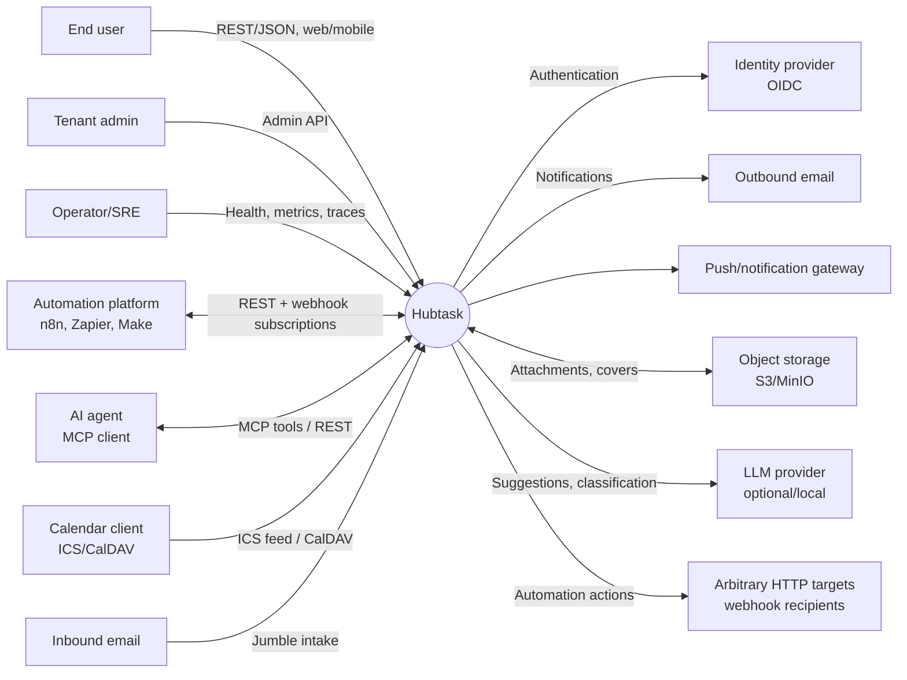
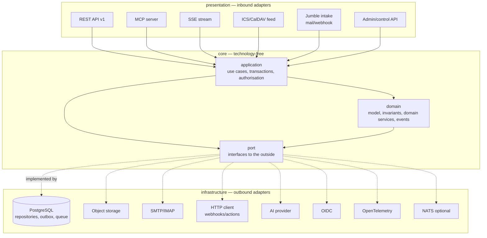
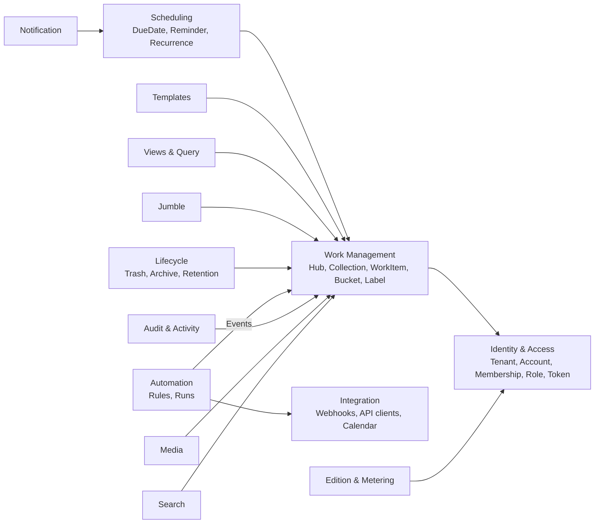
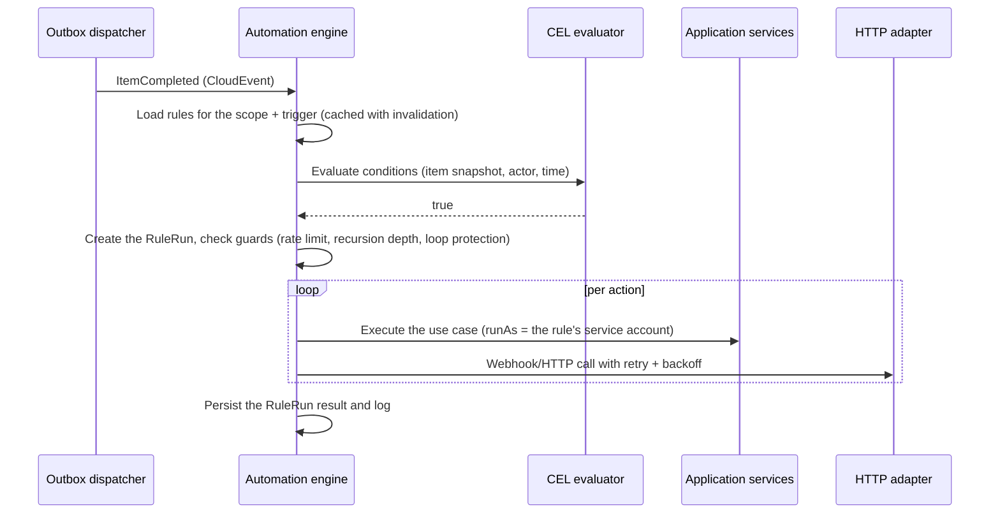
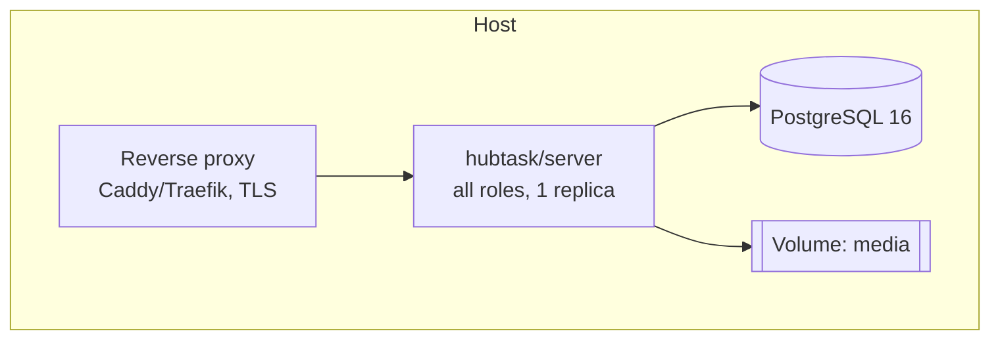
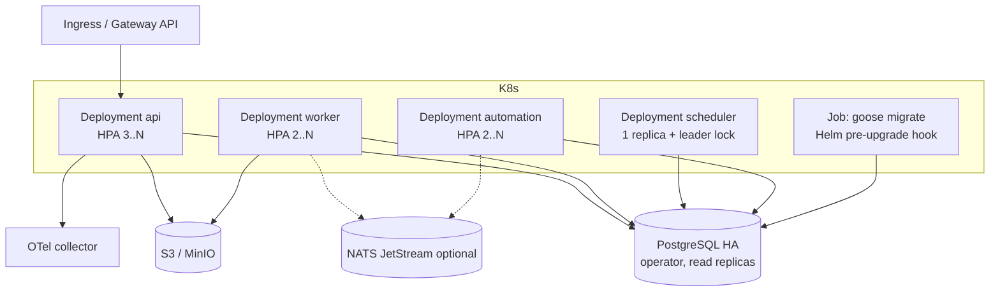

# Architecture Documentation — Hubtask

> Document version: **0.1.0** · Status: *draft for approval* · Template: **arc42 8.2**
> Language: English throughout — documentation, code, identifiers, and commits.

**Reading order for developers:** ch. 1 → 4 → 5 → [domain model](./domain-model.md) → [project structure](./project-structure.md) → [API guidelines](./api-guidelines.md) → ch. 8 → [security](./security.md) → [reliability](./observability-reliability.md).

| Deep dive | File |
|---|---|
| Domain model, aggregates, invariants, events | [domain-model.md](./domain-model.md) |
| Go project structure (hexagonal) & code conventions | [project-structure.md](./project-structure.md) |
| API-first guidelines, errors, pagination, query DSL | [api-guidelines.md](./api-guidelines.md) |
| Multi-tenancy & isolation | [multi-tenancy.md](./multi-tenancy.md) |
| **Security concept, threat model, security gates** | [security.md](./security.md) |
| **Audit and traceability** | [audit.md](./audit.md) |
| **Data protection (GDPR) and data subject rights** | [data-protection.md](./data-protection.md) |
| **Backup, targets, restore** | [backup-restore.md](./backup-restore.md) |
| **Retention and lifecycle of business data** | [data-retention.md](./data-retention.md) |
| **Offline capability and synchronisation** | [offline-sync.md](./offline-sync.md) |
| **CI/CD, pipelines, AI in the pipeline** | [ci-cd.md](./ci-cd.md) |
| **Deployment, environments, rollout** | [deployment.md](./deployment.md) |
| **Observability, SLOs, resilience, self-diagnosis** | [observability-reliability.md](./observability-reliability.md) |
| Internationalisation & localisation | [i18n-l10n.md](./i18n-l10n.md) |
| Automation, rules, webhooks, n8n/Zapier | [automation.md](./automation.md) |
| AI-first concept (MCP, agents, ports) | [ai-first.md](./ai-first.md) |
| Semantic versioning, release, branching | [versioning-release.md](./versioning-release.md) |
| Licence and edition model | [licensing-editions.md](./licensing-editions.md) |
| Test, quality, and engineering guidelines | [engineering-guidelines.md](./engineering-guidelines.md) |
| Architecture decisions | [../adr/README.md](../adr/README.md) |
| Data catalogue (record of processing activities) | [../privacy/data-catalog.md](../privacy/data-catalog.md) |
| Implementation plan / milestones | [../roadmap.md](../roadmap.md) |

---

## 1. Introduction and goals

Hubtask is an open, self-hostable task manager with five hierarchy levels
(Hub → Collection → Task → Work Package → Activity). It targets private individuals equally
(one container, one database, `docker compose up`) and service providers who run the application
multi-tenant for thousands of end customers (Kubernetes, horizontal scaling).

The application is built **backend first, API first, and AI first**: the business core and its API
are the product; every frontend, every integration, and every AI agent are equal clients of the
same public API.

### 1.1 Requirements

**Core business features** (details in [domain-model.md](./domain-model.md)):

| # | Requirement | Short description |
|---|---|---|
| F-01 | Hierarchy | A hub manages collections; a collection contains tasks; a task contains work packages; a work package contains activities |
| F-02 | Task feature set | Status (done/open), due date, reminders, bucket/list, notes, coloured labels, members, history, comments, cover (colour/image) |
| F-03 | Activity feature set | Status, due date, reminder, assignment |
| F-04 | Recurring tasks | Recurrence rules per RFC 5545 (RRULE), correct across time zones |
| F-05 | Templates | Templates for tasks including work packages and activities |
| F-06 | Views | List (collapsed/expanded), kanban, timeline — as saved, server-defined views |
| F-07 | Filtering & sorting | A generic, composable query DSL over every item field |
| F-08 | Jumble | An inbox for unstructured arrivals (email, webhook, quick capture) with conversion into items |
| F-09 | Trash | Soft delete, 30 days of retention, restore, then a hard delete |
| F-10 | Archiving | Permanent archiving, restorable at any time |
| F-11 | Automatic assignment | A fixed person, randomly across people/groups, extensible strategies |
| F-12 | Integrations | Calendar (ICS feed, CalDAV), outbound webhooks, HTTP actions |
| F-13 | Automation | A rule system trigger → condition → action with access to **all** business features |
| F-14 | Collaboration | Members, roles, permissions, comments, activity history |
| F-15 | Multi-tenancy | Complete data separation per tenant, provisioning, quotas, export, deletion |
| F-16 | Multilingualism | Any language (BCP-47), time zones, calendar week and date formats, RTL-capable |
| F-17 | Auditability | A tamper-evident log of security- and compliance-relevant events, queryable, exportable, verifiable ([audit.md](./audit.md)) |
| F-18 | Backup | Freely chosen targets (S3, FTP/FTPS, SFTP, WebDAV, SMB, cloud, local), schedules, encryption, generational retention, listing at the target, restore down to item level, import ([backup-restore.md](./backup-restore.md)) |
| F-19 | Retention rules | Configurable periods per data kind and area with a grace period, advance warning, and safeguards — for example, deleting completed tasks after a year ([data-retention.md](./data-retention.md)) |
| F-20 | Offline capability | Clients keep working without a network; per-field merging without losing other people's concurrent changes ([offline-sync.md](./offline-sync.md)) |

**Core non-functional requirements:**

| # | Requirement |
|---|---|
| Q-01 | Operation in Docker/Podman (single node) **and** Kubernetes (multi node) from the same artefact |
| Q-02 | Horizontally scalable, stateless processes |
| Q-03 | A central, extensible core component (new levels/fields/features without a break) |
| Q-04 | Source available; self-hosting for private individuals with no feature restriction |
| Q-05 | API completeness: no feature exists only in the UI |

### 1.2 Quality goals

Prioritised (1 = highest); in case of doubt these six goals win over everything else.

| Prio | Quality goal | Scenario (short) | Measure |
|---|---|---|---|
| 1 | **Extensibility / generalisation** | A sixth hierarchy level or a new field type is introduced | No change to the persistence schema structure and no breaking change to API v1; delivered in < 5 person-days |
| 2 | **Integrability / automatability** | Every business operation is usable through the API, as an event, and as an automation action | 100% of use cases available as an API operation *and* as an automation action (coverage test in CI) |
| 3 | **Security / tenant isolation** | Tenant A makes a manipulated request for tenant B's data | No cross-tenant access is possible; enforced at the database level (RLS), not just in code; gates SG-1…SG-12 green |
| 4 | **Reliability / self-diagnosis** | Object storage fails, a pod dies mid-job | No process exit, no data loss, the affected feature explicitly reported as `degraded`; SLO-1 ≥ 99.9%, SLO-8 data loss = 0 |
| 5 | **Operability** | A private individual starts the full version; a provider scales to 50 pods | Self-hosting: one image plus PostgreSQL, `docker compose up` in < 5 min; the identical image in Kubernetes through Helm |
| 6 | **Internationalisation** | Users in Tokyo and Cairo work in one collection | All times correct across time zones; no server-side hard-coded display text |

Secondary but binding: performance (P95 read < 200 ms at 10⁶ items per tenant), testability (the
domain is testable without infrastructure), maintainability.

Security and reliability are not cross-cutting wishes but enforced baselines: every rule has an
automated proof that breaks the build ([security.md](./security.md) §13,
[observability-reliability.md](./observability-reliability.md) §12).

### 1.3 Stakeholders

| Role | Expectation of the architecture |
|---|---|
| Private user (self-hoster) | One Compose file, low RAM requirements, all features, easy updates |
| Service provider / enterprise | Tenant isolation, SSO/OIDC, quotas, observability, a K8s Helm chart, data export |
| End user | A fast, multilingual, dependable app; data is never lost |
| Backend developer | A clear hexagonal structure, generated API types, fast tests |
| Frontend developer | A stable, complete, self-describing API; no UI assumptions in the backend |
| Integration/automation user (n8n, Zapier) | A complete REST API, webhook subscriptions, stable event schemas |
| AI agents / MCP clients | Deterministic, idempotent, machine-readable operations |
| Operator/SRE | Health and readiness probes, OpenTelemetry, zero-downtime migrations |
| Product owner | Frontend decisions can be deferred without blocking core work |

---

## 2. Constraints

### 2.1 Technical constraints

| ID | Constraint | Consequence |
|---|---|---|
| C-01 | Backend language **Go** (current stable minor version, at least 1.23) | No JVM or Node dependencies in the core |
| C-02 | The **hexagonal folder structure** of the in-house template (`core/`, `presentation/`, `Port.go`, PascalCase file names) | The structure is kept and only extended, see [project-structure.md](./project-structure.md) |
| C-03 | Operation in Docker, Podman **or** Kubernetes | A single-binary/multi-role design, 12-factor configuration |
| C-04 | Horizontal scalability | No local state, no sticky sessions, no in-memory scheduler without leader election |
| C-05 | Minimal mandatory dependencies for self-hosting | Only **PostgreSQL** is required; everything else is optional |
| C-06 | CI/CD on **GitHub Actions**; Helm chart under `k8s/` | Every gate is a `make` target ([ADR-0022](../adr/ADR-0022-github-platform.md), [ci-cd.md](./ci-cd.md)) |
| C-07 | **Semantic Versioning 2.0.0** | Conventional Commits, automated releases, API major versioning |
| C-08 | Documentation following **arc42** | This document is the single source of truth for the architecture |

### 2.2 Organisational and legal constraints

| ID | Constraint |
|---|---|
| C-10 | The source is public; self-hosting by private individuals is unrestricted and free of charge |
| C-11 | Commercial production use requires a commercial licence; the licence model is decided and recorded in [ADR-0013](../adr/ADR-0013-licensing.md) and [licensing-editions.md](./licensing-editions.md) |
| C-12 | GDPR conformance from the ground up (Art. 25): access, export, rectification, erasure, restriction, processing on behalf, data residency — the concept is in [data-protection.md](./data-protection.md), the record of processing activities in [../privacy/data-catalog.md](../privacy/data-catalog.md) |
| C-13 | No feature crippling of the self-hosted variant → monetisation through licence law plus optional add-ons, not through removed core features |
| C-14 | The frontend stack and feature distribution are decided ([ADR-0030](../adr/ADR-0030-svelte-frontend-framework.md)–[ADR-0033](../adr/ADR-0033-shared-client-architecture.md)); the original core of this constraint stands unchanged: the backend makes no assumptions about clients, and the API stays client-blind |
| C-15 | Backup targets must not be limited to particular providers; the target, timing, and retention are freely configurable |
| C-16 | Offline operation must be compatible with multi-user collaboration — other people's changes must not be silently lost |

### 2.3 Conventions

* Business terms in the code are English: `Hub`, `Collection`, `Task`, `WorkPackage`, `Activity`, `Bucket`, `Label`, `Jumble`.
* All instants are UTC server-side (`timestamptz`), additionally storing the originating IANA time zone where it matters to the business logic (recurrence, reminders).
* IDs: **UUIDv7** (time-sortable, no sequential information leakage).
* Money and quotas: integers, never floats.
* No domain code knows about HTTP, SQL, JSON tags, or framework types.

---

## 3. Context and scope

### 3.1 Business context



| Neighbour | Direction | Interface / contract |
|---|---|---|
| End user clients | Inbound | REST/JSON `/api/v1`, OpenAPI 3.1 as the contract |
| Automation platforms | Bidirectional | The REST API, webhook subscriptions (CloudEvents, HMAC-signed), trigger polling |
| AI agents | Bidirectional | The MCP server (tools = use cases), alternatively REST with a service account |
| Identity provider | Outbound | OIDC discovery, authorization code + PKCE; local users as a fallback |
| Object storage | Outbound | The S3 API (presigned URLs); self-hosting fallback: a local volume |
| Email | Inbound and outbound | SMTP for sending; intake by IMAP poll or an inbound webhook |
| Calendar | Outbound | An ICS feed per view/user, CalDAV later |
| LLM provider | Outbound | The `core/port/ai` port; adapters for OpenAI-compatible APIs and local Ollama; disabled by default |

### 3.2 Technical context

| Channel | Protocol | Port (default) | Note |
|---|---|---|---|
| Public API | HTTP/1.1 + HTTP/2, JSON | 8080 | TLS terminated at the ingress/reverse proxy |
| Real-time updates | Server-sent events (`/api/v1/stream`) | 8080 | WebSocket only once bidirectional traffic is needed |
| MCP | HTTP (streamable) | 8080 (`/mcp`) | Its own auth scope |
| Operations | HTTP (Prometheus, health) | 9090 | Not publicly exposed |
| Database | PostgreSQL wire protocol | 5432 | Required |
| Object storage | S3 HTTPS | — | Optional |
| Event bus (scale-out) | NATS JetStream | 4222 | Optional, default: the PostgreSQL outbox |

---

## 4. Solution strategy

| Goal/constraint | Approach |
|---|---|
| Extensibility (Q-01, Q-03) | **Generalisation instead of specialisation:** one polymorphic `WorkItem` aggregate root with an `ItemType` and a configurable **capability profile** per type, instead of four separate entities. New levels and features = new configuration, not a new schema. Plus typed `CustomField` definitions for tenant-specific fields. |
| Integrability (Q-02) | **The use case catalogue as the single truth:** every application service use case automatically becomes (a) a REST operation, (b) an MCP tool, (c) an automation action. A CI test fails if a use case is not registered in all three channels. |
| Operability (Q-03) | **One artefact, several roles:** one container image, with roles (`api`, `worker`, `scheduler`, `automation`) selected by configuration. Self-hosting = all roles in one process; Kubernetes = one deployment per role. |
| Few dependencies | PostgreSQL as the database **and** the job queue (`SKIP LOCKED`) **and** the outbox **and** full-text search **and** the pub/sub fallback. NATS, Redis, and S3 are interchangeable adapters, not prerequisites. |
| Tenant isolation (Q-04) | `tenant_id` in every table plus **PostgreSQL row level security**; the application connects with a role *without* `BYPASSRLS`. Sharding per tenant through a control plane comes later. |
| Frontend decoupled (C-14) | The backend supplies **generic building blocks**: the query DSL (filter/sort/group/cursor), `SavedView` with an opaque `layout` hint, and the capability manifest. Kanban, timeline, and lists are interpretations of the same query. |
| AI first | The domain stays AI-free; AI is an adapter behind ports. Outwards: an MCP server, deterministic IDs, idempotency, machine-readable errors, and optional embeddings (pgvector) for semantic search. |
| Architectural style | **Hexagonal + DDD + explicit architecture** after Herberto Graça: the core (domain/application) knows only ports; all technology lives in adapters. A modular monolith with cleanly cut bounded contexts that can be deployed as their own process when needed (the automation service is the first candidate). |
| Why not a microservice split from the start | A distributed system would make consistency, operations, and self-hosting considerably more expensive with no business benefit. The context boundaries are already drawn; cutting one out stays possible (see [ADR-0002](../adr/ADR-0002-modular-monolith.md)). |

### 4.1 Technology decisions at a glance

| Area | Decision | ADR |
|---|---|---|
| Language/runtime | Go ≥ 1.23, `net/http` (the standard mux), `log/slog` | — |
| API definition | OpenAPI 3.1 spec-first, code generation with `oapi-codegen` | [ADR-0004](../adr/ADR-0004-api-first-openapi.md) |
| Persistence | PostgreSQL 16+, `pgx/v5`, `sqlc`, migrations with `goose` | [ADR-0003](../adr/ADR-0003-postgresql-as-single-datastore.md) |
| Domain model | A generalised `WorkItem` plus capability profiles, the tree as `parent_id` + `path` (ltree-like) | [ADR-0006](../adr/ADR-0006-generalized-workitem.md) |
| Jobs/scheduling | A PostgreSQL queue (`SKIP LOCKED`), advisory lock leader election, RRULE via `rrule-go` | [ADR-0008](../adr/ADR-0008-jobs-and-scheduling.md) |
| Events | A transactional outbox → dispatcher; CloudEvents 1.0; an optional NATS JetStream adapter | [ADR-0007](../adr/ADR-0007-events-outbox-cloudevents.md) |
| Automation | Declarative rules, conditions in **CEL** (no arbitrary code) | [ADR-0009](../adr/ADR-0009-automation-rules-cel.md) |
| AuthN/AuthZ | OIDC plus local users; PATs and service accounts; RBAC with roles inherited per scope | [ADR-0005](../adr/ADR-0005-authn-authz.md) |
| Multi-tenancy | Shared schema + RLS, shard routing later | [ADR-0010](../adr/ADR-0010-multi-tenancy.md) |
| i18n | Server-side only message codes; ICU MessageFormat, `golang.org/x/text`, CLDR | [ADR-0011](../adr/ADR-0011-i18n-message-codes.md) |
| AI access | An MCP server as a presentation adapter, the AI provider behind a port | [ADR-0012](../adr/ADR-0012-ai-first-mcp.md) |
| Licence | BSL 1.1 with an additional use grant, change licence Apache-2.0 | [ADR-0013](../adr/ADR-0013-licensing.md) |

---

## 5. Building block view

### 5.1 Level 1 — whitebox Hubtask



| Building block | Responsibility | Forbidden dependencies |
|---|---|---|
| `core/domain` | The business model, invariants, state transitions, domain events, pure domain services | Everything except the standard library and our own value objects |
| `core/application` | Use cases, orchestration, transaction boundaries, permission checks, event publication | No frameworks, no SQL, no HTTP |
| `core/port` | Interfaces (repositories, clock, IDs, storage, mail, bus, AI, environment) | No implementations |
| `presentation/*` | Translation between protocol and use case DTO, serialisation, localisation of messages | No business logic |
| `infrastructure/*` | The technical implementation of the ports | No business rules |

### 5.2 Level 2 — bounded contexts in the core



| Context | Aggregates / key terms | Note |
|---|---|---|
| **Identity & Access** | `Tenant`, `Account`, `Membership`, `Group`, `Role`, `ServiceAccount`, `AccessToken` | The tenant is the topmost isolation boundary, above the hub |
| **Work Management** | `Hub`, `Collection`, `WorkItem` (TASK/WORK_PACKAGE/ACTIVITY), `Bucket`, `Label`, `Assignment`, `Comment`, `Cover`, `CustomFieldDefinition` | The business core, see [domain-model.md](./domain-model.md) |
| **Scheduling** | `DueDate`, `Reminder`, `RecurrenceRule`, `ScheduledOccurrence` | RFC 5545 RRULE, time zones per user. `ScheduledOccurrence` is a **concept rather than a table** (D-05): an occurrence *is* a `WorkItem` pointing at its rule, and what the materialisation needs to remember is one moment - how far the series has been dealt with - which lives on the rule as `last_materialized_at`. A skip is that moment moving past an occurrence without one being created, and the exactly-once guarantee is its compare-and-set. A table would have added a row per occurrence saying what the entry already says, and a second thing to keep in step with it |
| **Templates** | `Template`, `TemplateNode` | Produces item trees |
| **Views & Query** | `SavedView`, `QuerySpec`, `GroupingSpec` | The basis for list/kanban/timeline |
| **Jumble** | `JumbleEntry`, `IntakeChannel` | Conversion into a `WorkItem` |
| **Lifecycle** | `TrashEntry` (30 days), `ArchiveEntry` (indefinite) | Restorability, the retention job |
| **Automation** | `AutomationRule`, `RuleTrigger`, `RuleCondition`, `RuleAction`, `RuleRun` | Separately deployable |
| **Integration** | `WebhookSubscription`, `Delivery`, `OAuthClient`, `CalendarFeed` | The REST hooks pattern for Zapier/n8n |
| **Notification** | `NotificationPreference`, `Notification`, channel ports | Email, webhook, push |
| **Audit & Activity** | `ActivityEntry`, `AuditLog` | Append-only, the source of the item history |
| **Media** | `MediaObject` | Covers and attachments, presigned upload |
| **Search** | Full text (`tsvector`, language-dependent), optionally vector | |
| **Edition & Metering** | `EditionPolicy`, `UsageRecord` | The basis for later monetisation, inactive in self-hosting |

### 5.3 Level 3 — whitebox Work Management (an extract)

| Element | Type | Responsibility |
|---|---|---|
| `WorkItem` | Aggregate root | Title, type, parent reference, status, ordering, bucket, labels, members, notes, cover, custom fields, and `version` for optimistic locking |
| `ItemCapabilityProfile` | Domain policy | Which features an `ItemType` has (e.g. `ACTIVITY` without cover or comments), the maximum depth, the permitted child types |
| `Hierarchy` | Domain service | Checks the permitted parent-child combination, depth, freedom from cycles, and moving subtrees |
| `Ordering` | Value object | The sort key for drag and drop (lexicographic rank, low collision) |
| `CompletionPolicy` | Domain policy | Optional: a parent item counts as complete once all its children are (configurable per collection) |
| `AssignmentStrategy` | Port + strategies | `FIXED`, `RANDOM_MEMBER`, `RANDOM_GROUP_MEMBER`, `ROUND_ROBIN`, `LEAST_LOADED` |
| `WorkItemRepository` | Port | Loading and saving the aggregate, tree queries, executing the query DSL |

---

## 6. Runtime view

### 6.1 Creating a task (the standard write path)

```mermaid
sequenceDiagram
  participant C as Client
  participant R as REST adapter
  participant A as Application service
  participant D as Domain
  participant DB as PostgreSQL
  participant O as Outbox dispatcher

  C->>R: POST /api/v1/items (Idempotency-Key)
  R->>R: Validate against the OpenAPI schema, determine locale/time zone
  R->>A: CreateWorkItem(cmd, actor)
  A->>A: Check idempotency, check permissions
  A->>DB: BEGIN; SET LOCAL app.tenant_id
  A->>D: Hierarchy.Validate + WorkItem.New()
  D-->>A: WorkItem + WorkItemCreated
  A->>DB: INSERT work_item, activity_entry, outbox_event
  A->>DB: COMMIT
  A-->>R: DTO
  R-->>C: 201 Created + ETag
  O->>DB: Poll events (SKIP LOCKED)
  O->>O: Fan out: automation, webhooks, SSE, search index
```

**The rules:** one transaction per use case; domain events are written to the outbox *within the
same* transaction; outward side effects happen exclusively asynchronously through the dispatcher
(at-least-once semantics, idempotent consumers).

### 6.2 An automation rule fires



**Loop protection:** every event carries a `causation_chain`; rules whose actions trigger their own
triggers again are aborted beyond depth *n* (5 by default) and the run is marked `ABORTED_LOOP`.

### 6.3 A recurring task

1. The `RecurrenceRule` (RRULE + IANA time zone + mode) sits on the template item.
2. The scheduler (the leader) materialises occurrences for a rolling window (90 days by default) as jobs.
3. Mode `ON_SCHEDULE`: a new instance at time X; mode `ON_COMPLETION`: a new instance only once the predecessor is completed.
4. DST and time zone changes are resolved through the stored time zone, not through UTC offsets.
5. Changes to the series affect only occurrences not yet materialised (`THIS`, `THIS_AND_FOLLOWING`, `ALL` as an explicit parameter).

### 6.4 Jumble arrival → task

Email/webhook/quick capture → a `JumbleEntry` (raw content + origin + attachments) → optionally an
AI suggestion (title, due date, collection, labels) → the user confirms, or an automation rule
converts it automatically → a `WorkItem` with a back reference to the arrival.

### 6.5 Further documented scenarios

| Scenario | Key points |
|---|---|
| Login (OIDC) | Authorization code + PKCE, just-in-time provisioning of the account, tenant assignment through claim mapping |
| Kanban query | `POST /api/v1/items:query` with `group_by=bucket`, cursor pagination per group, `X-Total-Count` optional |
| Trash & retention | `DELETE` → `deleted_at` set, visibility filtered, the retention job hard-deletes after 30 days including media |
| Tenant deletion | Block → provide the export → cascading hard delete → evidence in the audit log |
| Zero-downtime migration | Expand/contract in separate releases (see [engineering-guidelines.md](./engineering-guidelines.md)) |
| Webhook delivery | HMAC signature, retry with exponential backoff (up to 24 h), dead letter plus manual replay |

---

## 7. Deployment view

### 7.1 One artefact, several roles

```
hubtask/server:<semver>   # one image, distroless, statically linked
HUBTASK_ROLES=api,worker,scheduler,automation   # default: all
```

| Role | Task | Scaling |
|---|---|---|
| `api` | HTTP, MCP, SSE, ICS | Horizontal, stateless |
| `worker` | Outbox dispatch, webhooks, mail, media, search index | Horizontal (PostgreSQL `SKIP LOCKED`) |
| `scheduler` | Reminders, recurrence, retention | Exactly one active (advisory lock leader election) |
| `automation` | Rule evaluation and execution | Horizontal; separately deployable, to decouple load spikes from the API |

### 7.2 Deployment "private individual" (Docker/Podman)



Two containers plus an optional proxy. Object storage = a local volume. No NATS, no Redis, no MinIO
required. The full feature set.

### 7.3 Deployment "provider" (Kubernetes)



The same image, the same configuration keys. The difference: role separation, PostgreSQL HA, S3, an
optional event bus, autoscaling, network policies, and tenant shard routing.

### 7.4 The configuration principle

Exclusively environment variables with the `HUBTASK_` prefix (12-factor), bundled behind
`core/port/environment/Port.go`. Every variable has a safe default for self-hosting.
Secrets come from Docker secrets or Kubernetes secrets/external secrets; never from files in the
image.

---

## 8. Cross-cutting concepts

### 8.1 Domain model and generalisation
In full in [domain-model.md](./domain-model.md). The core: one `WorkItem` aggregate root with an
`ItemType` and a capability profile; containers (`Hub`, `Collection`) generalised analogously;
extension through capability configuration and typed custom fields rather than through new tables.

### 8.2 Persistence
PostgreSQL as the only mandatory component ([ADR-0003](../adr/ADR-0003-postgresql-as-single-datastore.md)).
`sqlc` generates type-safe query functions; repositories map between the domain object and the row.
Tree queries use `parent_id` plus a materialised `path` (an index on the prefix). Migrations use
`goose`, strictly forward compatible (expand/contract). Optimistic locking through a `version` per
aggregate, exposed outwards as `ETag`/`If-Match`.

### 8.3 Multi-tenancy
See [multi-tenancy.md](./multi-tenancy.md). Shared schema, `tenant_id NOT NULL` everywhere, row
level security as the enforced boundary, `SET LOCAL app.tenant_id` per transaction, and an
application role without `BYPASSRLS`. Modes `SINGLE` (self-hosting, an implicit tenant) and `MULTI`.
Quotas, rate limits, export, and deletion per tenant; shard routing as the growth path.

### 8.4 Security
The full concept, with the threat model (STRIDE, T-01…T-20), hardening requirements, and the twelve
CI gates SG-1…SG-12: [security.md](./security.md), decision
[ADR-0015](../adr/ADR-0015-security-baseline.md). The principles: defence in depth, secure by
default, fail closed, least privilege — every rule with automated proof. In short:

* **AuthN:** OIDC (authorization code + PKCE) and local accounts (Argon2id); short-lived access tokens, rotating refresh tokens; personal access tokens and service accounts (hashed, scoped tokens) for automation and agents.
* **AuthZ:** RBAC with scope inheritance tenant → hub → collection → item; roles `OWNER`, `ADMIN`, `MEMBER`, `CONTRIBUTOR`, `VIEWER`, `GUEST`; the permission check happens *in the application layer* (never in an adapter), with the database-level tenant boundary on top.
* **Token scopes** are fine-grained (`items:read`, `items:write`, `automation:manage`, …), so that n8n, Zapier, and agents work with minimal privilege.
* **Outbound hardening:** webhook and HTTP actions with SSRF protection (a DNS rebinding check, a block list for private networks, a configurable allowlist), timeouts, size limits.
* **Uploads:** content type sniffing, a size limit, no delivery under the application origin, presigned URLs.
* **Audit:** every security-relevant action append-only with the actor type (`USER`, `SERVICE_ACCOUNT`, `AUTOMATION`, `AI_AGENT`).
* **Secrets** only through the environment or a secret store; integration credentials stored encrypted (AES-GCM with a key from the environment or a KMS).
* **Supply chain:** pinned dependencies, `govulncheck` and `gosec` as gates, an SBOM (CycloneDX) and signed images (cosign) per release, distroless/non-root/read-only.
* **Enforced evidence:** a cross-tenant negative test per repository method, the "app role without `BYPASSRLS`" test, the SSRF test suite, fuzzing for the query DSL and CEL, and the "logs contain no secrets" test.

### 8.5 The API concept
See [api-guidelines.md](./api-guidelines.md). Spec-first OpenAPI 3.1; one major path `/api/v1`;
additive changes without a version bump; errors per RFC 9457 (`application/problem+json`) with a
stable `code` and machine-readable `params`; cursor pagination; idempotency through
`Idempotency-Key`; bulk operations for automation; a single query DSL for every view.

### 8.6 Events and integration
A transactional outbox → dispatcher → consumers (automation, webhook subscriptions, SSE, search
index, optionally NATS). The format is CloudEvents 1.0, with the type scheme
`de.hubtask.<context>.<entity>.<action>.v<major>`. Event schemas are a public contract and are
versioned like the API.

### 8.7 Automation
See [automation.md](./automation.md). An internal rule engine (trigger/condition/action) with access
to the complete use case catalogue plus webhook and HTTP actions; externally, the REST API plus
webhook subscriptions plus trigger polling endpoints for n8n/Zapier/Make.

### 8.8 Internationalisation
See [i18n-l10n.md](./i18n-l10n.md). The server delivers codes and parameters, not finished
sentences; translations are ICU resources (server-side too, for emails and notifications);
`Accept-Language` negotiation, a user preference for locale and IANA time zone, the start of the
week and date formats from CLDR, language-dependent full-text search, and RTL metadata in the
capability manifest.

### 8.9 AI integration
See [ai-first.md](./ai-first.md). The MCP server as an inbound adapter, `core/port/ai` as the
outbound port; AI results are always *suggestions* with provenance; switchable off per tenant;
the self-hosting default is off, or a local model.

### 8.10 Observability and self-diagnosis
The full concept, with SLOs, the metric and alert catalogue, resilience patterns, and the test
series RT-1…RT-12: [observability-reliability.md](./observability-reliability.md), decision
[ADR-0016](../adr/ADR-0016-observability-reliability.md).

OpenTelemetry for traces, metrics, and logs (`log/slog` with trace correlation); the `trace_id` is
carried across the outbox and the job queue, so that the chain *request → event → rule → webhook*
is visible as one piece. Four separate health levels: `/healthz` (the process only, **never**
dependencies — otherwise a database outage kills every pod), `/startupz`, `/readyz`, and
`GET /api/v1/meta/health` as deep self-diagnosis with dependency status, degradation states,
backlogs, and configuration warnings (for example "backup not configured", "SMTP missing with
reminders enabled"). That turns the requirement to "always know what is missing" into an endpoint
rather than a log line. Label cardinality is bounded: no object IDs, and `tenant_id` only when
explicitly enabled. Every request carries a `request_id`, which appears in error responses.

### 8.11 Error handling
Domain errors are typed values (`ErrItemTypeNotAllowedHere`), not strings; the application layer
maps them to error categories; the adapter maps the category to an HTTP status plus problem
details. The categories and the statuses they produce (the codes are in
[api-guidelines.md](./api-guidelines.md) §6):

| Category | Status | Meaning |
|---|---|---|
| `VALIDATION` | 422, or 400 for `malformed_request` | Input the domain rejects |
| `UNAUTHENTICATED` | 401 | Missing, expired, or unreadable credential |
| `FORBIDDEN` | 403 | Authenticated, but not permitted |
| `NOT_FOUND` | 404 | Does not exist, or may not be known to exist |
| `CONFLICT` | 409 | Clash with the current state, including a stale version |
| `GONE` | 410 | Existed and was permanently deleted — the distinction from `NOT_FOUND` is what a synchronising client needs |
| `RATE_LIMITED` | 429 | A limit reached |
| `UNAVAILABLE` | 503 | A dependency unreachable or deliberately degraded — "later", not "wrong" |
| `INTERNAL` | 500 | A defect. Anything unclassified lands here, and nothing of it reaches the client beyond the code and the `request_id` |

An error carries a stable `code`, an optional `detail_code`, and parameters — never a sentence
(ADR-0011). The technical cause travels with the error for the log and is dropped at the adapter
boundary: an unknown error may contain a connection string ([security.md](./security.md) §9).

### 8.11.1 Resilience and controlled degradation
Binding patterns: timeouts and context deadlines everywhere (no call without a timeout, enforced by
lint), retry with backoff and jitter only for idempotent operations, a circuit breaker per external
dependency, bulkheads between the interactive and the background path, load shedding before latency
collapses, dead letter instead of endless retry, and optimistic locking instead of last-write-wins.

Panics are caught per request *and* per job and logged as `INTERNAL`; concurrent work runs
exclusively through `SafeGo` (recover plus a metric), and bare `go` statements outside
`core/shared/concurrency` are forbidden by an architecture test.
`hubtask_panics_recovered_total` is an alert metric with a target value of 0.

The failure of an optional dependency never terminates a process and never blocks the core write
path: object storage gone → only media is restricted; SMTP gone → notifications are caught up
later; AI gone → suggestions disappear; the search index gone → fallback to PostgreSQL full-text
search.
Affected features appear as `degraded_features` with a reason and a timestamp.

### 8.12 Editions and metering
One code path, no disabled core features in self-hosting ([licensing-editions.md](./licensing-editions.md)).
`EditionPolicy` describes only operationally sensible limits (the tenant count, for example) and
`UsageRecord` collects — only when enabled — figures for a later billing model.

### 8.13 Time, clock, IDs, randomness
`Clock`, `IDGenerator`, and `RandomSource` are ports. No `time.Now()` and no `rand` in the domain or
application layers — the precondition for deterministic tests (among them random assignment).

### 8.14 Audit and traceability
See [audit.md](./audit.md). Three separate records with different readers and different retention:
the user-visible item history (`activity_entry`), the security- and compliance-relevant audit
(`audit_log`), and technical logs. The audit is append-only (the application role has no `UPDATE`
or `DELETE`), hash-chained per tenant, optionally sealed daily, and exportable to a SIEM. It contains
**no** user content — which is why it does not collide with content deletion obligations; on account
deletion, references are pseudonymised rather than deleted.

### 8.15 Data protection
See [data-protection.md](./data-protection.md) and the data catalogue
[../privacy/data-catalog.md](../privacy/data-catalog.md). Data subject rights are use cases with
deadline tracking (`data_subject_request`), not manual work: access, portability, rectification,
erasure, **restriction of processing** (Art. 18 — a technical state that keeps automation and AI
away from the record), and objection. Data minimisation is built in (logs without content, metrics
without personal data, IP addresses only as a prefix), AI processing is opt-in per tenant, and
third-country transfers are made visible in the target and provider configuration.

### 8.16 Backup and restore
See [backup-restore.md](./backup-restore.md). Backup is a feature of the application: targets as
interchangeable adapters (S3, SFTP, FTPS/FTP, WebDAV, SMB, Azure, GCS, rclone, local), RRULE
schedules, client-side encryption as the standard, generational retention with a `min_keep` floor.
The archive format is logical (JSON Lines + manifest + content-addressed media) and therefore
importable across versions and selectively restorable down to item level. The list of existing
backups is read from the manifests **at the target**, so that a restore is possible even after total
loss of the database. A restore fires no automation, sends no notifications, and restores no tokens.

### 8.17 Retention of business data
See [data-retention.md](./data-retention.md). Periods are data (`retention_policy` per tenant, hub,
or collection) with a data kind, an optional CEL condition, an action, and a follow-up stage.
Execution is two-phase (mark and warn, then execute) with a grace period and a visible `retention`
field on the object. Legal hold, restriction of processing, the lower and upper bounds per data
kind, and the minimum tombstone period for offline clients all take precedence.

### 8.18 Offline capability and synchronisation
See [offline-sync.md](./offline-sync.md). Server-authoritative delta sync over a monotonic change
log per tenant (`change_log`, an opaque cursor) with `:pull`/`:push`, and SSE as an accelerator.
Merging happens **per field**, not per object; the time base is hybrid logical clocks with
server-side bounding of clock skew. Set fields (labels, members) are OR-sets and positions are
fractional indices — both because "last writer wins" would demonstrably lose changes there.
Permissions, invariants, and the tenant boundary stay server-side; `ACCESS_REVOKED` obliges clients
to delete locally. The change log is deliberately separate from the event outbox.

---

## 9. Architecture decisions

The full list with context, options, and consequences: [../adr/README.md](../adr/README.md).

| ADR | Title | Status |
|---|---|---|
| 0001 | Hexagonal architecture following the in-house template | accepted |
| 0002 | A modular monolith with a separately deployable automation service | accepted |
| 0003 | PostgreSQL as the only mandatory datastore | accepted |
| 0004 | API first with OpenAPI 3.1 and code generation | accepted |
| 0005 | Authentication and authorisation | accepted |
| 0006 | A generalised `WorkItem` with capability profiles | accepted |
| 0007 | Transactional outbox and CloudEvents | accepted |
| 0008 | Jobs and scheduling in PostgreSQL | accepted |
| 0009 | Automation rules with CEL instead of scripting | accepted |
| 0010 | Multi-tenancy through a shared schema and RLS | accepted |
| 0011 | i18n through message codes, no server-side display text | accepted |
| 0012 | AI first through an MCP server and an AI port | accepted |
| 0013 | The licence model (BSL 1.1 → Apache-2.0) | accepted |
| 0014 | One image, several roles | accepted |
| 0015 | Security as an enforced baseline with CI gates | accepted |
| 0016 | Self-diagnosis, controlled degradation, SLOs | accepted |
| 0017 | The audit trail: append-only, chained, content-free | accepted |
| 0018 | Data protection by design and by default | accepted |
| 0019 | Backup as an application feature with freely chosen targets | accepted |
| 0020 | Retention rules as data, with a grace period | accepted |
| 0021 | Offline sync: server-authoritative, per-field merging | accepted |
| 0022 | GitHub as the platform, Actions as the pipeline, GHCR as the registry | accepted |
| 0023 | Push-based deployment with approval, GitOps-ready | accepted |
| 0024 | Tenant-scoped foreign keys | accepted |
| 0025 | The status of a failed precondition | accepted |
| 0026 | How the query DSL turns into SQL | accepted |
| 0027 | One repository for the core, the clients, and the design system | accepted |
| 0028 | The web UI ships inside the binary, as an adapter | accepted |
| 0029 | The design system is code, and `tokens.json` is its only origin | accepted |
| 0030 | Svelte 5 for every first-party client, and the webapp as a plain Vite SPA | accepted |
| 0031 | Tauri 2 shells for desktop and mobile; the PWA path is closed | accepted |
| 0032 | The client capability matrix: parity by default, restrictions justified one by one | accepted |
| 0033 | One product UI, three targets: the shared client architecture | accepted |
| 0034 | The language-dependent search document | accepted |
| 0035 | One product version for the server and every first-party client | accepted |

---

## 10. Quality requirements

### 10.1 Quality tree

```
Quality
├── Maintainability
│   ├── Extensibility (prio 1)
│   ├── Modularity / context boundaries
│   └── Testability
├── Functional suitability
│   ├── API completeness
│   └── Correctness of recurrence and reminders
├── Security (prio 3)
│   ├── Tenant isolation (RLS, fail closed)
│   ├── Least privilege for tokens and database roles
│   ├── Hardening of the attack surface (SSRF, uploads, injection)
│   └── Supply chain integrity (SBOM, signatures, scans)
├── Reliability (prio 4)
│   ├── Availability / controlled degradation
│   ├── Fault tolerance (timeouts, breakers, bulkheads)
│   ├── Recoverability (RPO ≤ 5 min, RTO ≤ 60 min)
│   └── Observability / self-diagnosis
├── Portability / operability (prio 5)
├── Interoperability (prio 2)
└── Performance & scalability
```

### 10.2 Quality scenarios

| ID | Scenario | Response / measure |
|---|---|---|
| QS-01 | A sixth level "milestone" is to be introduced above task | A new `ItemType` plus a capability profile plus a migration step for constraints; no new table, API v1 stays compatible; effort ≤ 5 person-days |
| QS-02 | A tenant with 2 million items filters a kanban board by label and due date | P95 < 300 ms with cursor pagination, covered by composite indices; demonstrated in the load test |
| QS-03 | An attacker sets a foreign `tenant_id` in the request | The response is 404/403; RLS prevents data access even with a code defect; a regression test per repository |
| QS-04 | A webhook recipient is unreachable for 6 h | Retries with backoff, no data loss, dead letter, replay possible; the API stays unaffected |
| QS-05 | A self-hoster updates from 1.4 to 1.5 | `docker compose pull && up -d`; the migration runs automatically, backwards compatible, no data loss, downtime < 30 s |
| QS-06 | An automation rule produces an event that triggers the same rule | Abort at causality depth 5, `RuleRun = ABORTED_LOOP`, the user sees a comprehensible message |
| QS-07 | A user in São Paulo creates a daily recurrence, and a DST change occurs | The due time stays 09:00 local; test cases for every DST transition |
| QS-08 | A new language (Arabic, for example) is added | Only translation resources plus enabling the locale; no code change; the RTL flag in the manifest |
| QS-09 | The AI provider fails or is disabled | All core features stay available; AI endpoints respond `503` with problem details `ai_unavailable` |
| QS-10 | 200 concurrent bulk imports of 5,000 items each | Backpressure through rate limits and the queue; no OOM; progress queryable through the job status |
| QS-11 | Object storage (MinIO) is unreachable for 2 h | No process exit, the core write path unaffected; `media` reported as a `degraded_feature` with a reason and timestamp in `/meta/health`; automatic recovery without a restart (test RT-1) |
| QS-12 | A pod is killed hard mid-job (`SIGKILL`) | The job lease expires, another instance resumes it, and thanks to idempotency it takes effect exactly once; no data loss (test RT-3) |
| QS-13 | PostgreSQL is unreachable for 5 min | `/healthz` stays green (no kill loop), `/readyz` red, reconnection with backoff, then normal operation without a restart (test RT-2) |
| QS-14 | The operator has configured no backup | `/meta/health` reports `config.backup_not_configured` as a warning; alert A-12 in provider operation |
| QS-15 | An automation action targets `169.254.169.254` (cloud metadata) | `GuardedClient` refuses the connection before it is established, the rule run is logged as failed, threat T-07 is covered by test suite SG-6 |
| QS-16 | A rolling update from N−1 to N under load | No `5xx`, no data loss; pods with an incompatible migration state do not become ready (test RT-8) |
| QS-17 | A new repository method is introduced without a cross-tenant negative test | Gate SG-3 fails the build (methods reconciled against tests) |
| QS-18 | An auditor demands gapless evidence of every permission change in the past year | `GET /audit` with a filter, `:export` as a job, `:verify` confirming the hash chain and the absence of gaps |
| QS-19 | A data subject requests erasure of their data | A `data_subject_request` with a deadline; every storage location from the data catalogue is served; audit references are pseudonymised; backups expire over the documented retention period, and the deletion journal prevents return on restore |
| QS-20 | The database and server are lost entirely, and only the S3 target credentials exist | Start a new instance, enter the target, the archives are listed from the manifests, and a `NEW_TENANT` restore reproduces the state (test BK-1) |
| QS-21 | A user accidentally deletes a collection with 400 items, and the trash period has already elapsed | A selective restore from the last archive into the existing tenant, without touching any other data |
| QS-22 | A tenant configures "delete completed tasks after 1 year" | The rule starts in notify-only mode when more than 5% would be affected; advance warning to those concerned, a 14-day grace period, a visible `retention` field, execution in batches, the scope in the audit |
| QS-23 | A legal hold sits on a collection that a retention rule would delete | The deletion does not happen; the reason `legal_hold` appears in `retention_run.blocked_reasons` and on the object |
| QS-24 | Two people edit the same item offline: A changes the due date, B the title | Both changes survive (per-field merging); no user decision is needed (test SY-1) |
| QS-25 | A device has been offline for 90 days and knows items deleted in the meantime | `sync.cursor_too_old` forces a full sync; deleted objects do not come back (tests SY-5, RE-6) |
| QS-26 | A user loses access to a collection while offline | `ACCESS_REVOKED` in the pull stream, the client deletes locally; mutations against it are rejected server-side (test SY-6) |
| QS-27 | A device with a clock three hours out synchronises | The HLC bound stops it outvoting everyone else (test SY-2) |

---

## 11. Risks and technical debt

| ID | Risk / debt | Impact | Countermeasure |
|---|---|---|---|
| R-01 | The generalised `WorkItem` becomes a "god object" | Hard to maintain, unclear invariants | Capability profiles plus type-specific domain policies, architecture tests against field sprawl, ADR-0006 reviewed regularly |
| R-02 | The licence model (BSL) deters community adoption or inclusion in distributions | Less reach | A short Change Date to Apache-2.0 (three years), transparency about the model not being OSI open source, no-cost commercial licences for non-profit and educational use; the alternative AGPL-3.0 + CLA is documented in ADR-0013 |
| R-03 | PostgreSQL as the queue/bus hits limits under high load | Latency, vacuum pressure | The adapter boundary exists → the NATS JetStream adapter can be enabled; load test from milestone 0.6 |
| R-04 | Frontend requirements later contradict the generic API | Rework on the API | The query DSL plus the capability manifest are deliberately UI-agnostic; an early prototype (a reference client) against the API |
| R-05 | RLS becomes ineffective through faulty setting of the tenant context | Data leaks | Central transaction middleware, a test of the connection pool boundaries, a role without `BYPASSRLS`, negative tests in CI |
| R-06 | Automation can raise system load uncontrollably | Instability | Quotas per tenant, rate limits, a recursion bound, a separate deployment, circuit breakers |
| R-07 | RRULE plus time zones plus DST is error-prone | Wrong due dates | A library rather than a home-grown implementation, extensive table tests, golden files for DST boundaries |
| R-08 | The absent frontend decision delays user feedback | Late insight | A reference CLI plus a minimal reference client as a dogfooding tool from milestone 0.2 |
| R-09 | The GDPR deletion concept overlooks derived data (search index, events, backups) | Legal risk | The data catalogue with deletion paths per storage location, deletion tests, documented retention periods |
| R-10 | Public source plus automation as an HTTP primitive make the system an attractive SSRF/amplification tool | Abuse of third-party installations | `GuardedClient` as the only outbound route, an egress allowlist mandatory in provider operation, the SSRF test suite as a gate (SG-6), threat T-07 |
| R-11 | Security gates get bypassed under time pressure, or baselines get softened | A creeping loss of protection | Suppression only with a justification in the code and a second reviewer; softening a gate requires a new ADR (ADR-0015) |
| R-12 | Observability rots because new features produce no signals | Flying blind in production | Gate RT-12: reconciling the use case registry against metrics/spans fails the build |
| R-13 | Metric cardinality explodes in provider operation (many tenants) | Cost, unusable monitoring | Hard label rules (no object IDs), the `tenant_id` label only when explicitly enabled |
| R-14 | Degradation states multiply the test matrix and are not maintained | Undetected failure paths | The fixed test series RT-1…RT-12 with test containers instead of ad-hoc tests |
| R-15 | Freely configurable backup targets are a data egress channel | Exfiltration, SSRF | Instance administrators only, `GuardedClient`, an audit obligation, an egress allowlist in provider operation, tenant-owned targets off by default ([ADR-0019](../adr/ADR-0019-backup-targets.md)) |
| R-16 | Losing the backup passphrase makes every archive useless | Total loss despite backups | An unmissable notice and a logged confirmation at setup, rotation without losing old archives, a warning in `/meta/health` |
| R-17 | A misconfigured retention rule destroys people's work | Irreversible data loss | A mandatory preview, the 5% safety switch, a grace period with advance warning, the `:retain` escape, the scope in the audit ([ADR-0020](../adr/ADR-0020-retention-policies.md)) |
| R-18 | Our own archive format is a long-term commitment | Maintenance burden, import defects | The format version in the manifest, golden archives per major version in the repository, import test BK-4 as a gate |
| R-19 | Per-field merging in the sync is complex and error-prone | Silent data loss for the user | Merge rules centralised in `SyncService`, a table-driven field type mapping, the test catalogue SY-1…SY-12, and displaced versions are preserved |
| R-20 | Offline caches on end devices are personal data held outside the server | A privacy risk if a device is lost | Binding client requirements (encryption at rest, deletion on sign-out and on access revocation), the conformance test `hubctl sync-conformance`, an entry in the data catalogue |
| R-21 | Tombstone periods and backups effectively extend the deletion deadline | Tension with GDPR Art. 17 | Periods documented and configurable, the deletion journal on restore, transparency towards data subjects instead of silent continued storage |
| TD-01 | No OAuth2 provider initially (PATs only) for third-party apps | The Zapier integration is less convenient | Planned for milestone 0.5/0.6 |
| TD-02 | Full-text search is initially `tsvector` only | Limited relevance quality | The port abstracts it; vector or external search is possible later |

---

## 12. Glossary

| Term | Code identifier | Meaning |
|---|---|---|
| Hub | `Hub` | The topmost container; manages several collections |
| Collection | `Collection` | A container for items; defines buckets, labels, policies |
| Task | `Task` (`ItemType=TASK`) | An item with the full feature set |
| Work package | `WorkPackage` | An item below a task, grouping subtasks |
| Activity | `Activity` | An item with a reduced feature set |
| List / bucket | `Bucket` | A grouping or status column within a collection (a kanban column) |
| Jumble | `Jumble` | The inbox for unstructured arrivals |
| Trash | `Trash` | The soft-delete area, 30 days |
| Archive | `Archive` | Indefinite storage, restorable |
| Template | `Template` | A predefined item tree |
| View | `SavedView` | A saved query plus a layout hint |
| Tenant | `Tenant` | The topmost isolation boundary (a customer or organisation) |
| Capability profile | `ItemCapabilityProfile` | Defines the permitted fields and features per item type |
| Rule | `AutomationRule` | A trigger plus conditions plus actions |
| Rule run | `RuleRun` | The execution log of a rule |
| Event | Domain event / CloudEvent | A business state change, consumable externally |
| Port | Port | An interface from the core to the outside world |
| Adapter | Adapter | The technical implementation of a port |
