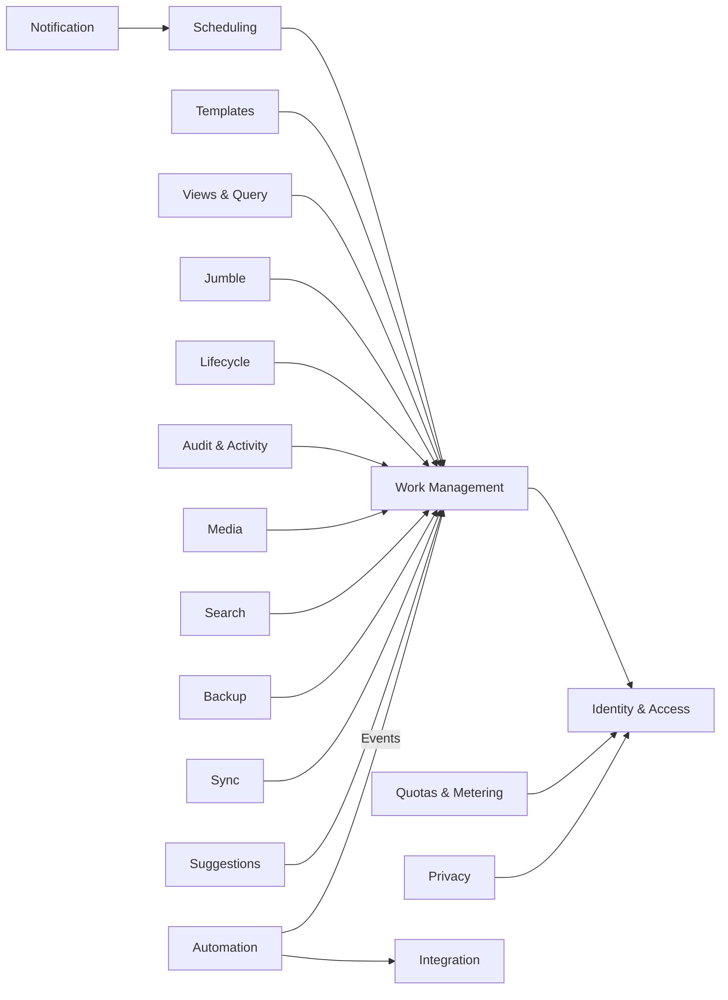

# Architecture Documentation — Hubtask

> Template: **arc42 8.2**.

This document is the frame: goals, constraints, building blocks and how they run. Each rule lives in
one subject document, linked from the chapter that needs it; an ADR records why a decision was taken.

**Reading order for developers:** ch. 1 → 4 → 5 → [domain model](./domain-model.md) → [project structure](./project-structure.md) → [API guidelines](./api-guidelines.md) → ch. 8 → [security](./security.md) → [reliability](./observability-reliability.md).

**Deep dives**

* Why and for whom: [vision](../vision/README.md),
  [use cases](../usecases/README.md).
* The model and the code: [domain-model.md](./domain-model.md),
  [project-structure.md](./project-structure.md), [api-guidelines.md](./api-guidelines.md),
  [engineering-guidelines.md](./engineering-guidelines.md).
* Isolation and trust: [multi-tenancy.md](./multi-tenancy.md), [security.md](./security.md),
  [identity.md](./identity.md), [audit.md](./audit.md).
* Personal data and its lifetime: [data-protection.md](./data-protection.md),
  [the data catalogue](../privacy/data-catalog.md), [data-retention.md](./data-retention.md),
  [backup-restore.md](./backup-restore.md), [tenant-export.md](./tenant-export.md).
* Behaviour: [offline-sync.md](./offline-sync.md), [automation.md](./automation.md),
  [ai-first.md](./ai-first.md), [i18n-l10n.md](./i18n-l10n.md).
* Operation and delivery: [observability-reliability.md](./observability-reliability.md),
  [deployment.md](./deployment.md), [support-matrix.md](./support-matrix.md),
  [ci-cd.md](./ci-cd.md), [versioning-release.md](./versioning-release.md),
  [licensing-editions.md](./licensing-editions.md).
* Clients: [the design system and the shell](../design/design-system.md).
* Decisions and plan: [the ADRs](../adr/README.md), [the roadmap](../roadmap.md).

---

## 1. Introduction and goals

Hubtask is an open, self-hostable task manager with five hierarchy levels
(Hub → Collection → Task → Work Package → Activity). It runs for a private individual in one
container with one database (`docker compose up`) and for a service provider multi-tenant on
Kubernetes; the deployments in between are D1–D7 in [`docs/vision/deployments.md`](../vision/deployments.md).

Hubtask is built **backend first, API first, and AI first**: the core and its API are the product;
every frontend, integration and AI agent is an equal client of the same public API.

### 1.1 Requirements

**Core business features** (details in [domain-model.md](./domain-model.md)):

| # | Requirement | Short description |
|---|---|---|
| F-01 | Hierarchy | Hub → collection → task → work package → activity |
| F-02 | Task feature set | Status, due date, reminders, bucket, notes, labels, members, history, comments, cover |
| F-03 | Activity feature set | Status, due date, reminder, assignment |
| F-04 | Recurring tasks | RFC 5545 RRULE across time zones |
| F-05 | Templates | Task trees as templates |
| F-06 | Views | List, kanban, timeline as saved, server-defined views |
| F-07 | Filtering & sorting | One query DSL over every item field |
| F-08 | Jumble | An inbox for unstructured arrivals, converted into items |
| F-09 | Trash | Soft delete, 30 days, restore, then a hard delete |
| F-10 | Archiving | Permanent, restorable at any time |
| F-11 | Automatic assignment | Fixed, random across people or groups, extensible |
| F-12 | Integrations | ICS feed, CalDAV, outbound webhooks, HTTP actions |
| F-13 | Automation | Trigger → condition → action over **all** business features |
| F-14 | Collaboration | Members, roles, permissions, comments, history |
| F-15 | Multi-tenancy | Complete separation per tenant, provisioning, quotas, export, deletion |
| F-16 | Multilingualism | Any BCP-47 language, time zones, date formats, RTL |
| F-17 | Auditability | A tamper-evident, verifiable log |
| F-18 | Backup | Free targets, encryption, generations, item-level restore |
| F-19 | Retention rules | Periods per data kind with grace period and safeguards |
| F-20 | Offline capability | Work without a network, merged per field |

**Core non-functional requirements:**

| # | Requirement |
|---|---|
| Q-01 | Operation in Docker/Podman (single node) **and** Kubernetes (multi node) from the same artefact |
| Q-02 | Horizontally scalable, stateless processes |
| Q-03 | A central, extensible core (new levels, fields and features without a break) |
| Q-04 | Open source (Apache-2.0); self-hosting with no feature restriction |
| Q-05 | API completeness: no feature exists only in the UI |

### 1.2 Quality goals

Prioritised (1 = highest); in case of doubt these six goals win over everything else.

| Prio | Quality goal | Scenario (short) | Measure |
|---|---|---|---|
| 1 | **Extensibility / generalisation** | A sixth level or a new field type | No schema restructuring, no breaking change to API v1; < 5 person-days |
| 2 | **Integrability / automatability** | Every operation via API, event and automation | 100% of use cases are an API operation *and* an automation action (the parity gate) |
| 3 | **Security / tenant isolation** | Tenant A requests tenant B's data | Impossible, enforced by RLS in the database, not just in code; the SG gates green |
| 4 | **Reliability / self-diagnosis** | Object storage fails, a pod dies mid-job | No process exit, no data loss, the feature reported `degraded`; SLO-1 ≥ 99.9%, SLO-8 data loss = 0 |
| 5 | **Operability** | A private individual starts it; a provider scales to 50 pods | One image plus PostgreSQL, `docker compose up` in < 5 min; the same image on Kubernetes through Helm |
| 6 | **Internationalisation** | Users in Tokyo and Cairo share a collection | Times correct across time zones; no server-side display text |

Secondary but binding: performance (P95 read < 200 ms at 10⁶ items per tenant), testability (the
domain is testable without infrastructure), maintainability. Security and reliability rules each
have an automated proof that breaks the build ([security.md](./security.md) §13,
[observability-reliability.md](./observability-reliability.md) §12).

### 1.3 Stakeholders

The architecture's roles; the people who use the product are
[`docs/vision/personas.md`](../vision/personas.md).

| Role | Expectation of the architecture |
|---|---|
| Private user (self-hoster) | One Compose file, little RAM, all features, easy updates |
| Service provider / enterprise | Tenant isolation, SSO/OIDC, quotas, observability, Helm, data export |
| End user | A fast, multilingual, dependable app; data is never lost |
| Backend developer | A clear hexagonal structure, generated API types, fast tests |
| Frontend developer | A stable, complete, self-describing API; no UI assumptions in the backend |
| Integration/automation user (n8n, Zapier) | A complete REST API, webhooks, stable event schemas |
| AI agents / MCP clients | Deterministic, idempotent, machine-readable operations |
| Operator/SRE | Health and readiness probes, OpenTelemetry, zero-downtime migrations |

---

## 2. Constraints

### 2.1 Technical constraints

| ID | Constraint | Consequence |
|---|---|---|
| C-01 | Backend language **Go**, the version `go.mod` pins ([support-matrix.md](./support-matrix.md)) | No JVM or Node dependencies in the core |
| C-02 | The in-house **hexagonal folder structure** | Kept and only extended ([project-structure.md](./project-structure.md)) |
| C-03 | Docker, Podman **or** Kubernetes | One binary, several roles, 12-factor configuration |
| C-04 | Horizontal scalability | No local state, no sticky sessions, no scheduler without leader election |
| C-05 | Minimal mandatory dependencies | Only **PostgreSQL** is required |
| C-06 | CI/CD on **GitHub Actions**; Helm chart under `k8s/` | Every gate is a `make` target ([ci-cd.md](./ci-cd.md)) |
| C-07 | **Semantic Versioning 2.0.0** | [versioning-release.md](./versioning-release.md) |
| C-08 | Documentation follows **arc42** | This document is the frame; rules live in subject documents, reasons in ADRs |

### 2.2 Organisational and legal constraints

| ID | Constraint |
|---|---|
| C-10 | The source is public; self-hosting by private individuals is unrestricted and free of charge |
| C-11 | Apache-2.0 for the whole repository and every release; inbound = outbound; the name is protected separately ([licensing-editions.md](./licensing-editions.md)) |
| C-12 | GDPR by design (Art. 25), data subject rights, processing on behalf, data residency ([data-protection.md](./data-protection.md)) |
| C-13 | No feature crippling: one code path, one image, no licence key, no commercial edition |
| C-14 | The backend makes no assumptions about clients; the API stays client-blind. The first-party client stack is [ADR-0030](../adr/ADR-0030-svelte-frontend-framework.md)–[ADR-0033](../adr/ADR-0033-shared-client-architecture.md) |
| C-15 | Backup targets are not limited to particular providers; target, timing and retention are freely configurable |
| C-16 | Offline operation is compatible with collaboration — other people's changes are never silently lost |

### 2.3 Conventions

* Business terms in the code are English: `Hub`, `Collection`, `Task`, `WorkPackage`, `Activity`, `Bucket`, `Label`, `Jumble`.
* Instants are UTC server-side (`timestamptz`), plus the originating IANA time zone where the logic needs it (recurrence, reminders).
* IDs: **UUIDv7** (time-sortable, no sequential information leakage).
* Money and quotas: integers, never floats.

---

## 3. Context and scope

### 3.1 Business context

| Neighbour | Direction | Interface / contract |
|---|---|---|
| End users and tenant admins | Inbound | REST/JSON `/api/v1` (OpenAPI 3.1), the web app |
| Automation platforms (n8n, Zapier, Make) | Both | REST, webhook subscriptions (CloudEvents, HMAC-signed), trigger polling |
| HTTP targets | Outbound | Automation actions, webhook deliveries |
| AI agents | Both | MCP (tools = use cases), or REST with a service account |
| Identity provider | Outbound | OIDC ([identity.md](./identity.md) §10); local accounts beside it |
| Object storage | Outbound | S3 with presigned URLs; fallback: a local volume |
| Email | Both | SMTP out; intake into the jumble **webhook-only**, to a token-protected URL per tenant, no IMAP ([ADR-0040](../adr/ADR-0040-no-imap-intake.md)) |
| Calendar | Both | An ICS feed per view; CalDAV with a personal access token, writing through the use cases ([security.md](./security.md) T-22) |
| LLM provider | Outbound | `core/port/ai`, OpenAI-compatible and Ollama; off by default |
| Operator/SRE | Inbound | Health, metrics, traces (§3.2) |

### 3.2 Technical context

| Channel | Protocol | Port (default) | Note |
|---|---|---|---|
| Public API and web app | HTTP/1.1 + HTTP/2, JSON | 8080 | TLS terminated at the ingress/reverse proxy |
| Real-time updates | Server-sent events (`/api/v1/stream`) | 8080 | |
| MCP | HTTP (streamable) | 8080 (`/mcp`) | Its own auth scope |
| Operations | HTTP (Prometheus, health) | 9090 (`HUBTASK_OPS_ADDR`) | Not publicly exposed |
| Database | PostgreSQL wire protocol | 5432 | Required |
| Object storage | S3 HTTPS | — | Optional |
| Event bus (scale-out) | NATS JetStream | 4222 | Optional, default: the PostgreSQL outbox |

---

## 4. Solution strategy

| Goal/constraint | Approach |
|---|---|
| Extensibility (quality goal 1, Q-03) | **Generalisation:** one `WorkItem` with a **capability profile** per type and typed custom fields — a new level is configuration, not schema |
| Integrability (quality goal 2, Q-05) | **One use case catalogue:** every use case is a REST operation, an MCP tool and an automation action (the parity gate) |
| Operability (quality goal 5, Q-01, Q-02) | **One artefact, several roles** chosen by configuration (§7.1) |
| Few dependencies (C-05) | PostgreSQL is database, job queue, outbox, full-text search and pub/sub fallback; NATS and S3 are optional |
| Tenant isolation (quality goal 3, F-15) | `tenant_id` in every table plus **row level security** under a role without `BYPASSRLS` ([multi-tenancy.md](./multi-tenancy.md)) |
| Frontend decoupled (C-14) | **Generic building blocks** — the query DSL, `SavedView` with an opaque `layout` hint, the capability manifest |
| AI first | The domain stays AI-free, AI an adapter behind ports; outwards MCP, idempotency, machine-readable errors ([ai-first.md](./ai-first.md)) |
| Architectural style | **Hexagonal + DDD:** the core knows only ports; a modular monolith whose contexts can run as their own process, automation first ([ADR-0002](../adr/ADR-0002-modular-monolith.md)) |

### 4.1 Technology decisions at a glance

Go (the version in `go.mod`) on `net/http` and `log/slog`; OpenAPI 3.1 through `oapi-codegen`;
PostgreSQL ([support-matrix.md](./support-matrix.md)) through `pgx/v5`, `sqlc` and `goose`;
`rrule-go`, CEL and `golang.org/x/text`; Svelte 5 for the clients. Each choice and its alternatives
is an ADR (§9); the full dependency list is `go.mod` and the `package.json` files.

---

## 5. Building block view

### 5.1 Level 1 — whitebox Hubtask

Dependencies point inwards: presentation and infrastructure depend on the core, never the reverse.

| Building block | Responsibility |
|---|---|
| `core/domain` | The business model, invariants, state transitions, domain events, pure domain services |
| `core/application` | Use cases, orchestration, transaction boundaries, permission checks, event publication |
| `core/port` | Interfaces to the outside (clock, IDs, storage, mail, bus, AI, environment, …) |
| `presentation/*` | Inbound adapters — REST incl. admin, MCP, the change stream, ICS/CalDAV, jumble intake, worker, web UI: protocol ↔ use case, serialisation, localisation of messages; the web UI serves bytes only |
| `infrastructure/*` | Outbound adapters — PostgreSQL (repositories, outbox, queue), object storage, SMTP, HTTP client, AI provider, OIDC, OpenTelemetry, NATS — without business rules |

What each may import, and where each package lives: [project-structure.md](./project-structure.md) §1, §2.

### 5.2 Level 2 — bounded contexts in the core


```mermaid
graph LR
  SCHED[Scheduling] & TPL[Templates] & VIEW[Views & Query] & JUM[Jumble] & LIFE[Lifecycle] --> WORK[Work Management]
  AUD[Audit & Activity] & FILES[Media] & SEARCH[Search] & BAK[Backup] & SYNC[Sync] & SUGG[Suggestions] --> WORK
  WORK & LIC[Quotas & Metering] & PRIV[Privacy] --> IAM[Identity & Access]
  AUTOM[Automation] -->|Events| WORK
  AUTOM --> INTEG[Integration]
  NOTIF[Notification] --> SCHED
```

| Context | Aggregates / key terms | Note |
|---|---|---|
| **Identity & Access** | `Tenant`, `Account`, `Membership`, `Group`, `Role`, `AccessToken`, `Session`, `IdentityProvider` | The tenant is the topmost isolation boundary, above the hub |
| **Work Management** | `Container`, `WorkItem`, `Bucket`, `Label`, `Comment`, `Cover`, `CustomFieldDefinition`, `AutoAssignPolicy` | The business core ([domain-model.md](./domain-model.md)) |
| **Scheduling** | `DueDate`, `Reminder`, `RecurrenceRule` | An occurrence *is* a `WorkItem`; no occurrence table (§6.3) |
| **Templates** | `Template`, its node tree | Produces item trees |
| **Views & Query** | `SavedView`, `QuerySpec`, the query field catalogue | List, kanban, timeline |
| **Jumble** | `JumbleEntry` | Converted into a `WorkItem` |
| **Lifecycle** | Trash, archive, retention rules, legal holds, the deletion journal | [data-retention.md](./data-retention.md) |
| **Automation** | `AutomationRule`, `Run`, scheduled triggers, outbound calls | Separately deployable |
| **Integration** | `WebhookSubscription`, `CalendarFeed`, inbound tokens, AI provider settings | |
| **Notification** | `Notification`, `NotificationPreference`, channel ports | Email is the only channel that sends; webhook and push are named channels not yet built |
| **Audit & Activity** | `ActivityEntry`, the audit trail | Append-only; the activity entry is the item history |
| **Media** | `MediaObject` | Covers and attachments, presigned upload (§8.4) |
| **Search** | Full text, optionally vector | |
| **Quotas & Metering** | The quota guard, `UsageRecord` | §8.12 |
| **Backup** | Targets, schedules, runs, restores | [backup-restore.md](./backup-restore.md) |
| **Privacy** | Data subject requests, consent | [data-protection.md](./data-protection.md) |
| **Sync** | Devices, mutations, the change log | [offline-sync.md](./offline-sync.md) |
| **Suggestions** | `Suggestion` | AI proposals; nothing changes until a person accepts ([ai-first.md](./ai-first.md)) |

Imports and jobs are supporting packages (`importer`, `job`), not contexts of their own.

### 5.3 Level 3 — whitebox Work Management (an extract)

The rules behind each element are in [domain-model.md](./domain-model.md).

| Element | Type | Responsibility |
|---|---|---|
| `WorkItem` | Aggregate root | The item, with `version` for optimistic locking |
| `ItemCapabilityProfile` | Domain policy | An `ItemType`'s features, maximum depth and permitted child types |
| `Hierarchy` | Domain service | Parent-child rules, depth, no cycles, moving subtrees |
| `Ordering` | Value object | The sort key, a fractional index |
| `CompletionPolicy` | Domain policy | Optional, per collection: a parent completes once all its children have |
| `AssignmentStrategy` | Interface + strategies | `FIXED`, `RANDOM_MEMBER`, `RANDOM_GROUP_MEMBER`, `ROUND_ROBIN`, `LEAST_LOADED` (§3.6 there) |
| Work item repository | Repository interface | The aggregate, tree queries, the query DSL |

---

## 6. Runtime view

### 6.1 Creating a task (the standard write path)

1. The client sends `POST /api/v1/items` with an `Idempotency-Key`.
2. The REST adapter decodes and validates against the use case descriptor.
3. The application service checks idempotency and permission, opens the transaction with
   `SET LOCAL app.tenant_id`, lets the domain create the `WorkItem` and its event, writes the item,
   the activity entry and the outbox event, and commits.
4. The client receives `201 Created` with an `ETag`.
5. The outbox dispatcher fans the event out to automation, webhooks, the change stream and the
   search index.

One transaction per use case, with no external call inside; outward side effects happen only through
the dispatcher ([domain-model.md](./domain-model.md) §4).

### 6.2 An automation rule fires

The dispatcher hands an event to the automation engine, which loads the matching rules, evaluates
their CEL conditions, checks the run's guards and executes each action as a use case under the
rule's runner, or as an HTTP call. A chain of rules triggering each other ends at causation depth 5
with `ABORTED_LOOP` ([automation.md](./automation.md) §2).

### 6.3 A recurring task

1. The `RecurrenceRule` (RRULE + IANA time zone + mode) sits on the template entry, and the series counts from the entry's due date.
2. The scheduler materialises occurrences for a rolling window (`horizonDays`, 90 by default, 1–365) as jobs.
3. Mode `ON_SCHEDULE` owes every moment of the grid out to the horizon; mode `ON_COMPLETION` owes exactly one, and only once nothing of the series is open, counted from the last completion.
4. DST and time zone changes are resolved through the stored time zone, not through UTC offsets.
5. **Each occurrence is created exactly once.** The pass that creates occurrences moves the rule's `last_materialized_at` (how far the series has been dealt with) by compare-and-set in the same transaction as the entries and their events, so a leader failover or two concurrent passes never mint one twice; the loser rolls back.
6. A materialised occurrence is an ordinary entry: changing or removing the series leaves occurrences already created alone, and a skip moves `last_materialized_at` past an occurrence not yet created.

### 6.4 Jumble arrival → task

Email, webhook or quick capture → a `JumbleEntry` (raw content, origin, attachments) → optionally an
AI suggestion → the user confirms, or a rule converts it → a `WorkItem` referring back to the arrival.

### 6.5 Further documented scenarios

| Scenario | Where |
|---|---|
| Login (OIDC) | [identity.md](./identity.md) §10. The workspace is resolved **before** the flow ([multi-tenancy.md](./multi-tenancy.md) §3) and travels in the single-use `state`, never in a claim, because the provider is configured per workspace |
| Kanban query | `POST /api/v1/items:query` with `group_by`, a cursor per group ([api-guidelines.md](./api-guidelines.md)) |
| Trash & retention | [data-retention.md](./data-retention.md) |
| Tenant deletion | [multi-tenancy.md](./multi-tenancy.md) §5 |
| Zero-downtime migration | [versioning-release.md](./versioning-release.md) §4 |
| Webhook delivery | [automation.md](./automation.md) §3.1 |

---

## 7. Deployment view

### 7.1 One artefact, several roles

```
ghcr.io/<owner>/hubtask:<semver>                # one image, distroless, statically linked
HUBTASK_ROLES=api,worker,scheduler,automation   # default: all
```

| Role | Task | Scaling |
|---|---|---|
| `api` | HTTP, MCP, the change stream, ICS/CalDAV, the web UI | Horizontal, stateless |
| `worker` | Outbox dispatch, webhooks, mail, media, search index, jobs | Horizontal (`SKIP LOCKED`) |
| `scheduler` | Reminders, recurrence, retention | Exactly one active (advisory lock leader) |
| `automation` | Rule evaluation and execution | Horizontal, separately deployable to keep spikes off the API |

### 7.2 Deployment "private individual" (Docker/Podman)

All roles in one replica beside PostgreSQL, with a volume for media; no NATS, no object store, the
full feature set ([deployment.md](./deployment.md) §2.1).

### 7.3 Deployment "provider" (Kubernetes)

The same image and configuration keys: one deployment per role (`scheduler` behind the leader
lock), the migration as a Job before the rollout, PostgreSQL through an operator, S3-compatible
storage, optionally NATS JetStream, network policies ([deployment.md](./deployment.md) §2.2).

### 7.4 The configuration principle

Only environment variables with the `HUBTASK_` prefix (12-factor), behind
`core/port/environment/Port.go`; every variable has a safe default for self-hosting. Secrets come
from Docker or Kubernetes secrets, never from files in the image. The reference is
[deployment.md](./deployment.md) §6.

---

## 8. Cross-cutting concepts

Each concept lives in its subject document; this chapter says where, and keeps only the rules that
have no other home.

### 8.1 Domain model and generalisation
[domain-model.md](./domain-model.md): one `WorkItem` with an `ItemType` and a capability profile,
containers generalised the same way, extension through configuration and typed custom fields.

### 8.2 Persistence
PostgreSQL is the only mandatory component ([ADR-0003](../adr/ADR-0003-postgresql-as-single-datastore.md)):
`sqlc` queries, trees as `parent_id` plus a materialised `path`, migrations forward only
([versioning-release.md](./versioning-release.md) §4), optimistic locking through a `version` per
aggregate exposed as `ETag`/`If-Match`. Schema principles: [domain-model.md](./domain-model.md) §6.

### 8.3 Multi-tenancy
[multi-tenancy.md](./multi-tenancy.md): shared schema, row level security, `SET LOCAL app.tenant_id`
per transaction.

### 8.4 Security
[security.md](./security.md) and [identity.md](./identity.md)
([ADR-0015](../adr/ADR-0015-security-baseline.md)). One rule lives here because the media code
cites it: **the server never carries a client's file bytes on object storage.** Upload and download
go directly between client and store through presigned URLs; the server issues the URL and, on
confirmation, reads the bytes back and judges them. On a local volume the server's own
token-protected content routes stand in for the store, and a storage key is minted, never taken
from a request.

### 8.5 The API concept
[api-guidelines.md](./api-guidelines.md).

### 8.6 Events and integration
[domain-model.md](./domain-model.md) §4: a transactional outbox, a dispatcher, CloudEvents 1.0.

### 8.7 Automation
[automation.md](./automation.md).

### 8.8 Internationalisation
[i18n-l10n.md](./i18n-l10n.md): the server delivers codes and parameters, never finished sentences.

### 8.9 AI integration
[ai-first.md](./ai-first.md): AI results are always *suggestions*; off by default.

### 8.10 Observability and self-diagnosis
[observability-reliability.md](./observability-reliability.md)
([ADR-0016](../adr/ADR-0016-observability-reliability.md)).

### 8.11 Error handling
Domain errors are typed values; the application layer maps them to a category, the adapter maps the
category to an HTTP status and problem details (codes: [api-guidelines.md](./api-guidelines.md) §6):

| Category | Status | Meaning |
|---|---|---|
| `VALIDATION` | 422, or 400 for `malformed_request` | Input the domain rejects |
| `UNAUTHENTICATED` | 401 | Missing, expired, or unreadable credential |
| `FORBIDDEN` | 403 | Authenticated, but not permitted |
| `NOT_FOUND` | 404 | Does not exist, or may not be known to exist |
| `CONFLICT` | 409 | Clash with the current state, including a stale version |
| `GONE` | 410 | Existed and was permanently deleted — what a synchronising client tells apart from `NOT_FOUND` |
| `RATE_LIMITED` | 429 | A limit reached |
| `UNAVAILABLE` | 503 | A dependency unreachable or deliberately degraded — "later", not "wrong" |
| `INTERNAL` | 500 | A defect; anything unclassified. Nothing of it reaches the client beyond the code and the `request_id` |

An error carries a stable `code`, an optional `detail_code` and parameters — never a sentence
([ADR-0011](../adr/ADR-0011-i18n-message-codes.md)). The technical cause goes to the log and is
dropped at the adapter boundary: it may contain a connection string ([security.md](./security.md) §9).

### 8.11.1 Resilience and controlled degradation
[observability-reliability.md](./observability-reliability.md) §6, §7: an optional dependency's
failure never stops a process or the core write path.

### 8.12 Quotas and metering
One code path and one edition ([licensing-editions.md](./licensing-editions.md)). The quota guard
enforces operational ceilings per workspace (`core/application/service/quota/Quota.go`), and
`UsageRecord` keeps daily tallies for capacity planning — operating an installation, not licensing it.

### 8.13 Time, clock, IDs, randomness
`Clock`, `IDGenerator`, and `RandomSource` are ports. No `time.Now()` and no `rand` in the domain or
application layers — the precondition for deterministic tests (among them random assignment). An
architecture test enforces it.

### 8.14 Audit and traceability
[audit.md](./audit.md): the item history, the audit trail and technical logs are three separate records.

### 8.15 Data protection
[data-protection.md](./data-protection.md) and [the data catalogue](../privacy/data-catalog.md).
Data subject rights are use cases with deadline tracking. **Restriction of processing** (Art. 18) is
a state of the account: the person keeps working, and no automation rule and no AI touches their
data while it holds.

### 8.16 Backup and restore
[backup-restore.md](./backup-restore.md): backup is an application feature with interchangeable
targets, client-side encryption and selective restore.

### 8.17 Retention of business data
[data-retention.md](./data-retention.md): periods are data, executed with a grace period; legal hold
and restriction of processing take precedence.

### 8.18 Offline capability and synchronisation
[offline-sync.md](./offline-sync.md): server-authoritative delta sync, merged per field; the change
log is separate from the event outbox.

### 8.19 Clients and their capability matrix
**Parity is the default:** every feature ships in every first-party client unless the matrix below
restricts it with a reason ([ADR-0032](../adr/ADR-0032-client-capability-matrix.md)).

| Area | Web | Desktop (Tauri) | Mobile (Tauri) |
|---|---|---|---|
| End-user features | full | full | full |
| Profile configuration | full | full | full |
| Administration | full | full | via the web app |

The web app always carries the complete feature set. Mobile shows administrative areas as links to the web app (online-only, high-consequence,
faster-changing than store review); member and role management at container scope is collaboration
and ships on mobile. The matrix governs what UI is built, never what the API permits. A new restriction
is a new row here with its reason, and an ADR. The web client's areas and routes:
[design-system.md](../design/design-system.md) §11.5.

---

## 9. Architecture decisions

Every decision, with its context, options and consequences, is listed in
[../adr/README.md](../adr/README.md); the rule each one set lives in the subject document its
`Rule lives in` line names.

---

## 10. Quality requirements

### 10.1 Quality tree

The attributes and their priorities are the quality goals of §1.2.

### 10.2 Quality scenarios

Where a scenario has been walked, its evidence file is linked; QS-24 to QS-27 are in [SY-2026-09-16.md](../archive/evidence/SY-2026-09-16.md).

| ID | Scenario | Response / measure |
|---|---|---|
| QS-01 | A sixth level "milestone" above task | A new `ItemType` and capability profile, no new table, API v1 compatible; ≤ 5 person-days |
| QS-02 | 2 million items, a kanban board filtered by label and due date | P95 < 300 ms with cursor pagination and composite indices (load test) |
| QS-03 | An attacker sets a foreign `tenant_id` | 404/403; RLS stops access even with a code defect |
| QS-04 | A webhook recipient is down for 6 h | Backoff, dead letter, replay, no data loss; the API unaffected |
| QS-05 | A self-hoster updates 1.4 → 1.5 | `docker compose pull && up -d`; the migration runs by itself; no data loss, downtime < 30 s |
| QS-06 | A rule's event triggers the same rule | Abort at causation depth 5, run `ABORTED_LOOP` |
| QS-07 | A daily 09:00 recurrence in São Paulo across a DST change | Stays 09:00 local; a test per DST transition |
| QS-08 | A new language (Arabic, for example) | Translations and enabling the locale, no code change; the RTL flag in the manifest ([QS-08-2026-09-15.md](../archive/evidence/QS-08-2026-09-15.md)) |
| QS-09 | The AI provider fails or is disabled | Core features stay; AI endpoints answer `503` `ai.unavailable` ([ADR-0049](../adr/ADR-0049-ai-provider-surface.md)); health as [observability-reliability.md](./observability-reliability.md) §7 ([QS-09-2026-09-09.md](../archive/evidence/QS-09-2026-09-09.md), [RT-1-2026-09-09.md](../archive/evidence/RT-1-2026-09-09.md)) |
| QS-10 | 200 concurrent imports of 5,000 items each | Backpressure through rate limits and the queue, no OOM, progress in the job status |
| QS-11 | Object storage down for 2 h | No process exit, write path unaffected, `media` degraded in `/meta/health`, recovery without restart (RT-1) |
| QS-12 | A pod `SIGKILL`ed mid-job | The lease expires, another instance resumes, the job takes effect once (RT-3) |
| QS-13 | PostgreSQL down for 5 min | `/healthz` green (no kill loop), `/readyz` red, reconnect with backoff, no restart (RT-2) |
| QS-14 | No backup configured | `/meta/health` warns `config.backup_not_configured`; alert A-12 for providers |
| QS-15 | An automation action targets `169.254.169.254` | `GuardedClient` refuses before connecting; the run fails, logged (T-07, SG-6) |
| QS-16 | A rolling update N−1 → N under load | No `5xx`, no data loss; a pod with an incompatible migration state stays unready (RT-8) |
| QS-17 | A repository method without a cross-tenant negative test | Gate SG-3 fails the build |
| QS-18 | An auditor wants every permission change of a year | `GET /audit` filtered, `:export` as a job, `:verify` proves the chain gapless |
| QS-19 | A data subject requests erasure | Every location in the data catalogue served within the deadline; backups expire over the documented period, and the deletion journal stops a return on restore ([data-protection.md](./data-protection.md)) |
| QS-20 | Database and server lost, only the S3 target credentials left | A new instance lists the archives from the manifests; a `NEW_TENANT` restore (BK-1) |
| QS-21 | A collection of 400 items deleted, the trash period over | Selective restore from the last archive into the existing tenant, nothing else touched |
| QS-22 | "Delete completed tasks after 1 year" | Notify-only above 5% affected; a warning and a 14-day grace period; the scope in the audit ([data-retention.md](./data-retention.md)) |
| QS-23 | A legal hold on a collection a rule would delete | Nothing deleted; `legal_hold` in `retention_run.blocked_reasons` and on the object |
| QS-24 | Offline, A changes an item's due date, B its title | Both survive, no user decision (SY-1) |
| QS-25 | A device offline for 90 days knows items deleted since | `sync.cursor_too_old` forces a full sync; deleted objects stay gone (SY-5, RE-6) |
| QS-26 | Access to a collection lost while offline | `ACCESS_REVOKED` in the pull stream, local deletion, mutations refused (SY-6) |
| QS-27 | A device clock three hours out | The HLC bound stops it outvoting everyone else (SY-2) |

---

## 11. Risks and technical debt

| ID | Risk / debt | Countermeasure |
|---|---|---|
| R-01 | The generalised `WorkItem` becomes a god object | Capability profiles, type-specific policies, architecture tests |
| R-03 | PostgreSQL as queue/bus hits limits under load | The NATS JetStream adapter; measured by `test/load` |
| R-04 | Frontend needs contradict the generic API | The query DSL and manifest; the web app uses the public API only |
| R-05 | A faulty tenant context makes RLS ineffective — a data leak | One transaction wrapper, a pool-boundary test, no `BYPASSRLS`, negative tests in CI |
| R-06 | Automation raises load uncontrollably | Quotas, rate limits, the recursion bound, a separate deployment, circuit breakers |
| R-07 | RRULE, time zones and DST give wrong due dates | A library, table tests, golden files for DST boundaries |
| R-08 | Defects only a person driving the finished product finds | Walks of finished screens against a real server; residue: builders walk their own work |
| R-09 | GDPR deletion overlooks derived data (index, events, backups) | A deletion path per location in the data catalogue, deletion tests |
| R-10 | Public source plus HTTP automation invite SSRF and amplification | `GuardedClient` as the only outbound route, a mandatory egress allowlist for providers, SG-6, T-07 |
| R-11 | Gates bypassed or softened under pressure | Suppression only with a reason in the code; softening a gate needs an ADR; `make gate-selftest` |
| R-12 | New features emit no signals | Gate RT-12 reconciles the use case registry against metrics and spans |
| R-13 | Metric cardinality explodes with many tenants | No object IDs as labels; `tenant_id` only when explicitly enabled |
| R-14 | Degradation states multiply the test matrix | The fixed series RT-1…RT-12 against containers |
| R-15 | Free backup targets are an exfiltration and SSRF channel | Instance administrators only, `GuardedClient`, audited, tenant-owned targets off by default ([ADR-0019](../adr/ADR-0019-backup-targets.md)) |
| R-16 | A lost backup passphrase makes every archive useless | An unmissable notice and logged confirmation at setup, rotation keeping old archives readable, a health warning |
| R-17 | A misconfigured retention rule irreversibly destroys work | The safeguards of [data-retention.md](./data-retention.md) ([ADR-0020](../adr/ADR-0020-retention-policies.md)) |
| R-18 | Our archive format is a long-term commitment | The format version in the manifest, golden archives per major version, import test BK-4 as a gate |
| R-19 | Per-field merging can lose data silently | Merge rules in one place (`core/application/service/sync`), tests SY-1…SY-12, displaced versions kept |
| R-20 | Offline caches are personal data on devices that get lost | Encryption at rest in the shells, deletion on sign-out and revocation, `hubctl sync-conformance` |
| R-21 | Tombstones and backups extend the deletion deadline (GDPR Art. 17) | Documented, configurable periods; the deletion journal on restore |

---

## 12. Glossary

| Term | Code identifier | Meaning |
|---|---|---|
| Hub | `Hub` | The topmost container; holds collections |
| Collection | `Collection` | Holds items; defines buckets, labels, policies |
| Task | `Task` (`ItemType=TASK`) | An item with the full feature set |
| Work package | `WorkPackage` | An item below a task, grouping subtasks |
| Activity | `Activity` | An item with a reduced feature set |
| List / bucket | `Bucket` | A status column within a collection (a kanban column) |
| Jumble | `Jumble` | The inbox for unstructured arrivals |
| Trash | `Trash` | The soft-delete area, 30 days |
| Archive | `Archive` | Indefinite storage, restorable |
| Template | `Template` | A predefined item tree |
| View | `SavedView` | A saved query plus a layout hint |
| Tenant | `Tenant` | The topmost isolation boundary; a workspace |
| Use case | `UC-…` | A requirement with numbered checks ([`docs/usecases/`](../usecases/README.md)) |
| Operation | a use case of the application layer | Registered in three channels ([domain-model.md](./domain-model.md) §5) |
| Private hub | `container.private` | A hub only its members reach ([ADR-0073](../adr/ADR-0073-private-hubs.md)) |
| Managed account | `Account.sign_in_name` | An account signing in with a name instead of a mail address ([ADR-0074](../adr/ADR-0074-managed-accounts.md)) |
| Capability profile | `ItemCapabilityProfile` | The permitted fields and features per item type |
| Rule | `AutomationRule` | A trigger plus conditions plus actions |
| Rule run | `Run` | The execution log of a rule |
| Event | Domain event / CloudEvent | A business state change, consumable externally |
| Port / adapter | Port, adapter | An interface from the core outwards / its technical implementation |
