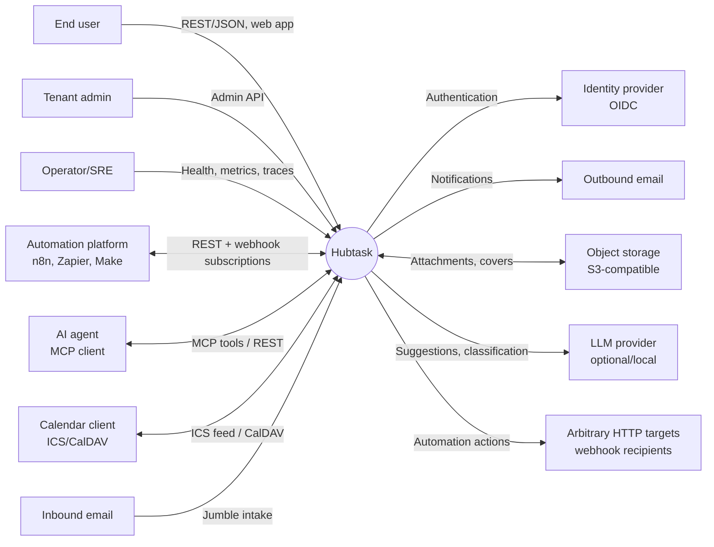
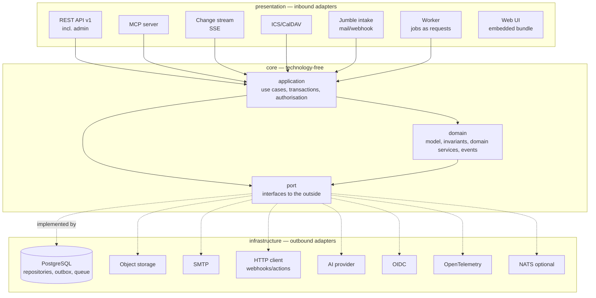
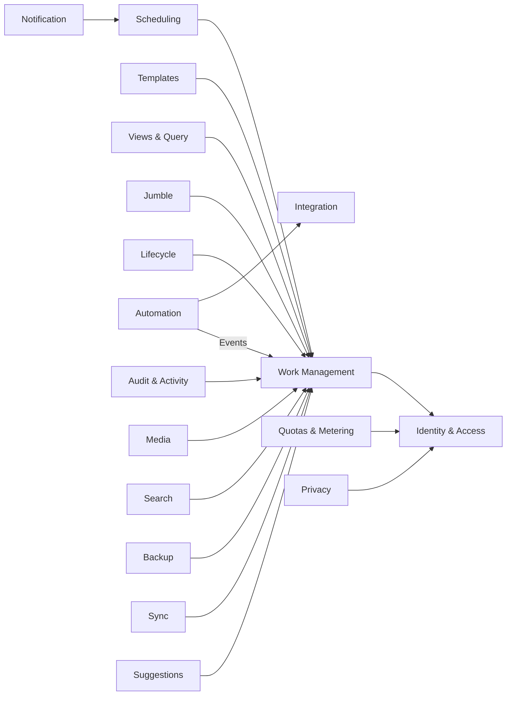
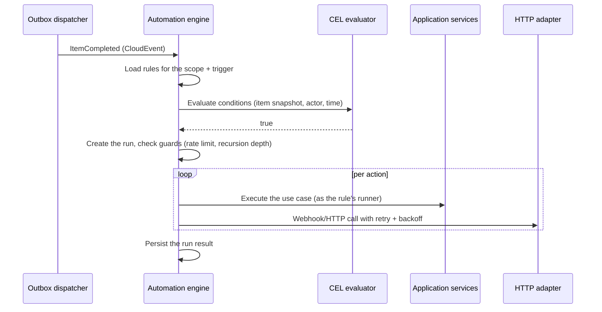
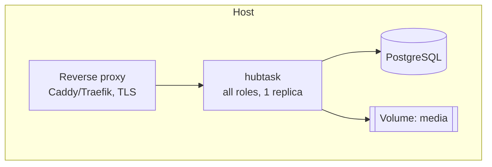
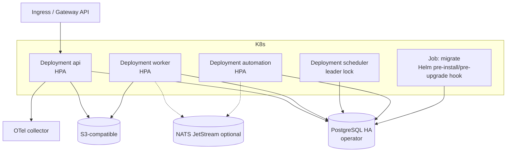

# Architecture Documentation — Hubtask

> Template: **arc42 8.2** · Language: English throughout — documentation, code, identifiers, and
> commits.

This document is the frame: the goals, the constraints, the building blocks and how they run. Each
rule lives in exactly one subject document, linked from the chapter that needs it; an ADR records
why and when a decision was taken.

**Reading order for developers:** ch. 1 → 4 → 5 → [domain model](./domain-model.md) → [project structure](./project-structure.md) → [API guidelines](./api-guidelines.md) → ch. 8 → [security](./security.md) → [reliability](./observability-reliability.md).

| Deep dive | File |
|---|---|
| **Vision: principles, personas, deployments, non-goals** | [../vision/README.md](../vision/README.md) |
| **Use cases: what a person can do, and how it is checked** | [../usecases/README.md](../usecases/README.md) |
| Domain model, aggregates, invariants, events, the operation catalogue's rules | [domain-model.md](./domain-model.md) |
| The repository map, dependency rules, code conventions | [project-structure.md](./project-structure.md) |
| API-first guidelines, errors, pagination, query DSL | [api-guidelines.md](./api-guidelines.md) |
| Multi-tenancy & isolation | [multi-tenancy.md](./multi-tenancy.md) |
| **Security concept, threat model, security gates** | [security.md](./security.md) |
| **Accounts, sign-in, sessions, second factor, providers, step-up** | [identity.md](./identity.md) |
| **Audit and traceability** | [audit.md](./audit.md) |
| **Data protection (GDPR) and data subject rights** | [data-protection.md](./data-protection.md) |
| **Backup, targets, restore** | [backup-restore.md](./backup-restore.md) |
| The tenant export format | [tenant-export.md](./tenant-export.md) |
| **Retention and lifecycle of business data** | [data-retention.md](./data-retention.md) |
| **Offline capability and synchronisation** | [offline-sync.md](./offline-sync.md) |
| **CI/CD and pipelines** | [ci-cd.md](./ci-cd.md) |
| **Deployment, environments, rollout** | [deployment.md](./deployment.md) |
| Supported runtimes, architectures, PostgreSQL majors | [support-matrix.md](./support-matrix.md) |
| **Observability, SLOs, resilience, self-diagnosis** | [observability-reliability.md](./observability-reliability.md) |
| Internationalisation & localisation | [i18n-l10n.md](./i18n-l10n.md) |
| Automation, rules, webhooks, n8n/Zapier | [automation.md](./automation.md) |
| AI-first concept (MCP, agents, ports) | [ai-first.md](./ai-first.md) |
| Semantic versioning, release, branching | [versioning-release.md](./versioning-release.md) |
| Licence (Apache-2.0) and the one edition | [licensing-editions.md](./licensing-editions.md) |
| Test strategy, Definition of Ready and of Done | [engineering-guidelines.md](./engineering-guidelines.md) |
| The design system and the shell | [../design/design-system.md](../design/design-system.md) |
| Architecture decisions | [../adr/README.md](../adr/README.md) |
| Data catalogue (record of processing activities) | [../privacy/data-catalog.md](../privacy/data-catalog.md) |
| Implementation plan / milestones | [../roadmap.md](../roadmap.md) |

---

## 1. Introduction and goals

Hubtask is an open, self-hostable task manager with five hierarchy levels
(Hub → Collection → Task → Work Package → Activity). It serves private individuals (one container,
one database, `docker compose up`) and service providers who run it multi-tenant for many
customers (Kubernetes, horizontal scaling). Between the two poles lie seven shapes — a private
person, a family, a club, a company running it itself, a provider for consumers, one for companies,
a managed service provider — which [`docs/vision/deployments.md`](../vision/deployments.md) names
D1–D7; with the principles and the personas they are the yardstick the use cases are written
against ([`docs/vision/`](../vision/README.md)).

The application is built **backend first, API first, and AI first**: the business core and its API
are the product; every frontend, every integration, and every AI agent is an equal client of the
same public API.

### 1.1 Requirements

**Core business features** (details in [domain-model.md](./domain-model.md)):

| # | Requirement | Short description |
|---|---|---|
| F-01 | Hierarchy | A hub manages collections; a collection contains tasks; a task contains work packages; a work package contains activities |
| F-02 | Task feature set | Status (done/open), due date, reminders, bucket/list, notes, coloured labels, members, history, comments, cover (colour/image) |
| F-03 | Activity feature set | Status, due date, reminder, assignment |
| F-04 | Recurring tasks | Recurrence rules per RFC 5545 (RRULE), correct across time zones |
| F-05 | Templates | Templates for tasks including work packages and activities |
| F-06 | Views | List (collapsed/expanded), kanban, timeline — as saved, server-defined views |
| F-07 | Filtering & sorting | A generic, composable query DSL over every item field |
| F-08 | Jumble | An inbox for unstructured arrivals (email, webhook, quick capture) with conversion into items |
| F-09 | Trash | Soft delete, 30 days of retention, restore, then a hard delete |
| F-10 | Archiving | Permanent archiving, restorable at any time |
| F-11 | Automatic assignment | A fixed person, randomly across people/groups, extensible strategies |
| F-12 | Integrations | Calendar (ICS feed, CalDAV), outbound webhooks, HTTP actions |
| F-13 | Automation | A rule system trigger → condition → action with access to **all** business features |
| F-14 | Collaboration | Members, roles, permissions, comments, activity history |
| F-15 | Multi-tenancy | Complete data separation per tenant, provisioning, quotas, export, deletion |
| F-16 | Multilingualism | Any language (BCP-47), time zones, calendar week and date formats, RTL-capable |
| F-17 | Auditability | A tamper-evident log of security- and compliance-relevant events, queryable, exportable, verifiable ([audit.md](./audit.md)) |
| F-18 | Backup | Freely chosen targets, schedules, encryption, generational retention, listing at the target, restore down to item level, import ([backup-restore.md](./backup-restore.md)) |
| F-19 | Retention rules | Configurable periods per data kind and area with a grace period, advance warning, and safeguards — for example, deleting completed tasks after a year ([data-retention.md](./data-retention.md)) |
| F-20 | Offline capability | Clients keep working without a network; per-field merging without losing other people's concurrent changes ([offline-sync.md](./offline-sync.md)) |

**Core non-functional requirements:**

| # | Requirement |
|---|---|
| Q-01 | Operation in Docker/Podman (single node) **and** Kubernetes (multi node) from the same artefact |
| Q-02 | Horizontally scalable, stateless processes |
| Q-03 | A central, extensible core component (new levels/fields/features without a break) |
| Q-04 | Open source (Apache-2.0); self-hosting with no feature restriction |
| Q-05 | API completeness: no feature exists only in the UI |

### 1.2 Quality goals

Prioritised (1 = highest); in case of doubt these six goals win over everything else.

| Prio | Quality goal | Scenario (short) | Measure |
|---|---|---|---|
| 1 | **Extensibility / generalisation** | A sixth hierarchy level or a new field type is introduced | No change to the persistence schema structure and no breaking change to API v1; delivered in < 5 person-days |
| 2 | **Integrability / automatability** | Every business operation is usable through the API, as an event, and as an automation action | 100% of use cases available as an API operation *and* as an automation action (the parity gate) |
| 3 | **Security / tenant isolation** | Tenant A makes a manipulated request for tenant B's data | No cross-tenant access is possible; enforced at the database level (RLS), not just in code; the SG gates green |
| 4 | **Reliability / self-diagnosis** | Object storage fails, a pod dies mid-job | No process exit, no data loss, the affected feature explicitly reported as `degraded`; SLO-1 ≥ 99.9%, SLO-8 data loss = 0 |
| 5 | **Operability** | A private individual starts the full version; a provider scales to 50 pods | Self-hosting: one image plus PostgreSQL, `docker compose up` in < 5 min; the identical image in Kubernetes through Helm |
| 6 | **Internationalisation** | Users in Tokyo and Cairo work in one collection | All times correct across time zones; no server-side hard-coded display text |

Secondary but binding: performance (P95 read < 200 ms at 10⁶ items per tenant), testability (the
domain is testable without infrastructure), maintainability.

Security and reliability are enforced baselines: every rule has an automated proof that breaks the
build ([security.md](./security.md) §13, [observability-reliability.md](./observability-reliability.md) §12).

### 1.3 Stakeholders

The roles below are the architecture's; the people who use the product, and in which of the
seven shapes, are [`docs/vision/personas.md`](../vision/personas.md).

| Role | Expectation of the architecture |
|---|---|
| Private user (self-hoster) | One Compose file, low RAM requirements, all features, easy updates |
| Service provider / enterprise | Tenant isolation, SSO/OIDC, quotas, observability, a Helm chart, data export |
| End user | A fast, multilingual, dependable app; data is never lost |
| Backend developer | A clear hexagonal structure, generated API types, fast tests |
| Frontend developer | A stable, complete, self-describing API; no UI assumptions in the backend |
| Integration/automation user (n8n, Zapier) | A complete REST API, webhook subscriptions, stable event schemas |
| AI agents / MCP clients | Deterministic, idempotent, machine-readable operations |
| Operator/SRE | Health and readiness probes, OpenTelemetry, zero-downtime migrations |

---

## 2. Constraints

### 2.1 Technical constraints

| ID | Constraint | Consequence |
|---|---|---|
| C-01 | Backend language **Go**, the version `go.mod` pins ([support-matrix.md](./support-matrix.md)) | No JVM or Node dependencies in the core |
| C-02 | The **hexagonal folder structure** of the in-house template (`core/`, `presentation/`, `Port.go`, PascalCase file names) | Kept and only extended, see [project-structure.md](./project-structure.md) |
| C-03 | Operation in Docker, Podman **or** Kubernetes | A single-binary/multi-role design, 12-factor configuration |
| C-04 | Horizontal scalability | No local state, no sticky sessions, no in-memory scheduler without leader election |
| C-05 | Minimal mandatory dependencies for self-hosting | Only **PostgreSQL** is required; everything else is optional |
| C-06 | CI/CD on **GitHub Actions**; Helm chart under `k8s/` | Every gate is a `make` target ([ci-cd.md](./ci-cd.md)) |
| C-07 | **Semantic Versioning 2.0.0** | Conventional Commits, automated releases, API major versioning ([versioning-release.md](./versioning-release.md)) |
| C-08 | Documentation follows **arc42** | This document is the frame; each rule lives in one subject document, each decision's reasoning in its ADR |

### 2.2 Organisational and legal constraints

| ID | Constraint |
|---|---|
| C-10 | The source is public; self-hosting by private individuals is unrestricted and free of charge |
| C-11 | Hubtask is licensed under Apache-2.0 — the whole repository and every published version; contributions are inbound = outbound, without a CLA; the name is protected by [TRADEMARK.md](../../TRADEMARK.md), not by the licence ([licensing-editions.md](./licensing-editions.md)); the project makes no maintenance commitment |
| C-12 | GDPR conformance from the ground up (Art. 25): access, export, rectification, erasure, restriction, processing on behalf, data residency — [data-protection.md](./data-protection.md), the record of processing activities in [../privacy/data-catalog.md](../privacy/data-catalog.md) |
| C-13 | No feature crippling: one code path, one image, no licence key, no commercial edition |
| C-14 | The backend makes no assumptions about clients, and the API stays client-blind. The first-party client stack is [ADR-0030](../adr/ADR-0030-svelte-frontend-framework.md)–[ADR-0033](../adr/ADR-0033-shared-client-architecture.md) |
| C-15 | Backup targets are not limited to particular providers; the target, timing, and retention are freely configurable |
| C-16 | Offline operation must be compatible with multi-user collaboration — other people's changes are never silently lost |

### 2.3 Conventions

* Business terms in the code are English: `Hub`, `Collection`, `Task`, `WorkPackage`, `Activity`, `Bucket`, `Label`, `Jumble`.
* All instants are UTC server-side (`timestamptz`), additionally storing the originating IANA time zone where it matters to the business logic (recurrence, reminders).
* IDs: **UUIDv7** (time-sortable, no sequential information leakage).
* Money and quotas: integers, never floats.
* No domain code knows about HTTP, SQL, JSON tags, or framework types.

---

## 3. Context and scope

### 3.1 Business context


```mermaid
graph LR
  U[End user]
  ADMIN[Tenant admin]
  OPS[Operator/SRE]
  AUTO[Automation platform<br/>n8n, Zapier, Make]
  AGENT[AI agent<br/>MCP client]
  CAL[Calendar client<br/>ICS/CalDAV]
  MAIL[Inbound email]
  IDP[Identity provider<br/>OIDC]
  SMTP[Outbound email]
  OBJ[Object storage<br/>S3-compatible]
  LLM[LLM provider<br/>optional/local]
  EXT[Arbitrary HTTP targets<br/>webhook recipients]

  HT((Hubtask))

  U -->|REST/JSON, web app| HT
  ADMIN -->|Admin API| HT
  OPS -->|Health, metrics, traces| HT
  AUTO <-->|REST + webhook subscriptions| HT
  AGENT <-->|MCP tools / REST| HT
  CAL <-->|ICS feed / CalDAV| HT
  MAIL -->|Jumble intake| HT
  HT -->|Authentication| IDP
  HT -->|Notifications| SMTP
  HT <-->|Attachments, covers| OBJ
  HT -->|Suggestions, classification| LLM
  HT -->|Automation actions| EXT
```

| Neighbour | Direction | Interface / contract |
|---|---|---|
| End user clients | Inbound | REST/JSON `/api/v1`, OpenAPI 3.1 as the contract |
| Automation platforms | Bidirectional | The REST API, webhook subscriptions (CloudEvents, HMAC-signed), trigger polling |
| AI agents | Bidirectional | The MCP server (tools = use cases), alternatively REST with a service account |
| Identity provider | Outbound | OIDC discovery, authorization code + PKCE; local accounts beside it |
| Object storage | Outbound | The S3 API (presigned URLs); self-hosting fallback: a local volume |
| Email | Inbound and outbound | SMTP for sending. Intake is **webhook-only**: a bridge, an MTA or a provider's push posts the message to a token-protected URL per tenant; there is no IMAP ([ADR-0040](../adr/ADR-0040-no-imap-intake.md)). The parser is transport-independent |
| Calendar | Bidirectional | An ICS feed per view; CalDAV: one `VTODO` calendar per calendar feed under HTTP Basic with a personal access token, read by any client and written back through the use cases — a completion, a due date, a title, and a todo made in the client, which keeps the UID the client chose while the server mints the identifier |
| LLM provider | Outbound | The `core/port/ai` port; adapters for OpenAI-compatible APIs and local Ollama; disabled by default |

### 3.2 Technical context

| Channel | Protocol | Port (default) | Note |
|---|---|---|---|
| Public API and web app | HTTP/1.1 + HTTP/2, JSON | 8080 | TLS terminated at the ingress/reverse proxy |
| Real-time updates | Server-sent events (`/api/v1/stream`) | 8080 | |
| MCP | HTTP (streamable) | 8080 (`/mcp`) | Its own auth scope |
| Operations | HTTP (Prometheus, health) | 9090 (`HUBTASK_OPS_ADDR`) | Not publicly exposed |
| Database | PostgreSQL wire protocol | 5432 | Required |
| Object storage | S3 HTTPS | — | Optional |
| Event bus (scale-out) | NATS JetStream | 4222 | Optional, default: the PostgreSQL outbox |

---

## 4. Solution strategy

| Goal/constraint | Approach |
|---|---|
| Extensibility (quality goal 1, Q-03) | **Generalisation instead of specialisation:** one polymorphic `WorkItem` aggregate root with an `ItemType` and a configurable **capability profile** per type, instead of four separate entities. New levels and features = new configuration, not a new schema. Plus typed `CustomField` definitions for tenant-specific fields. |
| Integrability (quality goal 2, Q-05) | **The use case catalogue as the single truth:** every use case of the application layer is (a) a REST operation, (b) an MCP tool, (c) an automation action. The parity gate fails if a use case is missing from any of the three. |
| Operability (quality goal 5, Q-01, Q-02) | **One artefact, several roles:** one container image, with roles (`api`, `worker`, `scheduler`, `automation`) selected by configuration. Self-hosting = all roles in one process; Kubernetes = one deployment per role. |
| Few dependencies (C-05) | PostgreSQL as the database **and** the job queue (`SKIP LOCKED`) **and** the outbox **and** full-text search **and** the pub/sub fallback. NATS and S3 are interchangeable adapters, not prerequisites. |
| Tenant isolation (quality goal 3, F-15) | `tenant_id` in every table plus **PostgreSQL row level security**; the application connects with a role *without* `BYPASSRLS` ([multi-tenancy.md](./multi-tenancy.md)). |
| Frontend decoupled (C-14) | The backend supplies **generic building blocks**: the query DSL (filter/sort/group/cursor), `SavedView` with an opaque `layout` hint, and the capability manifest. Kanban, timeline, and lists are interpretations of the same query. |
| AI first | The domain stays AI-free; AI is an adapter behind ports. Outwards: an MCP server, deterministic IDs, idempotency, machine-readable errors, and optional embeddings (pgvector) for semantic search. |
| Architectural style | **Hexagonal + DDD + explicit architecture** after Herberto Graça: the core (domain/application) knows only ports; all technology lives in adapters. A modular monolith with cleanly cut bounded contexts that can be deployed as their own process when needed (automation is the first candidate) ([ADR-0002](../adr/ADR-0002-modular-monolith.md)). |

### 4.1 Technology decisions at a glance

| Area | Decision | ADR |
|---|---|---|
| Language/runtime | Go (the version in `go.mod`), `net/http` (the standard mux), `log/slog` | — |
| API definition | OpenAPI 3.1 spec-first, code generation with `oapi-codegen` | [ADR-0004](../adr/ADR-0004-api-first-openapi.md) |
| Persistence | PostgreSQL ([support-matrix.md](./support-matrix.md)), `pgx/v5`, `sqlc`, migrations with `goose` | [ADR-0003](../adr/ADR-0003-postgresql-as-single-datastore.md) |
| Domain model | A generalised `WorkItem` plus capability profiles, the tree as `parent_id` + `path` | [ADR-0006](../adr/ADR-0006-generalized-workitem.md) |
| Jobs/scheduling | A PostgreSQL queue (`SKIP LOCKED`), advisory lock leader election, RRULE via `rrule-go` | [ADR-0008](../adr/ADR-0008-jobs-and-scheduling.md) |
| Events | A transactional outbox → dispatcher; CloudEvents 1.0; an optional NATS JetStream adapter | [ADR-0007](../adr/ADR-0007-events-outbox-cloudevents.md) |
| Automation | Declarative rules, conditions in **CEL** (no arbitrary code) | [ADR-0009](../adr/ADR-0009-automation-rules-cel.md) |
| AuthN/AuthZ | OIDC plus local accounts; personal access tokens and service accounts; RBAC with roles inherited per scope | [ADR-0005](../adr/ADR-0005-authn-authz.md) |
| Multi-tenancy | Shared schema + RLS | [ADR-0010](../adr/ADR-0010-multi-tenancy.md) |
| i18n | Server-side only message codes; ICU MessageFormat, `golang.org/x/text`, CLDR | [ADR-0011](../adr/ADR-0011-i18n-message-codes.md) |
| AI access | An MCP server as a presentation adapter, the AI provider behind a port | [ADR-0012](../adr/ADR-0012-ai-first-mcp.md) |
| Clients | Svelte 5, the web app embedded in the binary, one product UI for every target | [ADR-0028](../adr/ADR-0028-embedded-web-ui.md), [ADR-0030](../adr/ADR-0030-svelte-frontend-framework.md), [ADR-0033](../adr/ADR-0033-shared-client-architecture.md) |
| Licence | Apache-2.0 for the whole repository; the SDKs, the contract and the connector packages carry a `LICENSE` file of their own so that each can be extracted | [ADR-0080](../adr/ADR-0080-hubtask-is-apache-2-0.md), [ADR-0057](../adr/ADR-0057-sdk-licence-and-extraction.md) |

---

## 5. Building block view

### 5.1 Level 1 — whitebox Hubtask


```mermaid
graph TB
  subgraph P[presentation — inbound adapters]
    REST[REST API v1<br/>incl. admin]
    MCP[MCP server]
    STREAM[Change stream<br/>SSE]
    ICS[ICS/CalDAV]
    INTAKE[Jumble intake<br/>mail/webhook]
    WORKER[Worker<br/>jobs as requests]
    WEBUI[Web UI<br/>embedded bundle]
  end

  subgraph CORE[core — technology-free]
    APP[application<br/>use cases, transactions, authorisation]
    DOM[domain<br/>model, invariants, domain services, events]
    PORTS[port<br/>interfaces to the outside]
  end

  subgraph INF[infrastructure — outbound adapters]
    PG[(PostgreSQL<br/>repositories, outbox, queue)]
    OBJ[Object storage]
    MAILA[SMTP]
    HTTPA[HTTP client<br/>webhooks/actions]
    AIA[AI provider]
    IDPA[OIDC]
    OTEL[OpenTelemetry]
    BUS[NATS optional]
  end

  REST --> APP
  MCP --> APP
  STREAM --> APP
  ICS --> APP
  INTAKE --> APP
  WORKER --> APP
  APP --> DOM
  APP --> PORTS
  DOM --> PORTS
  PORTS -.implemented by.-> PG
  PORTS -.-> OBJ
  PORTS -.-> MAILA
  PORTS -.-> HTTPA
  PORTS -.-> AIA
  PORTS -.-> IDPA
  PORTS -.-> OTEL
  PORTS -.-> BUS
```

| Building block | Responsibility | Forbidden dependencies |
|---|---|---|
| `core/domain` | The business model, invariants, state transitions, domain events, pure domain services | Everything except the standard library and the core's own packages |
| `core/application` | Use cases, orchestration, transaction boundaries, permission checks, event publication | No frameworks, no SQL, no HTTP |
| `core/port` | Interfaces (clock, IDs, storage, mail, bus, AI, environment, …) | No implementations |
| `presentation/*` | Translation between protocol and use case, serialisation, localisation of messages; the web UI serves bytes only | No business logic |
| `infrastructure/*` | The technical implementation of the ports | No business rules |

The dependency rules and where each package lives: [project-structure.md](./project-structure.md).

### 5.2 Level 2 — bounded contexts in the core


```mermaid
graph LR
  IAM[Identity & Access]
  WORK[Work Management]
  SCHED[Scheduling]
  TPL[Templates]
  VIEW[Views & Query]
  JUM[Jumble]
  LIFE[Lifecycle]
  AUTOM[Automation]
  INTEG[Integration]
  NOTIF[Notification]
  AUD[Audit & Activity]
  FILES[Media]
  SEARCH[Search]
  LIC[Quotas & Metering]
  BAK[Backup]
  PRIV[Privacy]
  SYNC[Sync]
  SUGG[Suggestions]

  WORK --> IAM
  SCHED --> WORK
  TPL --> WORK
  VIEW --> WORK
  JUM --> WORK
  LIFE --> WORK
  AUTOM -->|Events| WORK
  AUTOM --> INTEG
  NOTIF --> SCHED
  AUD --> WORK
  FILES --> WORK
  SEARCH --> WORK
  LIC --> IAM
  BAK --> WORK
  PRIV --> IAM
  SYNC --> WORK
  SUGG --> WORK
```

| Context | Aggregates / key terms | Note |
|---|---|---|
| **Identity & Access** | `Tenant`, `Account`, `Membership`, `Group`, `Role`, `AccessToken`, `Session`, `IdentityProvider`, `Invitation`, OAuth clients | The tenant is the topmost isolation boundary, above the hub |
| **Work Management** | `Container` (hub, collection), `WorkItem` (TASK/WORK_PACKAGE/ACTIVITY), `Bucket`, `Label`, `Comment`, `Cover`, `CustomFieldDefinition`, `AutoAssignPolicy` | The business core, see [domain-model.md](./domain-model.md) |
| **Scheduling** | `DueDate`, `Reminder`, `RecurrenceRule` | RFC 5545 RRULE, time zones per user. An occurrence *is* a `WorkItem` pointing at its rule; there is no occurrence table. The rule's `last_materialized_at` is how far the series has been dealt with, a skip moves it past an occurrence without creating one, and its compare-and-set is the exactly-once guarantee (§6.3) |
| **Templates** | `Template`, its node tree | Produces item trees |
| **Views & Query** | `SavedView`, `QuerySpec`, the query field catalogue | The basis for list/kanban/timeline |
| **Jumble** | `JumbleEntry` | Conversion into a `WorkItem` |
| **Lifecycle** | Trash (30 days), archive (indefinite), retention rules, legal holds, the deletion journal | Restorability, the retention job |
| **Automation** | `AutomationRule`, `Run`, scheduled triggers, outbound calls | Separately deployable |
| **Integration** | `WebhookSubscription`, `WebhookDelivery`, `CalendarFeed`, inbound tokens, AI provider settings | The REST hooks pattern for Zapier/n8n |
| **Notification** | `Notification`, `NotificationPreference`, channel ports | Email is the channel that sends; webhook and push are named channels not yet built |
| **Audit & Activity** | `ActivityEntry`, the audit trail | Append-only; the activity entry is the source of the item history |
| **Media** | `MediaObject` | Covers and attachments, presigned upload (§8.4) |
| **Search** | Full text (`tsvector`, language-dependent), optionally vector | |
| **Quotas & Metering** | the quota guard, `UsageRecord` | Ceilings per workspace and daily usage tallies; operational, the same in every installation |
| **Backup** | Targets, schedules, runs, restores | [backup-restore.md](./backup-restore.md) |
| **Privacy** | Data subject requests, consent | [data-protection.md](./data-protection.md) |
| **Sync** | Devices, mutations, the change log | [offline-sync.md](./offline-sync.md) |
| **Suggestions** | `Suggestion` | AI proposals with provenance; nothing changes until a person accepts ([ai-first.md](./ai-first.md)) |

Imports and jobs are supporting packages (`importer`, `job`) rather than contexts of their own.

### 5.3 Level 3 — whitebox Work Management (an extract)

| Element | Type | Responsibility |
|---|---|---|
| `WorkItem` | Aggregate root | Title, type, parent reference, status, ordering, bucket, labels, members, notes, cover, custom fields, and `version` for optimistic locking |
| `ItemCapabilityProfile` | Domain policy | Which features an `ItemType` has (e.g. `ACTIVITY` without cover or comments), the maximum depth, the permitted child types |
| `Hierarchy` | Domain service | Checks the permitted parent-child combination, depth, freedom from cycles, and moving subtrees |
| `Ordering` | Value object | The sort key for drag and drop (a fractional index, low collision) |
| `CompletionPolicy` | Domain policy | Optional: a parent item counts as complete once all its children are (configurable per collection) |
| `AssignmentStrategy` | Interface + strategies | `FIXED`, `RANDOM_MEMBER`, `RANDOM_GROUP_MEMBER`, `ROUND_ROBIN`, `LEAST_LOADED` ([domain-model.md](./domain-model.md) §3.6) |
| Work item repository | Repository interface | Loading and saving the aggregate, tree queries, executing the query DSL |

---

## 6. Runtime view

### 6.1 Creating a task (the standard write path)

```mermaid
sequenceDiagram
  participant C as Client
  participant R as REST adapter
  participant A as Application service
  participant D as Domain
  participant DB as PostgreSQL
  participant O as Outbox dispatcher

  C->>R: POST /api/v1/items (Idempotency-Key)
  R->>R: Decode, validate against the use case descriptor, determine locale/time zone
  R->>A: CreateWorkItem(cmd, actor)
  A->>A: Check idempotency, check permissions
  A->>DB: BEGIN; SET LOCAL app.tenant_id
  A->>D: Hierarchy.Validate + WorkItem.New()
  D-->>A: WorkItem + WorkItemCreated
  A->>DB: INSERT work_item, activity_entry, outbox_event
  A->>DB: COMMIT
  A-->>R: DTO
  R-->>C: 201 Created + ETag
  O->>DB: Poll events (SKIP LOCKED)
  O->>O: Fan out: automation, webhooks, change stream, search index
```

**The rules:** one transaction per use case; domain events are written to the outbox *within the
same* transaction; outward side effects happen exclusively asynchronously through the dispatcher
(at-least-once semantics, idempotent consumers).

### 6.2 An automation rule fires


```mermaid
sequenceDiagram
  participant O as Outbox dispatcher
  participant AU as Automation engine
  participant CEL as CEL evaluator
  participant A as Application services
  participant H as HTTP adapter

  O->>AU: ItemCompleted (CloudEvent)
  AU->>AU: Load rules for the scope + trigger
  AU->>CEL: Evaluate conditions (item snapshot, actor, time)
  CEL-->>AU: true
  AU->>AU: Create the run, check guards (rate limit, recursion depth)
  loop per action
    AU->>A: Execute the use case (as the rule's runner)
    AU->>H: Webhook/HTTP call with retry + backoff
  end
  AU->>AU: Persist the run result
```

**Loop protection:** every event carries `causationId` and `causationDepth`; a chain of rules
triggering each other is cut off beyond depth 5 and the run is marked `ABORTED_LOOP`
([automation.md](./automation.md) §2).

### 6.3 A recurring task

1. The `RecurrenceRule` (RRULE + IANA time zone + mode) sits on the template entry, and the series counts from the entry's due date.
2. The scheduler materialises occurrences for a rolling window (`horizonDays`, 90 by default, 1–365) as jobs.
3. Mode `ON_SCHEDULE` owes every moment of the grid out to the horizon; mode `ON_COMPLETION` owes exactly one, and only once nothing of the series is open, counted from the last completion.
4. DST and time zone changes are resolved through the stored time zone, not through UTC offsets.
5. **Each occurrence is created exactly once.** The pass that creates occurrences moves the rule's `last_materialized_at` by compare-and-set in the same transaction as the entries and their events, so a leader failover or two passes that wake together never mint one twice; the loser rolls back.
6. A materialised occurrence is an ordinary entry: changing or removing the series leaves the occurrences already created alone, and skipping applies to an occurrence not yet created.

### 6.4 Jumble arrival → task

Email/webhook/quick capture → a `JumbleEntry` (raw content + origin + attachments) → optionally an
AI suggestion (title, due date, collection, labels) → the user confirms, or an automation rule
converts it → a `WorkItem` with a back reference to the arrival.

### 6.5 Further documented scenarios

| Scenario | Key points |
|---|---|
| Login (OIDC) | Authorization code + PKCE, just-in-time provisioning of the account. The workspace is resolved **before** the flow begins — from the subdomain or the tenant header ([multi-tenancy.md](./multi-tenancy.md) §3) — and travels inside the single-use `state`; it is never read from a claim, because the provider is configured per workspace and must be known before there is a token |
| Kanban query | `POST /api/v1/items:query` with `group_by=bucket`, cursor pagination per group; a total only with `count=exact` |
| Trash & retention | `DELETE` → `deleted_at` set, visibility filtered, the retention job hard-deletes after 30 days including media |
| Tenant deletion | Block → provide the export → cascading hard delete → evidence in the audit log |
| Zero-downtime migration | Expand/contract in separate releases ([versioning-release.md](./versioning-release.md) §4) |
| Webhook delivery | HMAC signature, retry with exponential backoff up to a fixed number of attempts, then dead letter plus manual replay ([automation.md](./automation.md) §3.1) |

---

## 7. Deployment view

### 7.1 One artefact, several roles

```
ghcr.io/<owner>/hubtask:<semver>                # one image, distroless, statically linked
HUBTASK_ROLES=api,worker,scheduler,automation   # default: all
```

| Role | Task | Scaling |
|---|---|---|
| `api` | HTTP, MCP, the change stream, ICS/CalDAV, the web UI | Horizontal, stateless |
| `worker` | Outbox dispatch, webhooks, mail, media, search index, jobs | Horizontal (PostgreSQL `SKIP LOCKED`) |
| `scheduler` | Reminders, recurrence, retention | Exactly one active (advisory lock leader election) |
| `automation` | Rule evaluation and execution | Horizontal; separately deployable, to decouple load spikes from the API |

### 7.2 Deployment "private individual" (Docker/Podman)


```mermaid
graph TB
  subgraph Host
    RP[Reverse proxy<br/>Caddy/Traefik, TLS]
    APP[hubtask<br/>all roles, 1 replica]
    PGC[(PostgreSQL)]
    VOL[[Volume: media]]
  end
  RP --> APP
  APP --> PGC
  APP --> VOL
```

Two containers plus an optional proxy, and a one-shot migration. Object storage = a local volume.
No NATS, no object store required. The full feature set ([deployment.md](./deployment.md) §2.1).

### 7.3 Deployment "provider" (Kubernetes)


```mermaid
graph TB
  ING[Ingress / Gateway API]
  subgraph K8s
    D1[Deployment api<br/>HPA]
    D2[Deployment worker<br/>HPA]
    D3[Deployment scheduler<br/>leader lock]
    D4[Deployment automation<br/>HPA]
    JOB[Job: migrate<br/>Helm pre-install/pre-upgrade hook]
  end
  PG[(PostgreSQL HA<br/>operator)]
  S3[(S3-compatible)]
  NATS[(NATS JetStream optional)]
  OTELC[OTel collector]

  ING --> D1
  D1 --> PG
  D2 --> PG
  D3 --> PG
  D4 --> PG
  D1 --> S3
  D2 --> S3
  D2 -.-> NATS
  D4 -.-> NATS
  D1 --> OTELC
  JOB --> PG
```

The same image, the same configuration keys. The difference: role separation, PostgreSQL HA, S3, an
optional event bus, autoscaling and network policies ([deployment.md](./deployment.md) §2.2).

### 7.4 The configuration principle

Exclusively environment variables with the `HUBTASK_` prefix (12-factor), bundled behind
`core/port/environment/Port.go`. Every variable has a safe default for self-hosting.
Secrets come from Docker secrets or Kubernetes secrets/external secrets; never from files in the
image. The reference is [deployment.md](./deployment.md) §6.

---

## 8. Cross-cutting concepts

Each concept lives in its subject document; this chapter says where, and keeps only the rules that
have no other home.

### 8.1 Domain model and generalisation
[domain-model.md](./domain-model.md): one `WorkItem` aggregate root with an `ItemType` and a
capability profile; containers generalised the same way; extension through configuration and typed
custom fields rather than new tables.

### 8.2 Persistence
PostgreSQL is the only mandatory component ([ADR-0003](../adr/ADR-0003-postgresql-as-single-datastore.md)).
`sqlc` generates type-safe query functions; repositories map between the domain object and the row.
Tree queries use `parent_id` plus a materialised `path`. Migrations use `goose`, forward only and
expand/contract ([versioning-release.md](./versioning-release.md) §4). Optimistic locking through a
`version` per aggregate, exposed as `ETag`/`If-Match`. The schema principles:
[domain-model.md](./domain-model.md) §6.

### 8.3 Multi-tenancy
[multi-tenancy.md](./multi-tenancy.md): shared schema, `tenant_id NOT NULL` everywhere, row level
security as the enforced boundary, `SET LOCAL app.tenant_id` per transaction, an application role
without `BYPASSRLS`; modes `SINGLE` and `MULTI`.

### 8.4 Security
[security.md](./security.md) — the threat model, hardening, secrets and the SG gates;
[identity.md](./identity.md) — accounts, sign-in, sessions and the step-up
([ADR-0015](../adr/ADR-0015-security-baseline.md)). One rule lives here because the media code
cites it: **the server never carries a client's file bytes on object storage.** An upload and a
download go directly between the client and the store through presigned URLs; the server issues
the URL and, on confirmation, reads the bytes back and judges them. On a local volume the server's
own token-protected content routes stand in for the store, and a storage key is minted, never taken
from a request.

### 8.5 The API concept
[api-guidelines.md](./api-guidelines.md): spec-first OpenAPI 3.1, one major path `/api/v1`, RFC 9457
errors with stable codes, cursor pagination, `Idempotency-Key`, one query DSL for every view.

### 8.6 Events and integration
[domain-model.md](./domain-model.md) §4: a transactional outbox → dispatcher → consumers
(automation, webhook subscriptions, the change stream, the search index, optionally NATS);
CloudEvents 1.0 with the type scheme `de.hubtask.<context>.<entity>.<action>.v<major>`.

### 8.7 Automation
[automation.md](./automation.md): the rule engine (trigger/condition/action) over the whole use case
catalogue, plus webhook subscriptions and trigger polling for n8n, Zapier and Make.

### 8.8 Internationalisation
[i18n-l10n.md](./i18n-l10n.md): the server delivers codes and parameters, never finished sentences.

### 8.9 AI integration
[ai-first.md](./ai-first.md): the MCP server as an inbound adapter, `core/port/ai` as the outbound
port; AI results are always *suggestions* with provenance; off by default.

### 8.10 Observability and self-diagnosis
[observability-reliability.md](./observability-reliability.md)
([ADR-0016](../adr/ADR-0016-observability-reliability.md)): OpenTelemetry, the four health levels,
`degraded_features`, bounded label cardinality, a `request_id` in every error response.

### 8.11 Error handling
Domain errors are typed values, not strings; the application layer maps them to error categories;
the adapter maps the category to an HTTP status plus problem details (the codes are in
[api-guidelines.md](./api-guidelines.md) §6):

| Category | Status | Meaning |
|---|---|---|
| `VALIDATION` | 422, or 400 for `malformed_request` | Input the domain rejects |
| `UNAUTHENTICATED` | 401 | Missing, expired, or unreadable credential |
| `FORBIDDEN` | 403 | Authenticated, but not permitted |
| `NOT_FOUND` | 404 | Does not exist, or may not be known to exist |
| `CONFLICT` | 409 | Clash with the current state, including a stale version |
| `GONE` | 410 | Existed and was permanently deleted — the distinction from `NOT_FOUND` is what a synchronising client needs |
| `RATE_LIMITED` | 429 | A limit reached |
| `UNAVAILABLE` | 503 | A dependency unreachable or deliberately degraded — "later", not "wrong" |
| `INTERNAL` | 500 | A defect. Anything unclassified lands here, and nothing of it reaches the client beyond the code and the `request_id` |

An error carries a stable `code`, an optional `detail_code`, and parameters — never a sentence
(ADR-0011). The technical cause travels with the error for the log and is dropped at the adapter
boundary: an unknown error may contain a connection string ([security.md](./security.md) §9).

### 8.11.1 Resilience and controlled degradation
[observability-reliability.md](./observability-reliability.md) §6, §7: timeouts everywhere, retry
only for idempotent operations, a circuit breaker per external dependency, bulkheads, load
shedding, dead letter instead of endless retry; panics caught per request and per job; concurrency
only through `SafeGo`; an optional dependency's failure never stops a process or the core write path.

### 8.12 Quotas and metering
One code path and one edition ([licensing-editions.md](./licensing-editions.md)). The quota guard
enforces operational ceilings per workspace (items, media bytes, webhook targets, AI tokens), and
`UsageRecord` keeps daily tallies for capacity planning. Both are about operating an installation,
not about licensing it.

### 8.13 Time, clock, IDs, randomness
`Clock`, `IDGenerator`, and `RandomSource` are ports. No `time.Now()` and no `rand` in the domain or
application layers — the precondition for deterministic tests (among them random assignment). An
architecture test enforces it.

### 8.14 Audit and traceability
[audit.md](./audit.md): three separate records — the item history (`activity_entry`), the audit
trail (`audit_log`, append-only, hash-chained per tenant, content-free) and technical logs.

### 8.15 Data protection
[data-protection.md](./data-protection.md) and [the data catalogue](../privacy/data-catalog.md).
Data subject rights are use cases with deadline tracking, not manual work. **Restriction of
processing** (Art. 18) is a technical state of the account: the person keeps working, and no
automation rule and no AI touches their data while it holds.

### 8.16 Backup and restore
[backup-restore.md](./backup-restore.md): backup is a feature of the application — interchangeable
targets (local, S3-compatible, SFTP, WebDAV), schedules, client-side encryption, generational
retention, a logical archive format listed from the manifests at the target, and selective restore.

### 8.17 Retention of business data
[data-retention.md](./data-retention.md): periods are data, executed in two phases with a grace
period; legal hold and restriction of processing take precedence.

### 8.18 Offline capability and synchronisation
[offline-sync.md](./offline-sync.md): server-authoritative delta sync over a per-tenant change log,
merged per field, with hybrid logical clocks; the change log is separate from the event outbox.

### 8.19 Clients and their capability matrix
**Parity is the default:** every feature ships in every first-party client unless the matrix below
restricts it with a reason ([ADR-0032](../adr/ADR-0032-client-capability-matrix.md)).

| Area | Web | Desktop (Tauri) | Mobile (Tauri) |
|---|---|---|---|
| End-user features | full | full | full |
| Profile configuration | full | full | full |
| Administration | full | full | via the web app |

* The web app always carries the complete feature set; it is the client every deployment has.
* Mobile reaches administration through the web app: it is online-only, high-consequence and
  changes faster than store review. Administrative areas appear on mobile as entries that link out
  to the deployment's web app. Member and role management at container scope is collaboration, not
  administration, and ships on mobile.
* Client capability is a presentation concern only. The API serves every operation to every
  authenticated client uniformly; the matrix governs what UI is built, never what the API permits.
* A new restriction is a new row here with its reason, and an ADR. The web client's areas and
  routes are in [design-system.md](../design/design-system.md) §11.5.

---

## 9. Architecture decisions

Every decision, with its context, options and consequences, is listed in
[../adr/README.md](../adr/README.md); the rule each one set lives in the subject document its
`Rule lives in` line names.

---

## 10. Quality requirements

### 10.1 Quality tree

```
Quality
├── Maintainability
│   ├── Extensibility (prio 1)
│   ├── Modularity / context boundaries
│   └── Testability
├── Functional suitability
│   ├── API completeness
│   └── Correctness of recurrence and reminders
├── Security (prio 3)
│   ├── Tenant isolation (RLS, fail closed)
│   ├── Least privilege for tokens and database roles
│   ├── Hardening of the attack surface (SSRF, uploads, injection)
│   └── Supply chain integrity (SBOM, signatures, scans)
├── Reliability (prio 4)
│   ├── Availability / controlled degradation
│   ├── Fault tolerance (timeouts, breakers, bulkheads)
│   ├── Recoverability (backup-restore.md)
│   └── Observability / self-diagnosis
├── Portability / operability (prio 5)
├── Interoperability (prio 2)
└── Performance & scalability
```

### 10.2 Quality scenarios

Where a scenario has been walked, its evidence file is linked.

| ID | Scenario | Response / measure |
|---|---|---|
| QS-01 | A sixth level "milestone" is to be introduced above task | A new `ItemType` plus a capability profile plus a migration step for constraints; no new table, API v1 stays compatible; effort ≤ 5 person-days |
| QS-02 | A tenant with 2 million items filters a kanban board by label and due date | P95 < 300 ms with cursor pagination, covered by composite indices; demonstrated in the load test |
| QS-03 | An attacker sets a foreign `tenant_id` in the request | The response is 404/403; RLS prevents data access even with a code defect; a regression test per repository |
| QS-04 | A webhook recipient is unreachable for 6 h | Retries with backoff, no data loss, dead letter, replay possible; the API stays unaffected |
| QS-05 | A self-hoster updates from 1.4 to 1.5 | `docker compose pull && up -d`; the migration runs automatically, backwards compatible, no data loss, downtime < 30 s |
| QS-06 | An automation rule produces an event that triggers the same rule | Abort at causality depth 5, the run is `ABORTED_LOOP`, the user sees a comprehensible message |
| QS-07 | A user in São Paulo creates a daily recurrence, and a DST change occurs | The due time stays 09:00 local; test cases for every DST transition |
| QS-08 | A new language (Arabic, for example) is added | Only translation resources plus enabling the locale; no code change; the RTL flag in the manifest. Holds for the server, mail, `hubctl` and the web app ([QS-08-2026-09-15.md](../archive/evidence/QS-08-2026-09-15.md)) |
| QS-09 | The AI provider fails or is disabled | All core features stay available; AI endpoints respond `503` with detail code `ai.unavailable`, one code for every reason a provider is out of reach (ADR-0049). *Disabled* is `/meta/health` `ok` with no degraded feature and `ai_suggestions: false` in the manifest; *failing* is `down` with both features named, a reason and a timestamp ([QS-09-2026-09-09.md](../archive/evidence/QS-09-2026-09-09.md), [RT-1-2026-09-09.md](../archive/evidence/RT-1-2026-09-09.md)) |
| QS-10 | 200 concurrent bulk imports of 5,000 items each | Backpressure through rate limits and the queue; no OOM; progress queryable through the job status |
| QS-11 | Object storage is unreachable for 2 h | No process exit, the core write path unaffected; `media` reported as a `degraded_feature` with a reason and timestamp in `/meta/health`; automatic recovery without a restart (test RT-1) |
| QS-12 | A pod is killed hard mid-job (`SIGKILL`) | The job lease expires, another instance resumes it, and thanks to idempotency it takes effect exactly once; no data loss (test RT-3) |
| QS-13 | PostgreSQL is unreachable for 5 min | `/healthz` stays green (no kill loop), `/readyz` red, reconnection with backoff, then normal operation without a restart (test RT-2) |
| QS-14 | The operator has configured no backup | `/meta/health` reports `config.backup_not_configured` as a warning; alert A-12 in provider operation |
| QS-15 | An automation action targets `169.254.169.254` (cloud metadata) | `GuardedClient` refuses the connection before it is established, the rule run is logged as failed, threat T-07 is covered by test suite SG-6 |
| QS-16 | A rolling update from N−1 to N under load | No `5xx`, no data loss; pods with an incompatible migration state do not become ready (test RT-8) |
| QS-17 | A new repository method is introduced without a cross-tenant negative test | Gate SG-3 fails the build (methods reconciled against tests) |
| QS-18 | An auditor demands gapless evidence of every permission change in the past year | `GET /audit` with a filter, `:export` as a job, `:verify` confirming the hash chain and the absence of gaps |
| QS-19 | A data subject requests erasure of their data | A data subject request with a deadline; every storage location from the data catalogue is served; audit references are pseudonymised; backups expire over the documented retention period, and the deletion journal prevents return on restore |
| QS-20 | The database and server are lost entirely, and only the S3 target credentials exist | Start a new instance, enter the target, the archives are listed from the manifests, and a `NEW_TENANT` restore reproduces the state (test BK-1) |
| QS-21 | A user accidentally deletes a collection with 400 items, and the trash period has already elapsed | A selective restore from the last archive into the existing tenant, without touching any other data |
| QS-22 | A tenant configures "delete completed tasks after 1 year" | The rule starts in notify-only mode when more than 5% would be affected; advance warning to those concerned, a 14-day grace period, a visible `retention` field, execution in batches, the scope in the audit |
| QS-23 | A legal hold sits on a collection that a retention rule would delete | The deletion does not happen; the reason `legal_hold` appears in `retention_run.blocked_reasons` and on the object |
| QS-24 | Two people edit the same item offline: A changes the due date, B the title | Both changes survive (per-field merging); no user decision is needed (test SY-1; [SY-2026-09-16.md](../archive/evidence/SY-2026-09-16.md)) |
| QS-25 | A device has been offline for 90 days and knows items deleted in the meantime | `sync.cursor_too_old` forces a full sync; deleted objects do not come back (tests SY-5, RE-6; [SY-2026-09-16.md](../archive/evidence/SY-2026-09-16.md)) |
| QS-26 | A user loses access to a collection while offline | `ACCESS_REVOKED` in the pull stream, the client deletes locally; mutations against it are rejected server-side (test SY-6; [SY-2026-09-16.md](../archive/evidence/SY-2026-09-16.md)) |
| QS-27 | A device with a clock three hours out synchronises | The HLC bound stops it outvoting everyone else (test SY-2; [SY-2026-09-16.md](../archive/evidence/SY-2026-09-16.md)) |

---

## 11. Risks and technical debt

| ID | Risk / debt | Impact | Countermeasure |
|---|---|---|---|
| R-01 | The generalised `WorkItem` becomes a "god object" | Hard to maintain, unclear invariants | Capability profiles plus type-specific domain policies, architecture tests against field sprawl, ADR-0006 reviewed regularly |
| R-03 | PostgreSQL as the queue/bus hits limits under high load | Latency, vacuum pressure | The adapter boundary exists → the NATS JetStream adapter can be enabled; the load suite (`test/load`) measures it |
| R-04 | Frontend requirements contradict the generic API | Rework on the API | The query DSL plus the capability manifest are UI-agnostic, and the web app is built against the public API only |
| R-05 | RLS becomes ineffective through faulty setting of the tenant context | Data leaks | Central transaction wrapper, a test of the connection pool boundaries, a role without `BYPASSRLS`, negative tests in CI |
| R-06 | Automation can raise system load uncontrollably | Instability | Quotas per tenant, rate limits, a recursion bound, a separate deployment, circuit breakers |
| R-07 | RRULE plus time zones plus DST is error-prone | Wrong due dates | A library rather than a home-grown implementation, extensive table tests, golden files for DST boundaries |
| R-08 | Defects that only a person driving the finished product finds | Late insight | Walks of the finished screens against a real server; what remains of the risk is that the walk is done by the people who built it |
| R-09 | The GDPR deletion concept overlooks derived data (search index, events, backups) | Legal risk | The data catalogue with deletion paths per storage location, deletion tests, documented retention periods |
| R-10 | Public source plus automation as an HTTP primitive make the system an attractive SSRF/amplification tool | Abuse of third-party installations | `GuardedClient` as the only outbound route, an egress allowlist mandatory in provider operation, the SSRF test suite as a gate (SG-6), threat T-07 |
| R-11 | Security gates get bypassed under time pressure, or baselines get softened | A creeping loss of protection | Suppression only with a justification in the code; softening a gate requires a new ADR (ADR-0015); `make gate-selftest` proves every gate still bites |
| R-12 | Observability rots because new features produce no signals | Flying blind in production | Gate RT-12: reconciling the use case registry against metrics/spans fails the build |
| R-13 | Metric cardinality explodes in provider operation (many tenants) | Cost, unusable monitoring | Hard label rules (no object IDs), the `tenant_id` label only when explicitly enabled |
| R-14 | Degradation states multiply the test matrix and are not maintained | Undetected failure paths | The fixed test series RT-1…RT-12 with test containers instead of ad-hoc tests |
| R-15 | Freely configurable backup targets are a data egress channel | Exfiltration, SSRF | Instance administrators only, `GuardedClient`, an audit obligation, an egress allowlist in provider operation, tenant-owned targets off by default ([ADR-0019](../adr/ADR-0019-backup-targets.md)) |
| R-16 | Losing the backup passphrase makes every archive useless | Total loss despite backups | An unmissable notice and a logged confirmation at setup, rotation without losing old archives, a warning in `/meta/health` |
| R-17 | A misconfigured retention rule destroys people's work | Irreversible data loss | A mandatory preview, the 5% safety switch, a grace period with advance warning, the `:retain` escape, the scope in the audit ([ADR-0020](../adr/ADR-0020-retention-policies.md)) |
| R-18 | Our own archive format is a long-term commitment | Maintenance burden, import defects | The format version in the manifest, golden archives per major version in the repository, import test BK-4 as a gate |
| R-19 | Per-field merging in the sync is complex and error-prone | Silent data loss for the user | Merge rules centralised in the sync service (`core/application/service/sync`), a table-driven field type mapping, the test catalogue SY-1…SY-12, and displaced versions are preserved |
| R-20 | Offline caches on end devices are personal data held outside the server | A privacy risk if a device is lost | Binding client requirements (encryption at rest in the shells, deletion on sign-out and on access revocation), the conformance test `hubctl sync-conformance`, an entry in the data catalogue |
| R-21 | Tombstone periods and backups effectively extend the deletion deadline | Tension with GDPR Art. 17 | Periods documented and configurable, the deletion journal on restore, transparency towards data subjects instead of silent continued storage |

---

## 12. Glossary

| Term | Code identifier | Meaning |
|---|---|---|
| Hub | `Hub` | The topmost container; manages several collections |
| Collection | `Collection` | A container for items; defines buckets, labels, policies |
| Task | `Task` (`ItemType=TASK`) | An item with the full feature set |
| Work package | `WorkPackage` | An item below a task, grouping subtasks |
| Activity | `Activity` | An item with a reduced feature set |
| List / bucket | `Bucket` | A grouping or status column within a collection (a kanban column) |
| Jumble | `Jumble` | The inbox for unstructured arrivals |
| Trash | `Trash` | The soft-delete area, 30 days |
| Archive | `Archive` | Indefinite storage, restorable |
| Template | `Template` | A predefined item tree |
| View | `SavedView` | A saved query plus a layout hint |
| Tenant | `Tenant` | The topmost isolation boundary (a customer or organisation); a workspace |
| Use case | `UC-…` | A person-level requirement with a goal and numbered checks in [`docs/usecases/`](../usecases/README.md) |
| Operation | a use case of the application layer | What the application layer can do, registered in three channels ([domain-model.md](./domain-model.md) §5) |
| Private hub | `container.private` | A hub only its own members reach; no role higher up flows into it ([ADR-0073](../adr/ADR-0073-private-hubs.md)) |
| Managed account | `Account.sign_in_name` | An account without a mail address, signing in with a name and a start password ([ADR-0074](../adr/ADR-0074-managed-accounts.md)) |
| Capability profile | `ItemCapabilityProfile` | Defines the permitted fields and features per item type |
| Rule | `AutomationRule` | A trigger plus conditions plus actions |
| Rule run | `Run` | The execution log of a rule |
| Event | Domain event / CloudEvent | A business state change, consumable externally |
| Port | Port | An interface from the core to the outside world |
| Adapter | Adapter | The technical implementation of a port |
