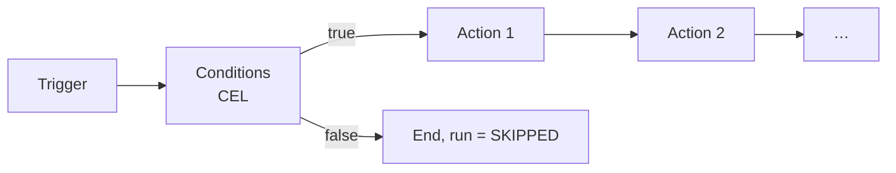

# Automation & Integration

Two equally capable ways to automate every feature:

1. **Externally** — n8n, Zapier, Make, your own scripts: the complete REST API plus webhook subscriptions plus trigger polling.
2. **Internally** — the built-in rule engine: trigger → conditions → actions, with access to
   **every** business use case as well as outbound webhooks and HTTP calls.

Both use the same use case catalogue and the same event types. There is no feature available only
internally or only externally.

---

## 1. The rule model



```json
{
  "id": "018f...",
  "name": "Escalate overdue approvals",
  "scope": { "container_id": "018f...", "include_descendants": true },
  "enabled": true,
  "run_as": "service-account:automation-default",
  "trigger": { "kind": "EVENT", "event_type": "de.hubtask.work.item.overdue.v1" },
  "conditions": [
    { "expr": "item.labels.exists(l, l == 'label:approval') && item.type == 'TASK'" },
    { "expr": "now.hour >= 8 && now.hour < 18" }
  ],
  "actions": [
    { "kind": "ADD_LABEL", "params": { "label": "label:escalated" } },
    { "kind": "ASSIGN", "params": { "strategy": "ROUND_ROBIN", "group": "group:leads" } },
    { "kind": "ADD_COMMENT", "params": { "body_code": "automation.escalated" } },
    { "kind": "SEND_WEBHOOK", "params": { "subscription_id": "018f..." } },
    { "kind": "HTTP_REQUEST", "params": { "method": "POST", "url": "https://…", "body_template": "…" } }
  ],
  "throttle": { "max_runs_per_hour": 100, "dedupe_key_expr": "item.id" },
  "on_error": "CONTINUE"
}
```

### 1.1 Triggers

| Kind | Example | Note |
|---|---|---|
| `EVENT` | Any domain event (`item.created`, `item.moved`, `comment.created`, …) | Field filters possible through `changed_fields` |
| `SCHEDULE` | Cron or RRULE, with a time zone | e.g. "weekly report Mondays at 08:00" |
| `RELATIVE_DATE` | "24 h before the due date", "3 days after creation" | Internally produces occurrence jobs |
| `INBOUND_WEBHOOK` | A dedicated, token-protected URL per rule | The payload is available as `payload` in CEL |
| `MANUAL` | A button, or a call through the API or an MCP tool | For "on demand" flows |
| `JUMBLE_ENTRY` | A new arrival in the jumble | The basis for automatic conversion |

### 1.2 Conditions

**CEL (Common Expression Language)** — declarative, sandboxed, terminating, readable.
Not arbitrary code, not a scripting engine ([ADR-0009](../adr/ADR-0009-automation-rules-cel.md)).
Available variables: `event`, `item`, `parent`, `collection`, `hub`, `actor`, `now`, `payload`,
`tenant.settings`. Library functions for date arithmetic, sets, and strings.
Limits: a maximum expression length, the evaluator's cost limit, and a 50 ms timeout per
expression.

The engine is `cel-go`, and it is imported by exactly one package — a gate says so by name (G-06).
The core describes what a condition is and never learns that a third-party evaluator exists
(ADR-0001), which is what lets the engine be replaced without a rule changing.

**The variable list is a contract, not a suggestion.** The names are declared to the compiler, so an
expression naming anything else fails when the rule is written rather than when it runs. Their values
are dynamic documents rather than modelled types: what a rule may depend on is the *names*, not every
field of every aggregate — a rule written today must not break when a field is renamed. Reaching into
a document that has no such field is an ordinary CEL answer (`has(item.cover)`), not a compile error.

**Compiling is separate from evaluating**, because the two happen for different people. A condition
is compiled when somebody writes a rule, so a mistake is answered to its author with a line and a
column while they are still looking at it; it is evaluated later, thousands of times, by nobody.

**The compiler is told what it is being asked for.** A condition has to produce a boolean and a
template has to produce text: a condition that answers a string filters nothing, a template that
answers a boolean renders `true`, and both are silently wrong on every run. Where CEL can decide the
type it refuses at compile time; where the expression reads a dynamic field it checks the value.

**Values are resolved lazily and once.** A condition naming only `event` costs no reads — the engine
evaluates every enabled rule against every event, and eagerly building `collection`, `hub` and
`parent` would turn one event into four queries per rule. A name the environment declared and the
activation cannot produce fails the evaluation rather than reading as false: a condition that quietly
took unreadable for false would match the opposite of what it says.

**`now` is one instant per run**, taken from the `Clock` port. A rule with two conditions must not
have the first answer "before six" and the second "after six" because a second passed between them.

The three limits, and what each one is for:

| Limit | Value | Why it is not covered by the next one |
|---|---|---|
| Expression length | 4096 bytes | Checked **before** the parser. A limit that let a megabyte be parsed first has already done the work it exists to prevent |
| Cost | the evaluator's own budget | Bounded statically as well as at evaluation. A limit applied only at evaluation would let an expensive rule be saved and then fail every time it fires — which looks fine to whoever wrote it |
| Timeout | 50 ms | **Per expression**, not per rule: a rule with three conditions gets 50 ms each rather than 50 between them |

"No loops, no I/O, terminating" are properties of the language rather than of this configuration.
What the configuration adds is the bounds above, because *terminates* is not *terminates soon
enough* — a nested expression can be finite and still spend a worker's afternoon.

### 1.3 Actions

Every action is an adapter over a use case — the list grows automatically with the catalogue. The
kind is the use case name in `SCREAMING_SNAKE_CASE`, derived rather than declared
(`core/application/usecase.Descriptor`), so `CreateContainer` is `CREATE_CONTAINER` and a new use
case becomes an action without anybody editing a list. The groups below are the shape of the
catalogue, not a second register of it:

| Group | Actions |
|---|---|
| Items | `CREATE_ITEM`, `UPDATE_FIELDS`, `SET_DUE_DATE`, `SHIFT_DUE_DATE` (`+P3D`), `COMPLETE`, `REOPEN`, `MOVE_TO_BUCKET`, `MOVE_TO_PARENT`, `REORDER`, `DUPLICATE`, `ARCHIVE`, `TRASH`, `RESTORE`, `SET_COVER`, `SET_CUSTOM_FIELD` |
| Assignment | `ASSIGN` (`FIXED`/`RANDOM`/`ROUND_ROBIN`/`LEAST_LOADED`), `UNASSIGN`, `ADD_MEMBER`, `REMOVE_MEMBER` |
| Structure | `ADD_LABEL`, `REMOVE_LABEL`, `CREATE_BUCKET`, `CREATE_CONTAINER` (hub or collection, per the `type` parameter) |
| Content | `ADD_COMMENT`, `ADD_ATTACHMENT_FROM_URL` |
| Templates | `INSTANTIATE_TEMPLATE` |
| Series | `SET_RECURRENCE`, `SKIP_OCCURRENCE` |
| Jumble | `CONVERT_JUMBLE_ENTRY`, `DISMISS_JUMBLE_ENTRY` |
| Notification | `NOTIFY_ACCOUNT`, `NOTIFY_GROUP`, `SEND_EMAIL` |
| Outbound | `SEND_WEBHOOK`, `HTTP_REQUEST` (method, headers, body template, optional signature) |
| Flow | `WAIT` (a delay as a job), `BRANCH` (a nested condition), `STOP` |
| AI (optional) | `AI_SUGGEST_FIELDS`, `AI_SUMMARIZE`, `AI_CLASSIFY` — the result as a suggestion or applied directly, configured explicitly |

Templating in action parameters uses the same CEL environment (`"Reminder: " + item.title`), plus
message codes for localised text.

### 1.4 Recurring tasks

These belong to scheduling (a `RecurrenceRule` on the item) rather than to the rule engine — which
keeps series usable without automation permissions. The rule engine can additionally create and
change series (`SET_RECURRENCE`).

---

## 2. Execution, security, observability

| Aspect | Implementation |
|---|---|
| Triggering | Outbox dispatcher → automation engine (in-process or its own deployment) |
| Delivery guarantee | At least once; actions use an `Idempotency-Key` derived from `(rule_id, event_id, action_index)` |
| Permissions | The rule runs as the `run_as` account; it can never do more than that account may. Every action goes through the same registry a person's request goes through, and the authoriser answers it the way it answers anybody (rule 2) — the engine gets no bypass, which is the whole point of `run_as`. A run is *granted* the token scope its action declares rather than narrowed by one: a rule presents no credential, so the bound whose purpose is letting a token be narrower than its owner has nothing to narrow, and the role is what decides. Writing a rule needs more than the automation permission — see §2.1 |
| Loop protection | `causation_depth` in the event; abort at depth 5 by default, run status `ABORTED_LOOP` |
| Replays | An event marked `replay: true` is one a restore produced ([backup-restore.md](./backup-restore.md) §8.4) and no rule reacts to it. The flag arrived with E-06 so that the engine finds it already there; it is on the envelope rather than in the payload because the decision is routing, and the dispatcher makes it — a subscriber is handed a replay only if it has asked for one, so the promise does not depend on every consumer remembering it |
| Throttling | Per rule and per tenant; the dedupe key prevents a storm during mass changes |
| Error handling | `on_error ∈ {STOP, CONTINUE, RETRY}`; retry with exponential backoff; after n failures the rule is disabled automatically and a notification is sent |
| Dry run | `POST /automation/rules:test` with a sample event → which conditions match, which actions *would* run; no side effects |
| Log | A `RuleRun` with timestamps, condition results, action results, and errors; retrievable, filterable, replayable |
| SSRF protection | Outbound calls go through `GuardedClient`: DNS resolution checked, private and link-local networks blocked (with a configurable allowlist for self-hosting), a redirect limit, a timeout, and a response size limit |
| Secrets | Header values and tokens for HTTP actions are stored encrypted and masked in logs and API responses |

### 2.0 How a run happens

The table above says what the engine promises. This is the shape it has (G-07):

1. **The dispatcher hands the event to a subscriber**, which asks which enabled rules have this
   event as their trigger and narrows them by scope. It decides only *which* rules are interested —
   a subscriber runs inside the dispatcher's transaction and may not reach the use case registry.
2. **One job per matching rule**, not one per event. Failure isolation per rule, the queue's backoff
   per rule, and a dead letter naming which rule rather than which batch. An event matching six
   rules that cost one job would make one rule's misconfiguration everybody else's outage.
3. **The engine runs the job** inside the queue runner's transaction. The run row, the effects its
   actions had, the idempotency records and the job's own completion commit together, so a process
   that dies halfway leaves none of them and the job is claimed again.

The order inside a run is the order of what is cheapest to refuse: the **depth** needs nothing, the
**throttle** is one count, the **conditions** are reads, the **actions** are writes. A run that may
not act does not evaluate conditions either — evaluating them is where the reads are, and a loop
that read on every hop would cost exactly what the bound exists to prevent.

**Every run is recorded, including the ones that did nothing.** The row is written `RUNNING` before
the conditions are evaluated, so a run whose process died is visible as one that started; a row left
in `RUNNING` is a crash rather than a state anything reaches deliberately. The six statuses are six
different answers and none of them collapses into another:

| Status | What happened |
|---|---|
| `SUCCEEDED` | The run reached its end. Some of its actions may have failed — that is what `on_error: CONTINUE` means, and the per-action results say which |
| `SKIPPED` | A condition answered no. The ordinary answer of a rule that is working |
| `THROTTLED` | The rule has already run as often as it may this hour. The conditions were never asked |
| `FAILED` | The rule could not do what it says: an action refused under `STOP`, or a condition that could not be evaluated at all |
| `ABORTED_LOOP` | The chain reached `causation_depth` 5. The run did nothing — its own status, because "misconfigured into a loop" and "action refused" send their reader to two different places |
| `RUNNING` | In flight, or a crash |

**Idempotency is per action, not per run.** The key is `(rule_id, event_id, action_index)` — the
index rather than the kind, because a rule may say "add this label and that one" and a key that
collapsed them would perform the first and silently skip the second. A redelivered event therefore
re-runs into stored answers: the run is recorded again, and it acts on nothing.

**The dedupe key is the queue's.** `job.dedupe_key` is already unique per kind while a job is
pending or running, so a rule with no `dedupe_key_expr` gets a key naming the rule and the event —
nothing collapses — and one with an expression gets the rule and the expression's value, which is
what collapses a storm. The expression is a *template*, not a condition: `item.id` is a value.

**`on_error: RETRY` is the queue's, not the engine's.** "Retry with exponential backoff, and the
dead letter after the budget" is what the queue already is; a second backoff inside the engine would
be a second answer to a question this system has answered. A run that was skipped, throttled or
aborted never comes back — none of them is a transient condition, and a loop is not fixed by trying
it once more.

**The failure counter counts runs, not actions**, and any run that is not a failure ends the streak —
including a skip and a throttle. A rule whose conditions said no is a rule that is working, and
counting that towards being switched off would disable the most careful rules first. At five
consecutive failures the rule switches itself off and its **author** is told, through the same
notification path everything else uses. The author rather than the account it runs as: a service
account has nobody behind it to read a message.

**No rule fires for a replay.** `eventbus.TakesReplays` is opt-in and the engine does not implement
it, which is how backup-restore.md §8.4 is kept rather than remembered. The engine also refuses its
own three events, which is the loop protection's first line — a rule reacting to a run is a rule
reacting to itself, and the depth limit would stop it five hops later rather than never letting it
start.

### 2.1 Who may write a rule

Writing a rule is not doing what the rule does. It is arranging for it to be done later, by another
account, without anybody looking — so the automation permission at the rule's scope is necessary and
not sufficient. A member holds that permission, holds nothing else, and would otherwise write a rule
that runs as a generously-scoped service account and restructures a hub they may not touch. The
rights would have been **laundered through the `run_as`**.

Three conditions, and all three have to hold (G-05):

1. **The automation permission at the rule's own scope.** The matrix's column, resolved down the
   path the scope names — tenant, hub, or collection. A member's cell reads "own rules".
2. **You cannot delegate more than you hold.** The `run_as` account's effective role at the rule's
   scope may not exceed the writer's own there. This is the general form of the leak and it needs no
   list of actions: whatever that account can do, the writer could already have done. A **person's**
   account is refused outright unless it is the writer's own — acting as a colleague is
   impersonation, and no amount of automation permission is a grant of it, not even an owner's.
3. **You must hold what the actions ask for.** Every action is a use case and every use case
   declares the scope a credential needs; the writer's own credential has to carry each of them.
   Read off the catalogue rather than restated, so the rule stays in step with what the actions
   actually require.

All three are asked again when a rule is **switched on**, because that is the moment its actions
begin to happen and the writer's rights may have narrowed since it was written. None of them is
asked when a rule is switched **off** or deleted: stopping a rule takes a power away, and somebody
who may manage rules here must never be unable to stop one.

An edit is checked twice — against the rule as it stands, so that somebody who may not touch it at
all is refused before the new shape is even considered, and against the rule as it would be, because
the same laundering performed in two steps is the same laundering.

**This is the courtesy; the run is the boundary.** The engine asks the authoriser again on every
action as the `run_as` account (rule 2, ADR-0005 — the engine gets no bypass, which is the whole
point of `run_as`). A role change between the write and the run therefore *narrows* the rule rather
than widening a stale check: the answer that decides an action is the answer of the day it runs.
What the write-time check buys is that the writer is told now rather than at three in the morning.

### 2.2 What a rule may say, and when

The accepted vocabulary is the executable vocabulary, at every commit — a rule that cannot be run is
not stored (E-08's lesson: stored and ignored is worse than refused, because its owner believes it
is working).

| Written | Until |
|---|---|
| A non-empty **condition**, and `throttle.dedupe_key_expr` with it | Refused. The expression language arrives with the engine that evaluates one (§1.2, ADR-0009) |
| An action naming `SEND_WEBHOOK`, `HTTP_REQUEST`, `WAIT`, `BRANCH`, `STOP`, or an AI kind | Refused by name, with a code that says "not built yet" rather than "no such action" — the difference is whether its author goes looking for a typo or for the milestone |
| A parameter the action's use case does not declare | Refused, exactly as the call itself would refuse it (C-07). A rule saved with a misspelled `parent_id` fails at a moment nobody is watching |
| A **required** parameter the rule does not carry | Accepted. A rule supplies some parameters and the run supplies the rest — the entry an event is about is not a value a rule can carry — so demanding them at write time would refuse every correct rule. The run is where the whole input exists, and the registry validates it in full there |
| A **trigger** of any of the six kinds | Accepted, with the fields its own kind needs and no others. Only `EVENT` has an engine in this release; the rest are stored and, like every newly written rule, switched off |

A rule is created **switched off**, and enabling it is its own call with its own audit entry.
Writing what a rule would do and letting it loose on the workspace are two decisions, and one that
acted the moment it was saved would give nobody the chance to read it back first.

---

## 3. External automation

### 3.1 Webhook subscriptions (push)

* `POST /api/v1/integrations/webhooks` with `target_url`, `event_types[]`, an optional CEL filter, and a scope.
* Payload: **CloudEvents 1.0** (structured JSON), identical to the internal event.
* Signature: `X-Hubtask-Signature: t=<ts>,v1=<hmac-sha256(secret, ts + "." + body)>`, with replay protection through a time window.
* Headers: `X-Hubtask-Event-Id` (for deduplication), `X-Hubtask-Event-Type`, `X-Hubtask-Delivery-Attempt`.
* Retries: 8 attempts with backoff up to 24 h; after that, dead letter, visible under
  `/integrations/webhooks/{id}/deliveries` and replayable manually.
* Auto-disable after sustained unreachability, plus a notification to the owner.
* Zapier-compatible self-management: `subscribe`/`unsubscribe` through the API (the REST hooks pattern).

### 3.2 Trigger polling (pull)

For platforms without a stable public URL:
`GET /api/v1/integrations/triggers/{eventType}?since=<cursor>&limit=100` returns events in
ascending order with a stable cursor — deduplicable through `event_id`.

* Payload: the same **CloudEvents 1.0** document a webhook subscription would have been POSTed, and
  `id` is the value `X-Hubtask-Event-Id` carries there. One schema, two transports: a consumer that
  deduplicates on it needs to learn nothing new to switch between them.
* The cursor is opaque and signed, and it names a position in the outbox — so it survives a restart
  and a failover, and a client can neither construct one nor read one.
* `since` absent starts at the oldest event still inside the window. A caller with no cursor has
  either never polled or lost its cursor, and both need what is there rather than a gap they cannot
  see.
* **Retention bounds the window.** The outbox keeps dispatched events for the tenant's retention
  period (`OUTBOX_EVENT`, seven days by default). A cursor older than that is answered `410 gone`
  with `triggers.cursor_expired` rather than silently restarted: a poller that missed more than the
  window has to know it missed, or it reports a completeness it does not have.
* **Authorisation is the event's, not the endpoint's.** A poll needs `automation:manage` — the same
  scope a webhook subscription needs, because pointing this workspace's whole event stream at an
  outside address and reading it directly are the same power — *and* the event type's own read
  scope: `items:read` for `de.hubtask.work.item.*`, `containers:read` for containers, buckets and
  labels, `media:read` for attachments, `templates:read` for a template instantiation. A token
  scoped to read items polls item events and is refused what it is not scoped for.
* **A poll reads a moment behind the present.** `occurred_at` is stamped by the writing transaction
  rather than by its commit, so a transaction that began before one already answered can still
  commit a row that sorts *behind* the cursor — and a poller past it would step over the event
  silently. Rows younger than `HUBTASK_TRIGGER_POLL_LAG` are therefore withheld from the page and
  from the cursor together, and answered by the next poll. An event is visible to a poller a lag
  after it happened; a webhook delivery is not delayed by this.
* A replayed event — one a restore wrote rather than one somebody did — is not answered, exactly as
  it is not delivered to a webhook (backup-restore.md §8.4).
* An event type this build does not declare is refused by name rather than answered with an empty
  page: a trigger configured against a typo would otherwise poll forever and report nothing wrong.

### 3.3 Recommendations for n8n/Zapier/Make

| Need | Endpoint |
|---|---|
| Trigger "new task" | A webhook subscription on `item.created`, or polling |
| Action "create task" | `POST /items` with an `Idempotency-Key` |
| Action "set field" | `PATCH /items/{id}` with `If-Match` |
| Search | `POST /search` for text, `POST /items:query` for a filter |
| Bulk import | `POST /items:bulk` |
| Auth phase 1 | A personal access token (header `Authorization: Bearer hbt_pat_…`) |
| Auth phase 2 | OAuth2 authorization code + PKCE (a prerequisite for the Zapier marketplace) |

Additionally planned (milestone 0.7+): an official **n8n community node** and a **Zapier app**, both
generated from OpenAPI plus the capability manifest, so that they stay complete automatically.

---

## 4. Why automation is its own service

Automation is the most load-intensive and riskiest part (third-party HTTP targets, long runtimes,
rule storms). It is therefore cut as its own bounded context and deployable as its own role, while
in self-hosting it runs inside the main process
([ADR-0002](../adr/ADR-0002-modular-monolith.md), [ADR-0014](../adr/ADR-0014-single-image-multi-role.md)).
The benefits: isolation from load spikes, independent scaling, a separate failure domain — with no
extra effort for private users.
