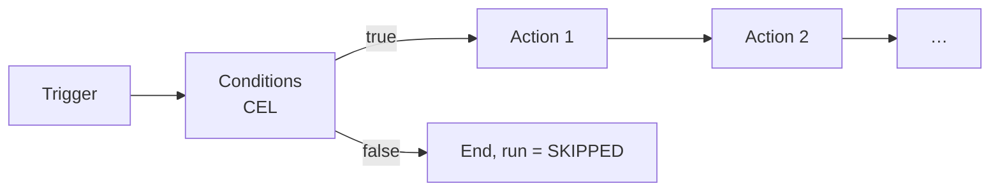

# Automation & Integration

Two equally capable ways to automate every feature:

1. **Externally** — n8n, Zapier, Make, your own scripts: the complete REST API plus webhook subscriptions plus trigger polling.
2. **Internally** — the built-in rule engine: trigger → conditions → actions, with access to
   **every** business use case as well as outbound webhooks and HTTP calls.

Both use the same use case catalogue and the same event types; no feature is available only one way.

---

## 1. The rule model


```mermaid
graph LR
  T[Trigger] --> C[Conditions<br/>CEL]
  C -->|true| A1[Action 1]
  A1 --> A2[Action 2]
  A2 --> A3[…]
  C -->|false| X[End, run = SKIPPED]
```

```json
{
  "name": "Escalate overdue approvals",
  "scope": { "type": "COLLECTION", "id": "018f..." },
  "enabled": true,
  "run_as": "018f...",
  "trigger": { "kind": "EVENT", "event_type": "de.hubtask.work.item.overdue.v1" },
  "conditions": [ { "expr": "item.type == 'TASK' && now.hour >= 8 && now.hour < 18" } ],
  "actions": [
    { "kind": "ADD_LABEL", "params": { "label_id": "018f..." } },
    { "kind": "HTTP_REQUEST", "params": { "method": "POST", "url": "https://…", "body_template": "…" } }
  ],
  "throttle": { "max_runs_per_hour": 100, "dedupe_key_expr": "item.id" },
  "on_error": "CONTINUE"
}
```

A rule holds at most 20 conditions (all must hold) and at most 50 actions; branches nest at most 3
deep. The scope is the workspace (`TENANT`), a `HUB` or a `COLLECTION`.

### 1.1 Triggers

**All six kinds feed one engine.** A trigger decides *when* a run starts and what makes it one
occasion; everything else is §2's. The run records the kind that started it on its own row, as a
rule can be edited into another kind.

| Kind | Example | What starts a run | What makes it one occasion |
|---|---|---|---|
| `EVENT` | Any domain event; field filters through `changed_fields` | The outbox dispatcher, through the matching subscriber | The event |
| `SCHEDULE` | RRULE with a time zone ("Mondays at 08:00") | The tenant's poller, when the stored `next_run_at` has come | The occurrence's instant |
| `RELATIVE_DATE` | "24 h before the due date", anchored on `DUE_DATE` or `CREATED_AT` | The same poller, when a stored occurrence has come | The occurrence row |
| `MANUAL` | A button, an API call or an MCP tool | `POST /automation/rules/{id}:trigger` | The run, so two presses are two runs |
| `INBOUND_WEBHOOK` | A token-protected URL per rule; the body is `payload` in CEL | `POST /automation/inbound/{token}` | The delivery, so two posts are two runs |
| `JUMBLE_ENTRY` | A new arrival in the jumble, the basis for automatic conversion | An arrival in the jumble | The entry |

The idempotency key (§2.0) names the occasion as the table gives it, never an absent event — else a
second manual press would find the first's answer and do nothing.

#### `SCHEDULE`

RRULE through the installation's one schedule engine
([ADR-0008](../adr/ADR-0008-jobs-and-scheduling.md)), DST-correct through both transitions.
`DTSTART` is the rule's creation instant, so `FREQ=WEEKLY` written on a Tuesday means Tuesdays.

The moment is **stored** on the rule (`next_run_at`), expanded at the write (§2.2), not on every
pass.

**Nothing enumerates tenants** ([multi-tenancy.md](./multi-tenancy.md) §2.1). The write that makes
something owed (for a rule, the *enable*) seeds that tenant's poller; each round reschedules itself
to the next owed moment, and a poller with nothing owed finishes until a write brings it back.

**Enabling recomputes from now**: a schedule off for a week owes nothing for that week. A backlog
produces **one catch-up run, then forward**.

#### `RELATIVE_DATE`

A row per (rule, entry) says when that rule owes that entry a run — the `reminder` table's fact with
a rule in place of a person — kept in step with its anchor by a subscriber; a **cleared anchor owes
nothing**, nor does an entry in the trash or gone. The `SCHEDULE` poller serves it too.

**A rule takes effect for what happens after it is switched on**; nothing walks earlier entries.

#### `MANUAL`

The only kind a *person* pulls: a registered use case behind `:trigger`, needing the **plain**
automation permission at the rule's scope — not §2.1's composition check, since pressing changes
nothing about what the rule may do. It queues; the `202` carries the future run's identifier, and the
run records who pressed. A rule that is off, or not `MANUAL`, is refused.

#### `INBOUND_WEBHOOK`

A token-protected URL per rule: 32 bytes of entropy, hashed with the installation secret under its
own purpose label, shown **once**, prefixed `hbt_hook_` so secret scanning finds a leak.

* **Rotating is revoking.** One address per rule, replaced in one statement; revoking without a
  replacement is switching the rule off.
* **The token names its own tenant** in clear: the lookup behind row level security needs a tenant
  context ([multi-tenancy.md](./multi-tenancy.md) §2.2), and the hash covers the whole string, so a
  token rewritten to another tenant matches nothing.
* **It authenticates the rule, never a person**: the run carries no actor and acts as `run_as`.
* The payload enters CEL as `payload`, as **data**, never as an instruction
  ([ai-first.md](./ai-first.md) §1.3). The request middleware bounds the transfer, the route bounds
  the evaluation, and a body that is not a JSON object is refused.
* An unknown, rotated or deleted token, a switched-off rule and a rule whose trigger changed all
  answer the same `404` with the same body ([security.md](./security.md) T-19).

### 1.2 Conditions

**CEL (Common Expression Language)** — declarative, sandboxed, terminating
([ADR-0009](../adr/ADR-0009-automation-rules-cel.md)). Variables: `event`, `item`, `parent`,
`collection`, `hub`, `actor`, `now`, `payload`, `tenant` (its settings), plus library functions for
dates, sets and strings. `cel-go` is imported by exactly one package, which a gate names; the core
never learns of it (ADR-0001).

* **The variable list is a contract**, declared to the compiler: an expression naming anything else
  fails at the write. The values are dynamic documents, so `has(item.cover)` answers for a missing
  field.
* **Compiling is separate from evaluating**: a mistake is answered at the write, with line and
  column. A condition must produce a boolean, a template text; where CEL cannot decide the type
  statically, the value is checked.
* **Values are resolved lazily and once.** A declared name the activation cannot produce fails the
  evaluation rather than reading as false.
* **`now` is one instant per run** from the `Clock` port, and it is the server's:
  `event.occurred_at` is the person's moment (for an offline change, the device's bounded reading),
  `event.received_at` when the server learned of it ([offline-sync.md](./offline-sync.md) §8), so a
  three-day-old completion does not fire a deadline rule.

| Limit | Value | Note |
|---|---|---|
| Expression length | 4096 bytes | Checked **before** the parser |
| Cost | the evaluator's own budget | Bounded statically too: an expensive rule is refused when saved |
| Timeout | 50 ms | **Per expression**, not per rule |

### 1.3 Actions

Every action is an adapter over a use case, and **every use case in the catalogue is an action**:
the kind is the use case name in `SCREAMING_SNAKE_CASE`, derived by
`usecase.Descriptor.AutomationAction` (`AddLabel` is `ADD_LABEL`). The served kinds, their fields and
summaries are answered by `GET /meta/capabilities` (§1.5), never listed here. The engine's flow kinds
`WAIT`, `BRANCH` and `STOP` are in no catalogue; a client names them itself.

A planned kind not yet served is refused as §2.2 says; notification actions are not built
([UC-AUT-09](../usecases/automation/UC-AUT-09-have-a-rule-tell-people.md)).

**The flow kinds.**

* `WAIT` suspends the run instead of sleeping on a worker: results so far are written under
  `WAITING`, a job with the queue's `run_at` carries the resume point. A rule edited while a run
  waits ends that run (`automation.rule_changed_while_waiting`).
* `BRANCH` is a nested list, not a jump target; both arms are checked at the write. The run log names
  each action by its path (`2/then/0`), which is also the idempotency key's third part.
* `STOP` ends the run, which succeeded.

**The outbound pair enqueues rather than calls.** `SEND_WEBHOOK` delivers the run's event to a named
subscription through the webhook pipeline (§3.1). `HTTP_REQUEST` runs on a detached job through the
guarded client with the webhook ladder's eight attempts. **A rule cannot read an answer** (ADR-0009):
the response is bounded by the client's size cap and discarded.

**AI actions** (such as `AI_CLASSIFY`) each queue one question; an AI call never sits in a run.
`apply` is **false unless said**; an applied answer is first recorded as a suggestion with
provenance, its acceptance audited as its own act, the change made through the owning use case as
`run_as`. A workspace with no provider or no consent is refused before anything is queued.

**Templating.** Parameters may use the CEL environment (`"Reminder: " + item.title`) and message
codes. An `HTTP_REQUEST`'s `body_template` is compiled at the write and rendered from the run's
event at each attempt, so a retry sends what the first attempt would have.

### 1.4 Recurring tasks

A `RecurrenceRule` on the item, so series work without automation permissions; rules can create
and change series (`SET_RECURRENCE`, `SKIP_OCCURRENCE`).

---

### 1.5 What a rule editor is built from

These bind every client that writes rules; the web client's editor is
`apps/webapp/src/lib/automation/`.

**The vocabulary is answered, never compiled in.** `GET /meta/capabilities` answers
`automation.triggers`, `automation.actions`, `automation.action_summaries` and
`automation.action_fields` — per kind, the use case's declared fields (`usecase.Field`, with
`format` such as `date-time`, and `rule`, false for plumbing a rule never sets, such as a
client-minted `id` or `expected_version`), derived from the descriptor as the MCP tool schema is. A
newly served use case is one more block without a client release.

* An action's form is rendered from its declared fields: `rule: false` hidden, `date-time` a
  date-and-time control, anything unmarked text; what the run supplies (§2.2) is one line.
* An `id` field the reference table of §2.3 knows is a picker over the client's store of that kind.
  **A rule names things by identifier**, so a rename keeps working and only a deletion is a finding.
* An event type or action kind is said in words derived from its name through one table of entities
  and verbs, the wire name as a hint; an unknown name shows as its segments. Every block carries its
  kind's icon ([design-system.md](../design/design-system.md) §12).
* A rule has no free description: the sentence generated from the rule is its description.

**The head is the rule, the canvas is the run.** The rule is a vertical path — §1's model is a list
with nested branches, and a free graph would draw freedoms the engine lacks:

* the trigger card (the only one in the signature colour), the gate holding the condition, the chain
  of actions — `BRANCH` a fork into *then* and *otherwise* that rejoins, `WAIT` a pause with its
  duration — and the end mark *Run ends*. Every gap is one line with one insertion point.
* What bounds the rule — `run_as`, scope, `on_error`, throttle — is said in the head and set on the
  *Rule* tab, never drawn as a card.
* The canvas shows; one panel beside it sets, on every width: **Rule**, **Blocks**, **Details**,
  **Probe**, **Runs**. No form on the canvas.
* A block's colour says its family everywhere: trigger signature, gate amber, flow violet, entries
  blue, people (assignment) teal, outbound slate, AI green. A condition belongs to the gate or a
  branch, never a block of its own.

**Branches, ladders and the end of a run.**

* **+ Else if** appends a rung (a branch as the sole step of the else arm), drawn as a ladder and
  read back by the same rule; a removed rung hands its *otherwise* to the rung above.
* `STOP` is called **End the run** and stands only as the last step of an arm, refused elsewhere
  with a sentence. When every arm of a branch ends the run, nothing may follow it, and the end mark
  reads *Run ends — on every path*; steps a stored rule carries after a stop are drawn faded, *never
  reached*.
* Below `bp.expanded`, and from the second nesting depth on any width, a branch shows one arm at a
  time behind a *then (n) · otherwise (n)* switch. Any branch folds to one line; a folded ladder
  counts its rungs.

**Conditions.**

* A condition is composed as sentences over a bounded set of subjects and their comparisons
  (`model.ts`), grouped under *all of* / *any of* / *none of*, and stored as one parenthesised CEL
  expression (§1.2), shown under the sentence; *edit as expression* switches to raw text, and a
  compile error shows the server's line and column. The reader takes apart only shapes the composer
  writes; anything else stays an expression.
* The editor offers the gate **exactly one** condition. A stored rule with several keeps them, each
  removable: a client never silently rewrites what somebody wrote.

**Moving pieces.**

* Every card — a whole branch with its arms included — moves to every gap that may take it, by drag
  and by arrows; every drag has a keyboard equivalent.
* While a piece is lifted only valid places become labelled targets; a refused drop is explained in
  one sentence in the hint line at the canvas's top edge.
* Every served kind is reachable by eye and by search in one list, drawn by the *Blocks* tab and the
  `+` popover: *Blocks* (most frequent, trigger kinds, then `words.ts`'s curated groups) and *All*
  (every kind by area). The popover is filtered to what its gap may take and says so.
* A click on the background or `Escape` clears the selection; the panel moves to *Blocks* unless on
  *Probe* or *Runs*, and a narrow-screen sheet closes.
* Cards are border-box, and the canvas keeps a gutter no narrower than the selection ring.

**Name and sentence.** The client generates a name from the trigger and first steps in the person's
language; a stored name equal to it is *automatic* and follows every edit, any other is owned until
cleared. The rule's sentence stands collapsed under the name.

**Review, probe, runs and health.**

* The probe sends the canvas as it stands to the dry run (§2), its sample the trigger's event type
  and a real entry as `subject`, plus a payload for an inbound rule.
* A dry run's and a recorded run's results are drawn alike on the canvas: per condition *held* or
  *did not hold*, the taken arm lit, *would run* per action, the status at the end.
* Before probing, the client reviews the **draft** against its manifest (`review.ts`, codes
  `app.flow.review_*`), drawn where findings are, refusing nothing; a server finding at the same card
  wins.
* A rule's health is client arithmetic over its last page of runs (20): *works*, *fails sometimes*,
  *failing* (more failures than not), plus *off*, *needs attention* and *broken* from the switch and
  findings; the server keeps no health statistic. The rules list says it from findings, switch and
  failure count, each rule carrying its `last_run`, so the list costs one request.
* `/administration/runs` is the one record of every run: a rule links to it prefiltered, a failed
  run is replayed there, and it shows this hour's runs against `automation_runs_per_hour` from
  `GET /quotas`.

## 2. Execution, security, observability

| Aspect | Implementation |
|---|---|
| Triggering | Outbox dispatcher → automation engine (in-process or its own deployment) |
| Delivery guarantee | At least once; per-action idempotency (§2.0) |
| Permissions | The rule runs as `run_as` and can never do more than that account: every action goes through the registry a person's request uses and the same authoriser (ADR-0005). A run is *granted* the token scope its action declares, since a rule presents no credential and the role decides. Writing a rule: §2.1 |
| Loop protection | `causation_depth` in the event; abort at depth 5 by default (`ABORTED_LOOP`) |
| Replays | An event marked `replay: true` was produced by a restore ([backup-restore.md](./backup-restore.md) §8.4); the dispatcher hands it only to a subscriber that asked (`eventbus.TakesReplays`), and the engine does not |
| Throttling | Per rule and per tenant; the dedupe key prevents a storm during mass changes |
| Error handling | `on_error ∈ {STOP, CONTINUE, RETRY}`; five consecutive failed runs disable the rule (§2.0) |
| Dry run | `POST /automation/rules:test` with a sample event → which conditions match, which actions *would* run, both arms of every branch; nothing below it opens a writing transaction |
| Log | A `RuleRun` with timestamps, condition and action results and errors; filterable by rule and `since`/`until` on `started_at`; a `FAILED` run is replayable (`POST /automation/runs/{id}:replay`), completing under its original keys, audited with the replayer |
| SSRF protection | Outbound calls go through `GuardedClient` ([security.md](./security.md) T-07) |
| Secrets | An `HTTP_REQUEST`'s header secret is sealed at the write under a purpose naming the rule, masked as `***` in every response, opened for one call; `***` sent back on an edit keeps it |

### 2.0 How a run happens

1. **The dispatcher hands the event to a subscriber**, which selects the enabled rules with this
   event as trigger, narrowed by scope, in the dispatcher's transaction and without the use case
   registry.
2. **One job per matching rule**, not per event: failure isolation, backoff and dead letter per rule.
3. **The engine runs the job** in the queue runner's transaction: the run row, the actions' effects,
   the idempotency records and the job's completion commit together; after a crash none stands and
   the job is claimed again.

Inside a run, the cheapest refusal comes first: **depth**, then **throttle**, then **conditions**
(reads), then **actions** (writes).

**Every run is recorded**, written `RUNNING` before the conditions are evaluated.

| Status | What happened |
|---|---|
| `SUCCEEDED` | The run reached its end; under `on_error: CONTINUE` some actions may have failed, as the per-action results say |
| `SKIPPED` | A condition answered no — the ordinary answer of a working rule |
| `THROTTLED` | The rule has already run as often as it may this hour; conditions not asked |
| `FAILED` | An action refused under `STOP`, or a condition could not be evaluated |
| `ABORTED_LOOP` | The chain reached `causation_depth` 5. The run did nothing |
| `WAITING` | Parked on a `WAIT`; a scheduled job holds the resume point, no worker is held |
| `RUNNING` | In flight, or a crash |

**Idempotency is per action**: `(rule_id, occasion, action_path)` — the path, as a rule may add two
labels. A failed action's claim is released with its failure, so a replay performs what the first
run did not; a redelivered event is recorded again and acts on nothing.

**The dedupe key is the queue's.** `job.dedupe_key` is unique per kind while pending or running.
Without `dedupe_key_expr` the key names the rule and the occasion and nothing collapses; with one it
names the rule and the expression's value, which collapses a storm. The expression is a template
(`item.id` is a value).

**`on_error: RETRY` is the queue's** backoff and dead letter, never a second one in the engine. A
skipped, throttled or aborted run never comes back.

**The failure counter counts runs**; any non-failed run, a skip or throttle included, ends the
streak. At five consecutive failures the rule switches itself off and its **author** (not `run_as`,
perhaps a service account nobody reads) is notified, the rule as the notification's subject.

The engine refuses its own three events as the loop protection's first line.

### 2.1 Who may write a rule

A rule acts later, as another account, unwatched; with only the automation permission a member
could launder rights **through the `run_as`**. All three must hold:

1. **The automation permission at the rule's own scope** — the matrix's column, resolved down the
   scope's path. A member's cell reads "own rules".
2. **You cannot delegate more than you hold.** The `run_as` account's effective role at the scope may
   not exceed the writer's there. A **person's** account other than the writer's own is refused
   outright — impersonation is not even an owner's to grant (`automation.run_as_not_delegable`,
   `automation.run_as_exceeds_writer`).
3. **You must hold what the actions ask for.** The writer's credential must carry every scope the
   actions' use cases declare (`automation.writer_lacks_action_right`).

All three are asked again when a rule is **switched on**, none when it is switched **off** or
deleted: whoever may manage rules must always be able to stop one. An edit is checked against the
rule as it stands and as it would be. **The run is the boundary**: every action is authorised again
as `run_as`, so a later role change narrows the rule.

### 2.2 What a rule may say, and when

A rule that cannot run is not stored: stored and ignored is worse than refused.

| Written | Answer |
|---|---|
| A **condition**, and `throttle.dedupe_key_expr` | Compiled at the write; refused with line and column if it does not compile (`automation.condition_invalid`), or as empty. A build without an expression engine stores no condition |
| An action kind the catalogue does not serve | `automation.action_unknown`, or `automation.action_not_available_yet` for a planned kind (§1.3) |
| A parameter the action's use case does not declare | Refused, as the call itself would refuse it |
| A **required** parameter the rule does not carry | Accepted: the run supplies the rest and the registry validates the whole input then. The check names one the run cannot supply either (§2.3) |
| A **trigger** of any of the six kinds | Accepted with the fields its kind needs and no others (`automation.trigger_field_not_for_kind`) |
| A `SCHEDULE` whose **recurrence** this installation cannot expand | Refused, the field named. An *exhausted* recurrence is stored with no next moment |
| An **address** on a rule whose trigger is not `INBOUND_WEBHOOK` | Refused by name |

**The run supplies** only `event_id` (the starting event) and `item_id` (the event's subject, or a
relative date's entry), merged into a declared field the rule left unset; a run about no entry
supplies none, a `JUMBLE_ENTRY` run `entry_id` instead.

A rule is created **switched off**; enabling is its own call with its own audit entry.

---

### 2.3 The check

**The check speaks before** a run fails ([ADR-0060](../adr/ADR-0060-rule-check.md)).

`CheckRules` resolves every reference a rule carries against what exists now: the trigger's event
type against `event.Types()`, action kinds and parameter keys against the catalogue, every condition
against the compiler, `run_as` against the workspace's accounts, and every `id` parameter the
reference table in `core/application/service/automation/Check.go` (`referenceFields`) knows against
its store through one `References` port. It also names a required parameter neither rule nor run
supplies (`automation.finding.parameter_missing`) and an acting account with no membership on the
rule's scope path (`automation.finding.runner_without_role`).

It writes `findings` (`{level, path, code, params}`, `path` the JSON pointer a write-time field
error carries) and `checked_at` on the rule. `ATTENTION`: the rule runs, but a step finds nothing
where it points. `BROKEN`: it cannot run, and the check switches it off as the failure streak does —
audit entry `automation.rule_disabled` with `reason: check`, author notified, metric counted by
reason.

* It runs **on demand** (`POST /automation/rules:check`, called when the rules screen opens) and **on
  the deletion events** of labels, buckets and containers, as one `automation.check` job per tenant
  — never on a timer, never across tenants.
* It does not re-run §2.1's rights checks and repairs nothing.
* **An edit leaves the rule unchecked** (findings emptied, `checked_at` cleared); a client asks for
  the check right after a save.

## 3. External automation

### 3.1 Webhook subscriptions (push)

* `POST /api/v1/integrations/webhooks` with `target_url` and `event_types[]`. A subscription receives
  every event of its types in the whole workspace: it takes no scope, and a `filter` is refused with
  `webhooks.filter_not_supported`; a CEL filter and a scope are planned
  ([UC-INT-01](../usecases/integration/UC-INT-01-receive-workspace-events-on-my-server.md)).
* Payload: **CloudEvents 1.0** (structured JSON), identical to the internal event.
* Signature: `X-Hubtask-Signature: t=<ts>,v1=<hmac-sha256(secret, ts + "." + body)>`, replays bounded by a time window.
* Headers: `X-Hubtask-Event-Id` (for deduplication), `X-Hubtask-Event-Type`, `X-Hubtask-Delivery-Attempt`.
* Retries: 8 attempts with backoff up to 24 h, then dead letter, visible under
  `/integrations/webhooks/{id}/deliveries` and replayable manually.
* Auto-disable after sustained unreachability, with a notification to the owner.
* Zapier-compatible self-management: `subscribe`/`unsubscribe` through the API (the REST hooks pattern).
* Deliveries of one sync push are collapsed ([offline-sync.md](./offline-sync.md) §8).

### 3.2 Trigger polling (pull)

For platforms without a stable public URL:
`GET /api/v1/integrations/triggers/{eventType}?since=<cursor>&limit=100` returns events in ascending
order with a stable cursor, deduplicable through `event_id`.

* Payload: the CloudEvents document a webhook would have received; `id` is its `X-Hubtask-Event-Id`.
* The cursor is opaque and signed and names an outbox position, so it survives restarts and
  failovers. `since` absent starts at the oldest event inside the window.
* **Retention bounds the window**: dispatched events are kept for `OUTBOX_EVENT` (seven days by
  default); an older cursor is `410 gone` with `triggers.cursor_expired`, never silently restarted.
* **Authorisation is the event's, not the endpoint's.** A poll needs `automation:manage` (as a
  webhook subscription does) *and* the event type's own read scope
  (`core/domain/event/ReadScope.go`).
* **A poll reads a moment behind the present.** `occurred_at` is stamped by the writing transaction,
  not its commit, so an earlier transaction can commit a row behind an answered cursor; rows younger
  than `HUBTASK_TRIGGER_POLL_LAG` are withheld from page and cursor until the next poll. Webhooks are
  not delayed.
* A replayed event is not answered, as it is not delivered (backup-restore.md §8.4).
* An event type this build does not declare is refused by name, not answered with an empty page.

### 3.3 Recommendations for n8n/Zapier/Make

| Need | Endpoint |
|---|---|
| Trigger "new task" | A webhook subscription on `item.created`, or polling |
| Action "create task" | `POST /items` with an `Idempotency-Key` |
| Action "set field" | `PATCH /items/{id}` with `If-Match` |
| Search | `POST /search` for text, `POST /items:query` for a filter |
| Bulk import | `POST /items:bulk` |
| Auth, simple | A personal access token (header `Authorization: Bearer hbt_pat_…`) |
| Auth, marketplace | OAuth2 authorization code + PKCE (a prerequisite for the Zapier marketplace) |

The **n8n community node** (`packages/n8n-nodes-hubtask`) and the **Zapier app**
(`packages/zapier-app`) are generated from the contract — one operation per use case, one trigger
per event type — and a test per package proves them complete
([ADR-0058](../adr/ADR-0058-connector-packages.md)).

---

## 4. Why automation is its own service

Automation carries the most load and risk (third-party targets, long runtimes, rule storms), so it
is its own bounded context, deployable as its own role and run inside the main process in
self-hosting ([ADR-0002](../adr/ADR-0002-modular-monolith.md),
[ADR-0014](../adr/ADR-0014-single-image-multi-role.md)).

---

## 5. Mail into the jumble

**No IMAP client is taken in** ([ADR-0040](../adr/ADR-0040-no-imap-intake.md)). Mail reaches the
jumble only through the webhook doors (`/jumble/inbound/{token}`, and `/jumble/mail/{token}` taking
`message/rfc822`); an operator without an MTA uses a provider's inbound route or a mail-to-webhook
bridge. A future transport would be **JMAP**, not a stateful session protocol.

**The parser is transport-independent**: bytes in; sender, subject, text and attachments out. The
use case behind it knows nothing about MIME, so a second transport is only a producer of bytes and a
source of a tenant.
