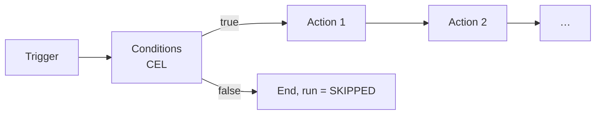

# Automation & Integration

Two equally capable ways to automate every feature:

1. **Externally** — n8n, Zapier, Make, your own scripts: the complete REST API plus webhook subscriptions plus trigger polling.
2. **Internally** — the built-in rule engine: trigger → conditions → actions, with access to
   **every** business use case as well as outbound webhooks and HTTP calls.

Both use the same use case catalogue and the same event types. There is no feature available only
internally or only externally.

---

## 1. The rule model


```mermaid
graph LR
  T[Trigger] --> C[Conditions<br/>CEL]
  C -->|true| A1[Action 1]
  A1 --> A2[Action 2]
  A2 --> A3[…]
  C -->|false| X[End, run = SKIPPED]
```

```json
{
  "id": "018f...",
  "name": "Escalate overdue approvals",
  "scope": { "type": "COLLECTION", "id": "018f..." },
  "enabled": true,
  "run_as": "018f...",
  "trigger": { "kind": "EVENT", "event_type": "de.hubtask.work.item.overdue.v1" },
  "conditions": [
    { "expr": "item.labels.exists(l, l == '01936f2a-7c1e-7000-8000-0000000000a1') && item.type == 'TASK' && now.hour >= 8 && now.hour < 18" }
  ],
  "actions": [
    { "kind": "ADD_LABEL", "params": { "label_id": "018f..." } },
    { "kind": "ASSIGN_WORK_ITEM", "params": { "account_id": "018f..." } },
    { "kind": "SEND_WEBHOOK", "params": { "subscription_id": "018f..." } },
    { "kind": "HTTP_REQUEST", "params": { "method": "POST", "url": "https://…", "body_template": "…" } }
  ],
  "throttle": { "max_runs_per_hour": 100, "dedupe_key_expr": "item.id" },
  "on_error": "CONTINUE"
}
```

A rule holds at most 20 conditions (all must hold) and at most 50 actions; branches nest at most 3
deep. The scope is the workspace (`TENANT`), a `HUB` or a `COLLECTION`.

### 1.1 Triggers

| Kind | Example | Note |
|---|---|---|
| `EVENT` | Any domain event (`item.created`, `item.moved`, `comment.created`, …) | Field filters possible through `changed_fields` |
| `SCHEDULE` | RRULE, with a time zone | e.g. "weekly report Mondays at 08:00". Cron notation would be sugar, never a second engine |
| `RELATIVE_DATE` | "24 h before the due date", "3 days after creation" | Anchored on `DUE_DATE` or `CREATED_AT`; internally produces occurrence rows |
| `INBOUND_WEBHOOK` | A dedicated, token-protected URL per rule | The payload is available as `payload` in CEL |
| `MANUAL` | A button, or a call through the API or an MCP tool | For "on demand" flows |
| `JUMBLE_ENTRY` | A new arrival in the jumble | The basis for automatic conversion |

**All six produce into one engine; none of them is a second execution path.** A trigger decides
*when* a run starts and what makes it one occasion; everything after that — the loop bound, the
throttle, the conditions, the actions and the run log — is §2's, identically for all of them. The
run records which kind started it, on the row rather than resolved from the rule at read time,
because a rule can be edited from one kind into another.

| Kind | What starts a run | What makes it one occasion |
|---|---|---|
| `EVENT` | The outbox dispatcher, through the matching subscriber | The event |
| `SCHEDULE` | The tenant's own poller, when the stored `next_run_at` has come | The occurrence's instant |
| `RELATIVE_DATE` | The same poller, when a stored occurrence has come | The occurrence row |
| `MANUAL` | `POST /automation/rules/{id}:trigger` | The run, so two presses are two runs |
| `INBOUND_WEBHOOK` | `POST /automation/inbound/{token}` | The delivery, so two posts are two runs |
| `JUMBLE_ENTRY` | An arrival in the jumble | The entry |

**The occasion is not always an event.** Five of the six kinds have none, and a key derived from an
absent event would be the same for every run of that rule — the second press of a manual trigger
would find the first's answer stored and do nothing. The idempotency key (§2) therefore names the
run's occasion, as the table gives it.

#### `SCHEDULE`

RRULE through the one schedule engine of the installation
([ADR-0008](../adr/ADR-0008-jobs-and-scheduling.md)), DST-correct for a rule firing at 03:00
through both transitions. `DTSTART` is the rule's own creation instant, so `FREQ=WEEKLY` written on
a Tuesday means Tuesdays.

The moment is **stored** on the rule (`next_run_at`) rather than derived on every pass: a poller
that re-expanded every rule would pay a library call for every rule that is not due, and the
expansion at the write is where a recurrence this installation cannot read is refused — to its
author, rather than at three in the morning.

**Nothing enumerates tenants** ([multi-tenancy.md](./multi-tenancy.md) §2.1). The write that makes
something owed seeds that tenant's poller — for a rule that is the *enable*, since a rule is
written switched off — and each round reschedules itself to the moment the tenant next owes
anything. A tenant that owes nothing lets its poller finish; the next write brings it back.

**Enabling recomputes from now**: a schedule that has been off for a week owes nothing for that
week. A backlog produces **one catch-up run, then forward** — a worker down over a weekend does not
fire three missed nights in a row on Monday.

#### `RELATIVE_DATE`

A row per (rule, entry) saying when that rule owes that entry a run — the `reminder` table's fact
with a rule in place of a person. A subscriber keeps the row in step with its anchor, so a moved
due date moves the occurrence; a **cleared anchor owes nothing**, and neither does an entry in the
trash or one that is gone. One poller per tenant answers both `SCHEDULE` and `RELATIVE_DATE` and
sleeps until whichever comes first.

**A rule takes effect for what happens after it is switched on.** Nothing walks the entries a rule
would have matched before it existed.

#### `MANUAL`

The only kind a *person* pulls: a registered use case behind `:trigger`, the automation permission
at the rule's scope, and a run that records who pressed it. The permission is the **plain** one,
not the composition check writing a rule needs (§2.1): pressing the button changes nothing about
what the rule may do, which is checked again per action when it runs. It queues rather than runs
inline, so a request's timeout never decides how much of a rule happened; the `202` carries the
identifier the run will have. A rule that is switched off, or not a `MANUAL` rule, is refused.

#### `INBOUND_WEBHOOK`

A token-protected URL per rule: 32 bytes of entropy, hashed with the installation secret under its
own purpose label, answered **once**, and prefixed `hbt_hook_` so that secret scanning finds a
leaked URL.

* **Rotating is revoking.** There is exactly one address per rule and the replacement happens in
  one statement, so the old token and the new one never both open it. Revoking without a
  replacement is switching the rule off.
* **The token names its own tenant**, in clear, inside itself: `automation_rule` is behind row level
  security, so the lookup needs a tenant context, and a route with no authentication has no other
  honest source of one ([multi-tenancy.md](./multi-tenancy.md) §2.2). The hash covers the whole
  string, tenant half included, so a token rewritten to quote another tenant matches nothing.
* **It authenticates the rule, never a person.** The run carries no actor, and the token can do
  exactly one thing: start that rule's run. What the run may then do is its `run_as` account's
  business, checked per action.
* The payload enters the CEL environment as `payload`, as **data**, never as an instruction to
  anything ([ai-first.md](./ai-first.md) §1.3). It is bounded twice — the request middleware stops a
  large *transfer*, the route stops a large *evaluation*. A body that is not a JSON object is
  refused rather than coerced.
* Every reason not to serve — an unknown token, a rotated one, a deleted rule, a switched-off rule,
  a rule whose trigger has changed — answers the same `404` with the same body
  ([security.md](./security.md) T-21's discipline).

### 1.2 Conditions

**CEL (Common Expression Language)** — declarative, sandboxed, terminating, readable. Not arbitrary
code, not a scripting engine ([ADR-0009](../adr/ADR-0009-automation-rules-cel.md)). Available
variables: `event`, `item`, `parent`, `collection`, `hub`, `actor`, `now`, `payload`, `tenant`
(its settings). Library functions for date arithmetic, sets, and strings.

The engine is `cel-go`, imported by exactly one package, which a gate names. The core describes
what a condition is and never learns that a third-party evaluator exists (ADR-0001), so the engine
can be replaced without a rule changing.

* **The variable list is a contract.** The names are declared to the compiler, so an expression
  naming anything else fails when the rule is written. Their values are dynamic documents rather
  than modelled types: a rule depends on the *names*, not on every field of every aggregate.
  Reaching into a document that has no such field is an ordinary CEL answer (`has(item.cover)`).
* **Compiling is separate from evaluating.** A condition is compiled when somebody writes a rule,
  so a mistake is answered to its author with a line and a column; it is evaluated later, by nobody.
* **The compiler is told what it is being asked for.** A condition must produce a boolean and a
  template must produce text. Where CEL can decide the type it refuses at compile time; where the
  expression reads a dynamic field the value is checked.
* **Values are resolved lazily and once.** A condition naming only `event` costs no reads. A name
  the environment declared and the activation cannot produce fails the evaluation rather than
  reading as false.
* **`now` is one instant per run**, taken from the `Clock` port.
* **A time condition evaluates the server's time.** An event carries two clocks
  ([offline-sync.md](./offline-sync.md) §8): `event.occurred_at` is the person's moment — for an
  offline change, the device's bounded reading — and `event.received_at` is when the server learned
  of it. `now` is the server's, so a completion three days old does not fire a deadline rule about
  the day it happened.

| Limit | Value | Why it is not covered by the next one |
|---|---|---|
| Expression length | 4096 bytes | Checked **before** the parser, so a megabyte is never parsed first |
| Cost | the evaluator's own budget | Bounded statically as well as at evaluation, so an expensive rule is refused when saved rather than failing every time it fires |
| Timeout | 50 ms | **Per expression**, not per rule |

### 1.3 Actions

Every action is an adapter over a use case, and **every use case in the catalogue is an action**.
The kind is the use case name in `SCREAMING_SNAKE_CASE`, derived rather than declared
(`usecase.Descriptor.AutomationAction`): `CreateWorkItem` is `CREATE_WORK_ITEM`, `AddLabel` is
`ADD_LABEL`, `AssignWorkItem` is `ASSIGN_WORK_ITEM`. A new use case becomes an action without
anybody editing a list. `GET /meta/capabilities` answers the served kinds (`automation.actions`)
with their fields and summaries (§1.5); the engine's own flow kinds `WAIT`, `BRANCH` and `STOP` are
in no catalogue and a client names them itself.

A kind that is documented as planned but not yet served is refused by name with
`automation.action_not_available_yet` rather than `automation.action_unknown`, so its author looks
for a release rather than a typo. Notification actions (a rule telling an account, a group or an
address) are not built ([UC-AUT-09](../usecases/automation/UC-AUT-09-have-a-rule-tell-people.md)).

**The flow kinds are the engine's own.**

* `WAIT` suspends the run rather than sleeping on a worker: the results so far are written under the
  run's `WAITING` status, a job carries the resume point with the queue's own `run_at`, and the
  current job finishes. A rule edited while a run waits ends that run
  (`automation.rule_changed_while_waiting`).
* `BRANCH` is a nested list, not a jump target, and both arms are checked when the rule is written.
  The run log names every action by its path (`2/then/0`), which is also the idempotency key's third
  part, so two branches' first actions never share a key.
* `STOP` ends the run where it stands, and the run succeeded: stopping early is what the rule said
  to do.

**The outbound pair enqueues rather than calls.** `SEND_WEBHOOK` delivers the run's event to a
named subscription through the webhook pipeline (§3.1: the same delivery table, signature, retry
ladder and dead letter). `HTTP_REQUEST` performs its call on a detached job through the guarded
client, with the webhook ladder's eight attempts. **A rule cannot read an answer:** conditions take
no external data (ADR-0009), so a response is bounded by the client's size cap and then discarded
unread.

**AI actions** (`AI_SUGGEST_FIELDS`, `AI_SUMMARIZE`, `AI_CLASSIFY` and the other AI use cases) each
queue one question: an AI call never sits in a run. `apply` is **false unless it is said**; an
applied answer is recorded as a suggestion with its provenance first, the acceptance is audited as
its own act, and the change goes through the owning use case as the rule's `run_as`. A workspace
with no provider, or one that has not consented, is refused before anything is queued.

**Templating.** Action parameters can use the CEL environment (`"Reminder: " + item.title`), plus
message codes for localised text. An `HTTP_REQUEST`'s `body_template` is compiled when the rule is
written and rendered from the run's event at each attempt, so a retry two days later sends what the
first attempt would have.

### 1.4 Recurring tasks

These belong to scheduling (a `RecurrenceRule` on the item) rather than to the rule engine — which
keeps series usable without automation permissions. The rule engine can additionally create and
change series (`SET_RECURRENCE`, `SKIP_OCCURRENCE`).

---

### 1.5 What a rule editor is built from

These rules bind every client that writes rules; the web client's editor lives in
`apps/webapp/src/lib/automation/`.

**The vocabulary is answered, never compiled in.** `GET /meta/capabilities` answers
`automation.triggers`, `automation.actions`, `automation.action_fields` and
`automation.action_summaries`. `action_fields` gives, for every kind, the fields its use case
declares (`usecase.Field`: name, kind, required, enum, description, `rule` — false for the caller's
plumbing a rule never sets, such as a client-minted `id` or `expected_version` — and `format`,
`date-time` for an RFC 3339 instant), derived from the descriptor exactly as the MCP tool schema is
and declared nowhere else. `action_summaries` is the use case's one sentence per kind. An
installation that serves one more use case therefore gets one more block without a client release.

* An action's form is rendered from its declared fields. A `rule: false` field is hidden, a
  `date-time` field is a date-and-time control, and an unmarked field is typed as text. What the run
  supplies (§2.2) is shown as one line, not as a field.
* A field of kind `id` whose name the reference table of §2.3 knows is a picker over the client's
  own store of that kind. **A rule names things by identifier**, so a renamed label keeps working
  and only a deleted one becomes a finding.
* An event type or action kind is said in words derived from its own name, through one table of
  entities and verbs, with the wire name as a hint; a select of events is grouped by entity. A name
  the table does not know is shown as its segments, never hidden.
* Every block is drawn with its kind's icon from one table, falling back to its group's icon.
* A rule has no free description: the sentence generated from the rule is its description.

**The head is the rule, the canvas is the run.** The rule is drawn as a vertical path, because §1's
model is a list with nested branches and a free graph would draw freedoms the engine does not have:

* the trigger card (the only card in the signature colour); the gate, holding the condition; the
  chain of actions, with `BRANCH` drawn as a fork into *then* and *otherwise* that rejoins, `WAIT` as
  a pause with its duration on the line; and the end mark *Run ends*. Every gap between two cards is
  one line with one insertion point.
* What bounds the rule rather than travelling it — the account it runs as, where it applies,
  `on_error` and the throttle — is said in the head and set on the *Rule* tab, never drawn as a card.
* The canvas shows; a panel beside it sets. One panel on every width, five tabs: **Rule**,
  **Blocks**, **Details** (what is selected), **Probe**, **Runs**. No form on the canvas.
* A block's colour says its family, the same in the list, the popover and on the card: trigger in
  the signature colour, the gate amber, flow (branch, wait, *End the run*) violet, entries blue,
  assignment teal, outbound slate, AI green. A condition is a property of the gate or of a branch,
  never a block of its own; a branch is a flow card carrying its condition in the gate's notation.

**Branches, ladders and the end of a run.**

* Under every branch stands **+ Else if**, which appends a rung: a branch as the sole step of the
  else arm. A chain of such branches is drawn as a ladder (*if / else if / … / else*), and a reader
  takes a ladder back apart by the same rule: an else arm whose only step is a branch is a rung.
  A rung is removed like any card and hands its *otherwise* to the rung above.
* `STOP` is called **End the run** and may stand only as the last step of an arm, once; in the
  chain it is refused with a sentence, since the chain's end ends anyway.
* When every arm of a branch ends the run, nothing may follow the branch: no gap, no `+`, and the
  end mark *Run ends — on every path*. Steps a stored rule carries after a stop or such a branch are
  drawn faded with *never reached*; the check is not involved.
* On a narrow screen (below `bp.expanded`), and from the second nesting depth on any width, a branch
  shows one arm at a time behind a *then (n) · otherwise (n)* switch. Any branch can be folded to
  one line; a folded ladder counts its rungs.

**Conditions.**

* A condition is composed as a sentence over a bounded set of subjects (an entry's labels, type,
  title, notes, due date, completed, archived, depth, assignee, bucket, parent, custom fields; the
  actor; the hour of `now`), with the comparisons each subject takes, and stored as the CEL of
  §1.2. The compiled expression is shown under the sentence, and *edit as expression* switches to
  the raw text. A compile error is shown at the condition with the server's line and column.
* A condition is a tree of sentences under *all of* / *any of* / *none of*, composed the same way
  for the gate and for a branch, and compiled to one CEL expression with parentheses. The reader
  takes back apart only the shapes the composer writes; anything else stays an expression. The
  composer offers a sentence and a group from the first sentence.
* The editor offers the gate **exactly one** condition, a tree that can say everything.
  `conditions` stays an array the engine ands, and a stored rule with several keeps them, each with
  its own remove, because a client never silently rewrites what somebody wrote.

**Moving pieces.**

* Every card can be moved — along the chain, into an arm, out of one, into a rung, a whole branch
  with its arms — to every gap that may take it; arrows on a card move it within its list.
* While a piece is lifted, only the places that may take it become labelled targets; everything
  else refuses the drop. A refused drop or move (a card into its own branch, anything after an end)
  is explained in one sentence in the hint line, which takes no room until it speaks and stays at
  the canvas's top edge while a piece is lifted.
* Every drag has a keyboard equivalent.
* Every kind the installation serves is reachable by eye as well as by search, in one list that the
  *Blocks* tab and the `+` popover both draw: *Blocks* (the workspace's most frequent kinds, the
  trigger kinds, then the curated groups Entries, Assignment, Structure, Content, Outbound, AI,
  Flow) and *All* (every served kind by area, with its summary). The popover is filtered to what its
  gap may take and says so.
* A click on the canvas's background, or `Escape` on it, clears the selection; the panel moves to
  *Blocks* unless it is on *Probe* or *Runs*, and on a narrow screen the sheet closes.
* The canvas's cards are border-box, and the canvas keeps a gutter no narrower than the selection
  ring it has to show.

**Name and sentence.** The client generates a name from the trigger and the first steps in the
person's language. A rule whose stored name equals the generated one is *automatic* and follows
every edit; any other name is owned and left alone; clearing an owned name returns to automatic.
After a language switch an automatic name reads as owned until it is cleared. The sentence the
whole rule reads as stands collapsed to one line under the name; whether a viewer opened it is kept
in their browser only.

**Review, probe, runs and health.**

* `POST /automation/rules:test` takes the definition as it stands, so a probe tests the canvas, not
  the stored rule. Its sample is the trigger's event type and a real entry named as `subject`
  (found through a read, never a write), plus the payload for an inbound rule.
* A dry run's answer and a recorded run's `condition_results` and `action_results` are drawn on the
  canvas the same way: *held* or *did not hold* per condition, the taken arm lit and the other
  dimmed, *would run* per action with its path, and the run's status at the end.
* Before the probe is pressed, the client reads the **draft** against the manifest it holds and
  says what is missing — no event on an event trigger, a required parameter nothing fills, a branch
  with two empty arms, a schedule feeding a step that needs an entry. These notes carry the client's
  own codes (`app.flow.review_*`), are drawn at the same cards a finding is, and refuse nothing; a
  server finding at the same card wins, because the server knows the workspace and the client knows
  only the draft.
* A rule's health is the client's arithmetic: over its last page of runs (20), *works* (no
  failure), *fails sometimes* (a failure among them), *failing* (more failures than not), plus
  *off*, *needs attention* and *broken* from the switch and the findings. The server keeps no
  health statistic. The rules list says it from the findings, the switch and the failure count
  alone, and each rule carries its `last_run`, so a list of rules costs one request.
* The rules list is the way in; `/administration/runs` is the one record of every run. A rule links
  to it prefiltered (`rule_id`, and `since`/`until` on `started_at`), a failed run is replayed
  there, and the page shows this hour's runs against `automation_runs_per_hour` from
  `GET /quotas` with a link to the limits.

## 2. Execution, security, observability

| Aspect | Implementation |
|---|---|
| Triggering | Outbox dispatcher → automation engine (in-process or its own deployment) |
| Delivery guarantee | At least once; actions use an `Idempotency-Key` derived from `(rule_id, occasion, action_path)` — the occasion is the run's one occurrence (§1.1) and the path names nested actions (`2/then/0`). A failed action's claim is released with its failure, so a replay performs what the first run never did |
| Permissions | The rule runs as the `run_as` account; it can never do more than that account may. Every action goes through the same registry a person's request goes through, and the authoriser answers it as it answers anybody (ADR-0005) — the engine gets no bypass. A run is *granted* the token scope its action declares rather than narrowed by one: a rule presents no credential, so the role decides. Writing a rule needs more than the automation permission — see §2.1 |
| Loop protection | `causation_depth` in the event; abort at depth 5 by default, run status `ABORTED_LOOP` |
| Replays | An event marked `replay: true` is one a restore produced ([backup-restore.md](./backup-restore.md) §8.4), and no rule reacts to it. The flag is on the envelope and the dispatcher routes on it: a subscriber is handed a replay only if it has asked for one |
| Throttling | Per rule and per tenant; the dedupe key prevents a storm during mass changes |
| Error handling | `on_error ∈ {STOP, CONTINUE, RETRY}`; retry with exponential backoff; after five consecutive failed runs the rule is disabled automatically and its author is notified |
| Dry run | `POST /automation/rules:test` with a sample event → which conditions match, which actions *would* run — both arms of every branch; no side effects, and nothing below it opens a writing transaction |
| Log | A `RuleRun` with timestamps, condition results, action results, and errors; retrievable, filterable by rule and by `since`/`until`, and — for a `FAILED` run — replayable through `POST /automation/runs/{id}:replay`, which completes the run under its original keys and is audited with the replayer |
| SSRF protection | Outbound calls go through `GuardedClient`: DNS resolution checked, private and link-local networks blocked (with a configurable allowlist for self-hosting), a redirect limit, a timeout, and a response size limit |
| Secrets | An `HTTP_REQUEST`'s header secret is sealed at the write under a purpose naming the rule, masked as `***` in every API response, and opened for the length of one call; sending `***` back on an edit keeps the stored secret |

### 2.0 How a run happens

1. **The dispatcher hands the event to a subscriber**, which asks which enabled rules have this
   event as their trigger and narrows them by scope. It decides only *which* rules are interested —
   a subscriber runs inside the dispatcher's transaction and may not reach the use case registry.
2. **One job per matching rule**, not one per event: failure isolation, backoff and a dead letter
   per rule.
3. **The engine runs the job** inside the queue runner's transaction. The run row, the effects of
   its actions, the idempotency records and the job's own completion commit together, so a process
   that dies halfway leaves none of them and the job is claimed again.

The order inside a run is the order of what is cheapest to refuse: the **depth** needs nothing, the
**throttle** is one count, the **conditions** are reads, the **actions** are writes. A run that may
not act does not evaluate conditions either.

**Every run is recorded, including the ones that did nothing.** The row is written `RUNNING` before
the conditions are evaluated, so a run whose process died is visible as one that started.

| Status | What happened |
|---|---|
| `SUCCEEDED` | The run reached its end. Some of its actions may have failed — that is what `on_error: CONTINUE` means, and the per-action results say which |
| `SKIPPED` | A condition answered no. The ordinary answer of a rule that is working |
| `THROTTLED` | The rule has already run as often as it may this hour. The conditions were never asked |
| `FAILED` | The rule could not do what it says: an action refused under `STOP`, or a condition that could not be evaluated at all |
| `ABORTED_LOOP` | The chain reached `causation_depth` 5. The run did nothing |
| `WAITING` | Parked on a `WAIT`: the results so far are written, a scheduled job holds the resume point, and no worker is held while the delay passes |
| `RUNNING` | In flight, or a crash |

**Idempotency is per action, not per run.** The key is `(rule_id, occasion, action_path)` — the
path rather than the kind, because a rule may add two labels and a key that collapsed them would
skip the second. A redelivered event re-runs into stored answers: the run is recorded again, and it
acts on nothing.

**The dedupe key is the queue's.** `job.dedupe_key` is unique per kind while a job is pending or
running, so a rule with no `dedupe_key_expr` gets a key naming the rule and the occasion — nothing
collapses — and one with an expression gets the rule and the expression's value, which collapses a
storm. The expression is a *template*, not a condition: `item.id` is a value.

**`on_error: RETRY` is the queue's, not the engine's:** the queue's backoff and dead letter, never a
second backoff inside the engine. A run that was skipped, throttled or aborted never comes back.

**The failure counter counts runs, not actions**, and any run that is not a failure ends the streak —
including a skip and a throttle. At five consecutive failures the rule switches itself off and its
**author** is told, through the ordinary notification path: a notification whose subject is the
rule (`rule_id`), rendered with the rule's name and a link to its screen. The author rather than the
`run_as` account, because a service account has nobody behind it to read a message.

**No rule fires for a replay.** `eventbus.TakesReplays` is opt-in and the engine does not implement
it. The engine also refuses its own three events — the loop protection's first line.

### 2.1 Who may write a rule

Writing a rule is arranging for something to be done later, by another account, without anybody
looking — so the automation permission at the rule's scope is necessary and not sufficient.
Otherwise a member could launder rights **through the `run_as`**. Three conditions, all of which
have to hold:

1. **The automation permission at the rule's own scope** — the matrix's column, resolved down the
   path the scope names. A member's cell reads "own rules".
2. **You cannot delegate more than you hold.** The `run_as` account's effective role at the rule's
   scope may not exceed the writer's own there. A **person's** account is refused outright unless
   it is the writer's own: acting as a colleague is impersonation, not even an owner's to grant
   (`automation.run_as_not_delegable`, `automation.run_as_exceeds_writer`).
3. **You must hold what the actions ask for.** Every action is a use case that declares the scope a
   credential needs; the writer's own credential has to carry each of them, read off the catalogue
   (`automation.writer_lacks_action_right`).

All three are asked again when a rule is **switched on**. None is asked when a rule is switched
**off** or deleted: somebody who may manage rules here must never be unable to stop one. An edit
is checked twice — against the rule as it stands and against the rule as it would be.

**This is the courtesy; the run is the boundary.** The engine asks the authoriser again on every
action as the `run_as` account (ADR-0005). A role change between the write and the run therefore
*narrows* the rule; the answer that decides an action is the answer of the day it runs.

### 2.2 What a rule may say, and when

The accepted vocabulary is the executable vocabulary: a rule that cannot be run is not stored,
because stored and ignored is worse than refused.

| Written | Answer |
|---|---|
| A **condition**, and `throttle.dedupe_key_expr` | Compiled at the write; an expression that does not compile is refused with its line and column (`automation.condition_invalid`). An empty expression is refused as empty. A build without an expression engine stores no condition |
| An action kind the catalogue does not serve | Refused: `automation.action_unknown`, or `automation.action_not_available_yet` for a kind documented as planned (§1.3) |
| A parameter the action's use case does not declare | Refused, exactly as the call itself would refuse it |
| A **required** parameter the rule does not carry | Accepted. A rule supplies some parameters and the run supplies the rest; the registry validates the whole input at the run. The check names one the run cannot supply either (§2.3) |
| A **trigger** of any of the six kinds | Accepted, with the fields its own kind needs and no others (`automation.trigger_field_not_for_kind`) |
| A `SCHEDULE` whose **recurrence** this installation cannot expand | Refused at the write, with the field named. A recurrence that is merely *exhausted* is accepted and stored with no next moment |
| An **address** on a rule whose trigger is not `INBOUND_WEBHOOK` | Refused by name |

**What the run supplies** is exactly two things, merged only into a field the action's use case
declares and the rule left unset, so a rule that names one outright keeps its choice: `event_id`,
the event that started the run, and `item_id`, the entry the run is about — the event's subject
where an event started it, the occurrence's where a relative date did. A run about no entry (a
container event, a schedule) supplies none rather than an empty one. A `JUMBLE_ENTRY` run supplies
`entry_id` instead.

A rule is created **switched off**, and enabling it is its own call with its own audit entry.

---

### 2.3 The check

§2.2 refuses what cannot run at the write, and §2 switches a rule off after five failed runs. Both
speak after the moment they are about. **The check speaks before**
([ADR-0060](../adr/ADR-0060-rule-check.md)).

`CheckRules` resolves every reference a rule carries against what exists now — the trigger's event
type against `event.Types()`, every action's kind against the catalogue and its parameter keys
against the descriptor, every condition and branch condition against the compiler, the `run_as`
account against the workspace's accounts, and every parameter of kind `id` whose name the reference
table knows (`label_id`, `bucket_id`, `container_id`, `parent_id`, `collection_id`, `template_id`,
`subscription_id`, `group_id`, `account_id`) against the store of its kind through one `References`
port. It also names a required parameter the rule does not carry and the run cannot supply
(`automation.finding.parameter_missing`) and an acting account that holds no membership anywhere on
the rule's scope path (`automation.finding.runner_without_role`).

It writes what it found **on the rule**: `findings`, a list of `{level, path, code, params}`, and
`checked_at`. `path` is the JSON pointer a write-time refusal's field errors carry, so an editor
points at one place for both. `ATTENTION` means the rule runs and one step would find nothing where
it points; `BROKEN` means it cannot run, and the check switches it off through the streak's own
path — the `automation.rule_disabled` audit entry with `reason: check`, the notification to the
author, the metric counted by reason.

* It runs **on demand** — `POST /automation/rules:check`, which the rules screen calls when it opens,
  so "after an update, the rules that need attention are shown" holds without anything enumerating
  tenants ([multi-tenancy.md](./multi-tenancy.md) §2.1) — and **on the deletion events** of labels,
  buckets and containers, through a subscriber that writes one `automation.check` job per tenant
  and nothing else (§2.0). Never on a timer, and never across tenants.
* It does not re-run §2.1's rights checks, which the enable asks and the run answers per action,
  and it repairs nothing: a finding is information, and repairing is the author's.
* **An edit leaves the rule unchecked**: the update empties the findings and clears `checked_at`. A
  client asks for the check right after a save, so the writer learns at the card whether the repair
  held.

## 3. External automation

### 3.1 Webhook subscriptions (push)

* `POST /api/v1/integrations/webhooks` with `target_url` and `event_types[]`. A subscription receives
  every event of its types in the whole workspace: it takes no scope, and a `filter` is refused
  with `webhooks.filter_not_supported`. An optional CEL filter and a scope are planned
  ([UC-INT-01](../usecases/integration/UC-INT-01-receive-workspace-events-on-my-server.md)).
* Payload: **CloudEvents 1.0** (structured JSON), identical to the internal event.
* Signature: `X-Hubtask-Signature: t=<ts>,v1=<hmac-sha256(secret, ts + "." + body)>`, with replay protection through a time window.
* Headers: `X-Hubtask-Event-Id` (for deduplication), `X-Hubtask-Event-Type`, `X-Hubtask-Delivery-Attempt`.
* Retries: 8 attempts with backoff up to 24 h; after that, dead letter, visible under
  `/integrations/webhooks/{id}/deliveries` and replayable manually.
* Auto-disable after sustained unreachability, plus a notification to the owner.
* Zapier-compatible self-management: `subscribe`/`unsubscribe` through the API (the REST hooks pattern).
* Deliveries of one sync push are collapsed ([offline-sync.md](./offline-sync.md) §8).

### 3.2 Trigger polling (pull)

For platforms without a stable public URL:
`GET /api/v1/integrations/triggers/{eventType}?since=<cursor>&limit=100` returns events in
ascending order with a stable cursor — deduplicable through `event_id`.

* Payload: the same **CloudEvents 1.0** document a webhook subscription would have been POSTed, and
  `id` is the value `X-Hubtask-Event-Id` carries there.
* The cursor is opaque and signed, and it names a position in the outbox — so it survives a restart
  and a failover, and a client can neither construct one nor read one.
* `since` absent starts at the oldest event still inside the window.
* **Retention bounds the window.** The outbox keeps dispatched events for the tenant's retention
  period (`OUTBOX_EVENT`, seven days by default). A cursor older than that is answered `410 gone`
  with `triggers.cursor_expired` rather than silently restarted.
* **Authorisation is the event's, not the endpoint's.** A poll needs `automation:manage` — the same
  scope a webhook subscription needs — *and* the event type's own read scope: `items:read` for
  `de.hubtask.work.item.*`, `containers:read` for containers, buckets and labels, `media:read` for
  attachments, `templates:read` for a template instantiation.
* **A poll reads a moment behind the present.** `occurred_at` is stamped by the writing transaction
  rather than by its commit, so a transaction that began earlier can still commit a row that sorts
  *behind* a cursor already answered. Rows younger than `HUBTASK_TRIGGER_POLL_LAG` are therefore
  withheld from the page and from the cursor together, and answered by the next poll. A webhook
  delivery is not delayed by this.
* A replayed event — one a restore wrote — is not answered, exactly as it is not delivered to a
  webhook (backup-restore.md §8.4).
* An event type this build does not declare is refused by name rather than answered with an empty
  page.

### 3.3 Recommendations for n8n/Zapier/Make

| Need | Endpoint |
|---|---|
| Trigger "new task" | A webhook subscription on `item.created`, or polling |
| Action "create task" | `POST /items` with an `Idempotency-Key` |
| Action "set field" | `PATCH /items/{id}` with `If-Match` |
| Search | `POST /search` for text, `POST /items:query` for a filter |
| Bulk import | `POST /items:bulk` |
| Auth, simple | A personal access token (header `Authorization: Bearer hbt_pat_…`) |
| Auth, marketplace | OAuth2 authorization code + PKCE (a prerequisite for the Zapier marketplace) |

The **n8n community node** (`packages/n8n-nodes-hubtask`) and the **Zapier app**
(`packages/zapier-app`) are generated from the contract at build time — one operation per use case,
one trigger per event type — and a test per package proves them complete against the document, so a
new use case reaches both without anybody remembering to add it
([ADR-0058](../adr/ADR-0058-connector-packages.md)). The table above is what they are generated
*from*.

---

## 4. Why automation is its own service

Automation is the most load-intensive and riskiest part (third-party HTTP targets, long runtimes,
rule storms). It is therefore cut as its own bounded context and deployable as its own role, while
in self-hosting it runs inside the main process
([ADR-0002](../adr/ADR-0002-modular-monolith.md), [ADR-0014](../adr/ADR-0014-single-image-multi-role.md)).
The benefits: isolation from load spikes, independent scaling, a separate failure domain — with no
extra effort for private users.

---

## 5. Mail into the jumble

**No IMAP client is taken in** ([ADR-0040](../adr/ADR-0040-no-imap-intake.md)): no library reading
hostile input on every tenant's behalf, no stored mailbox password, no per-tenant poll job. Mail
reaches the jumble only through the webhook doors (`/jumble/inbound/{token}`, and
`/jumble/mail/{token}` taking `message/rfc822`). An operator without an MTA uses a provider's
inbound route or a mail-to-webhook bridge that forwards the raw message. A future transport worth
building is **JMAP** (JSON over HTTP with push), not a stateful session protocol.

**The parser is transport-independent.** It takes bytes and answers a sender, a subject, a text and
some attachments, and knows nothing about how the bytes arrived; the use case behind it takes that
answer and a token, and knows nothing about MIME. A second transport is therefore only a producer of
bytes and a source of a tenant, and nothing between them changes.
