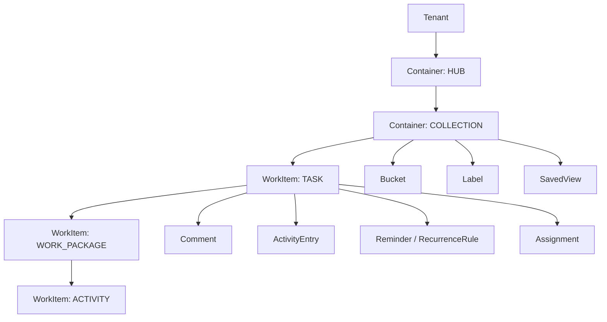
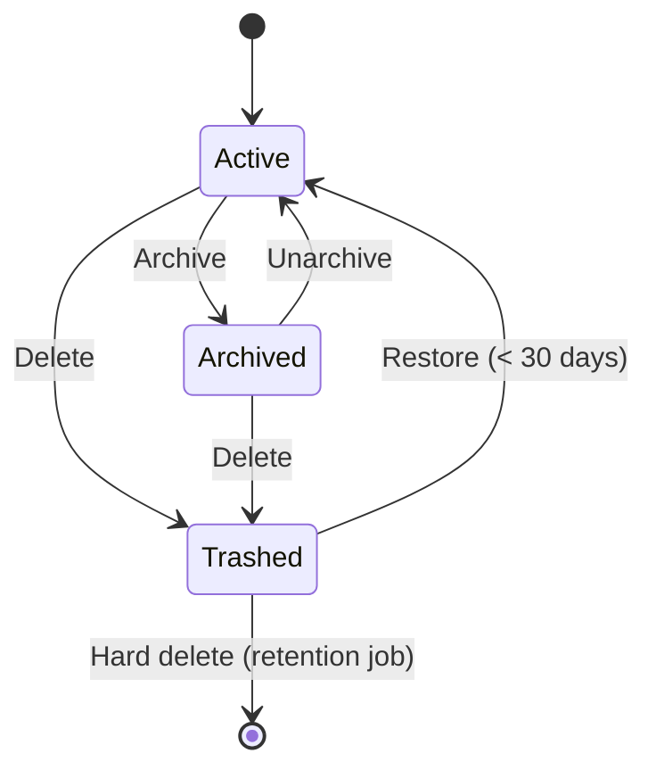

# Domain Model

Complements [arc42.md](./arc42.md) chapters 5 and 8.1. Binding for the implementation of
`core/domain` and `core/application`.

---

## 1. The guiding idea: generalisation

The requirements name four levels with different feature sets (task = everything, activity =
reduced). Four entities would mean four repositories, four permission checks, four API resources,
and four sets of automation actions — and all of it again when a fifth level appears.

**The decision:** one aggregate root `WorkItem` with an `ItemType` and a **capability profile**
that defines per type which capabilities are permitted. Containers are modelled analogously as
`Container` with a `ContainerType` (`HUB`, `COLLECTION`).

The consequence: one table, one repository, one set of use cases, one API resource (`/items`) —
extension through configuration rather than through code.

---

## 2. The capability matrix

`ItemCapabilityProfile` is a domain policy. System-defined profiles are defaults; tenants may
narrow them (never widen them beyond the system boundary).

| Capability | TASK | WORK_PACKAGE | ACTIVITY | Note |
|---|:--:|:--:|:--:|:--:|
| `COMPLETION` (done/open) | ✔ | ✔ | ✔ | Mandatory for every type |
| `DUE_DATE` | ✔ | ✔ | ✔ | |
| `REMINDER` | ✔ | ✔ | ✔ | Predefined plus custom |
| `ASSIGNMENT` | ✔ | ✔ | ✔ | Activity: exactly one assignee |
| `MEMBERS` (several) | ✔ | ✔ | ✘ | |
| `BUCKET` | ✔ | ✘ | ✘ | Buckets apply to items directly under the collection |
| `NOTES` | ✔ | ✔ | ✘ | |
| `LABELS` | ✔ | ✔ | ✘ | |
| `COMMENTS` | ✔ | ✔ | ✘ | |
| `COVER` | ✔ | ✘ | ✘ | A colour or an image |
| `ATTACHMENTS` | ✔ | ✔ | ✘ | |
| `HISTORY` | ✔ | ✔ | ✔ | Compact history for activities |
| `RECURRENCE` | ✔ | ✘ | ✘ | A series applies to the whole subtree |
| `CUSTOM_FIELDS` | ✔ | ✔ | ✘ | |
| `CHILDREN` | `WORK_PACKAGE` | `ACTIVITY` | — | The permitted child types |
| `MAX_DEPTH` | 3 | 2 | 1 | Relative to the collection |

**The rule:** setting a field whose capability is not active for the type produces
`ErrCapabilityNotSupported` (HTTP 422, code `capability_not_supported`) — not silent ignoring.

An extension example: a new type `MILESTONE` = a new profile entry plus an adjustment of the
permitted child types. No schema change, no API change.

---

## 3. Aggregates and entities

### 3.1 `Tenant` (context: Identity & Access)

| Field | Type | Rules |
|---|---|---|
| `id` | UUIDv7 | |
| `slug` | string(3..40) | Unique, `^[a-z0-9-]+$` |
| `displayName` | string(1..200) | |
| `status` | `ACTIVE` \| `SUSPENDED` \| `PENDING_DELETION` | State transitions only through use cases |
| `defaultLocale` | BCP-47 | e.g. `de-DE` |
| `defaultTimeZone` | IANA | e.g. `Europe/Berlin` |
| `settings` | JSONB | Retention, feature toggles, automation quotas |

In self-hosting mode exactly one tenant exists (`SINGLE`), created automatically.

### 3.2 `Account`, `Membership`, `Group`

`Account` = a person or a service account.

| Field | Type | Rules |
|---|---|---|
| `id`, `tenantId` | UUIDv7 | |
| `kind` | `USER` \| `SERVICE_ACCOUNT` | |
| `email` | string | Unique per tenant (for `USER`) |
| `externalSubject` | string? | The OIDC `sub`, for JIT provisioning |
| `locale`, `timeZone` | BCP-47 / IANA | Override the tenant default |
| `status` | `ACTIVE` \| `INVITED` \| `DISABLED` | |

`Membership(accountId, scopeType, scopeId, role)` with `scopeType ∈ {TENANT, HUB, COLLECTION, ITEM}`.
The effective permission is the highest role along the path (inheritance downwards).
`Group(id, tenantId, name, members[])` — the target object for assignment strategies and
permissions.

Roles and rights (an extract):

| Role | Read | Write items | Structure (buckets/labels) | Members | Automation | Delete (container) |
|---|:--:|:--:|:--:|:--:|:--:|:--:|
| `OWNER` | ✔ | ✔ | ✔ | ✔ | ✔ | ✔ |
| `ADMIN` | ✔ | ✔ | ✔ | ✔ | ✔ | ✘ |
| `MEMBER` | ✔ | ✔ | ✘ | ✘ | Own rules | ✘ |
| `CONTRIBUTOR` | ✔ | Assigned only | ✘ | ✘ | ✘ | ✘ |
| `VIEWER` | ✔ | ✘ | ✘ | ✘ | ✘ | ✘ |
| `GUEST` | Shared items only | Comment | ✘ | ✘ | ✘ | ✘ |

Two of those cells are qualifiers no permission name can carry, and both are decided in one place
in the application layer rather than by each use case that writes
([ADR-0005](../adr/ADR-0005-authn-authz.md), C-04). Every request about a single entry names the
entry, what it does to it, and whose it is; the decision point applies the row.

* **"Assigned only"** is measured against the entry's `assigneeId`. A contributor **may create**,
  and the entry they create is assigned to them — so the qualifier holds at every moment rather
  than being suspended for the one call that would break it. The auto-assignment is not optional:
  naming a different assignee, or asking the collection's policy to hand the entry out, is refused,
  because re-assigning is a write on an entry that is not yet theirs and is not a right the role
  holds. Creating remains possible only where the contributor holds a membership; the parent scope
  is checked unchanged.
* **"Shared items only"** is where the membership was granted, not a rule about the role. A
  membership at `ITEM` scope reaches that entry and nothing else, and the entry's own scope is the
  bottom of every authorisation path — so a share needs no mechanism of its own. Any role can be
  granted there; `GUEST` is simply the one usually given.

An entry that nothing on its path grants the actor anything on is answered as **not found** rather
than forbidden, in the same words a genuinely missing entry produces
([security.md](./security.md) T-04). A creation is the exception: it names no entry, so there is no
existence to disclose, and it is refused as any other write is.

`/meta/capabilities` reports the whole matrix, including these two cells, so that a client offers
the actions the server will accept rather than a table compiled into it.

### 3.3 `Container` (hub / collection)

| Field | Type | Rules |
|---|---|---|
| `id`, `tenantId` | UUIDv7 | |
| `type` | `HUB` \| `COLLECTION` | |
| `parentId` | UUIDv7? | `HUB` → `null`; `COLLECTION` → a `HUB` |
| `name` | string(1..200) | Unique per parent level (case-insensitive, Unicode NFC normalised) |
| `description` | text? | |
| `icon`, `color` | string? | |
| `orderKey` | string | Ordering within the parent context |
| `policies` | JSONB | `completionPolicy`, `defaultBucketId`, `capabilityOverrides`, `autoAssign` |
| `archivedAt`, `deletedAt` | timestamptz? | Lifecycle |
| `version` | int | Optimistic locking |

Invariants:
* I-C1: a `HUB` has no container parent; a `COLLECTION` has exactly one `HUB` as its parent.
* I-C2: deleting a container moves the entire subtree to the trash (a cascading soft delete with a shared `trashBatchId`, so that restoring is atomic).
* I-C3: an archived container is read-only; children inherit `effectiveArchived`.

### 3.4 `WorkItem` (the aggregate root)

| Field | Type | Rules |
|---|---|---|
| `id`, `tenantId` | UUIDv7 | |
| `collectionId` | UUIDv7 | Denormalised for queries and RLS performance |
| `type` | `TASK` \| `WORK_PACKAGE` \| `ACTIVITY` | Extensible |
| `parentId` | UUIDv7? | `TASK` → `null` (the parent is the collection) |
| `path` | string | A materialised path (`/<taskId>/<wpId>/…`) for subtree queries |
| `depth` | int | Derived, ≤ the type's `MAX_DEPTH` |
| `title` | string(1..500) | Required, trimmed, non-empty |
| `notes` | text? | Markdown (not rendered server-side), capability-dependent |
| `completion` | `{isCompleted, completedAt, completedBy}` | |
| `bucketId` | UUIDv7? | `TASK` only; the bucket must belong to the collection |
| `orderKey` | string | Rank within the bucket or the parent item |
| `dueAt` | timestamptz? | Plus `dueDateOnly bool` (all day) and `dueTimeZone` |
| `startAt` | timestamptz? | For the timeline view |
| `labels` | Set\<labelId\> | The collection's labels |
| `members` | Set\<accountId\> | Capability `MEMBERS` |
| `assigneeId` | accountId? | Capability `ASSIGNMENT` (for an activity, exactly this field) |
| `cover` | `{kind: COLOR\|IMAGE, colorToken?, mediaId?}` | Capability `COVER` |
| `customFields` | JSONB | Validated against `CustomFieldDefinition` |
| `recurrenceRuleId` | UUIDv7? | Capability `RECURRENCE` |
| `originJumbleEntryId` | UUIDv7? | Provenance |
| `archivedAt`, `deletedAt`, `trashBatchId` | | Lifecycle |
| `createdBy`, `createdAt`, `updatedAt`, `version` | | Audit + locking |

Invariants:
* I-W1: the `type` must be permitted under the `parent` by the capability profile (`Hierarchy.Validate`).
* I-W2: no cycles; `path` and `depth` stay consistent — changes go exclusively through `Hierarchy.Move`, which updates the subtree within one transaction.
* I-W3: all references (bucket, label, assignee, member, media) live in the same tenant and — for buckets and labels — in the same collection.
* I-W4: a trashed or archived item is not editable except through `Restore`/`Unarchive`.
* I-W5: with `completionPolicy = ROLLUP` active, a parent item is automatically completed or reopened when the completion status of all its children changes (idempotent, event-driven).
* I-W6: carrying an item into another collection — by moving it or by copying it — is only permitted if every reference can be resolved there; what cannot be is removed and reported back in the result (not silently). A move resolves the labels and the board column; a copy resolves those and, because it writes a new entry rather than relocating one, the members, the assignee and the custom field values as well (C-11). The reported kinds are `LABEL`, `BUCKET`, `MEMBER`, `ASSIGNEE`, `ATTACHMENT` and `CUSTOM_FIELD`, each with a stable message code saying why; an account is reported when it cannot see the destination, since an entry is only ever on somebody who can see it, and a reference is reported as an `ATTACHMENT` or by its kind when the type's capability profile no longer carries it.
* I-W7: `title` and text fields are Unicode NFC normalised; length limits count code points, not bytes.

The lifecycle state machine:

### 3.5 Surrounding entities

| Entity | Key fields | Rules |
|---|---|---|
| `Bucket` | `collectionId`, `name`, `orderKey`, `wipLimit?`, `isDoneBucket` | The "list" from the requirements; `isDoneBucket` can trigger completion |
| `Label` | `collectionId`, `name`, `colorToken`, `description?` | The colour is a token (not hex) → theming is possible in the frontend; hex optionally allowed |
| `Comment` | `itemId`, `authorId`, `body`, `editedAt?`, `parentCommentId?` | Only the author or an admin may change it; deletion is a soft delete ("removed") |
| `ActivityEntry` | `itemId`, `actor{type,id}`, `verb`, `changeSet` (JSONB), `occurredAt`, `causationId` | Append-only, the source of the history; `verb` is a code (i18n) |
| `MediaObject` | `tenantId`, `storageKey`, `fileName?`, `mimeType`, `size`, `checksum?`, `usage`, `status` (`PENDING`\|`READY`) | Presigned upload, reference counting, deletion on hard delete. `status` is the three-step flow written into the row: nothing may use an object before the confirmation has read its bytes back and judged them (C-06, T-11) |
| `CustomFieldDefinition` | `scope(collection\|tenant)`, `key`, `kind` (`TEXT`,`NUMBER`,`DATE`,`SELECT`,`MULTI_SELECT`,`BOOL`,`USER`,`URL`), `options`, `required` | Enables extension without a migration |
| `Reminder` | `itemId`, `offsetSpec` (`REL:-PT1H` / `ABS:<ts>`), `channels[]`, `recipients[]`, `state` | Predefined (relative presets) and custom |
| `RecurrenceRule` | `rrule` (RFC 5545), `timeZone`, `mode` (`ON_SCHEDULE`\|`ON_COMPLETION`), `horizonDays`, `endSpec` | See arc42 §6.3 |
| `Template` | `scope`, `name`, `rootType`, `nodes[]` (a tree carrying titles, notes, a relative due date as an ISO-8601 duration such as `P3D`, and a fixed `assigneeId` per node) | Instantiation produces an item tree. The tree is validated against the capability profiles at definition rather than at instantiation, and it holds at most `max_template_nodes` nodes (D-06) |
| `SavedView` | `scope`, `name`, `layout` (`LIST_COLLAPSED`,`LIST_EXPANDED`,`KANBAN`,`TIMELINE`), `query`, `grouping`, `visibleFields`, `sharing` | `layout` is a hint; the server does not interpret it |
| `JumbleEntry` | `tenantId`, `channel` (`EMAIL`,`WEBHOOK`,`QUICK_CAPTURE`,`API`), `rawSubject`, `rawBody`, `attachments[]`, `sender`, `status` (`NEW`,`PROCESSED`,`DISMISSED`), `suggestion` (JSONB) | Conversion produces a `WorkItem` and sets `PROCESSED` |
| `AutoAssignPolicy` | `scope`, `strategy`, `candidates[]` (accounts/groups), `state` (for round robin) | See below |
| `AutomationRule` | See [automation.md](./automation.md) | |
| `WebhookSubscription` | `tenantId`, `targetUrl`, `eventTypes[]`, `secret`, `state`, `failureCount` | HMAC-SHA256 signature, auto-disable after sustained failure |
| `CalendarFeed` | `tenantId`, `accountId` (the owner), `viewId`, `tokenHash`, `revokedAt` | The token is answered once and stored only as a purpose-labelled HMAC. The feed reads as its owner, evaluated at every fetch; revocation is a stamp, and a deleted view leaves the feed serving nothing (D-08, T-21) |

**The `ActivityEntry` verbs.** The verb is a message code and the catalogue key is that verb in the
`activity` namespace: `item.completed` is stored, `activity.item_completed` is what a client renders
(`i18n-l10n.md` §1, ADR-0011). The vocabulary of milestone 0.2.0 is `item.created`, `item.updated`,
`item.completed`, `item.reopened`, `item.moved`, `item.reordered`, `item.archived`,
`item.unarchived`, `item.trashed`, `item.restored`, `item.label_added` and `item.label_removed`.
Milestone 0.3.0 adds `item.assigned`, `item.unassigned`, `item.member_added`,
`item.member_removed` and `item.commented`. Handing an entry from one person to another is
`item.assigned` and not a removal followed by an addition: the assignee is a scalar, so it is one
step, and both sides of it are in the change set. `item.commented` is the one comment verb: an
edit and a deletion write no history, because the comment carries its own `editedAt` and its
tombstone, and the thread is where both are read. Milestone 0.4.0 adds `item.due_set` and
`item.due_cleared`: one verb covers setting and moving a due date, because the change set carries
both sides and a move is a value moving rather than a different act, and clearing is its own verb
the way `item.unassigned` is — "the deadline is gone" is a different sentence from "the deadline
moved". The event is `item.due_changed` for all of it (§4).

Milestone 0.4.0 also adds the three series verbs, `item.recurrence_set`,
`item.recurrence_changed` and `item.recurrence_removed` (D-04). Three rather than one, because
they are three different sentences to the person reading the history — this entry repeats now,
what it repeats by has changed, it stops repeating — and their change set is compact: what the
rule *is* belongs to the rule, and a history that restated it would be a second copy going stale
beside it.

The `changeSet` keeps the field names always and the values only where the product needs them: a
rename carries both titles, a note carries `changed: true` and none of its text. Where the type's
`HISTORY` capability is compact — an activity, per the matrix in §2 — the verb, the actor and the
time are the whole of the step and the change set is empty.

A container has no `ActivityEntry`: the entity is keyed on `itemId`, and `/items/{id}/activity` is
the only reader the API declares. What a hub or a collection changed is in the audit trail and in
the change log.

### 3.6 Automatic assignment

| Strategy | Behaviour | Determinism in tests |
|---|---|---|
| `FIXED` | Always the same person or group | Trivial |
| `RANDOM_MEMBER` | Random from the candidate list | Injectable through the `RandomSource` port |
| `RANDOM_GROUP_MEMBER` | A random group, then a random member | Likewise |
| `ROUND_ROBIN` | Rotating, with state persisted per policy | The state is explicitly visible |
| `LEAST_LOADED` | The lowest number of open items | A pure function over counts |

Extension happens through the `AssignmentStrategy` port; new strategies need no change to
`WorkItem`.

---

## 4. Domain events

The naming scheme: `de.hubtask.<context>.<entity>.<action>.v1`. Every event contains
`tenantId`, `actor{type,id}`, `occurredAt`, `correlationId`, `causationId`, `causationDepth`,
and a business payload. Events are a public contract (webhooks, automation, n8n).

| Event | Payload (core) | Consumers |
|---|---|---|
| `container.created` / `.renamed` / `.policies_updated` / `.moved` / `.archived` / `.unarchived` / `.deleted` / `.restored` | A container snapshot, `effectiveArchived` included; `.renamed` and `.policies_updated` add a `changeSet`, `.moved` the hub it came from | Automation, webhooks, search |
| `item.created` | An item snapshot, `parentRef` | Automation, search, SSE |
| `item.updated` | `changeSet` (old/new per field) | Automation (field change triggers), history |
| `item.completed` / `item.reopened` | `completedBy`, `completedAt` | Automation, roll-up, `ON_COMPLETION` recurrence |
| `item.moved` | `fromParent`, `toParent`, `fromBucket`, `toBucket`, `orderKey` | Kanban automation |
| `item.assigned` / `item.unassigned` | `assigneeId`, `strategy?` | Notification |
| `item.member_added` / `.member_removed` | `accountId` | Notification |
| `item.label_added` / `.label_removed` | `labelId` | Automation |
| `item.due_changed` | `oldDueAt`, `newDueAt`, `timeZone` | Scheduler, calendar feed |
| `item.due_soon` / `item.overdue` | `dueAt`, `thresholdSpec` | Reminders, automation |
| `item.archived` / `.trashed` / `.restored` / `.purged` | Lifecycle | Cleanup, media GC |
| `bucket.created` / `.updated` / `.reordered` / `.deleted` | A bucket snapshot; `.updated` and `.reordered` add a `changeSet`, `.deleted` says where its items went | Kanban clients, automation, search |
| `label.created` / `.updated` / `.deleted` | A label snapshot; `.updated` adds a `changeSet` | Automation, search |
| `comment.created` / `.updated` / `.deleted` | The comment | Notification, automation |
| `attachment.added` / `.removed` | A media reference | Media GC |
| `recurrence.occurrence_created` | `sourceItemId`, `newItemId`, `occurrenceAt` | History |
| `jumble.entry_received` / `.entry_converted` | The entry, the target item | Automation, AI suggestions |
| `template.instantiated` | `templateId`, `rootItemId` | History |
| `automation.rule_run_started` / `.rule_run_finished` / `.rule_run_failed` | Run details | Monitoring, UI |
| `tenant.provisioned` / `.suspended` / `.deleted` | The tenant | Control plane, metering |
| `membership.granted` / `.revoked` | Scope, role | Audit, notification |

`container.unarchived` is separate from `.restored`, which belongs to the trash: a rule written to
react to something coming back from a deletion must not fire when somebody unarchives a hub. The same
reasoning separates `item.reopened` from `item.completed`, and `bucket.reordered` from
`bucket.updated` — dragging a column one place to the left is not renaming it.

`item.label_added` and `item.label_removed` carry a reference rather than a snapshot, which is the
one exception to the rule above. A label set merges as an OR-set rather than by last writer wins
(offline-sync.md §4.2), so a snapshot of the item would carry a set another device may already have
merged differently; `labelId` is what a rule reacts to and `itemId` is what it reads the rest from.

**Compatibility rules:** fields may only be added; removing or reinterpreting one requires a `.v2`
alongside continued delivery of `.v1` for at least two minor releases.

---

## 5. Use case catalogue (application layer)

Every use case is a `Command`/`Query` struct plus a handler, and is registered in **three**
channels: REST, an MCP tool, and an automation action (see arc42 §4). An extract — the list is the
implementation backlog:

**Work management**
`CreateContainer`, `RenameContainer`, `UpdateContainerPolicies`, `MoveContainer`, `ArchiveContainer`,
`UnarchiveContainer`, `TrashContainer`, `RestoreContainer`,
`CreateWorkItem`, `UpdateWorkItem`, `MoveWorkItem`, `ReorderWorkItem`, `CompleteWorkItem`,
`ReopenWorkItem`, `SetDueDate`, `ClearDueDate`, `AssignWorkItem`, `AutoAssignWorkItem`,
`AddMember`, `RemoveMember`, `AddLabel`, `RemoveLabel`, `SetCover`, `ClearCover`, `SetNotes`,
`SetCustomField`, `ArchiveWorkItem`, `TrashWorkItem`, `RestoreWorkItem`, `PurgeWorkItem`,
`DuplicateWorkItem` (with or without the subtree), `BulkUpdateWorkItems`.

**Structure** `CreateBucket`, `UpdateBucket`, `ReorderBucket`, `DeleteBucket`,
`CreateLabel`, `UpdateLabel`, `DeleteLabel`, `DefineCustomField`, `ListCustomFields`, `UpdateCustomField`, `DeleteCustomField`.

**Collaboration** `AddComment`, `EditComment`, `DeleteComment`, `ListActivity`.

**Media** `RequestMediaUpload`, `ConfirmMediaUpload`, `GetMedia`, `DeleteMedia`, `AttachMedia`,
`DetachMedia`, `ListAttachments`, `ReconcileMedia` (internal). The upload is three steps because
the server does not carry the bytes (arc42 §8.4): a client asks where to put them, puts them there,
and confirms — and only the confirmation, which reads them back and sniffs them, makes the object
usable. `AttachMedia` and `DetachMedia` were missing from this list while the event catalogue in
§4, the automation actions and the API resource table all named the attachment; they are here now
(C-06). `ReconcileMedia` is not registered in the three channels and deliberately not: "delete
every unreferenced file, now" is not a button anybody should be given, and the way to influence it
is the configuration rather than a call.

**Scheduling** `CreateReminder`, `ListReminders`, `UpdateReminder`, `DeleteReminder`,
`FireReminders` (internal), `SetRecurrence`, `GetRecurrence`, `RemoveRecurrence`,
`SkipOccurrence`, `MaterializeOccurrences` (internal).

`SetRecurrence` is also the `UpdateRecurrence` this list used to name separately (D-04): a series
is one document rather than six settings, the route is one `PUT`, and a caller sending it neither
knows nor cares whether the entry already had one — what differs is the trail, where the audit
entry and the history verb say which of the two happened. `GetRecurrence` joined for the reason
the read of a saved view did: a rule a client can set and never read back is one it cannot show.

The two internal ones are deliberately not registered in the three channels: the catalogue is what
a person, an agent or a rule may ask for, and "fire everybody's reminders now" is not something
anybody should be able to ask for — the way to influence when a reminder fires is the reminder
(D-03, and the same reasoning C-06 applied to `ReconcileMedia`).

**Templates** `CreateTemplate`, `ListTemplates`, `GetTemplate`, `UpdateTemplate`, `DeleteTemplate`, `InstantiateTemplate`. The list and the get joined with D-06 for the reason they joined the two lists on either side of this one: `/templates` says CRUD, and a shape nobody can read back is one nobody can edit. Defining, changing and deleting ask for `STRUCTURE` at the template's own scope - a template is a shape other people stamp out, so it belongs with the people who shape the workspace - while instantiating asks only for `WRITE_ITEMS` in the collection it lands in, because using a shape is ordinary work.

**Views & query** `QueryItems` (the query DSL), `CreateSavedView`, `ListSavedViews`, `GetSavedView`,
`UpdateSavedView`, `DeleteSavedView`, `ShareSavedView`, `ExportView` (CSV/JSON/ICS). The list and
the get joined with D-07, the way `ListCustomFields` joined with C-07: `/views` says CRUD, and a
view nobody can read back is not a view.

**Jumble** `SubmitJumbleEntry`, `ConvertJumbleEntry`, `DismissJumbleEntry`, `SuggestFromJumbleEntry` (AI, optional).

**Lifecycle** `ListTrash`, `EmptyTrash`, `ListArchive`, `RunRetention` (internal).

**Automation** `CreateRule`, `UpdateRule`, `EnableRule`, `DisableRule`, `DeleteRule`, `TestRule` (dry run),
`TriggerRuleManually`, `ListRuleRuns`, `ReplayRuleRun`.

**Integration** `CreateWebhookSubscription`, `UpdateWebhookSubscription`, `DeleteWebhookSubscription`,
`ListDeliveries`, `ReplayDelivery`, `CreateCalendarFeed`, `ListCalendarFeeds`,
`RevokeCalendarFeed`, `CreateAccessToken`, `RevokeAccessToken`, `CreateServiceAccount`.

The list of feeds joined with D-08 for the reason the two lists above it joined: a credential
somebody can mint and never see again is one they cannot revoke. All three ask for the view's own
read permission and nothing more - a feed grants exactly what its owner may already read, and
revocation must never be harder to reach than minting was. The fetch itself is deliberately **not**
in the catalogue: `GET /calendar/{token}.ics` answers a credential nobody in this system holds, so
there is nothing for MCP or an automation rule to call, and it is served by the internal
`ReadCalendarFeed` the way `MediaContent` serves the content routes.

**Identity & tenancy** `ProvisionTenant`, `UpdateTenantSettings`, `SuspendTenant`, `DeleteTenant`,
`ExportTenantData`, `InviteAccount`, `UpdateAccountPreferences`, `GrantMembership`, `RevokeMembership`,
`CreateGroup`, `UpdateGroup`, `DeleteGroup`.

**Search** `SearchItems` (full text, optionally semantic).

**Backup** `CreateBackupTarget`, `ListBackupTargets`, `TestBackupTarget` (E-03),
`CreateBackupSchedule`, `StartBackup`, `GetBackupRun`, `VerifyBackup` (E-05),
`ListBackupsAtTarget`, `StartRestore`, `GetRestoreRun` (E-06). Creating one asks
for the owner's right — `DELETE_CONTAINER`, the matrix's line for the one thing an administrator
cannot do — because a target is a channel the tenant's data leaves by, and in single-tenant
operation the tenant's owner is the instance administrator `backup-restore.md` §2 names. Listing
asks for `STRUCTURE` instead: knowing where the data goes is part of running the workspace, and
somebody who may not create a target may still need to see that one exists and that its last probe
failed. Credentials are sealed on the way in and are returned by nothing. The connection test is a
write, a read-back and a delete, and answers a result rather than an error — "the target is
unreachable" is what the caller asked to find out.

The restore side draws the same line one step further. Listing what is at a target and reading a
restore ask for `READ`-level knowledge of the workspace and are answered at `STRUCTURE`; *starting*
one asks for `STRUCTURE` too, because reading an archive back into the workspace is running it — but
`REPLACE_TENANT` and `INSTANCE` ask for `DELETE_CONTAINER`, the matrix's line for the one thing an
administrator cannot do. Those two remove what the archive does not name, which is destroying rather
than restoring. On top of the permission they need the workspace's name typed exactly and a step-up
that no installation can satisfy yet (`backup-restore.md` §8.3), so today they are refused with a
code that says so rather than permitted by omission.

**Jobs** `GetJob`, `CancelJob`. The resource three `202 Accepted` responses have been pointing at
since A-06, registered with E-01. Two permissions rather than one: reading a job is `READ` and
stopping one is `STRUCTURE`, because "show me" and "stop it" are different questions and a viewer
who may watch a restore must not be able to abandon it half way. Both are asked at the **tenant**,
which is not a shortcut - a job is anchored to nothing, so there is no path along which a
hub-scoped membership could be resolved, and every job kind the system creates today is the
workspace's rather than one hub's. What a job answers is deliberately narrow: its status, its
progress where it can compute one, a result reference and the code of the last failure. The
payload, the attempt count, the lease and the deduplication key are the queue's and stay there.

---

## 6. Persistence sketch

The complete DDL: [`../../db/schema.sql`](../../db/schema.sql). The principles:

* Every business table begins with `tenant_id uuid NOT NULL` and carries an RLS policy.
* Composite indices matching the query patterns of the views:
  `(tenant_id, collection_id, bucket_id, order_key)`, `(tenant_id, collection_id, due_at)`,
  `(tenant_id, assignee_id, is_completed, due_at)`, `(tenant_id, path text_pattern_ops)`.
* Partial indices for "not deleted / not archived" (the most common filter).
* Set relations (labels, members) as join tables rather than JSON arrays — filterability takes
  precedence.
* `custom_fields` as `jsonb` with a GIN index; validation happens in the domain code.
* Full text: a `tsvector` column with a language-dependent configuration per item, maintained by a trigger rather than generated — a generated column cannot choose its configuration ([ADR-0034](../adr/ADR-0034-language-dependent-search.md)) — plus a trigram index for the scripts that have no word boundaries.
* Trash and archive as timestamps rather than separate tables (restoring without moving data).
