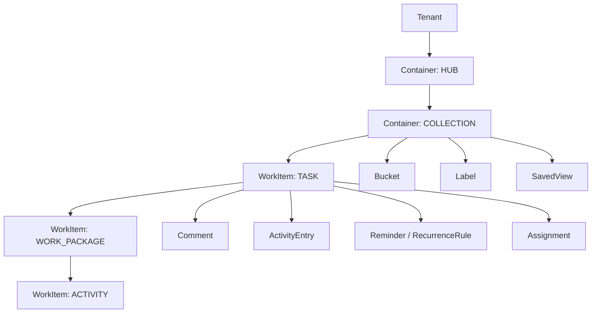
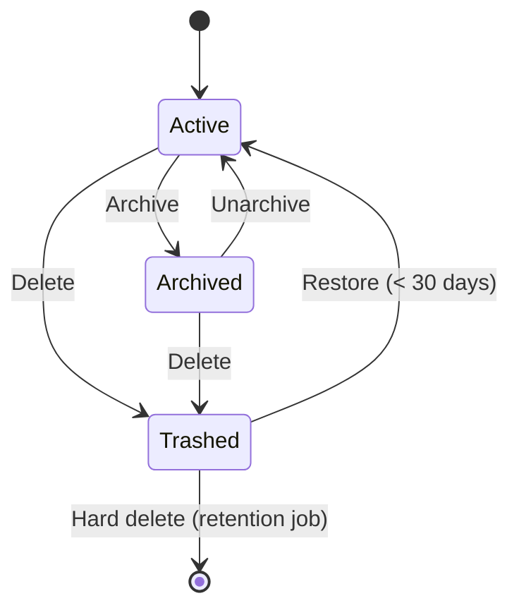

# Domain Model

Binding for `core/domain` and `core/application`. The aggregates, their fields and invariants, the
roles and what each may do, the events, and the rules of the operation catalogue. Complements
[arc42.md](./arc42.md) §5 and §8.1.

---

## 1. The guiding idea: generalisation

One aggregate root `WorkItem` with an `ItemType` and a **capability profile** that defines per type
which capabilities are permitted ([ADR-0006](../adr/ADR-0006-generalized-workitem.md)). Containers
are modelled the same way: `Container` with a `ContainerType` (`HUB`, `COLLECTION`).

```mermaid
graph TD
  T[Tenant] --> C1[Container: HUB]
  C1 --> C2[Container: COLLECTION]
  C2 --> I1[WorkItem: TASK]
  I1 --> I2[WorkItem: WORK_PACKAGE]
  I2 --> I3[WorkItem: ACTIVITY]
  C2 --> B[Bucket]
  C2 --> L[Label]
  C2 --> V[SavedView]
  I1 --> CM[Comment]
  I1 --> A[ActivityEntry]
  I1 --> R[Reminder / RecurrenceRule]
  I1 --> AS[Assignment]
```

The consequence: one table, one repository, one set of use cases, one API resource (`/items`). A
new level or feature is configuration, not a new schema.

---

## 2. The capability matrix

`ItemCapabilityProfile` is a domain policy. System-defined profiles are defaults; a tenant may
narrow them, never widen them beyond the system boundary.

| Capability | TASK | WORK_PACKAGE | ACTIVITY | Note |
|---|:--:|:--:|:--:|:--:|
| `COMPLETION` (done/open) | ✔ | ✔ | ✔ | Mandatory for every type |
| `DUE_DATE` | ✔ | ✔ | ✔ | |
| `REMINDER` | ✔ | ✔ | ✔ | Predefined plus custom |
| `ASSIGNMENT` | ✔ | ✔ | ✔ | Activity: exactly one assignee |
| `MEMBERS` (several) | ✔ | ✔ | ✘ | |
| `BUCKET` | ✔ | ✘ | ✘ | Buckets apply to items directly under the collection |
| `NOTES` | ✔ | ✔ | ✘ | |
| `LABELS` | ✔ | ✔ | ✘ | |
| `COMMENTS` | ✔ | ✔ | ✘ | |
| `COVER` | ✔ | ✘ | ✘ | A colour or an image |
| `ATTACHMENTS` | ✔ | ✔ | ✘ | |
| `HISTORY` | ✔ | ✔ | ✔ | Compact history for activities |
| `RECURRENCE` | ✔ | ✘ | ✘ | A series applies to the whole subtree |
| `CUSTOM_FIELDS` | ✔ | ✔ | ✘ | |
| `CHILDREN` | `WORK_PACKAGE` | `ACTIVITY` | — | The permitted child types |
| `MAX_DEPTH` | 3 | 2 | 1 | Relative to the collection |

**The rule:** setting a field whose capability is not active for the type produces
`ErrCapabilityNotSupported` (HTTP 422, code `capability_not_supported`) — never silent ignoring.

A new type such as `MILESTONE` is a new profile entry plus an adjustment of the permitted child
types: no schema change, no API change.

---

## 3. Aggregates and entities

### 3.1 `Tenant` (context: Identity & Access)

| Field | Type | Rules |
|---|---|---|
| `id` | UUIDv7 | |
| `slug` | string(3..40) | Unique; lower-case letters, digits and hyphens, starting with a letter or digit (a DNS label). Set by the installation operator (`/admin/tenants`) and refused by name in `PATCH /tenant`: it is the hostname in multi mode and the base of the registered OIDC redirect |
| `displayName` | string(1..200) | |
| `status` | `ACTIVE` \| `SUSPENDED` \| `PENDING_DELETION` | State transitions only through use cases |
| `defaultLocale` | BCP-47 | e.g. `de-DE` |
| `defaultTimeZone` | IANA | e.g. `Europe/Berlin` |
| `settings` | JSONB | Retention, feature toggles, sign-in rule, automation quotas. A write merges the keys it models and leaves every other key where it was |

In single mode exactly one tenant exists. It is created by `scripts/dev-workspace.sh --bootstrap`
or the admin API; the first start's setup in the browser is
[UC-INS-01](../usecases/admin/UC-INS-01-start-a-fresh-installation.md), not yet built.

### 3.2 `Account`, `Membership`, `Group`

`Account` = a person or a service account.

| Field | Type | Rules |
|---|---|---|
| `id`, `tenantId` | UUIDv7 | |
| `kind` | `USER` \| `SERVICE_ACCOUNT` | |
| `email` | string | Unique per tenant (for `USER`); absent on a managed account, which signs in with its `sign_in_name` instead ([ADR-0074](../adr/ADR-0074-managed-accounts.md)) |
| `externalSubject` | string? | The OIDC `sub`, for just-in-time provisioning |
| `locale`, `timeZone` | BCP-47 / IANA | Override the tenant default |
| `status` | `ACTIVE` \| `INVITED` \| `DISABLED` \| `RESTRICTED` \| `ANONYMIZED` | `RESTRICTED` is restriction of processing (Art. 18): the person still works, and no automatic decision or AI touches their data — it is not a lockout. `ANONYMIZED` is the end of an erasure that keeps authorship; such an account cannot act |

`Membership(accountId, scopeType, scopeId, role)` with `scopeType ∈ {TENANT, HUB, COLLECTION, ITEM}`.
The effective permission is the highest role along the path (inheritance downwards). One exception:
a **private hub** is reached only through a membership on the hub itself or below it — roles held
higher up the path do not flow into it, and the workspace owner reaches it only through the
transparent emergency access of [ADR-0073](../adr/ADR-0073-private-hubs.md).
`Group(id, tenantId, name, members[])` — the target object for assignment strategies and
permissions.

Roles and rights (an extract):

| Role | Read | Write items | Structure (buckets/labels) | Members | Automation | Delete (container) | Read configuration | Read the trail |
|---|:--:|:--:|:--:|:--:|:--:|:--:|:--:|:--:|
| `OWNER` | ✔ | ✔ | ✔ | ✔ | ✔ | ✔ | ✔ | ✔ |
| `ADMIN` | ✔ | ✔ | ✔ | ✔ | ✔ | ✘ | ✔ | ✔ |
| `MEMBER` | ✔ | ✔ | ✘ | ✘ | Own rules | ✘ | ✘ | Own events |
| `CONTRIBUTOR` | ✔ | Assigned only | ✘ | ✘ | ✘ | ✘ | ✘ | Own events |
| `VIEWER` | ✔ | ✘ | ✘ | ✘ | ✘ | ✘ | ✘ | Own events |
| `GUEST` | Shared items only | Comment | ✘ | ✘ | ✘ | ✘ | ✘ | Own events |
| `AUDITOR` | ✘ | ✘ | ✘ | ✘ | ✘ | ✘ | ✔ | ✔ |

**Read configuration** (`READ_CONFIGURATION`) is reading how the workspace is set up — the backup
targets and runs, the retention rules and their previews, the legal holds, the automation rules and
their runs, the webhook subscriptions — and never a secret any of them holds. A signing secret is
answered once where it is created and in no projection; a backup target's credentials are sealed
and are in no listing. It is separate from `STRUCTURE` because `STRUCTURE` is a writing permission;
every configuration read accepts either.

The `AUDITOR` row is not a rung on the ladder. It reads the trail and the configuration and nothing
else: without `READ`, every use case over containers, entries and comments refuses it by the
ordinary rule ([audit.md](./audit.md) §5, §9).

Two cells are qualifiers no permission name can carry. Both are decided in one place in the
application layer ([ADR-0005](../adr/ADR-0005-authn-authz.md)): every request about a single entry
names the entry, what it does to it, and whose it is, and the decision point applies the row.

* **"Assigned only"** is measured against the entry's `assigneeId`. A contributor **may create**,
  and the entry they create is assigned to them, so the qualifier holds at every moment. Naming a
  different assignee, or asking the collection's policy to hand the entry out, is refused.
  Creating needs a membership where the entry lands; the parent scope is checked unchanged.
* **"Shared items only"** is where the membership was granted, not a rule about the role. A
  membership at `ITEM` scope reaches that entry and nothing else, and the entry's own scope is the
  bottom of every authorisation path, so a share needs no mechanism of its own. Any role can be
  granted there; `GUEST` is the one usually given.

An entry that nothing on its path grants the actor anything on is answered as **not found**, in the
same words a missing entry produces ([security.md](./security.md) T-04). A creation names no entry,
so it is refused as any other write is.

**A list is narrowed inside the statement** — the reachable shares are passed as a bound array —
never filtered after the page is read, so a page is never short of what the caller may see and a
cursor never skips.

`/meta/capabilities` reports the whole matrix, including the two qualifiers, so that a client
offers the actions the server will accept rather than a table compiled into it.

### 3.3 `Container` (hub / collection)

| Field | Type | Rules |
|---|---|---|
| `id`, `tenantId` | UUIDv7 | |
| `type` | `HUB` \| `COLLECTION` | |
| `parentId` | UUIDv7? | `HUB` → `null`; `COLLECTION` → a `HUB` |
| `name` | string(1..200) | Unique per parent level (case-insensitive, Unicode NFC normalised) |
| `description` | text? | |
| `icon`, `color` | string? | |
| `orderKey` | string | A fractional index within the parent: a hub among the workspace's hubs, a collection among its hub's |
| `policies` | JSONB | `completionPolicy`, `defaultBucketId`, `capabilityOverrides`, `autoAssign` |
| `archivedAt`, `deletedAt` | timestamptz? | Lifecycle |
| `version` | int | Optimistic locking |

Invariants:
* I-C1: a `HUB` has no container parent; a `COLLECTION` has exactly one `HUB` as its parent.
* I-C2: deleting a container moves the entire subtree to the trash (a cascading soft delete with a shared `trashBatchId`, so that restoring is atomic).
* I-C3: an archived container is read-only; children inherit `effectiveArchived`.
* I-C4: `POST /containers/{id}:reorder` moves one container among its siblings by writing its own `orderKey` only — no neighbour is rewritten; an archived container refuses it.

### 3.4 `WorkItem` (the aggregate root)

| Field | Type | Rules |
|---|---|---|
| `id`, `tenantId` | UUIDv7 | |
| `collectionId` | UUIDv7 | Denormalised for queries and RLS performance |
| `type` | `TASK` \| `WORK_PACKAGE` \| `ACTIVITY` | Extensible |
| `parentId` | UUIDv7? | `TASK` → `null` (the parent is the collection) |
| `path` | string | A materialised path (`/<taskId>/<wpId>/…`) for subtree queries |
| `depth` | int | Derived, ≤ the type's `MAX_DEPTH` |
| `title` | string(1..500) | Required, trimmed, non-empty |
| `notes` | text? | Markdown (not rendered server-side), capability-dependent |
| `completion` | `{isCompleted, completedAt, completedBy}` | |
| `bucketId` | UUIDv7? | `TASK` only; the bucket must belong to the collection |
| `orderKey` | string | Rank within the bucket or the parent item |
| `dueAt` | timestamptz? | Plus `dueDateOnly bool` (all day) and `dueTimeZone`. Both exist only beside a `dueAt`, and clearing the due date clears all three |
| `startAt` | timestamptz? | For the timeline view |
| `labels` | Set\<labelId\> | The collection's labels |
| `members` | Set\<accountId\> | Capability `MEMBERS` |
| `assigneeId` | accountId? | Capability `ASSIGNMENT` (for an activity, exactly this field) |
| `cover` | `{kind: COLOR\|IMAGE, colorToken?, mediaId?}` | Capability `COVER` |
| `customFields` | JSONB | Validated against `CustomFieldDefinition` |
| `recurrenceRuleId` | UUIDv7? | Capability `RECURRENCE` |
| `originJumbleEntryId` | UUIDv7? | Provenance |
| `archivedAt`, `deletedAt`, `trashBatchId` | | Lifecycle |
| `createdBy`, `createdAt`, `updatedAt`, `version` | | Audit + locking |

Invariants:
* I-W1: the `type` must be permitted under the `parent` by the capability profile (`Hierarchy.Validate`).
* I-W2: no cycles; `path` and `depth` stay consistent — changes go exclusively through `Hierarchy.Move`, which updates the subtree within one transaction.
* I-W3: all references (bucket, label, assignee, member, media) live in the same tenant and — for buckets and labels — in the same collection.
* I-W4: a trashed or archived item is not editable except through `Restore`/`Unarchive`.
* I-W5: with `completionPolicy = ROLLUP` active, a parent item is automatically completed or reopened when the completion status of all its children changes (idempotent, event-driven).
* I-W6: carrying an item into another collection — by moving or by copying it — is permitted only if every reference can be resolved there; what cannot be is removed and reported back in the result, never silently. A move resolves the labels and the board column; a copy also resolves the members, the assignee and the custom field values, because it writes a new entry. The reported kinds are `LABEL`, `BUCKET`, `MEMBER`, `ASSIGNEE`, `ATTACHMENT` and `CUSTOM_FIELD`, each with a stable message code. An account is reported when it cannot see the destination; a reference the type's capability profile no longer carries is reported by its kind.
* I-W7: `title` and text fields are Unicode NFC normalised; length limits count code points, not bytes.

The lifecycle state machine:

```mermaid
stateDiagram-v2
  [*] --> Active
  Active --> Archived: Archive
  Archived --> Active: Unarchive
  Active --> Trashed: Delete
  Archived --> Trashed: Delete
  Trashed --> Active: Restore (< 30 days)
  Trashed --> [*]: Hard delete (retention job)
```

### 3.5 Surrounding entities

| Entity | Key fields | Rules |
|---|---|---|
| `Bucket` | `collectionId`, `name`, `orderKey`, `wipLimit?`, `isDoneBucket` | The "list" from the requirements. `isDoneBucket` marks the column that means finished; it is stored and reported, and the server completes nothing because of it |
| `Label` | `collectionId`, `name`, `colorToken`, `description?` | The colour is required and is one of the ten label tokens (`LabelTokens.go`), never a colour value, so clients theme it ([ADR-0029](../adr/ADR-0029-design-system-tokens.md)) |
| `Comment` | `itemId`, `authorId`, `body`, `editedAt?`, `parentCommentId?` | Only the author or an admin may change it. Deletion erases the body in the row and keeps the identifier, the author and the timestamps, so the thread stays readable and no removed text is retained |
| `ActivityEntry` | `itemId`, `actor{type,id}`, `verb`, `changeSet` (JSONB), `occurredAt`, `causationId` | Append-only, the source of the history; `verb` is a message code (below) |
| `MediaObject` | `tenantId`, `storageKey`, `fileName?`, `mimeType`, `size`, `checksum?`, `usage`, `status` (`PENDING`\|`READY`) | Presigned upload, reference counting, deletion on hard delete. Nothing may use an object before the confirmation has read its bytes back and judged them ([security.md](./security.md) T-11) |
| `CustomFieldDefinition` | `scope(collection\|tenant)`, `key`, `kind` (`TEXT`,`NUMBER`,`DATE`,`SELECT`,`MULTI_SELECT`,`BOOL`,`USER`,`URL`), `options`, `required` | Extension without a migration. Each value records the definition it was written under, and every read and filter answers only values whose definition still lives, so a key recreated after deletion starts empty |
| `Reminder` | `itemId`, `offsetSpec` (`REL:-PT1H` / `ABS:<ts>`), `channels[]`, `recipients[]`, `state` | Predefined (relative presets) and custom |
| `RecurrenceRule` | `rrule` (RFC 5545), `timeZone`, `mode` (`ON_SCHEDULE`\|`ON_COMPLETION`), `horizonDays`, `endSpec` | See [arc42.md](./arc42.md) §6.3 |
| `Template` | `scope`, `name`, `rootType`, `nodes[]` (a tree carrying titles, notes, a relative due date as an ISO-8601 duration such as `P3D`, and a fixed `assigneeId` per node) | Instantiation produces an item tree. The tree is validated against the capability profiles when it is defined, not when it is instantiated, and holds at most `max_template_nodes` nodes |
| `SavedView` | `scope`, `name`, `layout` (`LIST_COLLAPSED`,`LIST_EXPANDED`,`KANBAN`,`TIMELINE`), `query`, `grouping`, `visibleFields`, `sharing` | `layout` is a hint; the server does not interpret it |
| `JumbleEntry` | `tenantId`, `channel` (`EMAIL`,`WEBHOOK`,`QUICK_CAPTURE`,`API`), `rawSubject`, `rawBody`, `attachments[]`, `sender`, `status` (`NEW`,`PROCESSED`,`DISMISSED`), `suggestion` (JSONB) | Conversion produces a `WorkItem` and sets `PROCESSED` |
| `AutoAssignPolicy` | `scope`, `strategy`, `candidates[]` (accounts/groups), `state` (for round robin), `enabled` | See §3.6 |
| `AutomationRule` | See [automation.md](./automation.md) | |
| `WebhookSubscription` | `tenantId`, `targetUrl`, `eventTypes[]`, `secret`, `state`, `failureCount` | HMAC-SHA256 signature, auto-disable after sustained failure |
| `CalendarFeed` | `tenantId`, `accountId` (the owner), `viewId`, `tokenHash`, `revokedAt` | The token is answered once and stored only as a purpose-labelled HMAC. The feed reads as its owner, evaluated at every fetch; revocation is a stamp, and a deleted view leaves the feed serving nothing ([security.md](./security.md) T-21) |

**The `ActivityEntry` verbs.** The verb is a message code; the catalogue key is the verb in the
`activity` namespace: `item.completed` is stored, `activity.item_completed` is what a client renders
([i18n-l10n.md](./i18n-l10n.md) §1, ADR-0011). The vocabulary is closed
(`core/domain/model/activity/Entry.go`):

| Verbs | Rule |
|---|---|
| `item.created`, `item.updated`, `item.completed`, `item.reopened`, `item.moved`, `item.reordered`, `item.archived`, `item.unarchived`, `item.trashed`, `item.restored` | The entry's own lifecycle and edits |
| `item.label_added`, `item.label_removed`, `item.attachment_added`, `item.attachment_removed` | A set beside the entry: one verb per direction |
| `item.assigned`, `item.unassigned`, `item.member_added`, `item.member_removed` | Handing an entry from one person to another is `item.assigned` with both sides in the change set, not a removal plus an addition |
| `item.cover_set`, `item.cover_cleared` | The event is still `item.updated` carrying the field; there is no cover event |
| `item.custom_field_set` | Setting and clearing one field; the change set carries both sides |
| `item.due_set`, `item.due_cleared` | Setting and moving a due date are one verb; clearing is its own. The event is `item.due_changed` for all of it |
| `item.commented` | The one comment verb. An edit and a deletion write no history: the comment carries its own `editedAt` and tombstone |
| `item.duplicated` | The first step of a copy. The event is `item.created` |
| `item.recurrence_set`, `item.recurrence_changed`, `item.recurrence_removed`, `item.recurrence_skipped` | On the template entry; the change set is compact — what the rule is belongs to the rule. A created occurrence has a history of its own |
| `item.merged`, `item.change_lost` | Written by a sync push on top of the use case it performed: a free-text value displaced into a comment, or a meaningful change another device outvoted ([offline-sync.md](./offline-sync.md) §4.2, §5) |

Rules of the history:

* **Every mutating work-management use case writes an `ActivityEntry`, or is on the architecture
  test's exemption list with a reason** (`test/architecture/activity_test.go`); the descriptor and
  the test name it both. Two use cases never share a verb.
* The `changeSet` keeps the field names always and the values only where the product needs them: a
  rename carries both titles, a note carries `changed: true` and none of its text. Where the type's
  `HISTORY` capability is compact (an activity, §2), the verb, the actor and the time are the whole
  step and the change set is empty.
* A container has no `ActivityEntry`: the entity is keyed on `itemId`, and `/items/{id}/activity` is
  the only reader. What a hub or a collection changed is in the audit trail and the change log.

### 3.6 Automatic assignment

| Strategy | Behaviour | Determinism in tests |
|---|---|---|
| `FIXED` | Always the same one account. A fixed group is `RANDOM_GROUP_MEMBER` with a single group, because an assignee is an account | Trivial |
| `RANDOM_MEMBER` | Uniformly from the candidate accounts | Injectable through the `RandomSource` port |
| `RANDOM_GROUP_MEMBER` | A random group, then a random member of it — a small team and a large one carry the same share | Likewise |
| `ROUND_ROBIN` | Walks the candidate list in order, with its position persisted per policy. The cursor indexes the configured list, so a candidate skipped while ineligible loses one turn, not their place | The state is explicitly visible |
| `LEAST_LOADED` | The candidate with the fewest open entries | A pure function over counts |

An enabled policy applies itself to everything created in its collection; a disabled one is used
only when a create asks for `auto_assign`. Removing a policy deletes it. Extension happens through
the `AssignmentStrategy` interface in `core/domain/service`; a new strategy needs no change to
`WorkItem`.

---

## 4. Domain events

The naming scheme: `de.hubtask.<context>.<entity>.<action>.v1`. Every event carries `tenantId`,
`actor{type,id}`, `occurredAt`, `correlationId`, `causationId`, `causationDepth`, and a business
payload. Events are a public contract (webhooks, automation, n8n, Zapier); their JSON schemas live
under `api/events/`, and `core/domain/event/EventType.go` is the closed list.

Delivery ([ADR-0007](../adr/ADR-0007-events-outbox-cloudevents.md)):

* An event is written to the outbox **in the same transaction** as the change it describes — no
  event without a change, no change without its event.
* The dispatcher delivers at least once, in the CloudEvents 1.0 structured format; every consumer
  is idempotent on the event id.
* A change a restore wrote carries the extension attribute `replay`, present only when true, and a
  subscriber receives a replay only if it asked for one
  ([backup-restore.md](./backup-restore.md) §8.4).

The names below omit `de.hubtask.<context>.` and `.v1`; the context is `work` unless the row says
otherwise.

| Event | Payload (core) | Consumers |
|---|---|---|
| `container.created` / `.renamed` / `.policies_updated` / `.moved` / `.archived` / `.unarchived` / `.deleted` / `.restored` | A container snapshot, `effectiveArchived` included; `.renamed` and `.policies_updated` add a `changeSet`, `.moved` the hub it came from | Automation, webhooks, search |
| `item.created` | An item snapshot, `parentRef` | Automation, search, the change stream |
| `item.updated` | `changeSet` (old/new per field) | Automation (field change triggers), history |
| `item.completed` / `item.reopened` | `completedBy`, `completedAt` | Automation, roll-up, `ON_COMPLETION` recurrence |
| `item.moved` | `fromParent`, `toParent`, `fromBucket`, `toBucket`, `orderKey` | Kanban automation |
| `item.assigned` / `item.unassigned` | `assigneeId`, `strategy?` | Notification |
| `item.member_added` / `.member_removed` | `accountId` | Notification |
| `item.label_added` / `.label_removed` | `labelId` | Automation |
| `item.due_changed` | `oldDueAt`, `newDueAt`, `timeZone` | Scheduler, calendar feed |
| `item.due_soon` / `item.overdue` | `dueAt`, `thresholdSpec` | Reminders, automation |
| `item.archived` / `.unarchived` / `.trashed` / `.restored` / `.purged` | Lifecycle | Cleanup, media reconciliation |
| `bucket.created` / `.updated` / `.reordered` / `.deleted` | A bucket snapshot; `.updated` and `.reordered` add a `changeSet`, `.deleted` says where its items went | Kanban clients, automation, search |
| `label.created` / `.updated` / `.deleted` | A label snapshot; `.updated` adds a `changeSet` | Automation, search |
| `comment.created` / `.updated` / `.deleted` | The comment | Notification, automation |
| `attachment.added` / `.removed` | A media reference | Media reconciliation |
| `recurrence.occurrence_created` | `sourceItemId`, `newItemId`, `occurrenceAt` | History |
| `template.instantiated` | `templateId`, `rootItemId` | History |
| `entry.received` / `.converted` (context `jumble`) | The entry, the target item | Automation, AI suggestions |
| `rule_run.started` / `.finished` / `.failed` (context `automation`) | Run details | Monitoring, UI |

Rules:

* **Separate names for different acts.** `container.unarchived` is separate from `.restored`, which
  belongs to the trash; `item.reopened` from `item.completed`; `bucket.reordered` from
  `bucket.updated`. A rule written for one must not fire on the other.
* `item.label_added` and `item.label_removed` carry a reference rather than a snapshot: a label set
  merges as an OR-set ([offline-sync.md](./offline-sync.md) §4.2), so a snapshot could carry a set
  another device has already merged differently.
* **An entry created already assigned publishes `item.created` and then `item.assigned`**, because
  notifications subscribe to the latter.
* **`item.overdue` is announced once per due date** and never for a completed, trashed or archived
  entry; `item.due_soon` uses one fixed lead, carried in `thresholdSpec`, so it means the same thing
  to every rule.
* Tenant lifecycle and membership changes are not events; they are recorded in the audit trail
  ([audit.md](./audit.md)).

**Compatibility rules:** fields may only be added; removing or reinterpreting one requires a `.v2`
alongside continued delivery of `.v1` for at least two minor releases.

---

## 5. Use case catalogue (application layer)

*Two meanings of one word.* The entries here are **operations** — what the application layer can
do. A **use case** in [`docs/usecases/`](../usecases/README.md) is the person-level requirement
above them: a goal, a story and numbered checks, served by one or more operations. A task names
both.

**The list is the code.** Every operation is registered once in
[`core/application/catalogue/Catalogue.go`](../../core/application/catalogue/Catalogue.go), and
[`docs/audit/event-matrix.md`](../audit/event-matrix.md) is generated from it with each operation's
audit action. This section does not repeat the list; it holds the rules the list cannot say.

**The three channels.** Every catalogued operation is a `Command`/`Query` struct plus a handler
with a `Descriptor()`, and is reachable as a REST operation, an MCP tool and an automation action
([arc42.md](./arc42.md) §4). The name is PascalCase and stable; a route's operation id, the MCP
tool and the automation action are derived from it, and the parity gate compares them.

**What is deliberately not in the catalogue.** The catalogue is what a person, an agent or a rule
may ask for. A duty nobody should be able to ask for is internal: it runs as a job and is
influenced through its configuration or its own record, never by a call.

| Not catalogued | Why, and what stands in |
|---|---|
| `ReconcileMedia`, `FireReminders`, `MaterializeOccurrences`, retention runs, notification recording | "Delete every unreferenced file now", "fire everybody's reminders now" is not a button. The reminder, the series and the retention rule are what a person changes |
| `ReadCalendarFeed`, `MediaContent` | They answer a credential in the URL that nobody in this system holds, so there is nothing for MCP or a rule to call |
| The synchronisation protocol (`GET /stream`, `POST /sync:pull`, `:snapshot`, `:push`) | A held connection, a paged reader and a device's queue are not requests a person, agent or rule makes. What a push *applies* is never its own code path: every mutation is an ordinary catalogued use case performed as the pushing person, so a push grants nothing. `ListSyncDevices` and `ForgetSyncDevice` are catalogued; forgetting revokes the sign-in the device last synchronised under |

**Who may call what.** The permission each operation asks for is on its descriptor. Where the
choice is not the obvious one, the rule is:

| Area | Rule |
|---|---|
| Media | The upload is three steps — ask where, put the bytes there, confirm — because the server does not carry the bytes ([arc42.md](./arc42.md) §8.4). Only the confirmation, which reads them back and sniffs them, makes the object usable |
| Scheduling | `SetRecurrence` sets and changes a series in one `PUT`; the audit entry and the history verb say which happened. `GetRecurrence` reads it back |
| Templates | Defining, changing and deleting ask for `STRUCTURE` at the template's scope; instantiating asks only for `WRITE_ITEMS` in the collection it lands in |
| Views & query | `QueryItems` is the query DSL. A saved query is validated against the query catalogue when it is written, and a shared view always runs under the **reader's** authorisation, never its owner's |
| Jumble | Submitting, converting and dismissing ask for `WRITE_ITEMS` at the tenant, reading asks for `READ` there — an entry sits in no collection yet. The item a conversion produces goes through `CreateWorkItem`, where the destination's rights are checked. Rotating the intake address asks for `AUTOMATION` at the tenant; the address is shown once. `SuggestFromJumbleEntry` asks for `WRITE_ITEMS` (asking spends the workspace's budget and sends its content out), is refused before anything is queued without a provider or consent, and changes nothing but a suggestion |
| Lifecycle | Writing a retention rule asks for `DELETE_CONTAINER`, the owner's right: a standing instruction to destroy work. Reading and previewing rules ask for `STRUCTURE`. `:retain` is a write on the entry and is narrowed like any other. Placing a legal hold asks for `DELETE_CONTAINER` — a hold overrides the workspace's own retention, a person emptying their trash and an erasure request ([data-protection.md](./data-protection.md) §4.1); reading holds asks for `STRUCTURE` |
| Privacy & compliance | Recording, listing and moving a data subject request ask for `MANAGE_MEMBERS`; **starting an erasure asks for `DELETE_CONTAINER`**; starting an export does not. `RestrictProcessing` asks for `MANAGE_MEMBERS`. `WithdrawConsent` is self-service for one's own consent through the account scope, `MANAGE_MEMBERS` for somebody else's. A case scoped `INSTALLATION` reaches every workspace the person is a member of — the one operation that legitimately crosses the tenant boundary — through `admin:tenants`, one workspace at a time under that workspace's own tenant context, with an audit entry in each; never by relaxing `SET LOCAL app.tenant_id` and never through a repository method that takes a tenant |
| Integration | Creating, listing and revoking a calendar feed ask for the view's own read permission and nothing more: a feed grants exactly what its owner may already read, and revoking must never be harder than minting |
| Identity & tenancy | `ReadEncryptionStatus` and `ResealSecrets` are the control plane's, behind `admin:tenants` ([security.md](./security.md) §8.1). `GetOwnAccount` takes no input and performs no permission check — the actor is the identifier; the token scope still applies, and a service account gets the same document. **`GetAccount` is open to any member of the tenant** and answers `AccountSummary` — id, kind, display name, status — a separate schema, never `Account` with fields cleared; an identifier from another tenant fails to resolve rather than being refused, and an erased account answers its erasure marker with `status: ANONYMIZED`. `ListMemberships` answers what is granted **at** one scope and asks for `READ` there; a scope the caller holds nothing on is not found (T-04), except the workspace, whose refusal is a refusal and is audited. `ListGroups` and `GetGroup` are open to any member, under the `members:read` token scope. Notification preferences: the read answers one row per category and channel with the default filled in and marked as the default; the write takes `enabled` and `include_title` together and is audited with the previous value; one's own needs only the token scope, somebody else's `MANAGE_MEMBERS`; the invitation category is never switched off; the categories are published in `/meta/capabilities` |
| Suggestions (AI, optional) | Reading asks for `READ` and answering for `WRITE_ITEMS` at the target's scope. **Accepting performs the ordinary use case as the accepting person** — a suggestion grants nothing. A suggestion records the fingerprint of the input it was made from; accepting one whose target has changed since is refused with `suggestions.stale`, and dismissing is a state on the record, never a deletion — the record ages out through the `AI_SUGGESTION` retention kind. Producing a suggestion is a job, not a use case. Accepting a breakdown (`SuggestDecomposition`) is one `CreateWorkItem` per node in reading order, and a refusal at the third leaves the two before it. `SuggestDuplicates` asks no provider (embedding distance), answers synchronously, asks for `WRITE_ITEMS`, narrows what the index found to what the caller may read, and never proposes an entry's own parent or children; `AcceptSuggestion` refuses it and `DismissSuggestion` closes it. A collection's status summary (`AiSummarizeContainer`) is read and dismissed, never accepted. `AiGenerateTemplate` answers a `TEMPLATE` suggestion; accepting it is `CreateTemplate`, and a node the collection's profile refuses is dropped before it is stored. `AiTranslate` is not a suggestion: it answers now, stores nothing (user content is never translated in place, [i18n-l10n.md](./i18n-l10n.md) §7), asks for the entry's `READ` then the workspace's consent and budget, and every way of not answering is `ai.unavailable` |
| Search | `SearchItems` is full text and, where pgvector and a provider exist, semantic — one ranked page, the words winning over the meaning ([ADR-0050](../adr/ADR-0050-pgvector-as-a-capability.md)). `ReindexSearch` asks for `STRUCTURE` at the workspace, queues the rewrite of exactly the entries indexed under a replaced text search configuration, and answers the count |
| Backup | Creating a target asks for `DELETE_CONTAINER`: a target is a channel the data leaves by. Listing asks for `STRUCTURE`. Credentials are sealed on the way in and returned by nothing. The connection test writes, reads back and deletes, and answers a result rather than an error. Listing what is at a target, reading and starting a restore ask for `STRUCTURE`; `REPLACE_TENANT` and `INSTANCE` ask for `DELETE_CONTAINER`, the workspace's name typed exactly, and a step-up ([backup-restore.md](./backup-restore.md) §8.3) |
| Jobs | `GetJob` asks for `READ` and `CancelJob` for `STRUCTURE`, both at the tenant (a job is anchored to no container). A job answers its status, its progress where it can compute one, a result reference and the code of the last failure — never the payload, attempts, lease or deduplication key |
| Automation | [automation.md](./automation.md) §2.1 |

---

## 6. Persistence sketch

The complete DDL: [`../../db/schema.sql`](../../db/schema.sql). The principles:

* Every business table begins with `tenant_id uuid NOT NULL` and carries an RLS policy
  ([multi-tenancy.md](./multi-tenancy.md)).
* Composite indices matching the query patterns of the views:
  `(tenant_id, collection_id, bucket_id, order_key)`, `(tenant_id, collection_id, due_at)`,
  `(tenant_id, assignee_id, is_completed, due_at)`, `(tenant_id, path text_pattern_ops)`.
* Partial indices for "not deleted / not archived" (the most common filter).
* Set relations (labels, members) as join tables rather than JSON arrays — filterability takes
  precedence.
* `custom_fields` as `jsonb` with a GIN index; validation happens in the domain code.
* Full text: a `tsvector` column with a language-dependent configuration per item, maintained by a
  trigger rather than generated — a generated column cannot choose its configuration
  ([ADR-0034](../adr/ADR-0034-language-dependent-search.md)) — plus a trigram index for the scripts
  that have no word boundaries.
* Trash and archive as timestamps rather than separate tables (restoring without moving data).
