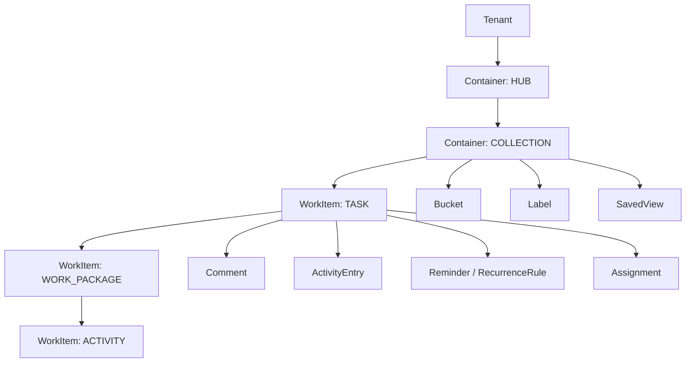
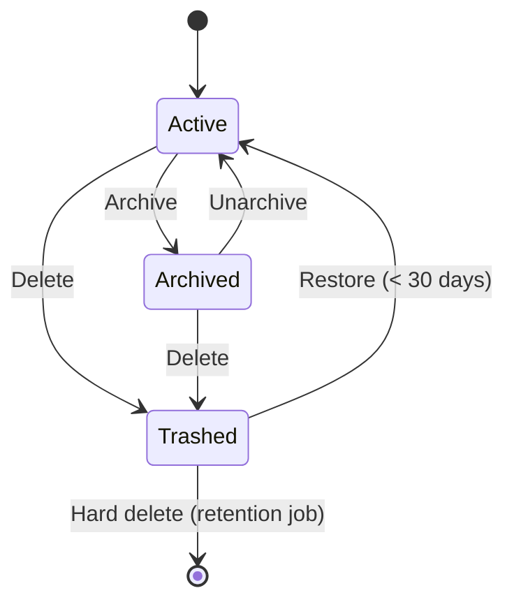

# Domain Model

Binding for `core/domain` and `core/application`: aggregates, invariants, roles, events and the
operation catalogue's rules. Complements [arc42.md](./arc42.md) §5 and §8.1.

---

## 1. The guiding idea: generalisation

One aggregate root `WorkItem` with an `ItemType` and a **capability profile** that defines per type
which capabilities are permitted ([ADR-0006](../adr/ADR-0006-generalized-workitem.md)). Containers
are modelled the same way: `Container` with a `ContainerType` (`HUB`, `COLLECTION`).

```mermaid
graph TD
  T[Tenant] --> C1[Container: HUB]
  C1 --> C2[Container: COLLECTION]
  C2 --> I1[WorkItem: TASK]
  I1 --> I2[WorkItem: WORK_PACKAGE]
  I2 --> I3[WorkItem: ACTIVITY]
  C2 --> B[Bucket]
  C2 --> L[Label]
  C2 --> V[SavedView]
  I1 --> CM[Comment]
  I1 --> A[ActivityEntry]
  I1 --> R[Reminder / RecurrenceRule]
  I1 --> AS[Assignment]
```

The consequence: one table, one repository, one set of use cases, one API resource (`/items`). A
new level or feature is configuration, not a new schema.

---

## 2. The capability matrix

`ItemCapabilityProfile` is a domain policy. System-defined profiles are defaults; a tenant may
narrow them, never widen them beyond the system boundary.

| Capability | TASK | WORK_PACKAGE | ACTIVITY | Note |
|---|:--:|:--:|:--:|:--:|
| `COMPLETION` (done/open) | ✔ | ✔ | ✔ | Mandatory for every type |
| `DUE_DATE` | ✔ | ✔ | ✔ | |
| `REMINDER` | ✔ | ✔ | ✔ | Predefined plus custom |
| `ASSIGNMENT` | ✔ | ✔ | ✔ | Activity: exactly one assignee |
| `MEMBERS` (several) | ✔ | ✔ | ✘ | |
| `BUCKET` | ✔ | ✘ | ✘ | Buckets apply to items directly under the collection |
| `NOTES` | ✔ | ✔ | ✘ | |
| `LABELS` | ✔ | ✔ | ✘ | |
| `COMMENTS` | ✔ | ✔ | ✘ | |
| `COVER` | ✔ | ✘ | ✘ | A colour or an image |
| `ATTACHMENTS` | ✔ | ✔ | ✘ | |
| `HISTORY` | ✔ | ✔ | ✔ | Compact history for activities |
| `RECURRENCE` | ✔ | ✘ | ✘ | A series applies to the whole subtree |
| `CUSTOM_FIELDS` | ✔ | ✔ | ✘ | |
| `CHILDREN` | `WORK_PACKAGE` | `ACTIVITY` | — | The permitted child types |
| `MAX_DEPTH` | 3 | 2 | 1 | Relative to the collection |

**The rule:** setting a field whose capability is not active for the type produces
`ErrCapabilityNotSupported` (HTTP 422, code `capability_not_supported`) — never silent ignoring. A
new type such as `MILESTONE` is a profile entry and its child types, no schema or API change.

---

## 3. Aggregates and entities

### 3.1 `Tenant` (context: Identity & Access)

| Field | Type | Rules |
|---|---|---|
| `id` | UUIDv7 | |
| `slug` | string(3..40) | Unique DNS label (lower-case letters, digits, hyphens; starts with a letter or digit). Set by the installation operator (`/admin/tenants`), refused by name in `PATCH /tenant`: it is the hostname in multi mode and the base of the registered OIDC redirect |
| `displayName` | string(1..200) | |
| `status` | `ACTIVE` \| `SUSPENDED` \| `PENDING_DELETION` | Changes only through use cases |
| `defaultLocale` | BCP-47 | e.g. `de-DE` |
| `defaultTimeZone` | IANA | e.g. `Europe/Berlin` |
| `settings` | JSONB | Retention, feature toggles, sign-in rule, automation quotas. A write merges the keys it models and leaves every other key alone |

In single mode exactly one tenant exists, created by `scripts/dev-workspace.sh --bootstrap` or the
admin API; the browser setup at first start is
[UC-INS-01](../usecases/admin/UC-INS-01-start-a-fresh-installation.md), not yet built.

### 3.2 `Account`, `Membership`, `Group`

`Account` = a person or a service account.

| Field | Type | Rules |
|---|---|---|
| `id`, `tenantId` | UUIDv7 | |
| `kind` | `USER` \| `SERVICE_ACCOUNT` | |
| `email` | string | Unique per tenant (for `USER`); absent on a managed account, which signs in with its `sign_in_name` ([ADR-0074](../adr/ADR-0074-managed-accounts.md)) |
| `externalSubject` | string? | The OIDC `sub`, for just-in-time provisioning |
| `locale`, `timeZone` | BCP-47 / IANA | Override the tenant default |
| `status` | `ACTIVE` \| `INVITED` \| `DISABLED` \| `RESTRICTED` \| `ANONYMIZED` | `RESTRICTED` is restriction of processing (Art. 18): the person still works, and no automatic decision or AI touches their data — not a lockout. `ANONYMIZED` ends an erasure that keeps authorship; such an account cannot act |

`Membership(accountId, scopeType, scopeId, role)` with `scopeType ∈ {TENANT, HUB, COLLECTION, ITEM}`.
The effective permission is the highest role along the path (inherited downwards). One exception: a
**private hub** is reached only through a membership on the hub or below it — roles higher up do not
flow into it, and the workspace owner reaches it only through the transparent emergency access of
[ADR-0073](../adr/ADR-0073-private-hubs.md). No group holds a role on a private hub or below it:
a group's members are the workspace administrators' to change ([identity.md](./identity.md) §22).
`Group(id, tenantId, name, members[])` is the target for assignment strategies and permissions.

Roles and rights (an extract):

| Role | Read | Write items | Structure (buckets/labels) | Members | Automation | Delete (container) | Read configuration | Read the trail |
|---|:--:|:--:|:--:|:--:|:--:|:--:|:--:|:--:|
| `OWNER` | ✔ | ✔ | ✔ | ✔ | ✔ | ✔ | ✔ | ✔ |
| `ADMIN` | ✔ | ✔ | ✔ | ✔ | ✔ | ✘ | ✔ | ✔ |
| `MEMBER` | ✔ | ✔ | ✘ | ✘ | Own rules | ✘ | ✘ | Own events |
| `CONTRIBUTOR` | ✔ | Assigned only | ✘ | ✘ | ✘ | ✘ | ✘ | Own events |
| `VIEWER` | ✔ | ✘ | ✘ | ✘ | ✘ | ✘ | ✘ | Own events |
| `GUEST` | Shared items only | Comment | ✘ | ✘ | ✘ | ✘ | ✘ | Own events |
| `AUDITOR` | ✘ | ✘ | ✘ | ✘ | ✘ | ✘ | ✔ | ✔ |

**Read configuration** (`READ_CONFIGURATION`) reads how the workspace is set up — backup targets
and runs, retention rules and previews, legal holds, automation rules and runs, webhook
subscriptions — never a secret. Every configuration read also accepts `STRUCTURE`. `AUDITOR` is not
a rung on the ladder: without `READ`, every use case over containers, entries and comments refuses
it ([audit.md](./audit.md) §5, §9).

The two qualifiers are decided in one place in the application layer
([ADR-0005](../adr/ADR-0005-authn-authz.md)), from the entry, the act and whose the entry is:

* **"Assigned only"** is measured against `assigneeId`. A contributor **may create**, and the entry is
  assigned to them; naming another assignee or invoking the auto-assign policy is refused. Creating
  needs a membership where the entry lands, and the parent scope is checked unchanged.
* **"Shared items only"** is where the membership was granted: one at `ITEM` scope reaches that entry
  and nothing else, so a share needs no mechanism of its own. Any role can be granted there; `GUEST`
  is the usual one.

An entry nothing on its path grants the actor anything on is **not found**, like a missing one
([security.md](./security.md) T-04); a creation is refused like any other write. **A list is
narrowed inside the statement** (the reachable shares bound as an array), never filtered after
reading, so a page is never short and a cursor never skips. `/meta/capabilities` reports the whole
matrix with both qualifiers.

### 3.3 `Container` (hub / collection)

| Field | Type | Rules |
|---|---|---|
| `id`, `tenantId` | UUIDv7 | |
| `type` | `HUB` \| `COLLECTION` | |
| `parentId` | UUIDv7? | `HUB` → `null`; `COLLECTION` → a `HUB` |
| `name` | string(1..200) | Unique per parent level (case-insensitive, Unicode NFC normalised) |
| `description` | text? | |
| `icon`, `color` | string? | |
| `orderKey` | string | A fractional index within the parent: a hub among the workspace's hubs, a collection among its hub's |
| `policies` | JSONB | `completionPolicy`, `defaultBucketId`, `capabilityOverrides`, `autoAssign` |
| `archivedAt`, `deletedAt` | timestamptz? | Lifecycle |
| `private` | bool | A `HUB` only; reached only through a membership on it or below it (§3.2) |
| `version` | int | Optimistic locking |

Invariants:
* I-C1: a `HUB` has no container parent; a `COLLECTION` has exactly one `HUB` as its parent.
* I-C2: deleting a container moves the entire subtree to the trash (a cascading soft delete with a shared `trashBatchId`, so that restoring is atomic).
* I-C3: an archived container is read-only; children inherit `effectiveArchived`.
* I-C4: `POST /containers/{id}:reorder` writes only the moved container's own `orderKey` — no neighbour is rewritten; an archived container refuses it.
* I-C5: only a `HUB` is `private`; a collection shares its hub's privacy (`containers.private_only_hubs`).

### 3.4 `WorkItem` (the aggregate root)

| Field | Type | Rules |
|---|---|---|
| `id`, `tenantId` | UUIDv7 | |
| `collectionId` | UUIDv7 | Denormalised for queries and RLS performance |
| `type` | `TASK` \| `WORK_PACKAGE` \| `ACTIVITY` | Extensible |
| `parentId` | UUIDv7? | `TASK` → `null` (the parent is the collection) |
| `path` | string | A materialised path (`/<taskId>/<wpId>/…`) for subtree queries |
| `depth` | int | Derived, ≤ the type's `MAX_DEPTH` |
| `title` | string(1..500) | Required, trimmed, non-empty |
| `notes` | text? | Markdown (not rendered server-side), capability-dependent |
| `completion` | `{isCompleted, completedAt, completedBy}` | |
| `bucketId` | UUIDv7? | `TASK` only; the bucket must belong to the collection |
| `orderKey` | string | Rank within the bucket or the parent item |
| `dueAt` | timestamptz? | Plus `dueDateOnly bool` (all day) and `dueTimeZone`, which exist only beside a `dueAt`; clearing the due date clears all three |
| `startAt` | timestamptz? | For the timeline view |
| `labels` | Set\<labelId\> | The collection's labels |
| `members` | Set\<accountId\> | Capability `MEMBERS` |
| `assigneeId` | accountId? | Capability `ASSIGNMENT` (for an activity, exactly this field) |
| `cover` | `{kind: COLOR\|IMAGE, colorToken?, mediaId?}` | Capability `COVER` |
| `customFields` | JSONB | Validated against `CustomFieldDefinition` |
| `recurrenceRuleId` | UUIDv7? | Capability `RECURRENCE` |
| `originJumbleEntryId` | UUIDv7? | Provenance |
| `archivedAt`, `deletedAt`, `trashBatchId` | | Lifecycle |
| `createdBy`, `createdAt`, `updatedAt`, `version` | | Audit + locking |

Invariants:
* I-W1: the `type` must be permitted under the `parent` by the capability profile (`Hierarchy.Validate`).
* I-W2: no cycles; `path` and `depth` stay consistent — changes go only through `Hierarchy.Move`, which updates the subtree in one transaction.
* I-W3: all references (bucket, label, assignee, member, media) live in the same tenant and — for buckets and labels — in the same collection.
* I-W4: a trashed or archived item is not editable except through `Restore`/`Unarchive`.
* I-W5: with `completionPolicy = ROLLUP`, a parent item is completed or reopened automatically when its children's completion changes (idempotent, event-driven).
* I-W6: carrying an item into another collection, by move or copy, keeps only references that resolve there; the rest is removed and reported in the result (`LABEL`, `BUCKET`, `MEMBER`, `ASSIGNEE`, `ATTACHMENT`, `CUSTOM_FIELD`, each with a stable message code), never silently. A move resolves labels and the board column; a copy also members, assignee and custom field values. An account is reported when it cannot see the destination, a reference the type's profile no longer carries by its kind.
* I-W7: `title` and text fields are Unicode NFC normalised; length limits count code points, not bytes.

The lifecycle state machine:

```mermaid
stateDiagram-v2
  [*] --> Active
  Active --> Archived: Archive
  Archived --> Active: Unarchive
  Active --> Trashed: Delete
  Archived --> Trashed: Delete
  Trashed --> Active: Restore (< 30 days)
  Trashed --> [*]: Hard delete (retention job)
```

### 3.5 Surrounding entities

| Entity | Key fields | Rules |
|---|---|---|
| `Bucket` | `collectionId`, `name`, `orderKey`, `wipLimit?`, `isDoneBucket` | The "list" of the requirements. `isDoneBucket` marks the column that means finished; it is stored and reported, and the server completes nothing because of it |
| `Label` | `collectionId`, `name`, `colorToken`, `description?` | The colour is required and is one of the ten label tokens (`LabelTokens.go`), never a colour value, so clients theme it ([ADR-0029](../adr/ADR-0029-design-system-tokens.md)) |
| `Comment` | `itemId`, `authorId`, `body`, `editedAt?`, `parentCommentId?` | Only the author or an admin may change it. Deletion erases the body and keeps identifier, author and timestamps, so the thread stays readable and no removed text is retained |
| `ActivityEntry` | `itemId`, `actor{type,id}`, `verb`, `changeSet` (JSONB), `occurredAt`, `causationId` | Append-only, the source of the history; `verb` is a message code (below) |
| `MediaObject` | `tenantId`, `storageKey`, `fileName?`, `mimeType`, `size`, `checksum?`, `usage`, `status` (`PENDING`\|`READY`) | Presigned upload, reference counting, deletion on hard delete. Nothing uses an object before the confirmation has read its bytes back and judged them ([security.md](./security.md) T-11) |
| `CustomFieldDefinition` | `scope(collection\|tenant)`, `key`, `kind` (`TEXT`,`NUMBER`,`DATE`,`SELECT`,`MULTI_SELECT`,`BOOL`,`USER`,`URL`), `options`, `required` | Extension without a migration. A value records the definition it was written under, and reads and filters answer only values whose definition still lives, so a key recreated after deletion starts empty |
| `Reminder` | `itemId`, `offsetSpec` (`REL:-PT1H` / `ABS:<ts>`), `channels[]`, `recipients[]`, `state` | Predefined (relative presets) and custom |
| `RecurrenceRule` | `rrule` (RFC 5545), `timeZone`, `mode` (`ON_SCHEDULE`\|`ON_COMPLETION`), `horizonDays`, `endSpec` | See [arc42.md](./arc42.md) §6.3 |
| `Template` | `scope`, `name`, `rootType`, `nodes[]` (titles, notes, a relative due date as an ISO-8601 duration such as `P3D`, a fixed `assigneeId` per node) | Instantiation produces an item tree. The tree is validated against the capability profiles when defined, not when instantiated, and holds at most `max_template_nodes` nodes |
| `SavedView` | `scope`, `name`, `layout` (`LIST_COLLAPSED`,`LIST_EXPANDED`,`KANBAN`,`TIMELINE`), `query`, `grouping`, `visibleFields`, `sharing` | `layout` is a hint; the server does not interpret it |
| `JumbleEntry` | `tenantId`, `channel` (`EMAIL`,`WEBHOOK`,`QUICK_CAPTURE`,`API`), `rawSubject`, `rawBody`, `attachments[]`, `sender`, `status` (`NEW`,`PROCESSED`,`DISMISSED`), `suggestion` (JSONB) | Conversion produces a `WorkItem` and sets `PROCESSED` |
| `AutoAssignPolicy` | `scope`, `strategy`, `candidates[]` (accounts/groups), `state` (for round robin), `enabled` | See §3.6 |
| `AutomationRule` | See [automation.md](./automation.md) | |
| `WebhookSubscription` | `tenantId`, `targetUrl`, `eventTypes[]`, `secret`, `state`, `failureCount` | HMAC-SHA256 signature, auto-disable after sustained failure |
| `CalendarFeed` | `tenantId`, `accountId` (the owner), `viewId`, `tokenHash`, `revokedAt` | The token is answered once; revocation is a stamp; a deleted view leaves the feed serving nothing. Storage and reading: [security.md](./security.md) T-21 |

**The `ActivityEntry` verbs.** The verb is a message code, rendered under the `activity` namespace
(`item.completed` stored, `activity.item_completed` rendered — [i18n-l10n.md](./i18n-l10n.md) §1).
The closed vocabulary, with each verb's change set and the event it publishes, is
`core/domain/model/activity/Entry.go`: one verb per lifecycle act and edit, one per direction for
each set beside the entry.

Rules of the history:

* **Every mutating work-management use case writes an `ActivityEntry`, or is on the exemption list
  of `test/architecture/activity_test.go` with a reason** the descriptor also names. Two use cases
  never share a verb.
* The `changeSet` keeps the field names, and values only where the product needs them: a rename
  carries both titles, a note `changed: true` and none of its text. Where `HISTORY` is compact (an
  activity, §2), the change set is empty.
* A container has no `ActivityEntry` (it is keyed on `itemId`, read only by
  `/items/{id}/activity`); what a hub or a collection changed is in the audit trail and the change
  log.

### 3.6 Automatic assignment

| Strategy | Behaviour | Determinism in tests |
|---|---|---|
| `FIXED` | Always the same account. A fixed group is `RANDOM_GROUP_MEMBER` with a single group, because an assignee is an account | Trivial |
| `RANDOM_MEMBER` | Uniformly from the candidate accounts | Injectable through the `RandomSource` port |
| `RANDOM_GROUP_MEMBER` | A random group, then a random member of it — a small team and a large one carry the same share | Likewise |
| `ROUND_ROBIN` | Walks the candidate list in order, its position persisted per policy. The cursor indexes the configured list, so a candidate skipped while ineligible loses one turn, not their place | The state is explicitly visible |
| `LEAST_LOADED` | The candidate with the fewest open entries | A pure function over counts |

An enabled policy applies to everything created in its collection; a disabled one only when a create
asks for `auto_assign`. Removing a policy deletes it. A new strategy implements `AssignmentStrategy`
(`core/domain/service`) without changing `WorkItem`.

---

## 4. Domain events

Named `de.hubtask.<context>.<entity>.<action>.v1`, every event carries `tenantId`,
`actor{type,id}`, `occurredAt`, `correlationId`, `causationId`, `causationDepth` and a business
payload. Events are a public contract (webhooks, automation, n8n, Zapier): JSON schemas under
`api/events/`, the closed list in `core/domain/event/EventType.go`.

Delivery ([ADR-0007](../adr/ADR-0007-events-outbox-cloudevents.md)):

* An event is written to the outbox **in the same transaction** as the change it describes.
* The dispatcher delivers at least once, as CloudEvents 1.0 structured; every consumer is
  idempotent on the event id.
* A change a restore wrote carries the extension attribute `replay`, present only when true; a
  subscriber receives a replay only if it asked for one ([backup-restore.md](./backup-restore.md) §8.4).

The names below omit `de.hubtask.<context>.` and `.v1`; the context is `work` unless the row says
otherwise.

| Event | Payload (core) | Consumers |
|---|---|---|
| `container.created` / `.renamed` / `.policies_updated` / `.moved` / `.archived` / `.unarchived` / `.deleted` / `.restored` | A container snapshot, `effectiveArchived` included; `.renamed` and `.policies_updated` add a `changeSet`, `.moved` the hub it came from | Automation, webhooks, search |
| `item.created` | An item snapshot, `parentRef` | Automation, search, the change stream |
| `item.updated` | `changeSet` (old/new per field) | Automation (field change triggers), history |
| `item.completed` / `item.reopened` | `completedBy`, `completedAt` | Automation, roll-up, `ON_COMPLETION` recurrence |
| `item.moved` | `fromParent`, `toParent`, `fromBucket`, `toBucket`, `orderKey` | Kanban automation |
| `item.assigned` / `item.unassigned` | `assigneeId`, `strategy?` | Notification |
| `item.member_added` / `.member_removed` | `accountId` | Notification |
| `item.label_added` / `.label_removed` | `labelId` | Automation |
| `item.due_changed` | `oldDueAt`, `newDueAt`, `timeZone` | Scheduler, calendar feed |
| `item.due_soon` / `item.overdue` | `dueAt`, `thresholdSpec` | Reminders, automation |
| `item.archived` / `.unarchived` / `.trashed` / `.restored` / `.purged` | Lifecycle | Cleanup, media reconciliation |
| `bucket.created` / `.updated` / `.reordered` / `.deleted` | A bucket snapshot; `.updated` and `.reordered` add a `changeSet`, `.deleted` says where its items went | Kanban clients, automation, search |
| `label.created` / `.updated` / `.deleted` | A label snapshot; `.updated` adds a `changeSet` | Automation, search |
| `comment.created` / `.updated` / `.deleted` | The comment | Notification, automation |
| `attachment.added` / `.removed` | A media reference | Media reconciliation |
| `recurrence.occurrence_created` | `sourceItemId`, `newItemId`, `occurrenceAt` | History |
| `template.instantiated` | `templateId`, `rootItemId` | History |
| `entry.received` / `.converted` (context `jumble`) | The entry, the target item | Automation, AI suggestions |
| `rule_run.started` / `.finished` / `.failed` (context `automation`) | Run details | Monitoring, UI |

Rules:

* **Separate names for different acts.** `container.unarchived` is not `.restored` (which belongs to
  the trash), `item.reopened` not `item.completed`, `bucket.reordered` not `bucket.updated`; a rule
  written for one must not fire on the other.
* `item.label_added` and `item.label_removed` carry a reference, not a snapshot: a label set merges
  as an OR-set ([offline-sync.md](./offline-sync.md) §4.2), so a snapshot could carry a set another
  device has already merged differently.
* **An entry created already assigned publishes `item.created`, then `item.assigned`**, because
  notifications subscribe to the latter.
* **`item.overdue` is announced once per due date**, never for a completed, trashed or archived
  entry; `item.due_soon` uses one fixed lead, carried in `thresholdSpec`, so it means the same to
  every rule.
* Tenant lifecycle and membership changes are not events; they are in the audit trail
  ([audit.md](./audit.md)).

**Compatibility rules:** fields may only be added; removing or reinterpreting one requires a `.v2`
alongside continued delivery of `.v1` for at least two minor releases.

---

## 5. Use case catalogue (application layer)

The entries here are **operations**; a **use case** in [`docs/usecases/`](../usecases/README.md) is
the person-level requirement above them, served by one or more operations.

**The list is the code**: every operation is registered once in
[`core/application/catalogue/Catalogue.go`](../../core/application/catalogue/Catalogue.go), and
[`docs/audit/event-matrix.md`](../audit/event-matrix.md) is generated from it. This section holds
the rules the list cannot say.

**The three channels.** Every catalogued operation is a `Command`/`Query` struct plus a handler with
a `Descriptor()`, reachable as a REST operation, an MCP tool and an automation action
([arc42.md](./arc42.md) §4). Its PascalCase name is stable; the operation id, the MCP tool and the
automation action derive from it, and the parity gate compares them.

**What is deliberately not in the catalogue.** The catalogue is what a person, an agent or a rule
may ask for. A duty nobody should ask for runs as a job, influenced through its configuration or its
own record, never by a call.

| Not catalogued | Why, and what stands in |
|---|---|
| `ReconcileMedia`, `FireReminders`, `MaterializeOccurrences`, retention runs, notification recording | "Delete every unreferenced file now" is not a button; the reminder, the series and the retention rule are what a person changes |
| `ReadCalendarFeed`, `MediaContent` | They answer a credential in the URL that nobody in this system holds, so there is nothing for MCP or a rule to call |
| The synchronisation protocol (`GET /stream`, `POST /sync:pull`, `:snapshot`, `:push`) | Not requests anybody makes. A push *applies* every mutation as an ordinary catalogued use case performed as the pushing person, so it grants nothing. `ListSyncDevices` and `ForgetSyncDevice` are catalogued; forgetting revokes the device's last sign-in |

**Who may call what.** The permission each operation asks for is on its descriptor. Where the
choice is not the obvious one:

| Area | Rule |
|---|---|
| Media | The upload is three steps — ask where, put the bytes there, confirm — because the server does not carry the bytes ([arc42.md](./arc42.md) §8.4); only the confirmation makes the object usable (§3.5) |
| Scheduling | `SetRecurrence` sets and changes a series in one `PUT`; the audit entry and the history verb say which happened. `GetRecurrence` reads it back |
| Templates | Defining, changing and deleting ask for `STRUCTURE` at the template's scope; instantiating only for `WRITE_ITEMS` in the target collection |
| Views & query | `QueryItems` is the query DSL. A saved query is validated against the query catalogue when written, and a shared view always runs under the **reader's** authorisation, never its owner's |
| Jumble | Submitting, converting and dismissing ask for `WRITE_ITEMS` at the tenant, reading for `READ` — an entry sits in no collection yet; the converted item goes through `CreateWorkItem`, which checks the destination. Rotating the intake address asks for `AUTOMATION`; the address is shown once. `SuggestFromJumbleEntry` asks for `WRITE_ITEMS` (it spends budget and sends content out) and is refused before queueing without provider or consent |
| Lifecycle | Writing a retention rule asks for `DELETE_CONTAINER` (a standing instruction to destroy work), as does placing a legal hold, which overrides retention, an emptied trash and an erasure ([data-protection.md](./data-protection.md) §4.1); reading and previewing either asks for `STRUCTURE`. `:retain` is a write on the entry, narrowed like any other |
| Privacy & compliance | Data subject requests: [data-protection.md](./data-protection.md) §4 (an `INSTALLATION` case is the one operation that legitimately crosses the tenant boundary). `ExtendDataSubjectRequest` asks for `MANAGE_MEMBERS`, and `admin:tenants` for an `INSTALLATION` case; it is not destructive, so an agent extends without `agent:destructive`, which the update - it can start an erasure - demands. `PreviewErasure` reads what the legal holds in force would keep of an erasure under the list's right (`MANAGE_MEMBERS`, `privacy:read`), and `admin:tenants` for an `INSTALLATION` case; it never carries a hold's reason. `RestrictProcessing` asks for `MANAGE_MEMBERS`; Lifting a restriction is refused while a legal hold keeps the account from an erasure. `WithdrawConsent` is self-service for one's own consent, `MANAGE_MEMBERS` for somebody else's |
| Integration | Creating, listing and revoking a calendar feed ask only for the view's read permission: a feed grants exactly what its owner may already read, and revoking is never harder than minting |
| Identity & tenancy | `ReadEncryptionStatus` and `ResealSecrets` are the control plane's, behind `admin:tenants` ([security.md](./security.md) §8.1). `GetOwnAccount` checks only the token scope — the actor is the identifier, a service account included. **`GetAccount` is open to any member** and answers `AccountSummary` (id, kind, display name, status), a separate schema, never `Account` with fields cleared; another tenant's identifier fails to resolve, an erased account answers `status: ANONYMIZED`. `ListMemberships` answers what is granted **at** one scope, asking for `READ` there; a scope the caller holds nothing on is not found (T-04), except the workspace, refused and audited. `ListGroups` and `GetGroup` are open to any member (`members:read`). Notification preferences: one row per category and channel, the default filled in and marked; a write sets `enabled` and `include_title` together, audited with the previous value; one's own needs only the token scope, somebody else's `MANAGE_MEMBERS`; the invitation category is never off |
| Suggestions (AI, optional) | Reading asks for `READ`, answering for `WRITE_ITEMS` at the target's scope. **Accepting performs the ordinary use case as the accepting person** — a suggestion grants nothing; one whose input fingerprint no longer matches its target is refused with `suggestions.stale`. Dismissing is a state, never a deletion (the record ages out as `AI_SUGGESTION`). Producing one is a job. `SuggestDuplicates` asks no provider, answers synchronously and asks for `WRITE_ITEMS`; `AiTranslate` asks for the entry's `READ`. What each kind's acceptance performs: [ai-first.md](./ai-first.md) §2 |
| Search | `SearchItems` is full text and, where pgvector and a provider exist, semantic — one ranked page, the words winning over the meaning ([ADR-0050](../adr/ADR-0050-pgvector-as-a-capability.md)). `ReindexSearch` asks for `STRUCTURE` at the workspace, queues the rewrite of exactly the entries indexed under a replaced text search configuration, and answers the count |
| Backup | Creating a target asks for `DELETE_CONTAINER`: a target is a channel the data leaves by. Listing targets, what is at one, and restores asks for `STRUCTURE`. The connection test writes, reads back and deletes, and answers a result rather than an error. Restore modes: [backup-restore.md](./backup-restore.md) §8.2 |
| Jobs | `GetJob` asks for `READ`, `CancelJob` for `STRUCTURE`, both at the tenant (a job belongs to no container). A job answers its status, its progress where computable, a result reference and the last failure's code — never the payload, attempts, lease or deduplication key |
| Automation | [automation.md](./automation.md) §2.1 |
| Private hubs | `CreateContainer` with `private: true` asks no `STRUCTURE`: any person holding a role anywhere in the workspace makes one and owns it. `SetHubPrivacy` (`PUT /containers/{id}/privacy`) marks with `STRUCTURE` on the workspace and `OWNER` on the hub itself, unmarks with that `OWNER` alone. `ListPrivateHubs` asks for `MANAGE_MEMBERS` and names no hub ([identity.md](./identity.md) §22) |

---

## 6. Persistence sketch

The complete DDL, indices included: [`../../db/schema.sql`](../../db/schema.sql). The principles:

* Every business table begins with `tenant_id uuid NOT NULL` and carries an RLS policy
  ([multi-tenancy.md](./multi-tenancy.md)).
* Composite indices, led by `tenant_id`, match the views' query patterns; partial indices serve
  "not deleted / not archived", the most common filter.
* Set relations (labels, members) as join tables, not JSON arrays — filterability takes precedence.
* `custom_fields` as `jsonb` with a GIN index; validation happens in the domain code.
* Full text: a `tsvector` column with a language-dependent configuration per item, maintained by a
  trigger — a generated column cannot choose its configuration
  ([ADR-0034](../adr/ADR-0034-language-dependent-search.md)) — plus a trigram index for scripts
  without word boundaries.
* Trash and archive as timestamps, not separate tables (restoring without moving data).
