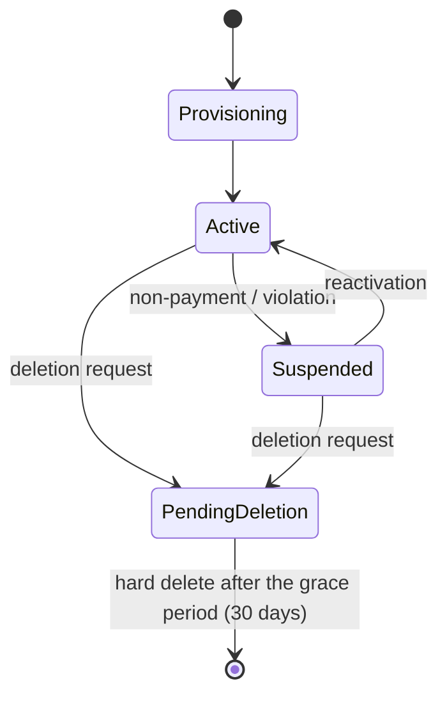

# Multi-Tenancy

The goal: the same codebase runs (a) the private installation with a single user and (b) a platform
on which a service provider serves thousands of end customers — comparable to Atlassian/Trello.

---

## 1. Modes of operation

| Mode | `HUBTASK_TENANCY_MODE` | Behaviour |
|---|---|---|
| Single | `single` (default) | Exactly one tenant is created on first startup; no tenant selection in the API; registration optionally open |
| Multi | `multi` | Tenants are provisioned through the control/admin API; resolved by subdomain, header, or token claim; self-service signup optional |

The code **always** knows about a tenant; "single" is merely the special case with one row in
`tenant`. That means there is no second code path and no special cases in repositories.

---

## 2. Isolation strategy

**Chosen: shared database / shared schema + `tenant_id` + PostgreSQL row level security.**

| Criterion | Shared schema + RLS (chosen) | Schema per tenant | Database per tenant |
|---|---|---|---|
| Operating effort at 10,000 tenants | Low | High (migrations × n) | Very high |
| Migrations | Once | n times | n times |
| Isolation strength | Strong (database-enforced) | Stronger | Strongest |
| Resources per tenant | Minimal | Medium | High |
| Noisy neighbour | Needs quotas | Partly | Solved |
| Suitability for self-hosting | Perfect (one schema) | Overhead | Overhead |

For tenants with special requirements (data residency, enterprise isolation) the growth path is
**shard routing**: a control plane database holds `tenant → shard`, and the application picks the
matching connection pool. The data model stays identical, because it is `tenant_id`-based anyway.

### 2.1 RLS implementation

```sql
ALTER TABLE work_item ENABLE ROW LEVEL SECURITY;
ALTER TABLE work_item FORCE ROW LEVEL SECURITY;

CREATE POLICY tenant_isolation ON work_item
  USING (tenant_id = current_setting('app.tenant_id', true)::uuid)
  WITH CHECK (tenant_id = current_setting('app.tenant_id', true)::uuid);
```

* The application connects with the role `hubtask_app` — **without** `BYPASSRLS`, and **not** as the table owner.
* Migrations run with the separate role `hubtask_migrator`.
* Exactly one place in the code sets the context: the transaction middleware in
  `infrastructure/postgres/Tenant.go` runs `SET LOCAL app.tenant_id = $1` and
  `SET LOCAL app.actor_id = $2` before every transaction.
  `SET LOCAL` is bound to the transaction and therefore pool-safe (no leak through `pgbouncer` in
  transaction pooling mode).
* Without a context set, every query returns zero rows — a programming error leads to "nothing
  found", not to another tenant's data.
* Some rows belong to no tenant: the system-defined capability profiles, which every tenant may
  read and none may write. They are reached through an **installation scope** — a unit of work
  that sets `app.tenant_id` to the empty value rather than skipping the call, so
  `current_tenant_id()` is `NULL`, every policy comparing against it is false, and no tenant's
  rows are visible at all. It is the strictest position inside the boundary rather than a way
  around it, and it is read-only by construction: every `WITH CHECK` would compare against a
  tenant it deliberately does not have. `GET /meta/capabilities` uses it to answer an
  unauthenticated caller.
* System jobs (retention, outbox dispatch) loop per tenant rather than running globally. The outbox
  dispatcher is therefore one job per tenant, woken by the same transaction that wrote the event
  and rescheduled by each round rather than completed ([ADR-0007](../adr/ADR-0007-events-outbox-cloudevents.md),
  `infrastructure/eventbus/OutboxBus.go`). The queue itself is the one table without a policy — a
  worker has to be able to claim a job before it can know whose it is — and the job names its
  tenant, so the transaction that runs it is as bounded as a request.

### 2.2 Defence in depth

1. Authentication supplies the `tenant_id` (token claim or session), never the request body.
2. `ActorContext` carries tenant and actor, typed, through the application layer.
3. The permission check happens in the application layer (roles/scopes).
4. RLS is the last, unbypassable boundary.
5. Negative tests in CI: for every repository there is a test that expects empty results or errors under the wrong tenant context.

---

## 3. Tenant resolution

| Source | Priority | Example |
|---|---|---|
| Token claim / PAT binding | 1 | Service accounts are always bound to one tenant |
| Subdomain | 2 | `acme.hubtask.example.com` |
| Header `X-Hubtask-Tenant` | 3 | Internal tools, admin API |
| Path prefix | — | Deliberately not used (it pollutes the API) |

Contradictions between the token and the subdomain/header → `403 tenant_mismatch`.

---

## 4. Quotas, fairness, limits

Configurable per tenant (`tenant.settings`), enforced in the application layer and middleware:

| Limit | Default (multi) | Default (single/self-hosted) |
|---|---|---|
| API requests/min per token | 600 | 6,000 |
| Items per tenant | Plan-bound | Unlimited |
| Media storage | Plan-bound | Disk space |
| Automation runs/hour | 1,000 | 100,000 |
| Webhook targets | 50 | Unlimited |
| Bulk operations per request | 500 | 500 |
| Automation causality depth | 5 | 5 |
| Concurrent export jobs | 2 | 5 |

Further fairness mechanisms: a weighted job queue (one tenant cannot monopolise the workers), query
timeouts (`statement_timeout` per role), and cost estimation for query DSL requests with rejection
of obviously unaffordable queries.

---

## 5. The lifecycle of a tenant



| Phase | Actions |
|---|---|
| Provisioning | Tenant, default hub, example collection, owner membership, locale/time zone, standard buckets/labels; idempotent through `Idempotency-Key` |
| Active | Normal operation, metering (only if enabled) |
| Suspended | The API responds `403 tenant_suspended`; data remains; read export still possible |
| PendingDeletion | Access blocked, an export provided, automations disabled |
| Hard delete | Cascades across every storage location: database rows, media in object storage, search index, outbox/events, job queue; evidence in the audit log; backup retention documented |

**Export:** `POST /admin/tenants/{id}:export` produces a complete, documented JSON Lines archive
(plus media) — the basis for GDPR access requests, provider migration, and building trust
("no lock-in").

---

## 6. Data protection

| Requirement | Implementation |
|---|---|
| Access (Art. 15) | A personal data export per account |
| Erasure (Art. 17) | Account anonymisation (authorship remains as "former user") or full deletion including comments, depending on configuration |
| Data residency | Shard/region per tenant; media in the regional bucket |
| Processing on behalf | A data catalogue with fields, purposes, and retention in the repository ([`docs/privacy/data-catalog.md`](../privacy/data-catalog.md)) |
| Encryption | TLS in transit; encryption at rest by the infrastructure; integration secrets additionally at the application level (AES-GCM) |
| Logs | No item or comment content in logs; IDs only |

---

## 7. Consequences for scaling

* All processes are stateless → any number of `api` replicas.
* Reads can be directed to read replicas (the `persistence` port allows `ReadOnly` transactions; beware replication lag → always use the primary after a write within the same request).
* Partitioning of large tables (`activity_entry`, `outbox_event`, `rule_run`) by time; and if needed
  `work_item` by `tenant_id` hash — prepared for by the `tenant_id` index prefix.
* The `scheduler` stays single-leader; the work itself is distributed as jobs.
