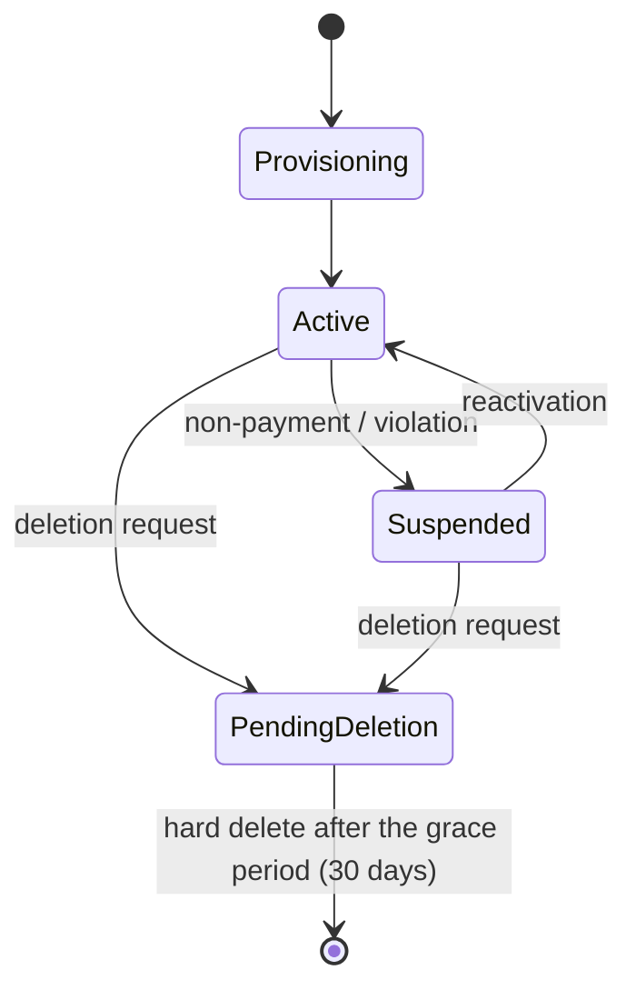

# Multi-Tenancy

One codebase runs both a private installation with a single user and a platform on which a provider
serves thousands of workspaces. Decision: [ADR-0010](../adr/ADR-0010-multi-tenancy.md).

---

## 1. Modes of operation

| Mode | `HUBTASK_TENANCY_MODE` | Behaviour |
|---|---|---|
| Single | `single` (default) | Exactly one tenant, created by `scripts/dev-workspace.sh --bootstrap` or the admin API. A first-start setup in the web app ([UC-INS-01](../usecases/admin/UC-INS-01-start-a-fresh-installation.md)) is planned and not built. No tenant selection in the API; registration optionally open |
| Multi | `multi` | Tenants are provisioned through the control plane (§4.1); resolved as §3 says; self-service signup optional |

The code **always** knows about a tenant; single mode is one row in `tenant`. There is no second
code path and no special case in a repository.

---

## 2. Isolation strategy

**Shared database, shared schema, `tenant_id` on every business table, PostgreSQL row level
security as the boundary** — one migration for all tenants, minimal resources per tenant; noisy
neighbours need quotas (§4).

The growth path for special requirements (data residency, enterprise isolation) is **shard
routing**: a control plane database holds `tenant → shard`, the application picks the matching
pool, the data model stays identical. Not built.

### 2.1 RLS implementation

```sql
ALTER TABLE work_item ENABLE ROW LEVEL SECURITY;
ALTER TABLE work_item FORCE ROW LEVEL SECURITY;

CREATE POLICY tenant_isolation ON work_item
  USING (tenant_id = current_setting('app.tenant_id', true)::uuid)
  WITH CHECK (tenant_id = current_setting('app.tenant_id', true)::uuid);
```

**Roles and context**

* The application connects as `hubtask_app`: **no** `BYPASSRLS`, and **not** the table owner.
* Migrations run as `hubtask_migrator`, which **owns** the objects; `0001`'s default privileges
  name that role, so migrations under another owner would grant the application nothing.
* Exactly one place sets the context: the transaction wrapper in `infrastructure/postgres/Tenant.go`
  runs `SET LOCAL app.tenant_id = $1` and `SET LOCAL app.actor_id = $2` before every transaction —
  bound to the transaction, so safe under `pgbouncer` transaction pooling.
* A nested unit of work may not switch tenant (`postgres.tenant_switch_in_transaction`); a helper
  that may run inside somebody else's transaction reads in the ambient scope.
* Without a context, every query returns zero rows — "nothing found", never another tenant's data.
* **Installation scope.** Rows that belong to no tenant (the system capability profiles) are read
  with `app.tenant_id` set empty: `current_tenant_id()` is `NULL`, every tenant policy is false,
  and every `WITH CHECK` fails, so it is read-only by construction. `GET /meta/capabilities` uses it
  for an unauthenticated caller.

**Every table carries RLS with `FORCE`, with these exceptions.** The list is kept in three places
that must agree: `rlsExceptions` in `test/integration/tenant_boundary_test.go`, the restore drill's
copy in `cmd/restore-drill/checks.go`, and this table. A new exception is entered in all three.

| Table | Why it has no tenant policy | What bounds it instead |
|---|---|---|
| `job` | A worker must claim a job before it knows whose it is | The job names its tenant; the transaction that runs it is as bounded as a request |
| `goose_db_version` | The migration ledger | No grant to the application role |
| `instance_event` | The installation's own journal; its rows outlive the tenants they name ([audit.md](./audit.md) §6) | Append-only grants; written only by the tenant lifecycle use cases; no API reads it |
| `item_capability_profile` | Has RLS but **no `FORCE`**: the system rows are the owner's to seed, and `FORCE` would bind the owner too ([ADR-0052](../adr/ADR-0052-managed-postgresql-support.md)) | The policy binds every non-owner role in full, `hubtask_app` included |
| `restore_drill_marker` | The restore drill's marker rows; no tenant column | No grant to the application role |
| `operator` | The operator register names accounts across workspaces | No grant to the application role; reachable only through four `SECURITY DEFINER` functions |
| `instance_setting` | Installation configuration every workspace reads (§4.1) | Holds configuration, never personal data; written by one control-plane use case |

**Doors through the boundary.** A `SECURITY DEFINER` function is the only way the application role
reads across tenants. Each is narrow by construction and granted to `hubtask_app` alone:

| Function | Answers | Used by |
|---|---|---|
| `resolve_tenant(slug)` | One tenant identifier or none — never a list | Sign-in before a credential exists (§3) |
| `admin_tenants()` | The list of tenants | The control plane behind `admin:tenants` (§4.1) |
| `instance_census()` | Five counts, no rows | The instance overview |
| `subject_tenants(email)` | The tenants one data subject has an account in | An installation-wide data subject request ([data-protection.md](./data-protection.md) §4) |
| `is_operator`, `operator_register`, `add_operator`, `drop_operator` | The operator register | The control plane (§4.1) |
| `purge_tenant_trail(tenant)` | Deletes one tenant's audit trail | The hard delete only ([audit.md](./audit.md) §3) |

**Nothing enumerates tenants.** No job, scheduler or worker lists the tenants. Every per-tenant duty
(outbox dispatch, retention, reminders, recurrence, backup and automation schedules, media
reconciliation, privacy deadlines, audit anchoring, reindex, embeddings, the hard-delete grace) is
**seeded by the write that creates its work**, in that tenant's transaction, with the tenant as the
dedupe key; each round reschedules itself while work remains (`queue.Result{Repeat: true}`). The
one listing is `admin_tenants()`, an operator's read, not a job. A duty that belongs to no tenant
(an instance-wide backup schedule, partition maintenance) is the leader's, under the installation
scope.

**Partitions.** A partition addressed directly does not inherit its parent's policy, so every
partition — and the `SECURITY DEFINER` function that creates one (`ensure_audit_partition`,
`ensure_stream_partition`) — carries its own policy, its own `FORCE` and its own revoked grants.

### 2.1.1 A database the operator brings

An installation may use a PostgreSQL it did not create (`database.enabled` off; the DSN from a
Secret), and the migrations run there too
([ADR-0052](../adr/ADR-0052-managed-postgresql-support.md); [support-matrix.md](./support-matrix.md)
§3). Such a service gives no superuser, so before the first migration the operator:

1. **Creates the two roles** with the service's admin account (`0001` reports a refused
   `CREATE ROLE` rather than failing). `hubtask_app` gets the password the application's DSN
   carries.
2. **Makes `hubtask_migrator` the database owner** — not the admin account: the grants in `0001`
   name that role, and default privileges for a role that owns nothing apply to nothing.

```sql
CREATE ROLE hubtask_migrator LOGIN PASSWORD '…';
CREATE ROLE hubtask_app      LOGIN PASSWORD '…';
CREATE DATABASE hubtask OWNER hubtask_migrator;
```

`HUBTASK_DB_DSN` connects as `hubtask_app`, the migration's DSN as `hubtask_migrator`; nothing needs
`SUPERUSER` or `BYPASSRLS`. The integration suite migrates under exactly this arrangement.

### 2.1.2 References carry the tenant

Row level security does not check a foreign key — PostgreSQL validates a reference with the owner's
rights, so a single-column key would let a row in tenant A point at a row in tenant B
([ADR-0024](../adr/ADR-0024-tenant-scoped-foreign-keys.md)).

* **A foreign key between two tables whose `tenant_id` is `NOT NULL` is composite** over
  `(tenant_id, id)`. The referenced table carries `UNIQUE (tenant_id, id)`; its primary key stays
  `id`.
* `MATCH SIMPLE` (the default), so a `NULL` reference is not checked.
* `ON DELETE SET NULL` names its column — `ON DELETE SET NULL (column)` — or it would null
  `tenant_id` when it fires. This is why PostgreSQL 15 is the hard floor.
* A gate walks `pg_constraint` and fails the build on a single-column foreign key between two such
  tables, delete rule included.
* **Exception: the backup family**, where `tenant_id IS NULL` means installation-wide. A composite
  key is wrong there, not weaker; those references stay single-column.

### 2.2 Defence in depth

1. Authentication supplies the `tenant_id` (token claim or session), never the request body.
2. `ActorContext` carries tenant and actor, typed, through the application layer.
3. The permission check happens in the application layer (roles and scopes).
4. RLS is the last, unbypassable boundary.
5. Negative tests in CI: every repository method has a test that expects empty results or an error
   under the wrong tenant context (gate SG-3).

---

## 3. Tenant resolution

**Accounts are per tenant** (`account_email_uq` is `(tenant_id, lower(email))`), so a sign-in
resolves its tenant **before any credential is checked**.

**Signing in (no credential yet)** — `SessionWriter.resolveTenant`:

| Mode | Source, in order | Nothing resolves |
|---|---|---|
| Single | The one row (`resolve_tenant(NULL)`); the subdomain is ignored | — |
| Multi | 1. The subdomain under the base host (`resolve_tenant(slug)`) · 2. the `X-Hubtask-Tenant` header (a workspace identifier) | `404 auth.tenant_unresolved` |

**An authenticated request** — the credential binds the tenant: a session's or token's claim, a
personal access token's or service account's account.

In both cases the weaker sources **may confirm the tenant and never overrule it**. A header (or, on
an authenticated request, a subdomain) that names another tenant is refused with
`403 access.tenant_mismatch`. On an authenticated request the header may carry the identifier or
the slug. A path prefix is deliberately not used.

---

## 4. Quotas, fairness, limits

Configured per tenant in `tenant.settings.quotas`, written by the operator through
`PATCH /admin/tenants/{id}/quotas`, read by the workspace through `GET /quotas`, enforced in the
application layer and middleware. A capacity quota refuses as `422 capacity.<quota>` naming the
ceiling; the rate as `429` with `Retry-After`. The approach to a ceiling is alert A-18.

| Limit | Default (multi) | Default (single/self-hosted) |
|---|---|---|
| API requests/min per token | 600 | 6,000 |
| Items per tenant | Plan-bound | Unlimited |
| Media storage | Plan-bound | Disk space |
| Automation runs/hour | 1,000 | 100,000 |
| Webhook targets | 50 | Unlimited |
| Bulk operations per request | 500 | 500 |
| Automation causality depth | 5 | 5 |
| Concurrent export jobs | 2 | 5 |
| AI tokens per day | 200,000 | Unlimited |

**The AI budget** is counted in provider-reported tokens over a UTC calendar day, from the billing
ledger. A workspace over it **stops getting suggestions and keeps working** (`ai.unavailable`).
`ai_tokens_per_day` limits the models the installation **offers**; a workspace's own model only by
its optional `ai_own_tokens_per_day`, off by default
([ADR-0072](../adr/ADR-0072-ai-at-the-installation-level.md) §4).

**Fairness:** the job queue claims per tenant round-robin, so one tenant cannot monopolise the
workers; `statement_timeout` per role; a query DSL request whose estimated cost is over the cap is
refused before it runs.

---

## 4.1 The instance layer

The plane above the workspaces: it provisions them and sets values that apply to all of them
([ADR-0070](../adr/ADR-0070-the-instance-layer.md)).

**The control plane's credential.** Everything under `/admin/tenants` needs the `admin:tenants`
scope. No session carries it, except that a **registered operator** may raise their own session to
it for one hour with a step-up (`instance.session_elevated`, in the trail and `instance_event`).
Automation uses a personal access token minted for the purpose.

**Who an operator is.** A register (`operator`), checked when `admin:tenants` is minted and when it
is exercised. An empty register counts only for an active `OWNER` on an installation with exactly
one workspace ([identity.md](./identity.md) §19). A service account may be an operator.

**What an instance setting is.** A row in `instance_setting` with a value **and a lock**. Open, a
workspace may tighten it; closed, it applies and the workspace's control is shown switched off with
the reason and who set it — never hidden. The effective value is resolved on read along
`product minimum → instance → plan → workspace`, so a change applies at once.

**How it is reached.** One API with three doors: a file (`seed` or `enforce`), `hubctl admin`, and
the web app's `/instance` area.

**What it never shows** is a workspace's contents: counts, states and limits (`instance_census()`),
never rows — the boundary is a database policy, not a role.

---

## 5. The lifecycle of a tenant


```mermaid
stateDiagram-v2
  [*] --> Provisioning
  Provisioning --> Active
  Active --> Suspended: non-payment / violation
  Suspended --> Active: reactivation
  Active --> PendingDeletion: deletion request
  Suspended --> PendingDeletion: deletion request
  PendingDeletion --> [*]: hard delete after the grace period (30 days)
```

| Phase | Actions |
|---|---|
| Provisioning | Tenant, default hub, example collection, owner membership, locale/time zone, standard buckets/labels; idempotent under `Idempotency-Key` |
| Active | Normal operation; metering only if enabled |
| Suspended | The API answers `403 access.tenant_suspended`; data remains; the export still works |
| PendingDeletion | Access blocked (`403 access.tenant_pending_deletion`), automations disabled, the export still works |
| Hard delete | A job seeded by the deletion request's own write runs after the grace period. It cascades across every storage location — database rows, media objects, search entries, outbox, queue — and purges the tenant's audit trail; the evidence goes to `instance_event` in the same transaction ([audit.md](./audit.md) §6) |

Deleting a tenant demands a step-up and the typed tenant name. The hard delete removes the workspace
from the primary system at once and from the operator's system backups **35 days** later
([data-protection.md](./data-protection.md) §5).

**Export:** `POST /admin/tenants/{id}:export` writes one complete, unencrypted archive of the
workspace ([tenant-export.md](./tenant-export.md)) to a backup target, as a job, in every lifecycle
state. It reads through the same RLS path as the API (T-20), is audited with its target, never its
content, and counts against the §4 export quota. The target must be one the workspace itself can
see — so in multi mode with `HUBTASK_BACKUP_TENANT_TARGETS=false` (the default) a workspace cannot
be exported: an open gap; the contract's "or an installation-wide one" does not hold today.

---

## 6. Data protection

Data subject rights, erasure modes, the data catalogue and residency are
[data-protection.md](./data-protection.md) (§4–§6). What tenancy adds: integration secrets are
encrypted at the application level (AES-GCM) on top of TLS in transit and the infrastructure's
encryption at rest, and logs carry identifiers only, never item or comment content.

---

## 7. Consequences for scaling

* All processes are stateless → any number of `api` replicas.
* Reads may go to read replicas (the `persistence` port allows `ReadOnly` transactions). Replication
  lags, so a read after a write in the same request uses the primary.
* `audit_log`, `change_log`, `activity_entry`, `outbox_event` and `rule_run` partition by month: a
  default catch-all partition, RLS per partition (§2.1), the leader creating coming months, an
  aged-out month dropped whole with evidence in the instance journal. `work_item` can partition by
  `tenant_id` hash if ever needed; the `tenant_id` index prefix prepares for it.
* The `scheduler` stays single-leader; the work itself is distributed as jobs.
