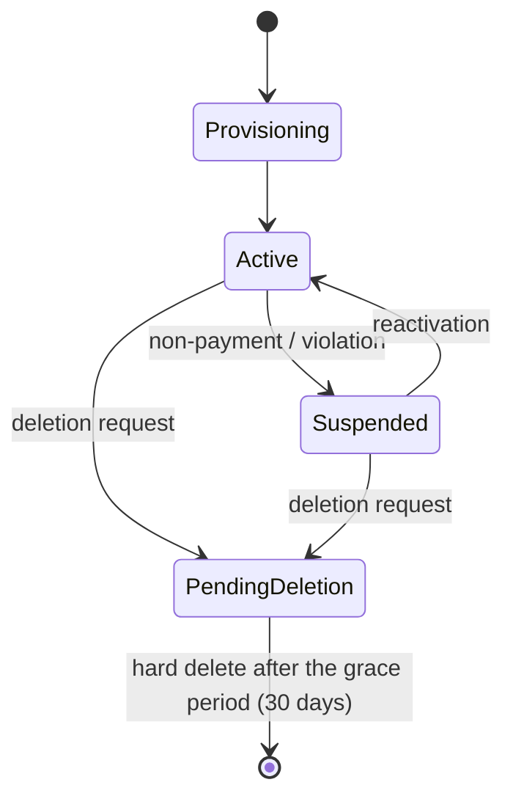

# Multi-Tenancy

One codebase runs both (a) a private installation with a single user and (b) a platform on which a
service provider serves thousands of workspaces. Decision:
[ADR-0010](../adr/ADR-0010-multi-tenancy.md).

---

## 1. Modes of operation

| Mode | `HUBTASK_TENANCY_MODE` | Behaviour |
|---|---|---|
| Single | `single` (default) | Exactly one tenant, created by `scripts/dev-workspace.sh --bootstrap` or the admin API. A first-start setup in the web app ([UC-INS-01](../usecases/admin/UC-INS-01-start-a-fresh-installation.md)) is planned and not built. No tenant selection in the API; registration optionally open |
| Multi | `multi` | Tenants are provisioned through the control plane (§4.1); resolved as §3 says; self-service signup optional |

The code **always** knows about a tenant; single mode is the special case with one row in `tenant`.
There is no second code path and no special case in a repository.

---

## 2. Isolation strategy

**Shared database, shared schema, `tenant_id` on every business table, PostgreSQL row level
security as the boundary.** It costs one migration for all tenants and minimal resources per
tenant; the price is that noisy neighbours need quotas (§4).

For tenants with special requirements (data residency, enterprise isolation) the growth path is
**shard routing**: a control plane database holds `tenant → shard`, and the application picks the
matching connection pool. The data model stays identical. Not built.

### 2.1 RLS implementation

```sql
ALTER TABLE work_item ENABLE ROW LEVEL SECURITY;
ALTER TABLE work_item FORCE ROW LEVEL SECURITY;

CREATE POLICY tenant_isolation ON work_item
  USING (tenant_id = current_setting('app.tenant_id', true)::uuid)
  WITH CHECK (tenant_id = current_setting('app.tenant_id', true)::uuid);
```

**Roles and context**

* The application connects as `hubtask_app`: **no** `BYPASSRLS`, and **not** the table owner.
* Migrations run as `hubtask_migrator`, which **owns** the objects. Migration `0001` sets
  `ALTER DEFAULT PRIVILEGES FOR ROLE hubtask_migrator`, so migrations run under another owner would
  grant the application nothing on later tables.
* Exactly one place sets the context: the transaction wrapper in `infrastructure/postgres/Tenant.go`
  runs `SET LOCAL app.tenant_id = $1` and `SET LOCAL app.actor_id = $2` before every transaction.
  `SET LOCAL` is bound to the transaction, so it is safe under `pgbouncer` transaction pooling.
* A nested unit of work may not switch tenant: a scope with a different tenant inside an open
  transaction is refused (`postgres.tenant_switch_in_transaction`). A helper that may run inside
  somebody else's transaction reads in the ambient scope instead of opening its own.
* Without a context, every query returns zero rows: a programming error yields "nothing found",
  never another tenant's data.
* **Installation scope.** Rows that belong to no tenant (the system capability profiles) are read
  through a unit of work that sets `app.tenant_id` to the empty value. `current_tenant_id()` is then
  `NULL`, every tenant policy is false, and no tenant's row is visible. It is read-only by
  construction, because every `WITH CHECK` compares against a tenant it does not have.
  `GET /meta/capabilities` uses it to answer an unauthenticated caller.

**Every table carries RLS with `FORCE`, with these exceptions.** The list is kept in three places
that must agree: `rlsExceptions` in `test/integration/tenant_boundary_test.go`, the restore drill's
own copy in `cmd/restore-drill/checks.go`, and this table. A new exception is entered in all three.

| Table | Why it has no tenant policy | What bounds it instead |
|---|---|---|
| `job` | A worker must claim a job before it knows whose it is | The job names its tenant; the transaction that runs it is as bounded as a request |
| `goose_db_version` | The migration ledger | No grant to the application role |
| `instance_event` | The installation's own journal; its rows outlive the tenants they name ([audit.md](./audit.md) §6) | Append-only grants; written only by the tenant lifecycle use cases; no API reads it |
| `item_capability_profile` | Has RLS but **no `FORCE`**: the system rows are the owner's to seed, and `FORCE` would bind the owner too ([ADR-0052](../adr/ADR-0052-managed-postgresql-support.md)) | The policy binds every non-owner role in full, `hubtask_app` included |
| `restore_drill_marker` | The restore drill's marker rows; no tenant column | No grant to the application role |
| `operator` | The operator register names accounts across workspaces | No grant to the application role; reachable only through four `SECURITY DEFINER` functions |
| `instance_setting` | Installation configuration every workspace reads (§4.1) | Holds configuration, never personal data; written by one control-plane use case |

**Doors through the boundary.** A `SECURITY DEFINER` function is the only way the application role
reads across tenants. Each is narrow by construction and granted to `hubtask_app` alone:

| Function | Answers | Used by |
|---|---|---|
| `resolve_tenant(slug)` | One tenant identifier or none — never a list | Sign-in before a credential exists (§3) |
| `admin_tenants()` | The list of tenants | The control plane behind `admin:tenants` (§4.1) |
| `instance_census()` | Five counts, no rows | The instance overview |
| `subject_tenants(email)` | The tenants one data subject has an account in | An installation-wide data subject request ([data-protection.md](./data-protection.md) §4) |
| `is_operator`, `operator_register`, `add_operator`, `drop_operator` | The operator register | The control plane (§4.1) |
| `purge_tenant_trail(tenant)` | Deletes one tenant's audit trail | The hard delete only ([audit.md](./audit.md) §3) |

**Nothing enumerates tenants.** No job, scheduler or worker lists the tenants to do per-tenant work.
Every per-tenant duty — the outbox dispatch, retention, reminders, recurrence materialisation,
backup and automation schedules, media reconciliation, privacy deadlines, audit anchoring, search
reindex, embeddings, the hard-delete grace — is **seeded by the write that creates its work**, in
that tenant's transaction, with the tenant as the dedupe key. Each round then reschedules itself
while work remains (`queue.Result{Repeat: true}`) and finishes when the tenant owes nothing; the
next write seeds it again. The one legitimate listing of tenants is `admin_tenants()`, read by the
control plane behind `admin:tenants` — an operator's read, not a job. A duty that belongs to no
tenant (an instance-wide backup schedule, partition maintenance) is the leader's, runs under the
installation scope, and can reach only rows that have no tenant.

**Partitions.** A partition does not inherit its parent's policy when it is addressed directly. So
every partition — and the `SECURITY DEFINER` function that creates one (`ensure_audit_partition`,
`ensure_stream_partition`) — carries its own policy, its own `FORCE` and its own revoked grants.

### 2.1.1 A database the operator brings

An installation may point the application at a PostgreSQL it did not create — a managed service or
a cluster somebody else runs. The chart supports it (`database.enabled` is off by default and every
deployment reads its DSN from a Secret), and the migrations run there too
([ADR-0052](../adr/ADR-0052-managed-postgresql-support.md), proven by a job:
[support-matrix.md](./support-matrix.md) §3).

Such a service gives no superuser. Before the first migration the operator therefore:

1. **Creates the two roles** with the service's own admin account. `0001` catches a refused
   `CREATE ROLE` and reports it rather than failing. `hubtask_app` gets the password the
   application's DSN carries.
2. **Makes `hubtask_migrator` the database owner** — not the service's admin account: the grants in
   `0001` name that role, and default privileges for a role that owns nothing apply to nothing.

```sql
-- With the provider's admin account, once, before the first deploy.
CREATE ROLE hubtask_migrator LOGIN PASSWORD '…';
CREATE ROLE hubtask_app      LOGIN PASSWORD '…';
CREATE DATABASE hubtask OWNER hubtask_migrator;
```

`HUBTASK_DB_DSN` connects as `hubtask_app`; the migration's DSN connects as `hubtask_migrator`.
Nothing needs `SUPERUSER` or `BYPASSRLS`. The integration suite migrates its own database under
exactly this arrangement on every run and then checks that the boundary holds.

### 2.1.2 References carry the tenant

Row level security does not check a foreign key: PostgreSQL validates a reference with the owner's
rights, so a single-column key would let a row in tenant A point at a row in tenant B
([ADR-0024](../adr/ADR-0024-tenant-scoped-foreign-keys.md)).

* **A foreign key between two tables whose `tenant_id` is `NOT NULL` is composite** over
  `(tenant_id, id)`. The referenced table carries `UNIQUE (tenant_id, id)`; its primary key stays
  `id`.
* `MATCH SIMPLE` (the default), so a `NULL` reference is not checked.
* `ON DELETE SET NULL` names its column — `ON DELETE SET NULL (column)` — or it would null
  `tenant_id` when it fires. This is why PostgreSQL 15 is the hard floor.
* A gate walks `pg_constraint` and fails the build on a single-column foreign key between two such
  tables, delete rule included.
* **Exception: the backup family**, where `tenant_id IS NULL` means installation-wide. A composite
  key is wrong there, not weaker; those references stay single-column.

### 2.2 Defence in depth

1. Authentication supplies the `tenant_id` (token claim or session), never the request body.
2. `ActorContext` carries tenant and actor, typed, through the application layer.
3. The permission check happens in the application layer (roles and scopes).
4. RLS is the last, unbypassable boundary.
5. Negative tests in CI: every repository method has a test that expects empty results or an error
   under the wrong tenant context (gate SG-3).

---

## 3. Tenant resolution

**Accounts are per tenant** (`account_email_uq` is `(tenant_id, lower(email))`), so a sign-in
resolves its tenant **before any credential is checked**. Two cases:

**Signing in (no credential yet)** — `SessionWriter.resolveTenant`:

| Mode | Source, in order | Nothing resolves |
|---|---|---|
| Single | The one row (`resolve_tenant(NULL)`); the subdomain is ignored | — |
| Multi | 1. The subdomain under the base host (`resolve_tenant(slug)`) · 2. the `X-Hubtask-Tenant` header (a workspace identifier) | `404 auth.tenant_unresolved` |

**An authenticated request** — the credential binds the tenant: a session's or token's claim, a
personal access token's or service account's account.

In both cases the weaker sources **may confirm the tenant and never overrule it**. A header (or, on
an authenticated request, a subdomain) that names another tenant is refused with
`403 access.tenant_mismatch`, not resolved in anybody's favour. On an authenticated request the
header may carry the identifier or the slug. A path prefix is deliberately not used.

---

## 4. Quotas, fairness, limits

Configured per tenant in `tenant.settings.quotas`, written by the operator through
`PATCH /admin/tenants/{id}/quotas` and read by the workspace through `GET /quotas`. Enforced in the
application layer and middleware. A capacity quota refuses as `422 capacity.<quota>` naming the
ceiling; the rate refuses as `429` with `Retry-After`. The approach to a ceiling is
`hubtask_tenant_quota_usage_ratio` (alert A-18).

| Limit | Default (multi) | Default (single/self-hosted) |
|---|---|---|
| API requests/min per token | 600 | 6,000 |
| Items per tenant | Plan-bound | Unlimited |
| Media storage | Plan-bound | Disk space |
| Automation runs/hour | 1,000 | 100,000 |
| Webhook targets | 50 | Unlimited |
| Bulk operations per request | 500 | 500 |
| Automation causality depth | 5 | 5 |
| Concurrent export jobs | 2 | 5 |
| AI tokens per day | 200,000 | Unlimited |

**The AI budget.** Counted in the tokens each provider reports, over a UTC calendar day, from the
billing ledger. A workspace over it **stops getting suggestions and keeps working**: the refusal is
`ai.unavailable`, the same one an absent provider or an open circuit gives. `ai_tokens_per_day`
limits the models the installation **offers**; a workspace's own model is limited only by its
optional `ai_own_tokens_per_day`, off by default
([ADR-0072](../adr/ADR-0072-ai-at-the-installation-level.md) §4). Unlimited in single mode because
the self-hoster pays their own provider or runs a local model.

**Fairness:** the job queue claims per tenant round-robin, so one tenant cannot monopolise the
workers; `statement_timeout` per role; and a query DSL request whose estimated cost is over the cap
is refused before it runs.

---

## 4.1 The instance layer

The plane above the workspaces: it provisions them and sets values that apply to all of them
([ADR-0070](../adr/ADR-0070-the-instance-layer.md)).

**The control plane's credential.** Everything under `/admin/tenants` needs the `admin:tenants`
scope. No session carries it, with one exception: a **registered operator** may raise their own
session to it for one hour by passing a step-up (`instance.session_elevated`, written to the trail
and to `instance_event`). Automation uses a personal access token minted for the purpose.

**Who an operator is.** A register (`operator`), checked when `admin:tenants` is minted and again
when it is exercised. In single mode it is empty, and empty means the owner. A service account may
be an operator, so a purchase platform can provision without a person's credential.

**What an instance setting is.** A row in `instance_setting` with a value **and a lock**. Open means
a workspace may tighten it; closed means it applies and the workspace's control is shown switched
off with the reason and who set it — never hidden. The effective value is resolved on read along
`product minimum → instance → plan → workspace`, so a change applies at once and no job walks
anything. The table has no row policy (§2.1).

**How it is reached.** One API with three doors: a file (`seed` or `enforce`, one source per mode),
`hubctl admin`, and the `/instance` area of the web app.

**What it never shows** is a workspace's contents. An operator sees counts, states and limits
(`instance_census()`), never rows; the boundary is a database policy, not a role.

---

## 5. The lifecycle of a tenant


```mermaid
stateDiagram-v2
  [*] --> Provisioning
  Provisioning --> Active
  Active --> Suspended: non-payment / violation
  Suspended --> Active: reactivation
  Active --> PendingDeletion: deletion request
  Suspended --> PendingDeletion: deletion request
  PendingDeletion --> [*]: hard delete after the grace period (30 days)
```

| Phase | Actions |
|---|---|
| Provisioning | Tenant, default hub, example collection, owner membership, locale/time zone, standard buckets/labels; idempotent under `Idempotency-Key` |
| Active | Normal operation; metering only if enabled |
| Suspended | The API answers `403 access.tenant_suspended`; data remains; the export still works |
| PendingDeletion | Access blocked (`403 access.tenant_pending_deletion`), automations disabled, the export still works |
| Hard delete | A job seeded by the deletion request's own write runs after the grace period. It cascades across every storage location — database rows, media objects, search entries, outbox, queue — and purges the tenant's audit trail; the evidence goes to `instance_event` in the same transaction ([audit.md](./audit.md) §6) |

Deleting a tenant demands a step-up and the typed tenant name. The hard delete removes the workspace
from the primary system at once and from the operator's system backups **35 days** later
([data-protection.md](./data-protection.md) §5).

**Export:** `POST /admin/tenants/{id}:export` writes one complete, unencrypted archive of the
workspace to a backup target, as a job (`202` + `/jobs/{id}`), in every lifecycle state. The format
is [tenant-export.md](./tenant-export.md), specified well enough to build an importer from the
document alone. The export reads through the same RLS path as the API (T-20) and is audited with its
target, never its content. Concurrent exports count against the §4 quota.

The target must be one the workspace itself can see. A target with `tenant_id IS NULL` is invisible
under the workspace's scope, so in multi mode with `HUBTASK_BACKUP_TENANT_TARGETS=false` (the
default) a workspace has no target and cannot be exported — an open gap; the contract's "or an
installation-wide one" does not hold today.

---

## 6. Data protection

| Requirement | Implementation |
|---|---|
| Access (Art. 15) | A personal data export per account |
| Erasure (Art. 17) | Anonymisation (authorship remains as "former user") or full deletion including comments, chosen per case ([data-protection.md](./data-protection.md) §4) |
| Data residency | Shard/region per tenant; media in the regional bucket (not built) |
| Processing on behalf | The data catalogue with fields, purposes and retention ([`docs/privacy/data-catalog.md`](../privacy/data-catalog.md)) |
| Encryption | TLS in transit; encryption at rest by the infrastructure; integration secrets additionally at the application level (AES-GCM) |
| Logs | No item or comment content in logs; identifiers only |

---

## 7. Consequences for scaling

* All processes are stateless → any number of `api` replicas.
* Reads may go to read replicas (the `persistence` port allows `ReadOnly` transactions). Replication
  lags, so a read after a write in the same request uses the primary.
* `audit_log`, `change_log`, `activity_entry`, `outbox_event` and `rule_run` partition by month: a
  default catch-all partition, RLS per partition (§2.1), the leader keeping coming months in
  existence, and an aged-out month dropped as one partition with evidence in the instance journal.
  `db/migrations/0068_stream_partitions.sql` shows the conversion of a table that already held
  data. If ever needed, `work_item` can partition by `tenant_id` hash; the `tenant_id` index prefix
  prepares for it.
* The `scheduler` stays single-leader; the work itself is distributed as jobs.
