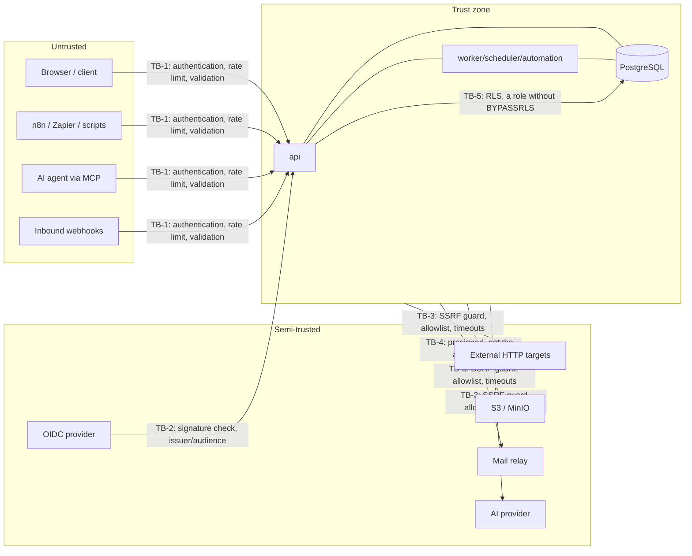

# Security Concept

Binding for all building blocks. Complements [arc42.md](./arc42.md) §8.4,
[ADR-0005](../adr/ADR-0005-authn-authz.md), [ADR-0010](../adr/ADR-0010-multi-tenancy.md),
and [ADR-0015](../adr/ADR-0015-security-baseline.md).

---

## 1. Principles

| Principle | What it means in the code |
|---|---|
| **Defence in depth** | Every protective rule exists at two levels at least. The tenant boundary: the application layer *and* PostgreSQL RLS. Permissions: the token scope *and* the RBAC check. |
| **Secure by default** | The unconfigured state is the safe one. AI off, registration closed, CORS empty, outbound HTTP targets only by allowlist, a signup token required. |
| **Fail closed** | If the tenant context is missing, the policy cache is cold, or the permission source is unreachable → rejection (`403`/`503`), never passage. |
| **Least privilege** | A database role without `BYPASSRLS`; tokens with minimal scope; automation rules run with the rights of their `run_as`, not as an administrator; containers non-root and read-only. |
| **No security through obscurity** | The model is publicly documented and must hold even when an attacker reads the source — in an open project, they do read it. |
| **Security is a CI gate, not a feeling in review** | Every rule below has either an automated test or a build check. Rules without evidence count as absent. |

---

## 2. Assets and protection goals

| Asset | Confidentiality | Integrity | Availability | Particularity |
|---|---|---|---|---|
| Tenant data (items, comments, media) | High | High | High | The core promise; a cross-tenant leak is a critical incident |
| Credentials, tokens, secrets | Very high | High | Medium | Stored only hashed or encrypted |
| Integration credentials (calendar, webhook secrets, AI keys) | Very high | High | Medium | Envelope encryption, never in clear text in logs or the API |
| Audit trail | Medium | **Very high** | High | Append-only; tampering must be detectable |
| Automation rules | Medium | High | High | A tampered rule is an execution primitive |
| Operational metadata (metrics, traces) | Medium | Medium | Medium | Must contain no user content |

---

## 3. Trust boundaries

**The key statement:** everything to the left of `api` is hostile until proven otherwise — including
our own AI agent and our own automation rule. Inside the trust zone, the tenant boundary still
applies (TB-5).

---

## 4. Threat model (STRIDE)

Per trust boundary; `T-xx` are referenceable threat IDs. Every row has a countermeasure **and**
test evidence (§13).

| ID | Boundary | STRIDE | Threat | Countermeasure | Evidence |
|---|---|---|---|---|---|
| T-01 | TB-1 | Spoofing | A stolen access token is replayed | Short lifetime (15 min), refresh rotation with reuse detection → invalidate the family; a client binding hint (UA/IP class) is logged with the token | Token replay integration test |
| T-02 | TB-1 | Spoofing | Credential stuffing / brute force | Argon2id, progressive delay, lockout after *n* failed attempts per account **and** per IP, a generic error message (no account existence disclosure), optional TOTP MFA | "Login enumeration" test |
| T-03 | TB-1 | Tampering | A manipulated `tenant_id`/`container_id` in the request | The tenant **never** comes from the request body but from the token or host; RLS as the second level | Cross-tenant negative test suite |
| T-04 | TB-5 | Info disclosure | IDOR: another tenant's `item_id` in the URL | Authorisation in the application layer through scope inheritance; RLS makes foreign IDs invisible → `404`, not `403` (no existence disclosure) | A test per resource |
| T-05 | TB-1 | Info disclosure | Mass extraction through the query DSL | A field allowlist, a maximum filter depth, a capped `limit`, rate limit plus quota, a bounded `expand` depth | Fuzz test of the DSL |
| T-06 | TB-1 | Tampering | SQL injection through filter expressions | Exclusively parameterised queries (`sqlc`); the DSL produces an AST → parameters, never string concatenation; importing `fmt.Sprintf` into query building is forbidden via `depguard` | Lint + fuzz |
| T-07 | TB-3 | Elevation | SSRF through a webhook or HTTP action (cloud metadata, internal services) | `GuardedClient`: resolve before connecting, a block list for RFC 1918/loopback/link-local/ULA, protection against DNS rebinding (pin to the checked IP), `http(s)` only, no redirects to new hosts without re-checking, a timeout, a response size limit, an optional allowlist (mandatory in provider operation) | Unit test with malicious DNS |
| T-08 | TB-3 | Elevation | An automation rule as a "confused deputy" (a guest's rule triggers an admin action) | Actions run with the rights of the `run_as` principal; `run_as` can never hold more rights than the rule's author had at save time; revoking rights disables the rule | "Rights revocation" test |
| T-09 | Internal | DoS | An automation infinite loop (rule A triggers B triggers A) | A causality chain of maximum depth 5, loop detection over the `causation_id` path, a throttle per rule, automatic deactivation after *n* failed runs | Golden loop test |
| T-10 | TB-1 | Elevation | Prompt injection through item content against the MCP agent | User content is handed to the model as **data**, never as instruction; destructive MCP tools blocked by default; agent tokens with their own scope; every agent action in the audit with actor `AI_AGENT` | "Injected instruction" test case |
| T-11 | TB-4 | Info disclosure | Stored XSS through an upload (SVG/HTML) | Delivery only through a separate origin/bucket domain, `Content-Disposition: attachment`, `Content-Type` from sniffing rather than the client's claim, SVG either rasterised or served as a download, `Content-Security-Policy: sandbox` | Upload matrix test |
| T-12 | TB-1 | Tampering | CSRF against cookie sessions | The API is primarily bearer-token; where cookies are needed: `SameSite=Lax`, `Secure`, `HttpOnly` plus a double-submit token; state-changing operations never over `GET` | Test |
| T-13 | TB-2 | Spoofing | A manipulated ID token / wrong issuer | Full verification of the signature, `iss`, `aud`, `exp`, `nonce`, a JWKS cache with rotation; no `alg: none`; clock skew ≤ 60 s | Test with a tampered JWT |
| T-14 | TB-1 | Repudiation | A user disputes a deletion | Append-only `activity_entry` plus the audit with actor, time, `request_id`, and a before/after diff; trash kept 30 days | Test |
| T-15 | Internal | Tampering | Tampering with the audit trail | The app role holds no `UPDATE`/`DELETE` rights on the audit tables (a database grant), plus optional hash chaining per tenant | Test with the app role |
| T-16 | Supply chain | Tampering | A compromised dependency or build | Pinning through `go.sum`, `govulncheck` in the gate, an SBOM (CycloneDX) per release, signed images (cosign) plus provenance, reproducible builds, no `curl \| sh` steps in CI | Release gate |
| T-17 | TB-1 | DoS | Large bodies / zip bombs / expensive regexes | A body limit per endpoint, an upload limit, no user-controlled regexes, `statement_timeout`, a request deadline | Load test + test |
| T-18 | Operations | Info disclosure | Secrets in logs, traces, or error messages | A redaction layer in the logger, the `Secret` type with a masking `String()`, a ban on `%+v` over config structs (lint), and a "the log contains no token" test case | Test |
| T-19 | TB-1 | Spoofing | A forged inbound webhook | An HMAC signature plus timestamp tolerance (5 min) plus a nonce against replay; constant-time comparison | Test |
| T-20 | Operations | Info disclosure | A backup or export containing another tenant | The export runs through the same RLS path as the API; the backup restore drill includes an isolation check | Restore drill |
| T-21 | TB-1 | Info disclosure | A calendar feed URL leaks - through a log, a `Referer`, a shared screen, a calendar client's own history or a synchronised device - and the holder reads somebody's work | The URL is the only credential in the system that travels in one, so: it is revocable at any time and the revocation is immediate; it is stored only as an HMAC-SHA-256 under its own purpose label, so a database dump yields no working URL and a hash from another table cannot be replayed as one; it appears in no log, metric, trace or audit entry, and the type that carries it masks every way of printing it; the lookup is one index seek on a unique hash rather than a comparison, and an unknown, revoked, view-less or owner-less feed answer one indistinguishable `404`; a bucket of its own sheds a client polling too hard before the query runs, while the anonymous bucket bounds the guessing; the feed reads as its **owner** evaluated at fetch time, so a revoked membership narrows it and a disabled account silences it; and the document is minimal - a title, a date and a link, never the notes | The feed suite (D-08): the token refused as a bearer credential, the six refusals compared byte for byte, the masking test, and the golden `.ics` |

New bounded contexts get a short STRIDE analysis at design time; the result is added here
(Definition of Ready, the "security assessment" point).

---

## 5. Identity, sessions, permissions

| Topic | Requirement |
|---|---|
| Passwords | Argon2id, `m=64 MiB, t=3, p=2` (starting values, reviewed yearly), minimum length 12, checked against known leak lists (offline, optional), no forced rotation |
| Access token | JWT or opaque, 15 min, `tenant_id`, `sub`, `scopes`, `jti`; verifiable without a database round trip |
| Refresh token | 30 days, rotating; reuse invalidates the entire family and raises an alert |
| PAT (`hbt_pat_…`) | Visible only at creation, stored hashed (SHA-256 + pepper), a mandatory expiry date (max. 1 year), scopes, last use visible; the prefix enables secret scanning at GitHub/GitLab |

The concrete form of a personal access token is
`hbt_pat_<32 hex digits of the tenant>_<43 characters, base64url, 32 random bytes>` — a scanning
pattern of `hbt_pat_[0-9a-f]{32}_[A-Za-z0-9_-]{43}`. The tenant travels inside the credential
because the lookup needs it before it can happen: `access_token` is behind row level security like
every other table, so a query for the hash returns nothing until a tenant context is set, and for a
non-interactive credential the only honest source of that context is the credential itself
(multi-tenancy.md §3). Naming the wrong tenant gains nothing — the hash covers the whole string,
tenant half included, and is unique across the installation. The stored hash is
HMAC-SHA-256 keyed on a pepper derived from `HUBTASK_SECRET_KEY` with a purpose label, so a hash
from here cannot be replayed as a signed cursor or a feed token.

| Service accounts | No login, tokens only, bound to a tenant, with their own role |
| MFA | TOTP from milestone `0.6.0`; enforceable per tenant for the `OWNER`/`ADMIN` roles; single-use recovery codes |
| Session management | The user sees active sessions and can sign out individually or globally |
| Privileged actions | Tenant deletion, changing the `OWNER` role, creating a token with the `admin` scope: re-authentication ("step-up") |
| Permission check | Exactly one place: `core/application/service` through `AuthorizationService`; adapters must not authorise; the architecture test fails on violation |

---

## 6. Tenant isolation (summary)

Details in [multi-tenancy.md](./multi-tenancy.md). The security-relevant core points:

* The app role `hubtask_app` has **no** `BYPASSRLS` and no `SUPERUSER`; `FORCE ROW LEVEL SECURITY` on all tenant tables.
* `SET LOCAL app.tenant_id` is set in **one** place (the transaction wrapper); access without a context set returns empty result sets or fails.
* Migration and maintenance roles are separate and used only by the migration job.
* A mandatory "cross-tenant" test suite: for **every** repository method, a negative test with a foreign tenant. A new method without a test → the CI gate fails (a count reconciliation of methods against tests).

---

## 7. Input and output handling

* **Validation** at the edge (the OpenAPI schema, generated types) *and* in the domain (value objects with constructor invariants). The adapter validates form, the domain validates meaning.
* **Normalisation** of Unicode (NFC) before storage and comparison; protection against homoglyph display names in invitations (a warning, not a block).
* **Output** is structured (JSON); there are no server-rendered HTML pages apart from a static error page. That removes the classic XSS surface in the backend; the client's responsibility is recorded in the client requirements in the roadmap.
* **Markdown in notes and comments** is stored as raw text and **not** rendered to HTML server-side; rendering is the client's job, with a mandatory sanitiser.
* **CEL expressions** run with a time limit, an expression depth limit, and a cost limit (`cel-go` cost budget); no network or time functions beyond the ones provided.

---

## 8. Cryptography and secrets

| Purpose | Method |
|---|---|
| Password hash | Argon2id |
| Token storage | SHA-256 with a server-side pepper (not in the database) |
| Integration credentials, webhook secrets, backup target credentials | AES-256-GCM, envelope encryption: a data key **per value**, encrypted with a master key from the environment keyring (E-02, `HUBTASK_ENCRYPTION_KEYS`); the key ID is persisted → rotation without data migration. A data key per value rather than per tenant, because GCM's safety is a bound on how much one key encrypts, and a per-value key means the master key only ever encrypts random 32-byte keys. The ciphertext is bound to a purpose the caller supplies, so it cannot be moved between rows |
| Backup archives | AES-256-GCM under a key derived from a passphrase with Argon2id (RFC 9106's second recommended cost: t=3, m=64 MiB, p=4). The passphrase is stored nowhere; the salt and the cost are stored beside the archive, so raising the cost later leaves older archives readable (backup-restore.md §4) |
| Signatures on outbound webhooks | HMAC-SHA-256, a secret per subscription, the header `X-Hubtask-Signature` with a timestamp |
| Transport | TLS 1.2+ (target 1.3); inside the cluster ideally mTLS through a service mesh (optional, not required); HSTS where TLS is terminated |
| Randomness | Exclusively `crypto/rand` for tokens, IDs, and nonces; the `RandomSource` port uses `crypto/rand` in production |
| Home-grown crypto | Forbidden. Only the standard library and established packages. One package names a cipher — `infrastructure/crypto` — and `gate-architecture` fails a build that imports `crypto/aes`, `crypto/cipher`, `crypto/hkdf` or `golang.org/x/crypto` anywhere else |

Secrets come exclusively from environment variables or mounted secret files (the `HUBTASK_*_FILE`
convention for Docker and Kubernetes secrets). There is no default value for a secret — if one is
missing, the process does not start (fail closed, with a clear error message and a message code).

---

## 9. HTTP hardening

| Measure | Requirement |
|---|---|
| Security headers | `Strict-Transport-Security`, `X-Content-Type-Options: nosniff`, `Referrer-Policy: no-referrer`, `Cross-Origin-Resource-Policy: same-site`, a minimal `Permissions-Policy`; a `Content-Security-Policy` per origin — see below |
| CORS | Empty by default; an allowlist explicitly configurable; never `*` in combination with credentials |
| Rate limits | Multi-level: per IP (unauthenticated), per token, per tenant; stricter limits for login, password reset, invitation, search, and bulk; a `429` response with `Retry-After` and `RateLimit-*` |
| Request sizes | A global body limit (1 MiB by default), a separate upload limit, a header limit |
| Deadlines | A server-side request timeout; every handler receives a `context` with a deadline |
| Methods | State-changing operations never over `GET`; `OPTIONS` only for CORS |
| Error responses | RFC 9457 with a stable `code` and a `request_id`; **no** stack traces, query fragments, versions, or paths |
| Version disclosure | The `Server` header without a version; the version only through the authenticated `/meta` endpoint |

**Three origins, three policies.** The header set above is identical everywhere; the
`Content-Security-Policy` is not, because the three things this process serves are not the same
kind of thing.

| Origin | Policy | Why |
|---|---|---|
| The API (`/api/*`, `/mcp`) | `default-src 'none'; frame-ancestors 'none'; base-uri 'none'; form-action 'none'` | It answers JSON and nothing else. If a body ever did reach a browser as HTML, this leaves it with no way to load or send anything |
| The web interface (everything else, when it is enabled) | `default-src 'none'`, then `'self'` for script, style, font, connect, manifest and worker; `img-src 'self' data: blob:`; no `'unsafe-inline'`, no `'unsafe-eval'` | It answers a document, and under the API's policy that document could not load its own script. Every source is `'self'` because the bundle and the API come from one origin ([ADR-0028](../adr/ADR-0028-embedded-web-ui.md)) |
| The media origin | `sandbox` | T-11: an uploaded SVG or HTML file is served from a separate origin, as a download, with no ability to execute |

The absence of `'unsafe-inline'` and `'unsafe-eval'` from the interface's policy is a **constraint
on the frontend framework**, decided before the framework was, rather than a consequence of the one
that gets chosen. `presentation/webui` sets the policy on every answer it produces, including its
404 and its 405.

---

## 10. Automation and AI as attack surface

This surface is larger in Hubtask than in a classic to-do app, because rules trigger HTTP calls and
agents write. The rules:

1. **No scripting language** — only declarative rules with CEL conditions ([ADR-0009](../adr/ADR-0009-automation-rules-cel.md)). There is no execution primitive for arbitrary code.
2. **`run_as` is the permission boundary** (T-08), not the triggering user.
3. **Outbound calls only through `GuardedClient`** (T-07); in provider operation, an egress allowlist at the network level on top.
4. **A causality bound** against loops and amplification attacks (T-09).
5. **AI is opt-in per tenant**, off by default; content goes only to the configured provider, documented in the data catalogue; AI results are suggestions with provenance, never silent changes.
6. **MCP tools** carry `readOnly`/`destructive` hints; destructive tools require explicit release per token and appear in the audit.

---

## 11. Supply chain and build

| Control | Implementation |
|---|---|
| Dependencies | Dependabot ([ADR-0022](../adr/ADR-0022-github-platform.md)): grouped version updates weekly, ungrouped security updates on the advisory; `go.sum` mandatory; no `replace` directives onto forks without an ADR |
| Vulnerabilities | `govulncheck` in every pipeline run (a gate), a container scan (Trivy/Grype) in the release gate |
| Static analysis | `gosec` as part of `golangci-lint`; `depguard` enforces layer boundaries and forbids risky packages |
| Secret scanning | A push rule plus a history scan (gitleaks) |
| Build | Reproducible, `CGO_ENABLED=0`, ldflags with version and commit; no network access outside the module proxy |
| Artefacts | An SBOM (CycloneDX) per release, an image signature (cosign, keyless), a provenance attestation; the target is SLSA build level 3 |
| Base image | distroless/static, non-root (UID 65532), a read-only root filesystem, no shell, multi-arch |
| Release integrity | Signed tags; publication only from a protected branch with review |

---

## 12. Data protection (reference)

* The data catalogue `docs/privacy/data-catalog.md`: data kind, purpose, legal basis, storage location, retention, recipients (including AI providers) — mandatory before `1.0.0`.
* Processing on behalf: provider operation needs a DPA template and a sub-processor list.
* Data subject rights are technically represented: export (`GET /tenants/{id}:export`), deletion with a defined deadline, rectification through the normal API.
* Data minimisation: logs without user content, metrics without personal labels, traces with masked attributes.
* Retention: trash 30 days, the audit trail configurable (400 days by default), webhook deliveries 30 days, rule runs 30 days.

---

## 13. Security gates in CI

The build fails if any row fails. No merge with a red gate, no exception by comment.

| Gate | Check |
|---|---|
| SG-1 | `govulncheck` with no known exploitable vulnerability |
| SG-2 | `gosec`/`golangci-lint` with no new findings (the baseline is frozen) |
| SG-3 | The cross-tenant negative test suite green and **complete** (every repository method covered) |
| SG-4 | The "database role without BYPASSRLS" test plus the "RLS active on all tenant tables" test (a catalogue query against the table list) |
| SG-5 | The authorisation architecture test: no call to a repository method without a prior policy check; no authorisation in adapters |
| SG-6 | The SSRF test suite against `GuardedClient` (metadata IPs, rebinding, redirect chains) |
| SG-7 | Secret scanning with no findings; the "log output contains no tokens or secrets" test |
| SG-8 | Fuzz tests for the query DSL parser, CEL input, and webhook signature verification (a short run on the PR, a long one overnight) |
| SG-9 | A container scan with no critical findings; the image verified as non-root and read-only |
| SG-10 | An SBOM produced and the image signed (release pipeline only) |
| SG-11 | Auth negative tests: an expired/tampered/revoked token, the wrong issuer, a missing scope |
| SG-12 | The upload matrix test (SVG, HTML, polyglot files, the wrong content type) |

---

## 14. Handling incidents

1. **Reporting** through `SECURITY.md` (a dedicated address, a GPG key, 72 h to acknowledge, coordinated disclosure, a 90-day deadline).
2. **Triage** with CVSS v3.1; severity targets: critical fixed ≤ 7 days, high ≤ 30 days, medium ≤ 90 days.
3. **Remediation** on all supported minor lines (see [versioning-release.md](./versioning-release.md)).
4. **Communication** through a GitHub security advisory with the affected versions, a workaround, and detection guidance (log patterns).
5. **Follow-up**: a blameless post-mortem note in the repository; a new regression test is part of the fix — without a test, the incident does not count as closed.

---

## 15. Deliberately not included

| Not included | Reason |
|---|---|
| End-to-end encryption of content | Incompatible with server-side search, automation, and AI; it would be a different product architecture |
| Our own WAF/IDS | The operator's job (ingress/reverse proxy); the application supplies clean signals instead |
| Certifications (ISO 27001, SOC 2) | Organisational, not architectural; the architecture creates the technical preconditions |
| SAML/SCIM | Deferred to after `1.0.0` (roadmap) |

---

## 16. Open points

| # | Point | Needed by |
|---|---|---|
| S-1 | An external penetration test / code audit before the first commercial operation | Before `1.0.0` |
| S-2 | ~~Decide master key management in provider operation (environment vs. KMS vs. Vault)~~ — settled as **the environment keyring** ([ADR-0045](../adr/ADR-0045-master-key-in-the-environment.md), H-13). The threat the question names is a database dump plus a filesystem read, and only the cold half of it is defensible: a process compromised badly enough to read the environment can hold a KMS session or a Vault token just as easily, so all three options fail together against a live compromise and the cheapest of them already defends the dump — the ring is not in the database. What a KMS would add is the record rather than the secrecy, which is why the decision carries a **trigger instead of a review date**: hardware the project does not control operated by somebody who is not Hubtask's operator, or a compliance review asking for custody separation in writing. The half that was missing is now the work: a ring only grows until something rewraps what an older key sealed, so the ADR decides the re-seal that lets a key finally be retired, and §8.1 is the procedure | Closed (H-13) |
| S-3 | The data catalogue and the DPA template | Before `1.0.0` |
| S-4 | Extend the threat model for the frontend (once decided) | With the frontend ADR |
| S-5 | Bug bounty yes/no, and its framing | After `1.0.0` |
