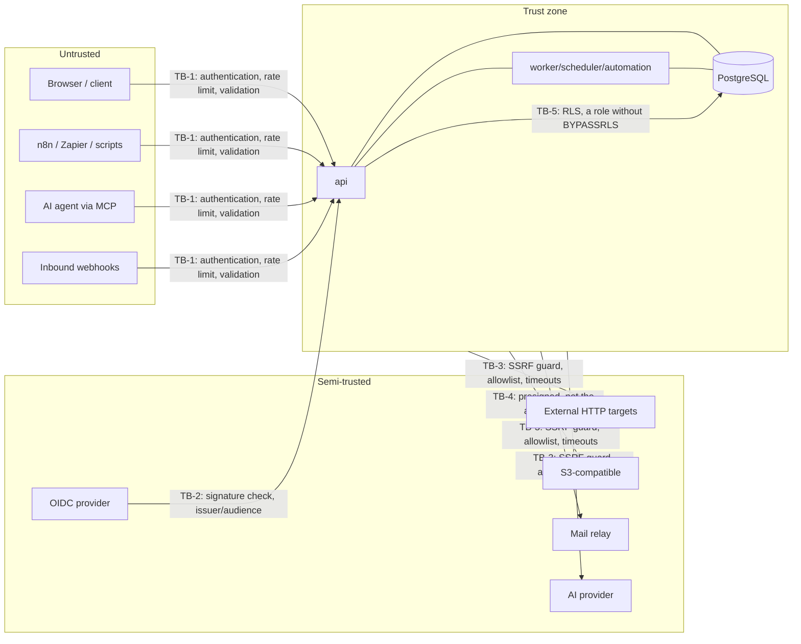

# Security Concept

Binding for all building blocks: the threat model, the security gates, hardening, cryptography and
secrets. Accounts, sign-in, passwords, the second factor, providers, sessions, tokens and the
step-up live in [identity.md](./identity.md); the tenant boundary in
[multi-tenancy.md](./multi-tenancy.md). Decision records:
[ADR-0005](../adr/ADR-0005-authn-authz.md), [ADR-0010](../adr/ADR-0010-multi-tenancy.md),
[ADR-0015](../adr/ADR-0015-security-baseline.md).

---

## 1. Principles

| Principle | What it means in the code |
|---|---|
| **Defence in depth** | Every protective rule exists at two levels at least. The tenant boundary: the application layer *and* PostgreSQL RLS. Permissions: the token scope *and* the RBAC check. |
| **Secure by default** | The unconfigured state is the safe one. AI off, no self-registration (an account is invited, or admitted by a provider a workspace configured), every sign-in switch at what NIST advises, CORS empty, outbound HTTP targets only by allowlist, no default for a secret. |
| **Fail closed** | If the tenant context is missing, the policy cache is cold, or the permission source is unreachable → rejection (`403`/`503`), never passage. |
| **Least privilege** | A database role without `BYPASSRLS`; tokens with minimal scope; automation rules run with the rights of their `run_as`, not as an administrator; containers non-root and read-only. |
| **No security through obscurity** | The model is publicly documented and must hold even when an attacker reads the source — in an open project, they do read it. |
| **Security is a CI gate, not a feeling in review** | Every rule below has either an automated test or a build check. Rules without evidence count as absent. |

---

## 2. Assets and protection goals

| Asset | Confidentiality | Integrity | Availability | Particularity |
|---|---|---|---|---|
| Tenant data (items, comments, media) | High | High | High | The core promise; a cross-tenant leak is a critical incident |
| Credentials, tokens, secrets | Very high | High | Medium | Stored only hashed or encrypted |
| Integration credentials (calendar, webhook secrets, AI keys) | Very high | High | Medium | Envelope encryption, never in clear text in logs or the API |
| Audit trail | Medium | **Very high** | High | Append-only; tampering must be detectable |
| Automation rules | Medium | High | High | A tampered rule is an execution primitive |
| Operational metadata (metrics, traces) | Medium | Medium | Medium | Must contain no user content |

---

## 3. Trust boundaries

```mermaid
flowchart LR
  subgraph U[Untrusted]
    B[Browser / client]
    N[n8n / Zapier / scripts]
    A[AI agent via MCP]
    W[Inbound webhooks]
  end
  subgraph E[Semi-trusted]
    IDP[OIDC provider]
    EXT[External HTTP targets]
    OBJ[S3-compatible]
    SMTP[Mail relay]
    LLM[AI provider]
  end
  subgraph T[Trust zone]
    API[api] --- WRK[worker/scheduler/automation]
    API --- DB[(PostgreSQL)]
    WRK --- DB
  end
  B & N & A & W -->|TB-1: authentication, rate limit, validation| API
  IDP -->|TB-2: signature check, issuer/audience| API
  T -->|TB-3: SSRF guard, allowlist, timeouts| EXT & SMTP & LLM
  T -->|TB-4: presigned, not the app origin| OBJ
  API -->|TB-5: RLS, a role without BYPASSRLS| DB
```

**The key statement:** everything to the left of `api` is hostile until proven otherwise — including
our own AI agent and our own automation rule. Inside the trust zone, the tenant boundary still
applies (TB-5).

---

## 4. Threat model (STRIDE)

Per trust boundary; `T-xx` are referenceable threat IDs. Every row has a countermeasure **and**
test evidence (§13).

| ID | Boundary | STRIDE | Threat | Countermeasure | Evidence |
|---|---|---|---|---|---|
| T-01 | TB-1 | Spoofing | A stolen access token is replayed | Short lifetime (15 min), refresh rotation with reuse detection → invalidate the family and raise the alert; the session records a client-binding hint (user agent, IP class) ([identity.md](./identity.md) §14) | Token replay integration test |
| T-02 | TB-1 | Spoofing | Credential stuffing / brute force | Argon2id; an attempt ledger per account **and** per IP class whose delay doubles to a fifteen-minute ceiling, advanced by every password and second-factor door; one generic refusal (no account existence disclosure); a second factor a workspace can require ([identity.md](./identity.md) §4.3, §8) | "Login enumeration" test; a per-door ledger test against the real database |
| T-03 | TB-1 | Tampering | A manipulated `tenant_id`/`container_id` in the request | The tenant **never** comes from the request body but from the token or host; RLS as the second level | Cross-tenant negative test suite |
| T-04 | TB-5 | Info disclosure | IDOR: another tenant's `item_id` in the URL | Authorisation in the application layer through scope inheritance; RLS makes foreign IDs invisible → `404`, not `403` (no existence disclosure) | A test per resource |
| T-05 | TB-1 | Info disclosure | Mass extraction through the query DSL | A field allowlist, a maximum filter depth, a capped `limit`, rate limit plus quota, a bounded `expand` depth | Fuzz test of the DSL |
| T-06 | TB-1 | Tampering | SQL injection through filter expressions | Exclusively parameterised queries (`sqlc`); the DSL produces an AST → parameters, never string concatenation; importing `fmt.Sprintf` into query building is forbidden via `depguard` | Lint + fuzz |
| T-07 | TB-3 | Elevation | SSRF through a webhook or HTTP action (cloud metadata, internal services) | `GuardedClient`: resolve before connecting, a block list for RFC 1918/loopback/link-local/ULA, protection against DNS rebinding (pin to the checked IP), `http(s)` only, no redirects to new hosts without re-checking, a timeout, a response size limit, an optional allowlist (mandatory in provider operation) | Unit test with malicious DNS |
| T-08 | TB-3 | Elevation | An automation rule as a "confused deputy" (a guest's rule triggers an admin action) | Actions run with the rights of the `run_as` principal; `run_as` can never hold more rights than the rule's author had at save time; revoking rights disables the rule | "Rights revocation" test |
| T-09 | Internal | DoS | An automation infinite loop (rule A triggers B triggers A) | A causality chain of maximum depth 5, loop detection over the `causation_id` path, a throttle per rule, automatic deactivation after *n* failed runs | Golden loop test |
| T-10 | TB-1 | Elevation | Prompt injection through item content against the MCP agent | User content is handed to the model as **data**, never as instruction; destructive MCP tools blocked by default; agent tokens with their own scope; every agent action in the audit with actor `AI_AGENT` | "Injected instruction" test case |
| T-11 | TB-4 | Info disclosure | Stored XSS through an upload (SVG/HTML) | Delivery only through a separate origin/bucket domain, `Content-Disposition: attachment`, `Content-Type` from sniffing rather than the client's claim, SVG either rasterised or served as a download, `Content-Security-Policy: sandbox` | Upload matrix test |
| T-12 | TB-1 | Tampering | CSRF against cookie sessions | There is no cookie session: every route takes a bearer ([identity.md](./identity.md) §14). Should one ever be introduced: `SameSite=Lax`, `Secure`, `HttpOnly` plus a double-submit token. State-changing operations never over `GET` | Test |
| T-13 | TB-2 | Spoofing | A manipulated ID token / wrong issuer | Full verification of the signature, `iss` (exact; a templated issuer substituted first), `aud`, `exp`, `nonce`, a JWKS cache with rotation; no `alg: none`; clock skew ≤ 60 s ([identity.md](./identity.md) §10.1) | Test with a tampered JWT |
| T-14 | TB-1 | Repudiation | A user disputes a deletion | Append-only `activity_entry` plus the audit with actor, time, `request_id`, and a before/after diff; trash kept 30 days | Test |
| T-15 | Internal | Tampering | Tampering with the audit trail | The app role holds no `UPDATE`/`DELETE` rights on the audit tables (a database grant), plus optional hash chaining per tenant | Test with the app role |
| T-16 | Supply chain | Tampering | A compromised dependency or build | Pinning through `go.sum`, `govulncheck` in the gate, an SBOM (CycloneDX) per release, signed images (cosign) plus provenance, reproducible builds, no `curl \| sh` steps in CI | Release gate |
| T-17 | TB-1 | DoS | Large bodies / zip bombs / expensive regexes | A body limit per endpoint, an upload limit, no user-controlled regexes, `statement_timeout`, a request deadline | Load test + test |
| T-18 | Operations | Info disclosure | Secrets in logs, traces, or error messages | A redaction layer in the logger, the `Secret` type with a masking `String()`, a ban on `%+v` over config structs (lint), and a "the log contains no token" test case | Test |
| T-19 | TB-1 | Spoofing | A forged inbound webhook | An HMAC signature plus timestamp tolerance (5 min) plus a nonce against replay; constant-time comparison | Test |
| T-20 | Operations | Info disclosure | A backup or export containing another tenant | The export runs through the same RLS path as the API; the backup restore drill includes an isolation check | Restore drill |
| T-21 | TB-1 | Info disclosure | A calendar feed URL leaks - through a log, a `Referer`, a shared screen, a calendar client's own history or a synchronised device - and the holder reads somebody's work | The URL is the only credential in the system that travels in one, so: it is revocable at any time and the revocation is immediate; it is stored only as an HMAC-SHA-256 under its own purpose label, so a database dump yields no working URL and a hash from another table cannot be replayed as one; it appears in no log, metric, trace or audit entry, and the type that carries it masks every way of printing it; the lookup is one index seek on a unique hash rather than a comparison, and an unknown, revoked, view-less or owner-less feed answer one indistinguishable `404`; a bucket of its own sheds a client polling too hard before the query runs, while the anonymous bucket bounds the guessing; the feed reads as its **owner** evaluated at fetch time, so a revoked membership narrows it and a disabled account silences it; and the document is minimal - a title, a date and a link, never the notes | The feed suite: the token refused as a bearer credential, the six refusals compared byte for byte, the masking test, and the golden `.ics` |
| T-22 | TB-1 | Tampering, Info disclosure | The CalDAV tree parses XML a calendar client sends and takes HTTP Basic - an entity bomb, a document that names another account's tree, a password guessed through a client that retries silently | Every request body is read through `encoding/xml`, which expands no DTD-declared entity and refuses a document that names one, and it is bounded by the same body limit as every API request; the tree is mounted inside the middleware chain, so the credential bucket and the auth bucket shed a guesser before the token lookup; Basic is taken **only** on the tree, refused before any lookup everywhere else, and the password is a personal access token - revocable, hashed at rest, scoped - never the account password; the account in the address must be the token's own and any other is `404`, exactly as a feed the account does not own; every calendar is selected as the owner with the owner's permission, through the same use case the ICS feed uses; a title is written as XML text and never as markup, and a VTODO carries what the ICS feed carries - never the notes, an assignee or a comment; a write is the ordinary use case performed as the token's account through the registry - validated and authorised there, never here - behind `If-Match` (`428` without one, `412` when stale), and a property the product does not model is refused by name rather than dropped; and the tree offers no `sync-token` at all, because a change token that hid deletions would be a lie a client acts on | `presentation/calendar/CalDav_test.go` (an internal entity refused; another account's tree and a feed not owned answered `404`; a revoked feed absent); `CalDavWrite_test.go` (`428` and `412`, the unmodelled property refused by name, a use case's refusal travelling as its status, a tree without a catalogue read-only); `presentation/rest/Auth_test.go` (Basic taken on the tree, refused on an API route before any lookup, the Basic challenge on both a missing and a refused credential) |
| T-23 | TB-2 | Spoofing, Elevation | A provider an administrator configured — or a public one — asserts somebody else's address, and the arrival is connected to that person's account and skips its second factor | Connecting a provider to an account that holds a credential takes that account's own proof (`LINK`), or a mailbox link plus a fresh sign-in where the password is off, and never skips an armed factor; an invited account is activated only with a second proof; a provider is trusted for an address only where it hosts the mailbox; once connected, an identity is found by issuer and subject, never by address ([identity.md](./identity.md) §10.4, §11) | `OidcLinking_test.go` (`TestAProviderCannotOpenAnAccountThatHoldsAPasswordAndAFactor`), `OidcAdmission_test.go` |

New bounded contexts get a short STRIDE analysis at design time; the result is added here
(Definition of Ready, the "security assessment" point).

---

## 5. Identity, sessions, permissions

The rules for accounts and every way into one live in [identity.md](./identity.md). This section
keeps the permission check and says where each identity rule lives.

| Topic | Rule |
|---|---|
| Permission check | Exactly one place: `core/application/service` through `AuthorizationService`; adapters and repositories must not authorise; the architecture test fails on violation (SG-5). Roles and their inheritance: [domain-model.md](./domain-model.md) §3.2 |
| Two bounds on every request | The role along the path **and** the credential's scopes; either alone refuses ([identity.md](./identity.md) §15) |
| Passwords | The rule, its levels, hashing and the rules route: [identity.md](./identity.md) §5; setting and changing: §6; forgetting: §7 |
| Access and refresh token, sessions | [identity.md](./identity.md) §14 |
| Personal access tokens, service accounts, OAuth2 grants | [identity.md](./identity.md) §15 |
| Second factor and recovery codes | [identity.md](./identity.md) §8, §9 |
| Sign-in providers and connecting one to an account | [identity.md](./identity.md) §10, §11 (T-13, T-23) |
| Privileged actions (step-up) | [identity.md](./identity.md) §16 — each privileged operation declares its step-up on its descriptor, and the architecture test fails one that does not |
| Credentials in a client | [identity.md](./identity.md) §14.4 |
| Nobody is locked out | [identity.md](./identity.md) §17 |
| Operators and the elevated session | [identity.md](./identity.md) §19 |

---

## 6. Tenant isolation (summary)

Details in [multi-tenancy.md](./multi-tenancy.md). The security-relevant core points:

* The app role `hubtask_app` has **no** `BYPASSRLS` and no `SUPERUSER`; `FORCE ROW LEVEL SECURITY` on all tenant tables.
* `SET LOCAL app.tenant_id` is set in **one** place (the transaction wrapper); access without a context set returns empty result sets or fails.
* Migration and maintenance roles are separate and used only by the migration job.
* A mandatory "cross-tenant" test suite: for **every** repository method, a negative test with a foreign tenant. A new method without a test → the CI gate fails (a count reconciliation of methods against tests).

---

## 7. Input and output handling

* **Validation** at the edge (the OpenAPI schema, generated types) *and* in the domain (value objects with constructor invariants). The adapter validates form, the domain validates meaning.
* **Normalisation** of Unicode (NFC) before storage and comparison; protection against homoglyph display names in invitations (a warning, not a block).
* **Output** is structured (JSON); there are no server-rendered HTML pages apart from a static error page. That removes the classic XSS surface in the backend; the web client is bound by the interface's `Content-Security-Policy` (§9).
* **Markdown in notes and comments** is stored as raw text and **not** rendered to HTML server-side; rendering is the client's job, with a mandatory sanitiser.
* **Inbound mail is hostile input.** Its HTML is stored as text and never rendered by the server; its sender is provenance and never an identity — the intake address is the credential; and every bound is checked before anything is allocated. A client draws what arrived from outside — a jumble entry's subject, body and sender — as text, never as markup or a live link, and labels the sender as what the transport claimed, never as an identity.
* **CEL expressions** run with a time limit, an expression depth limit, and a cost limit (`cel-go` cost budget); no network or time functions beyond the ones provided.

---

## 8. Cryptography and secrets

| Purpose | Method |
|---|---|
| Password hash | Argon2id, `m=64 MiB, t=3, p=2`, re-applied at sign-in ([identity.md](./identity.md) §5.3) |
| Token storage | HMAC-SHA-256 keyed on a pepper derived from `HUBTASK_SECRET_KEY` (not in the database) under a purpose label per credential kind, so a hash of one kind cannot be replayed as another |
| Signed tokens | The session access token, cursors and media tokens are HMAC-SHA-256 under a key derived from `HUBTASK_SECRET_KEY` with their own purpose label; none of them is JOSE |
| Integration credentials, webhook secrets, backup target credentials | AES-256-GCM, envelope encryption: a data key **per value**, encrypted with a master key from the environment keyring (`HUBTASK_ENCRYPTION_KEYS`, §8.1); the key ID is persisted → rotation without data migration. A data key per value rather than per tenant, because GCM's safety is a bound on how much one key encrypts, and a per-value key means the master key only ever encrypts random 32-byte keys. The ciphertext is bound to a purpose the caller supplies, so it cannot be moved between rows |
| Backup archives | AES-256-GCM under a key derived from a passphrase with Argon2id (RFC 9106's second recommended cost: t=3, m=64 MiB, p=4). The passphrase is stored nowhere; the salt and the cost are stored beside the archive, so raising the cost later leaves older archives readable (backup-restore.md §4) |
| Signatures on outbound webhooks | HMAC-SHA-256, a secret per subscription, the header `X-Hubtask-Signature` with a timestamp |
| Transport | TLS 1.2+ (target 1.3); inside the cluster ideally mTLS through a service mesh (optional, not required); HSTS where TLS is terminated |
| Randomness | Exclusively `crypto/rand` for tokens, IDs, and nonces; the `RandomSource` port uses `crypto/rand` in production |
| Home-grown crypto | Forbidden. Only the standard library and established packages. One package names a cipher — `infrastructure/crypto` — and `gate-architecture` fails a build that imports `crypto/aes`, `crypto/cipher`, `crypto/hkdf` or `golang.org/x/crypto` anywhere else; the one named exception is `golang.org/x/crypto/ssh` in `infrastructure/backupstorage`, the transport of the SFTP target. A small, closed protocol over standard primitives — TOTP (RFC 6238), AWS SigV4, the SFTP file protocol — is written in-house rather than imported (§11) |

Secrets come exclusively from environment variables or mounted secret files (the `HUBTASK_*_FILE`
convention for Docker and Kubernetes secrets). There is no default value for a secret — if one is
missing, the process does not start (fail closed, with a clear error message and a message code).

### 8.1 Rotating the master key

The master key stays in the environment: a KMS or a vault would defend nothing a live compromise
could not also reach, and the ring is not in the database a dump yields
([ADR-0045](../adr/ADR-0045-master-key-in-the-environment.md), which also names the trigger for
revisiting it). The procedure below is drilled
([evidence](../archive/evidence/S-2-2026-09-04.md), [completion](../archive/evidence/S-2-2026-09-06.md)).

`HUBTASK_ENCRYPTION_KEYS` is a ring, current first, and every predecessor in it stays readable.
That is what makes a rotation a configuration change: nothing is rewritten at the moment the key
changes, because the master key protects one data key per row rather than the rows.

1. **Mint the new key.** At least 32 bytes from a real source (`openssl rand -base64 48`), and an
   identifier that is lower-case letters, digits and underscores — it appears in every row sealed
   under it, in log lines, and in an environment variable name.
2. **Put it first, keep the rest.** `HUBTASK_ENCRYPTION_KEYS=k2,k1` and the material for both. From
   the moment that rollout completes, new values seal under `k2` and values written under `k1` are
   still opened by it. A rollout that carries the new key but drops the old one is not a rotation;
   it is an outage with a message code.
3. **Re-seal what the old key still holds.** `POST /admin/encryption:reseal` — or
   `hubctl admin encryption reseal` — with the control plane's credential. It queues one round per
   workspace; each round moves every value that names an older key under `k2` by rewrapping the
   value's data key, and never reconstructs a plaintext. Asking twice before the first round has
   run queues nothing new.
4. **Read the census, then retire the old key.** `GET /admin/encryption` — `hubctl admin
   encryption show` — answers, for every key the ring holds, how many stored values still name it
   across all workspaces. Remove `k1` from the ring only when its count is zero. Removing it
   earlier does not lose the data, but it turns every row that names it into `crypto.unknown_key`
   — a refusal in the middle of somebody's integration rather than at a moment anybody chose — and
   the census then lists the key with `in_ring: false`, which is the state to repair by putting it
   back and re-sealing again.

**What a round touches, and what it does not.** Six places hold a sealed value — the second
factor, an identity provider's client secret, the AI provider's API key, a webhook's current and
previous signing secret, a backup target's credential, and a rule's HTTP header secret at any depth
of a branch — and each is re-sealed by the service that owns it, under the purpose only that
service knows. A round runs per workspace, so an installation provider's client secret is not
re-sealed yet and stays under the key it was sealed with, which the census reports rather than
hides (S-6). No version moves and no `updated_at` changes: a rotation of the installation's keys is nobody's edit, and the person
editing their subscription at that moment meets no conflict. A value that names a key the ring no
longer holds is skipped and counted, never failed on. The round's counts land in
`hubtask_secret_reseals_total` by store and outcome, and in the workspace's audit trail as
`encryption.resealed` when anything moved.

Removing an old key before its count is zero answers an unavailability rather than a corrupted
read, which is why step 4 counts before it removes.

---

## 9. HTTP hardening

| Measure | Requirement |
|---|---|
| Security headers | `Strict-Transport-Security`, `X-Content-Type-Options: nosniff`, `Referrer-Policy: no-referrer`, `Cross-Origin-Resource-Policy: same-site`, a minimal `Permissions-Policy`; a `Content-Security-Policy` per origin — see below |
| CORS | Empty by default; an allowlist explicitly configurable; never `*` in combination with credentials |
| Rate limits | Multi-level: per IP (unauthenticated), per token, per tenant; stricter limits for login, password reset, invitation, search, and bulk; a `429` response with `Retry-After` and `RateLimit-*` |
| Request sizes | A global body limit (1 MiB by default), a separate upload limit, a header limit |
| Deadlines | A server-side request timeout; every handler receives a `context` with a deadline |
| Methods | State-changing operations never over `GET`; `OPTIONS` only for CORS |
| Error responses | RFC 9457 with a stable `code` and a `request_id`; **no** stack traces, query fragments, versions, or paths |
| Version disclosure | The `Server` header without a version; the version only through the authenticated `/meta` endpoint |

**Three origins, three policies.** The header set above is identical everywhere; the
`Content-Security-Policy` is not, because the three things this process serves are not the same
kind of thing.

| Origin | Policy | Why |
|---|---|---|
| The API (`/api/*`, `/mcp`) | `default-src 'none'; frame-ancestors 'none'; base-uri 'none'; form-action 'none'` | It answers JSON and nothing else. If a body ever did reach a browser as HTML, this leaves it with no way to load or send anything |
| The web interface (everything else, when it is enabled) | `default-src 'none'`, then `'self'` for script, style, font, connect, manifest and worker; `img-src 'self' data: blob:`; no `'unsafe-inline'`, no `'unsafe-eval'`. Under `HUBTASK_STORAGE_KIND=s3` the installation's media origin — the one origin the presigned upload and download URLs carry, derived from the storage configuration at startup — is added to `connect-src` and `img-src` and to nothing else; under `local` the policy is exactly the constant ([ADR-0047](../adr/ADR-0047-media-origin-in-the-interface-policy.md)) | It answers a document, and under the API's policy that document could not load its own script. Every source is `'self'` because the bundle and the API come from one origin ([ADR-0028](../adr/ADR-0028-embedded-web-ui.md)); the media origin is the exception the upload flow needs, since the server deliberately carries none of the bytes (arc42 §8.4) |
| The media origin | `sandbox` | T-11: an uploaded SVG or HTML file is served from a separate origin, as a download, with no ability to execute |

The absence of `'unsafe-inline'` and `'unsafe-eval'` from the interface's policy is a **constraint
on the frontend framework**, decided before the framework was, rather than a consequence of the one
that gets chosen. `presentation/webui` sets the policy on every answer it produces, including its
404 and its 405.

**The upload's middle step carries no credential.** It is the one request a client sends to an
address it did not compose, and it carries no bearer and no cookies: a presigned URL is its own
credential, and a bearer sent to a bucket is a bearer leaked.

---

## 10. Automation and AI as attack surface

This surface is larger in Hubtask than in a classic to-do app, because rules trigger HTTP calls and
agents write. The rules:

1. **No scripting language** — only declarative rules with CEL conditions ([ADR-0009](../adr/ADR-0009-automation-rules-cel.md)). There is no execution primitive for arbitrary code.
2. **`run_as` is the permission boundary** (T-08), not the triggering user.
3. **Outbound calls only through `GuardedClient`** (T-07); in provider operation, an egress allowlist at the network level on top. An operator-configured endpoint in the database DSN's trust class — the object store — may use its own client, listed in the architecture test's exceptions, with deadlines, refused redirects, the breaker and the bulkhead.
4. **A causality bound** against loops and amplification attacks (T-09).
5. **AI is opt-in per tenant**, off by default; content goes only to the configured provider, documented in the data catalogue; AI results are suggestions with provenance, never silent changes.
6. **MCP tools** carry `readOnly`/`destructive` hints; destructive tools require explicit release per token and appear in the audit.

---

## 11. Supply chain and build

| Control | Implementation |
|---|---|
| New dependencies | A new direct third-party dependency arrives only through an accepted ADR, before the first commit that uses it, pinned, licence-gated, and imported by exactly one adapter package a gate names (`cel-go`, the OIDC libraries in `infrastructure/oidc`, the NATS client in `infrastructure/eventbus`, the text libraries, `golang.org/x/crypto` in `infrastructure/crypto` with `x/crypto/ssh` in `infrastructure/backupstorage` — the one dependency the SFTP target adds). A small, closed protocol (TOTP, SigV4, SFTP) is written here instead |
| Dependency updates | Dependabot ([ADR-0022](../adr/ADR-0022-github-platform.md)): grouped version updates weekly, ungrouped security updates on the advisory; `go.sum` mandatory; no `replace` directives onto forks without an ADR |
| Vulnerabilities | `govulncheck` in every pipeline run (a gate), a container scan (Trivy/Grype) in the release gate |
| Static analysis | `gosec` as part of `golangci-lint`; `depguard` enforces layer boundaries and forbids risky packages |
| Secret scanning | A push rule plus a history scan (gitleaks) |
| Build | Reproducible, `CGO_ENABLED=0`, ldflags with version and commit; no network access outside the module proxy |
| Artefacts | An SBOM (CycloneDX) per release, an image signature (cosign, keyless), a provenance attestation; the target is SLSA build level 3 |
| Base image | distroless/static, non-root (UID 65532), a read-only root filesystem, no shell, multi-arch |
| Release integrity | Signed tags; publication only from a protected branch with review |

---

## 12. Data protection (reference)

The rules live in [data-protection.md](./data-protection.md) (data subject rights, deletion,
processing on behalf), [data-retention.md](./data-retention.md) (retention periods) and the data
catalogue [data-catalog.md](../privacy/data-catalog.md) (every personal data field with its purpose,
legal basis and deletion path). The security-relevant core:

* Data minimisation: logs without user content, metrics without personal labels, traces with masked attributes (rule 10).
* A new personal data field is not merged without its catalogue row and deletion path.

---

## 13. Security gates in CI

The build fails if any row fails. No merge with a red gate, no exception by comment.

| Gate | Check |
|---|---|
| SG-1 | `govulncheck` with no known exploitable vulnerability |
| SG-2 | `gosec`/`golangci-lint` with no new findings (the baseline is frozen) |
| SG-3 | The cross-tenant negative test suite green and **complete** (every repository method covered) |
| SG-4 | The "database role without BYPASSRLS" test plus the "RLS active on all tenant tables" test (a catalogue query against the table list). Row level security is **active** on every tenant table without exception; `FORCE` — which binds the table's *owner* as well — carries one documented exception, `item_capability_profile`, whose system defaults the owner has to be able to seed ([ADR-0052](../adr/ADR-0052-managed-postgresql-support.md)). What makes that safe is the other half of the same gate: the application role holds no `BYPASSRLS` and owns no table, so it is bound by the policy either way. The exceptions live in one list per suite, each with its reason |
| SG-5 | The authorisation architecture test: no call to a repository method without a prior policy check; no authorisation in adapters |
| SG-6 | The SSRF test suite against `GuardedClient` (metadata IPs, rebinding, redirect chains) |
| SG-7 | Secret scanning with no findings; the "log output contains no tokens or secrets" test |
| SG-8 | Fuzz tests for the query DSL parser, CEL input, and webhook signature verification (a short run on the PR, a long one overnight) |
| SG-9 | A container scan with no critical findings; the image verified as non-root and read-only |
| SG-10 | An SBOM produced and the image signed (release pipeline only) |
| SG-11 | Auth negative tests: an expired/tampered/revoked token, the wrong issuer, a missing scope |
| SG-12 | The upload matrix test (SVG, HTML, polyglot files, the wrong content type) |
| SG-13 | Every use case that writes declares its audit obligation, and every auditable action is in the `AuditableAction` registry ([audit.md](./audit.md) §7) |

---

## 14. Handling incidents

1. **Reporting and aims** are in [`SECURITY.md`](../../SECURITY.md): a private GitHub security advisory or `security@hubtask.eu`; acknowledgement, a CVSS assessment and a fix are aims, best effort, not deadlines; disclosure is coordinated.
2. **Remediation** goes into the current minor version ([versioning-release.md](./versioning-release.md)).
3. **Communication** through a GitHub security advisory with the affected versions, a workaround, and detection guidance (log patterns).
4. **Follow-up**: a blameless post-mortem note in the repository; a new regression test is part of the fix — without a test, the incident does not count as closed.

---

## 15. Deliberately not included

| Not included | Reason |
|---|---|
| End-to-end encryption of content | Incompatible with server-side search, automation, and AI; it would be a different product architecture |
| Our own WAF/IDS | The operator's job (ingress/reverse proxy); the application supplies clean signals instead |
| Certifications (ISO 27001, SOC 2) | Organisational, not architectural; the architecture creates the technical preconditions |
| SAML/SCIM | Deferred to after `1.0.0` (roadmap) |

---

## 16. Open points

| # | Point | Needed by |
|---|---|---|
| S-1 | An external penetration test / code audit before the first commercial operation | Before `1.0.0` |
| S-4 | Extend the threat model for the web client: today the interface's policy (§9) and the client's credential rules ([identity.md](./identity.md) §14.4) cover it, and no threat row names the client itself | — |
| S-6 | Re-seal the installation's own sealed values on a key rotation (§8.1) | Before a multi-tenant installation rotates its keys |
| S-5 | Bug bounty yes/no, and its framing | After `1.0.0` |
