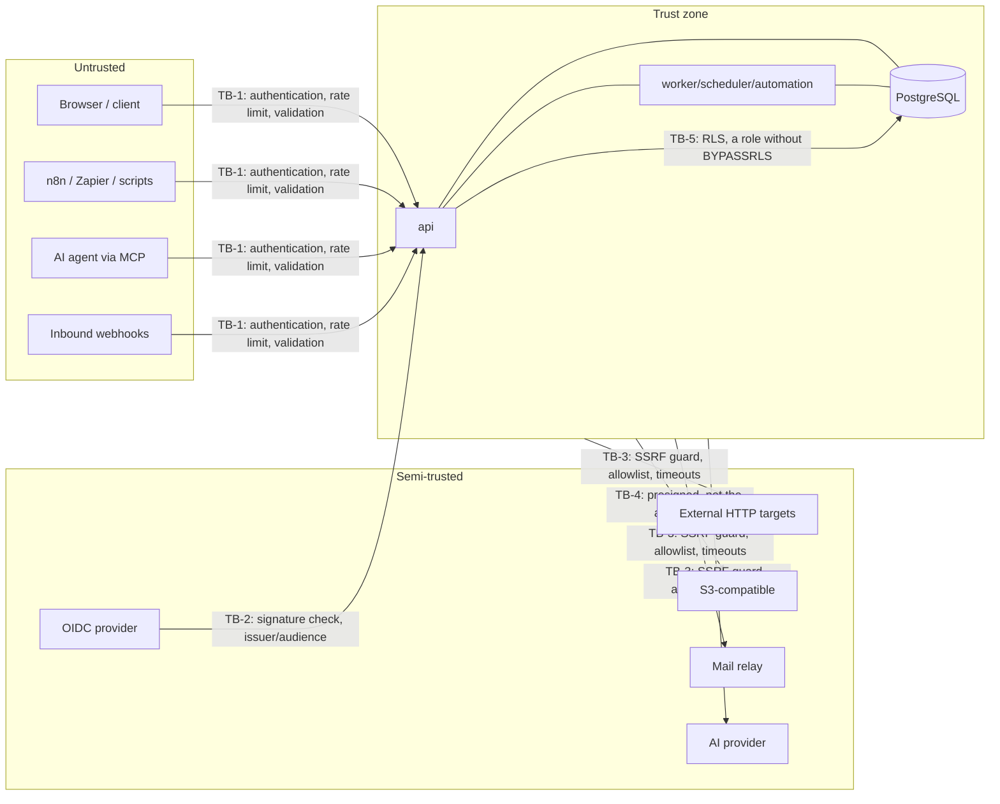

# Security Concept

Binding for all building blocks: the threat model, the security gates, hardening, cryptography and
secrets. Accounts, sign-in, sessions, tokens and the step-up live in [identity.md](./identity.md);
the tenant boundary in [multi-tenancy.md](./multi-tenancy.md). Decision records:
[ADR-0005](../adr/ADR-0005-authn-authz.md), [ADR-0010](../adr/ADR-0010-multi-tenancy.md),
[ADR-0015](../adr/ADR-0015-security-baseline.md).

---

## 1. Principles

| Principle | What it means in the code |
|---|---|
| **Defence in depth** | Every protective rule holds at two levels at least: the tenant boundary in the application layer *and* PostgreSQL RLS; permissions through the token scope *and* the RBAC check. |
| **Secure by default** | The unconfigured state is the safe one: AI off, no self-registration (an account is invited, or admitted by a provider a workspace configured), every sign-in switch at what NIST advises, CORS empty, outbound HTTP only by allowlist, no default for a secret. |
| **Fail closed** | A missing tenant context, a cold policy cache or an unreachable permission source is a rejection (`403`/`503`), never passage. |
| **Least privilege** | A database role without `BYPASSRLS`; tokens with minimal scope; automation rules run with their `run_as` rights; containers non-root and read-only. |
| **No security through obscurity** | The model is public and must hold against an attacker who reads the source. |
| **Security is a CI gate, not a feeling in review** | Every rule below has an automated test or a build check; a rule without evidence counts as absent. |

---

## 2. Assets and protection goals

| Asset | Confidentiality | Integrity | Availability | Particularity |
|---|---|---|---|---|
| Tenant data (items, comments, media) | High | High | High | The core promise; a cross-tenant leak is a critical incident |
| Credentials, tokens, secrets | Very high | High | Medium | Stored only hashed or encrypted |
| Integration credentials (calendar, webhook secrets, AI keys) | Very high | High | Medium | Envelope encryption, never in clear text in logs or the API |
| Audit trail | Medium | **Very high** | High | Append-only; tampering must be detectable |
| Automation rules | Medium | High | High | A tampered rule is an execution primitive |
| Operational metadata (metrics, traces) | Medium | Medium | Medium | Must contain no user content |

---

## 3. Trust boundaries

```mermaid
flowchart LR
  subgraph U[Untrusted]
    B[Browser / client]
    N[n8n / Zapier / scripts]
    A[AI agent via MCP]
    W[Inbound webhooks]
  end
  subgraph E[Semi-trusted]
    IDP[OIDC provider]
    EXT[External HTTP targets]
    OBJ[S3-compatible]
    SMTP[Mail relay]
    LLM[AI provider]
  end
  subgraph T[Trust zone]
    API[api] --- WRK[worker/scheduler/automation]
    API --- DB[(PostgreSQL)]
    WRK --- DB
  end
  B & N & A & W -->|TB-1: authentication, rate limit, validation| API
  IDP -->|TB-2: signature check, issuer/audience| API
  T -->|TB-3: SSRF guard, allowlist, timeouts| EXT & SMTP & LLM
  T -->|TB-4: presigned, not the app origin| OBJ
  API -->|TB-5: RLS, a role without BYPASSRLS| DB
```

Everything left of `api` is hostile until proven otherwise — our own AI agent and automation rules
included. Inside the trust zone the tenant boundary still applies (TB-5).

---

## 4. Threat model (STRIDE)

`T-xx` are referenceable threat IDs. Every row has a countermeasure **and** test evidence (§13).

| ID | Boundary | STRIDE | Threat | Countermeasure | Evidence |
|---|---|---|---|---|---|
| T-01 | TB-1 | Spoofing | A stolen access token is replayed | 15-minute access tokens, refresh rotation with reuse detection (the family invalidated, the alert raised), a client-binding hint on the session ([identity.md](./identity.md) §14) | Token replay integration test |
| T-02 | TB-1 | Spoofing | Credential stuffing / brute force | Argon2id; an attempt ledger per account **and** IP class advanced by every password and code door; one generic refusal; a second factor a workspace can require ([identity.md](./identity.md) §4.3, §8) | "Login enumeration" test; a per-door ledger test against the real database |
| T-03 | TB-1 | Tampering | A manipulated `tenant_id`/`container_id` in the request | The tenant **never** comes from the body, only from the token or host; RLS as the second level | Cross-tenant negative test suite |
| T-04 | TB-5 | Info disclosure | IDOR: another tenant's `item_id` in the URL | Authorisation in the application layer through scope inheritance; RLS hides foreign IDs → `404`, not `403` | A test per resource |
| T-05 | TB-1 | Info disclosure | Mass extraction through the query DSL | A field allowlist, a maximum filter depth, a capped `limit`, rate limit plus quota, a bounded `expand` depth | Fuzz test of the DSL |
| T-06 | TB-1 | Tampering | SQL injection through filter expressions | Only parameterised queries (`sqlc`); the DSL produces an AST → parameters; `fmt.Sprintf` in query building forbidden by `depguard` | Lint + fuzz |
| T-07 | TB-3 | Elevation | SSRF through a webhook or HTTP action | `GuardedClient`: resolve first, block RFC 1918/loopback/link-local/ULA, pin the checked IP, `http(s)` only, redirects re-checked, a timeout, a response size limit, an allowlist (mandatory in provider operation) | Unit test with malicious DNS |
| T-08 | TB-3 | Elevation | An automation rule as a "confused deputy" | Actions run with the rights of `run_as`, which can never exceed the author's rights at save time; revoking rights disables the rule | "Rights revocation" test |
| T-09 | Internal | DoS | An automation loop (A triggers B triggers A) | A causality chain of maximum depth 5, loop detection over the `causation_id` path, a throttle per rule, deactivation after *n* failed runs | Golden loop test |
| T-10 | TB-1 | Elevation | Prompt injection through item content against the MCP agent | User content reaches the model as **data**, never instruction; destructive MCP tools blocked by default; agent tokens with their own scope; every agent action audited with actor `AI_AGENT` | "Injected instruction" test case |
| T-11 | TB-4 | Info disclosure | Stored XSS through an upload (SVG/HTML) | Delivery only from a separate origin; `Content-Type` from sniffing, not the client's claim; only a short allowlist of inert image types inline, everything else — SVG and HTML included — as `Content-Disposition: attachment`; `Content-Security-Policy: sandbox` | Upload matrix test |
| T-12 | TB-1 | Tampering | CSRF against cookie sessions | There is no cookie session ([identity.md](./identity.md) §14); should one appear: `SameSite=Lax`, `Secure`, `HttpOnly` and a double-submit token. State changes never over `GET` | Test |
| T-13 | TB-2 | Spoofing | A manipulated ID token / wrong issuer | Full verification ([identity.md](./identity.md) §10.1): signature, exact `iss`, `aud`, `exp`, `nonce`, JWKS rotation, no `alg: none`, skew ≤ 60 s | Test with a tampered JWT |
| T-14 | TB-1 | Repudiation | A user disputes a deletion | Append-only `activity_entry` plus the audit with actor, time, `request_id` and a before/after diff; trash kept 30 days | Test |
| T-15 | Internal | Tampering | Tampering with the audit trail | The app role holds no `UPDATE`/`DELETE` on the audit tables, a trigger lock, and a hash chain per tenant ([audit.md](./audit.md) §3) | Test with the app role |
| T-16 | Supply chain | Tampering | A compromised dependency or build | `go.sum` pinning, `govulncheck`, a CycloneDX SBOM per release, signed images (cosign) with provenance, reproducible builds, no `curl \| sh` in CI | Release gate |
| T-17 | TB-1 | DoS | Large bodies / zip bombs / expensive regexes | A body limit per endpoint, an upload limit, no user-controlled regexes, `statement_timeout`, a request deadline | Load test + test |
| T-18 | Operations | Info disclosure | Secrets in logs, traces or error messages | A redaction layer in the logger, the `Secret` type with a masking `String()`, no `%+v` over config structs (lint), a "the log contains no token" test | Test |
| T-19 | TB-1 | Spoofing | A forged inbound webhook | A 32-byte token per rule in the address, hashed under its purpose label, rotatable; every refusal one identical `404`; the run acts as `run_as`, the body enters CEL as data ([automation.md](./automation.md) §1.1) | Test |
| T-20 | Operations | Info disclosure | A backup or export containing another tenant | The export runs through the API's RLS path; the restore drill includes an isolation check | Restore drill |
| T-21 | TB-1 | Info disclosure | A calendar feed URL leaks (a log, a `Referer`, a shared screen, a client's history, a synchronised device) | Revocable at once; stored only as an HMAC under its own purpose label; never logged, its type masking every print; one unique-hash seek, every refusal (unknown, revoked, view-less, owner-less) one identical `404`; its own rate-limit bucket; read as its **owner** at fetch time, so a lost membership narrows it and a disabled account silences it; the document holds a title, a date and a link, never notes | The feed suite: the token refused as a bearer, the refusals compared byte for byte, the masking test, the golden `.ics` |
| T-22 | TB-1 | Tampering, Info disclosure | The CalDAV tree parses client XML and takes HTTP Basic: an entity bomb, a document naming another account's tree, a password guessed by a silently retrying client | `encoding/xml` (no DTD entity expanded, a document naming one refused) under the body limit; the rate-limit buckets shed a guesser before the token lookup; Basic **only** on the tree (refused before any lookup elsewhere), its password a personal access token, never the account password; a title is XML text, never markup; another account's tree is `404`; calendars read as the owner through the ICS feed's use case, carrying what the feed carries; a write is the ordinary use case through the registry behind `If-Match` (`428`/`412`), an unmodelled property refused by name; no `sync-token`, since one hiding deletions would lie | `presentation/calendar/CalDav_test.go`, `CalDavWrite_test.go`, `presentation/rest/Auth_test.go` |
| T-23 | TB-2 | Spoofing, Elevation | A provider asserts somebody else's address, connecting to their account and skipping its second factor | Connecting needs the account's own proof or a mailbox link plus a fresh sign-in, never skipping an armed factor; a provider is trusted only for addresses it hosts ([identity.md](./identity.md) §10.4, §11) | `OidcLinking_test.go` (`TestAProviderCannotOpenAnAccountThatHoldsAPasswordAndAFactor`), `OidcAdmission_test.go` |

A new bounded context gets a short STRIDE analysis at design time, added here (Definition of Ready,
"security assessment").

---

## 5. Identity, sessions, permissions

| Topic | Rule |
|---|---|
| Permission check | Exactly one place: `core/application/service` through `AuthorizationService`; adapters and repositories never authorise; the architecture test fails a violation (SG-5). Roles and inheritance: [domain-model.md](./domain-model.md) §3.2 |
| Two bounds on every request | The role along the path **and** the credential's scopes; either alone refuses ([identity.md](./identity.md) §15) |
| Everything else | [identity.md](./identity.md): passwords §5–§7, second factor and recovery codes §8–§9, providers §10–§11 (T-13, T-23), sessions and client credentials §14, machine credentials and OAuth2 grants §15, the step-up §16 (declared on each privileged operation's descriptor, enforced by the architecture test), the ways back in §17, operators §19 |

---

## 6. Tenant isolation (summary)

Details in [multi-tenancy.md](./multi-tenancy.md). The security core:

* `hubtask_app` has **no** `BYPASSRLS` and no `SUPERUSER`; `FORCE ROW LEVEL SECURITY` on all tenant
  tables (SG-4 names the exception).
* `SET LOCAL app.tenant_id` is set in **one** place, the transaction wrapper; without it a query
  returns nothing or fails.
* Migration and maintenance roles are separate and used only by the migration job.
* **Every** repository method has a negative test with a foreign tenant; a method without one fails
  the CI gate (a count of methods against tests).

---

## 7. Input and output handling

* **Validation** at the edge (the OpenAPI schema, generated types) *and* in the domain (value
  objects with constructor invariants): the adapter validates form, the domain meaning.
* **Unicode** is normalised (NFC) before storage and comparison; homoglyph display names in
  invitations get a warning, not a block.
* **Output** is JSON; apart from a static error page the server renders no HTML. The web client is
  bound by the interface's `Content-Security-Policy` (§9).
* **Markdown in notes and comments** is stored raw and never rendered server-side; the client renders
  it through a mandatory sanitiser.
* **Inbound mail is hostile input.** Its HTML is stored as text, never rendered by the server; its
  sender is provenance, never an identity (the intake address is the credential); every bound is
  checked before allocation. A client draws it as text, never markup or a live link, and labels the
  sender as what the transport claimed.
* **CEL expressions** run under a time, depth and cost limit (`cel-go` cost budget), with no network
  or time functions beyond the ones provided.

---

## 8. Cryptography and secrets

| Purpose | Method |
|---|---|
| Password hash | Argon2id ([identity.md](./identity.md) §5.3) |
| Token storage | HMAC-SHA-256 keyed on a pepper derived from `HUBTASK_SECRET_KEY` (not in the database), under a purpose label per credential kind, so a hash of one kind cannot be replayed as another |
| Signed tokens | The session access token, cursors and media tokens: HMAC-SHA-256 under a key derived from `HUBTASK_SECRET_KEY` with their own purpose label; none is JOSE |
| Integration credentials, webhook secrets, backup target credentials | AES-256-GCM envelope encryption: a data key **per value** (the master key only encrypts random keys, within GCM's per-key bound), wrapped by a master key from `HUBTASK_ENCRYPTION_KEYS` (§8.1) whose ID is stored. The ciphertext is bound to a caller-supplied purpose and cannot move between rows |
| Backup archives | AES-256-GCM under a key derived from a passphrase with Argon2id (t=3, m=64 MiB, p=4); the passphrase is stored nowhere, salt and cost beside the archive ([backup-restore.md](./backup-restore.md) §4) |
| Signatures on outbound webhooks | HMAC-SHA-256, a secret per subscription, the header `X-Hubtask-Signature` with a timestamp |
| Transport | TLS 1.2+ (target 1.3); mTLS inside the cluster optional; HSTS where TLS is terminated |
| Randomness | Only `crypto/rand` for tokens, IDs and nonces; the `RandomSource` port uses it in production |
| Home-grown crypto | Forbidden. Only `infrastructure/crypto` names a cipher: `gate-architecture` fails an import of `crypto/aes`, `crypto/cipher`, `crypto/hkdf` or `golang.org/x/crypto` anywhere else, except `golang.org/x/crypto/ssh` in `infrastructure/backupstorage` (the SFTP target). A small, closed protocol over standard primitives — TOTP, AWS SigV4, SFTP — is written in-house (§11) |

Secrets come only from environment variables or mounted secret files (the `HUBTASK_*_FILE`
convention). A secret has no default: if one is missing, the process does not start, with a message
code.

### 8.1 Rotating the master key

The master key stays in the environment, out of any database dump
([ADR-0045](../adr/ADR-0045-master-key-in-the-environment.md)). `HUBTASK_ENCRYPTION_KEYS` is a
ring, current first, and every key in it stays readable; since the master key wraps one data key per
value, a rotation is a configuration change. The procedure is drilled
([evidence](../archive/evidence/S-2-2026-09-04.md), [completion](../archive/evidence/S-2-2026-09-06.md)):

1. **Mint the new key**: at least 32 bytes (`openssl rand -base64 48`), an identifier of lower-case
   letters, digits and underscores.
2. **Put it first, keep the rest**: `HUBTASK_ENCRYPTION_KEYS=k2,k1` with both keys' material. New
   values seal under `k2`, `k1` values still open; dropping `k1` here is an outage.
3. **Re-seal**: `POST /admin/encryption:reseal` (`hubctl admin encryption reseal`) queues one round
   per workspace, rewrapping each value's data key under `k2`, never decrypting the value. Asking
   again before a round ran queues nothing.
4. **Read the census, then retire the old key**: `GET /admin/encryption` (`hubctl admin encryption
   show`) counts the stored values naming each key. Remove `k1` only at zero; earlier, its rows
   answer `crypto.unknown_key` and the census shows it `in_ring: false` until it is put back and
   re-sealed.

**What a round touches.** The six sealed places — the second factor, an identity provider's client
secret, the AI provider's key, a webhook's current and previous signing secret, a backup target's
credential, a rule's HTTP header secret at any depth — each re-sealed by its owning service under its
purpose. An installation provider's client secret is not re-sealed yet; the census reports it (S-6).
No version or `updated_at` moves. A value naming a key outside the ring is skipped and counted.
Counts land in `hubtask_secret_reseals_total` by store and outcome, and as `encryption.resealed` in
the workspace's trail when anything moved.

---

## 9. HTTP hardening

| Measure | Requirement |
|---|---|
| Security headers | `Strict-Transport-Security`, `X-Content-Type-Options: nosniff`, `Referrer-Policy: no-referrer`, `Cross-Origin-Resource-Policy: same-site`, a minimal `Permissions-Policy`; a `Content-Security-Policy` per origin (below) |
| CORS | Empty by default; an explicit allowlist; never `*` with credentials |
| Rate limits | Per IP (unauthenticated), per token, per tenant; stricter for login, password reset, invitation, search and bulk; `429` with `Retry-After` and `RateLimit-*` |
| Request sizes | A global body limit (1 MiB by default), a separate upload limit, a header limit |
| Deadlines | A server-side request timeout; every handler receives a `context` with a deadline |
| Methods | State changes never over `GET`; `OPTIONS` only for CORS |
| Error responses | RFC 9457 with a stable `code` and a `request_id`; **no** stack traces, query fragments, versions or paths |
| Version disclosure | The `Server` header without a version; the version only through the authenticated `/meta` endpoint |

**Three origins, three policies.** The headers above are the same everywhere; the
`Content-Security-Policy` is not.

| Origin | Policy | Why |
|---|---|---|
| The API (`/api/*`, `/mcp`) | `default-src 'none'; frame-ancestors 'none'; base-uri 'none'; form-action 'none'` | It answers JSON only; a body reaching a browser as HTML could load or send nothing |
| The web interface (everything else, when enabled) | `default-src 'none'`, then `'self'` for script, style, font, connect, manifest and worker; `img-src 'self' data: blob:`; no `'unsafe-inline'` or `'unsafe-eval'` — a **constraint on the frontend framework**. Under `HUBTASK_STORAGE_KIND=s3` the media origin is added to `connect-src` and `img-src` only ([ADR-0047](../adr/ADR-0047-media-origin-in-the-interface-policy.md)) | Bundle and API share one origin ([ADR-0028](../adr/ADR-0028-embedded-web-ui.md)); the upload flow needs the media origin |
| The media origin | `sandbox` | T-11 |

`presentation/webui` sets its policy on every answer, 404 and 405 included. **The upload's middle
step carries no credential**: the presigned URL is its own, and a bearer sent to a bucket is leaked.

---

## 10. Automation and AI as attack surface

Rules trigger HTTP calls and agents write, so:

1. **No scripting language** — only declarative rules with CEL conditions
   ([ADR-0009](../adr/ADR-0009-automation-rules-cel.md)); no primitive executes arbitrary code.
2. **`run_as` is the permission boundary** (T-08), not the triggering user.
3. **Outbound calls only through `GuardedClient`** (T-07), plus a network egress allowlist in
   provider operation. The object store, an operator-configured endpoint in the database DSN's trust
   class, may use its own client, listed in the architecture test's exceptions, with deadlines,
   refused redirects, the breaker and the bulkhead.
4. **A causality bound** against loops and amplification (T-09).
5. **AI is opt-in per tenant**, off by default; content goes only to the configured provider
   (documented in the data catalogue); AI results are suggestions with provenance.
6. **MCP tools** carry `readOnly`/`destructive` hints; destructive tools need explicit release per
   token and are audited.

---

## 11. Supply chain and build

| Control | Implementation |
|---|---|
| New dependencies | A new direct third-party dependency arrives only through an accepted ADR, before the first commit using it, pinned, licence-gated, and imported by exactly one adapter package a gate names (e.g. `cel-go`, the OIDC libraries in `infrastructure/oidc`, the NATS client in `infrastructure/eventbus`, `golang.org/x/crypto` as §8 says). A small, closed protocol is written here instead (§8) |
| Dependency updates | Dependabot ([ADR-0022](../adr/ADR-0022-github-platform.md)): grouped version updates weekly, ungrouped security updates on the advisory; `go.sum` mandatory; no `replace` onto forks without an ADR |
| Vulnerabilities | `govulncheck` in every pipeline run, a container scan (Trivy/Grype) in the release gate |
| Static analysis | `gosec` within `golangci-lint`; `depguard` enforces layer boundaries and forbids risky packages |
| Secret scanning | A push rule plus a history scan (gitleaks) |
| Build | Reproducible, `CGO_ENABLED=0`, ldflags with version and commit; no network outside the module proxy |
| Artefacts | A CycloneDX SBOM per release, a keyless cosign signature, a provenance attestation; the target is SLSA build level 3 |
| Base image | distroless/static, non-root (UID 65532), read-only root filesystem, no shell, multi-arch |
| Release integrity | Signed tags; publication only from a protected branch with review |

---

## 12. Data protection (reference)

The rules live in [data-protection.md](./data-protection.md), [data-retention.md](./data-retention.md)
and the [data catalogue](../privacy/data-catalog.md). The security core: logs without user content,
metrics without personal labels, traces with masked attributes (rule 10); no new personal data field
is merged without its catalogue row and deletion path.

---

## 13. Security gates in CI

The build fails if any row fails. No merge with a red gate, no exception by comment.

| Gate | Check |
|---|---|
| SG-1 | `govulncheck` with no known exploitable vulnerability |
| SG-2 | `gosec`/`golangci-lint` with no new findings (the baseline is frozen) |
| SG-3 | The cross-tenant negative test suite green and **complete** (every repository method covered) |
| SG-4 | The application role has no `BYPASSRLS` and owns no table; RLS is **active** on every tenant table (a catalogue query). `FORCE` has one exception, `item_capability_profile`, whose defaults the owner seeds ([ADR-0052](../adr/ADR-0052-managed-postgresql-support.md)). Exceptions live in one list per suite, each with its reason |
| SG-5 | The authorisation architecture test: no repository call without a prior policy check; no authorisation in adapters |
| SG-6 | The SSRF test suite against `GuardedClient` (metadata IPs, rebinding, redirect chains) |
| SG-7 | Secret scanning with no findings; the "log output contains no tokens or secrets" test |
| SG-8 | Fuzz tests for the query DSL parser, CEL input and signature verification, run overnight (`make gate-fuzz`). Today only the query DSL compiler and the mail parser have fuzz targets, and the target does not fail the run |
| SG-9 | A container scan with no critical findings; the image verified as non-root and read-only |
| SG-10 | An SBOM produced and the image signed (release pipeline only) |
| SG-11 | Auth negative tests: an expired/tampered/revoked token, the wrong issuer, a missing scope |
| SG-12 | The upload matrix test (SVG, HTML, polyglot files, the wrong content type) |
| SG-13 | Every writing use case declares its audit obligation, and every auditable action is in the `AuditableAction` registry ([audit.md](./audit.md) §7) |

---

## 14. Handling incidents

1. **Reporting and aims** are in [`SECURITY.md`](../../SECURITY.md): a private GitHub security advisory or `security@hubtask.eu`; acknowledgement, a CVSS assessment and a fix are best-effort aims; disclosure is coordinated.
2. **Remediation** goes into the current minor version ([versioning-release.md](./versioning-release.md)).
3. **Communication** through a GitHub security advisory with the affected versions, a workaround and detection guidance (log patterns).
4. **Follow-up**: a blameless post-mortem note in the repository; the fix includes a regression test, without which the incident is not closed.

---

## 15. Deliberately not included

| Not included | Reason |
|---|---|
| End-to-end encryption of content | Incompatible with server-side search, automation and AI |
| Our own WAF/IDS | The operator's job (ingress/reverse proxy); the application supplies clean signals |
| Certifications (ISO 27001, SOC 2) | Organisational, not architectural |
| SAML/SCIM | After `1.0.0` |

---

## 16. Open points

| # | Point | Needed by |
|---|---|---|
| S-1 | An external penetration test / code audit before the first commercial operation | Before `1.0.0` |
| S-4 | A threat row for the web client itself; today the interface's policy (§9) and the client's credential rules ([identity.md](./identity.md) §14.4) cover it | — |
| S-5 | Bug bounty yes/no, and its framing | After `1.0.0` |
| S-6 | Re-seal the installation's own sealed values on a key rotation (§8.1) | Before a multi-tenant installation rotates its keys |
